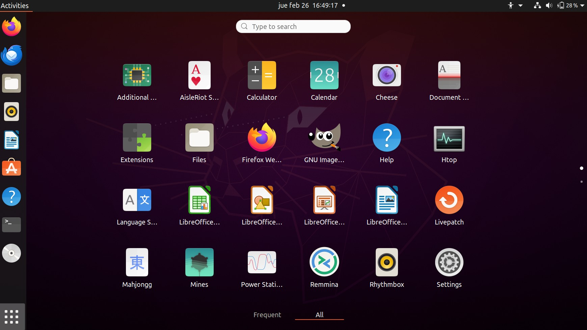
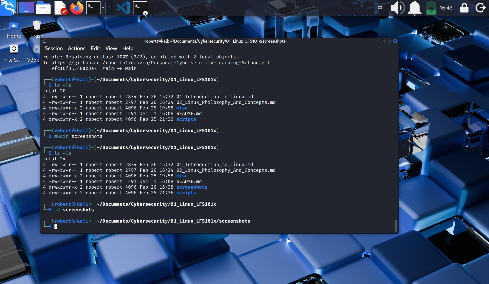

## II.- LINUX PHILOSOPHY AND CONCEPTS
### Philosophy and concepts

1. Linux releases development **Kernel** about once every three months.
2. Linus is an operating system and its core is just a **kernel** that makes the hardware work.
3. Linux has around 2,000 developers in over 400-500 companies.
4. It works based on a **Command Line Interface** and a **Graphical Interface**.
5. Linux initially developed on and for **intel x86**-based PC's.
6. Linux, by **Linus Torvalds**, Helsinki, Finland, 1991.
7. Linux borrows heavily from **UNIX**.
8. Files are stored in a hierarchical filesystem with the **top node of the system being the root or simply "/"**.
9. Components are available via **files** or **objects** that look like files.
10. Processes, devices, and **network sockets** are all represented by **file**-like **objects** and can ofen be worked with using the same **utilities** used for regular files.
11. It is multitasking, multiuser, with built-in networking and service processes known as daemons.
12. Delivers the freedom to use the OS for any purpose; to change it (since is open source); to share it, and to share the changes you made.
13. Linux empowers big technolgy companies such as Amazon, Google, Facebook, etc.
14. There are different ways to communicate with the community: IRC (Internet Relay Chat), GitHub, and events.
---
### Linux Terminology

1. **Kernel**: Is the brain of the Linux OS. It controls the hardware and makes the hardware interact with the applications.
2. **Distribution**: is a collection of programs combined with the Linux kernel to make a Linux-based operating system.
3. **Boot loader**: a program that boots the OS. **GRUB** and **ISOLINUX** are boot loader examples.
4. **Service**: is a program that runs as a background process. Some examples are: httpd, nfsd, ntpd, ftpd and named.
5. **File System**: is a method for storing and organizing files. Some examples are: ext3, ext4, FAT, xfs and Btrfs. 
6. **X Windows System**: is the graphical susbsystem on nearly all Linux systems.
7. **Desktop Enviroment**: is a Graphical User Interface **on top of the OS**. Some examples are GNOME, KDE, Xfce and Fluxbox.
8. **Command Line**: is an interface for **typing commands** on top of the OS.
9. **Shell**: command line interpreter that interprets the CL (Command Line) input and instructs the OS to perform tasks and commands.

#### Graphical User Interface Gnome used on Ubuntu

#### Graphical User Interface Xfce used on Kali
 

---
### Additional concepts
1. Some critical actions that work diferently on different Linux distros are:
    * File-related operations.
    * User management.
    * Software package management.

2. All major distributions provide update services for keeping your system primed with the lastest security, bug fixes and performance enhancementes. They provide online support resources.

---
- End of chapter **two**.