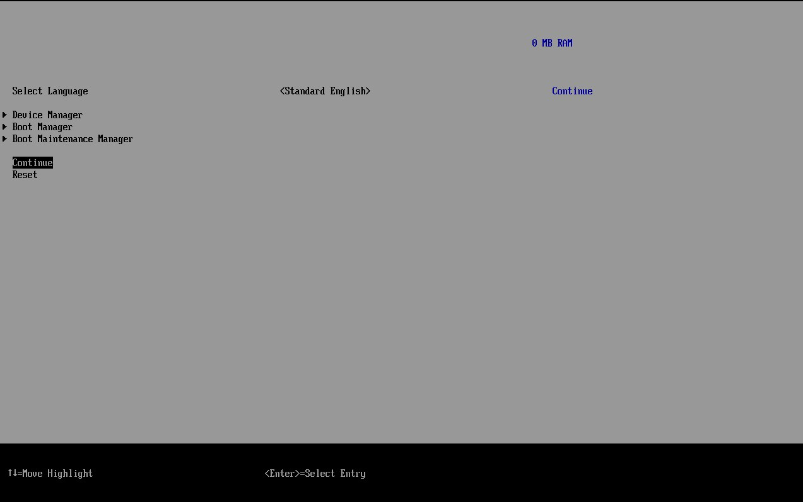
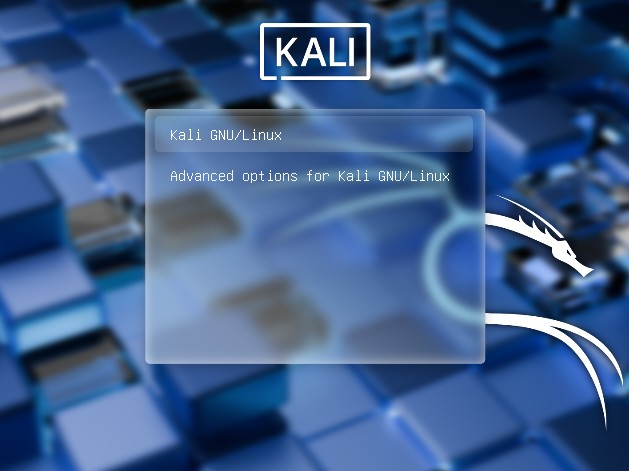
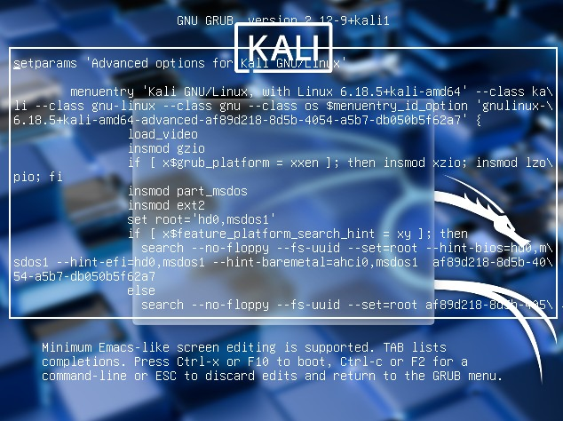
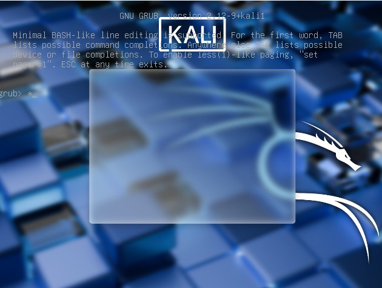

## III.- LINUX BASICS AND SYSTEM START UP
### 1.- The boot process
1. The boot process is the procedure for initializing the system. It consists of everything that happens from: **power on ----> user interface fully operational**.
2. To know it is to be able to troubleshoot problems and to tailor computer performance to your needs.

### 2.- Boot Process
1. Power On.
2. BIOS (Basic Input/Output System).
3. Master Boot Record (MBR) or EFI partition.
    * Note: EFI stands for Extensible Firmware Interface, for more recent: UEFI which stands for **Unified** Extensible Firmware Interface.
4. Boot Loader (e.g. **GRUB**).
5. Kernel
6. Initial RAM disk - **initramfs**
7. /sbin/init which is responsible to start system and network services at boot time.
8. Command Shell using getty.
9. Graphical User Interface (X Window or Way Land).

### 3.- More on the Boot Process
1. The **BIOS** software is stored on a **read-only** memory (ROM) chip on the Motherboard.
2. **BIOS** initializes the hardware (screen, keyboard, etc) and tests the main memory. This process is also called POST.
    * Note: POST stands for Power on Self Test, from this point and on the boot process is now controlled by the boot loader.
3. Once the POST is completed, system control passes from BIOS to ***boot loader***.
4. Boot Loader presents a **user interface** for choosing alternative options for bootin Linux.
5. As mentioned before examples of boot loaders are: ***GRUB (Grand Unified Boot Loader), ISOLINUX, and DAS U-Boot.
6. Boot Loader is responsible for loading the **kernel image** and the initial RAM disk or **filesystem** into memory.
7. **Systemd** permits multiple services to be initiated simultaneously.

### 4.- Important utilities
1. `systemctl`:     initiates, stop and re-start, enables a service.
2. `journalctl`:    to see logs.
3. `logind`:        manages user sesions (energy, suspend, shutdown).

**For example**: check the status of the apache web server on my system:

`sudo systemctl status httpd`

`sudo systemctl start httpd`

Where ***status*** is to check the status and ***start*** is to start the service.

### 5.- Some more information about BIOS
The BIOS (Basic Input/Output System) or UEFI (Unified Extensible Firmware Interface) is the low‑level firmware that runs before the operating system. It initializes the virtual hardware and controls how the system boots. In a virtual machine, this firmware is provided by the hypervisor, not by Kali Linux.
Its main functions include:
1. Configuring the boot order, which is useful when reinstalling the OS or booting from an ISO.
2. Managing firmware-level boot entries, especially in UEFI mode.
3. Checking that the virtual hardware (disk, network, etc.) is detected before the OS loads.

To enter the BIOS/UEFI on a Virtual Machine:
1. Make sure the VM is completely powered off.
2. If UEFI mode is enabled, press ESC immediately after starting the VM.
3. If using Legacy BIOS mode, press F2 right after powering on.
4. To exit, highlight Continue and press Enter to resume the boot process.

### 6.- Some more information about GRUB

You can access boot loader GRUB by modifying with **sudo** `/etc/default/grub`
* Change the line GRUB_TIMOUT_STYLE=hidden for GRUB_TIMEOUT_STYLE=menu
* Change the line GRUB_TIMEOUT=0 for GRUB_TIMEOUT=5 (for 5 seconds).
* Save changes and exit; then
* `sudo update-grub`.

Entering GRUB allows you to: 
* Recover the system.
* Modify Kernel configuration.
* Debbuging
* Acces a **shell root** without a password.
* System failure analysis.

Press **e** on the GRUB screen to:
* Edit kernel parameters.
* Enter on recovery mode.
* Initialize with later kernerls.

Press **c** on the GRUB screen to:
* Open internal GRUB console: it is a basic enviroment where you can execute booting commands.
* See disks and partitions.
* Explore partitions.
* Manually start the kernel.
* Fix damaged start-up programs.
* It is nos a Linux Shell, it is a **GRUB Shell**.

### 7.- Filesystem
1. A filesystem is just a method of storing and accesing files.
2. For Windows OS the filesystem type is **NTFS/VFAT** with base folder **C:\\**.
3. For Linux the filesystem type is **ext3/ext4/XFS** with base folder **/**.
4. Linux store their important files according to a standard layout called **Filesystem Hierarchy Sstandard** (FHS).
5. Linux uses "/" and does not use drive letters.
6. Windows uses "\" and uses drive letters.
7. Removable media such as USB drives and CDs will show up as **mounted**: `/run/media/yourusername/dislabel`.

### 8.- Filesystem Hierarchy Standard
There are 16 Filesystem Hierarchy Standard directories:

1. `/bin/` essential user command binaries.
2. `/boot/` static files o the boot loader.
3. `/dev/` devie files
4. `/etc/` host-specific system configuration.
5. `/home/` user(s) home directory(ies).
6. `/lib/` essential shared libraries and kernel modules.
7. `/media/` mount point for removable media.
8. `/mnt/` mount point for a temporary **mounted filesystem**.
9. `/opt/` add-on application software packages.
10. `/sbin/` system binaries.
11. `/srv/` data for services provided by this system.
12. `/tmp/` temporary files.
13. `/usr/` multi-user utilities
14. `/var/` variable files.
15. `/root/` home diretory for the root user
16. `/proc/` virtual filesystem documenting kernel and process status as text files.

* Notes: 
1. All filesystem names ar case-sensitive:
> /boot/ is different to /Boot/
    
2. The filesystem can be view through the Graphical Interface:
    * For Ubuntu: **nautilus**.
    * For Kali: **thunar**.

### 9.- Choosing a Linux distribution
To choose the right Linux distribution for you consider:
1. If the purpose of the system is to be a desktop or a server.
2. Every Linux distro comes with a specific set of **system utilities** related to the Linux distro purpose.

### 10.- Linux installation methods:
1. Live Media:

Live CDs, DVDs or USB media which can be used to run Linux without actually instaling it on any disk drive. It features a slow startup, poor performance and any changes in setup or software **will be lost** every time one boots up.

2. Virtual Machine (Hypervisor):

It is a full guest operating system which **runs on top of an Hypervisor program** on a **Host Machine**.

* **For example**:
    
    1. Install VirtualBox.
    2. Download the ISO image for Ubuntu (go to www.ubuntu.com/downloads -----> UBUNTU Desktop 24.04.3LTS).
    3. Open VirtualBox.
    4. Click on New.

3. Re-partitioning your hard disk:

***A partition is a logical part of the disk. By dividing the hard disk into partitions, data can be grouped and separated as neede. When a failure or mistake occours, only the data in the specific partition will be damaged, while the data on the other partitions will likely survive***

---
- End of chapter **three**.
