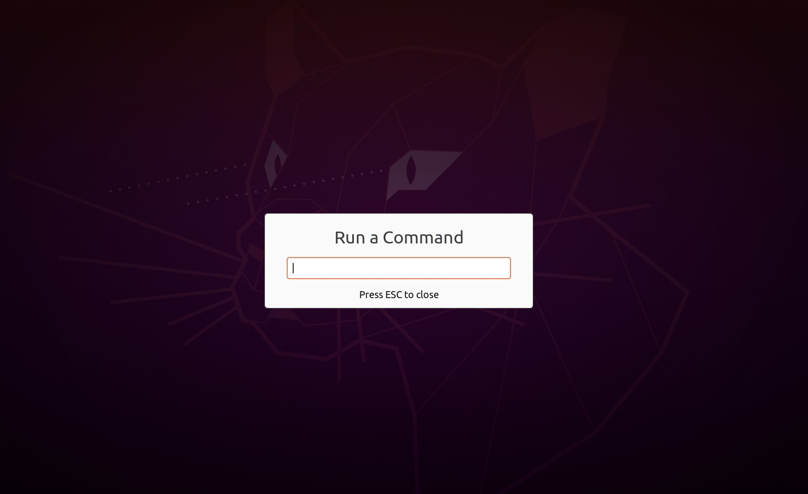
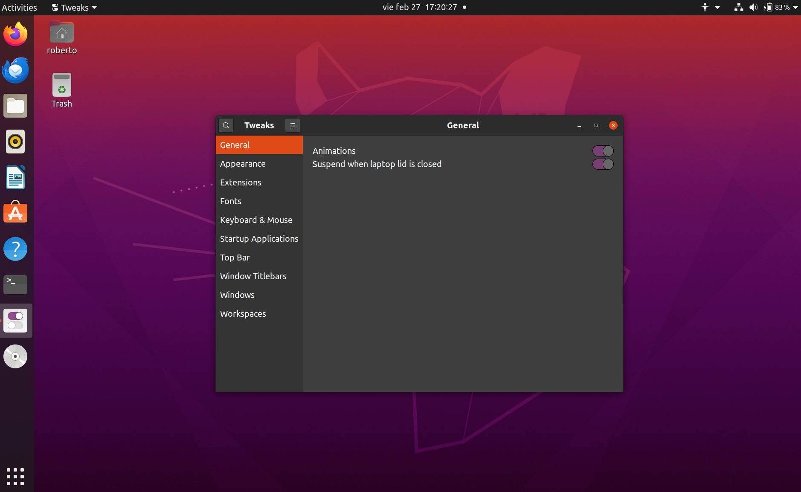
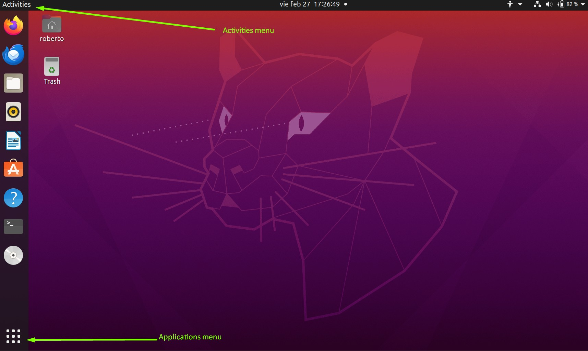
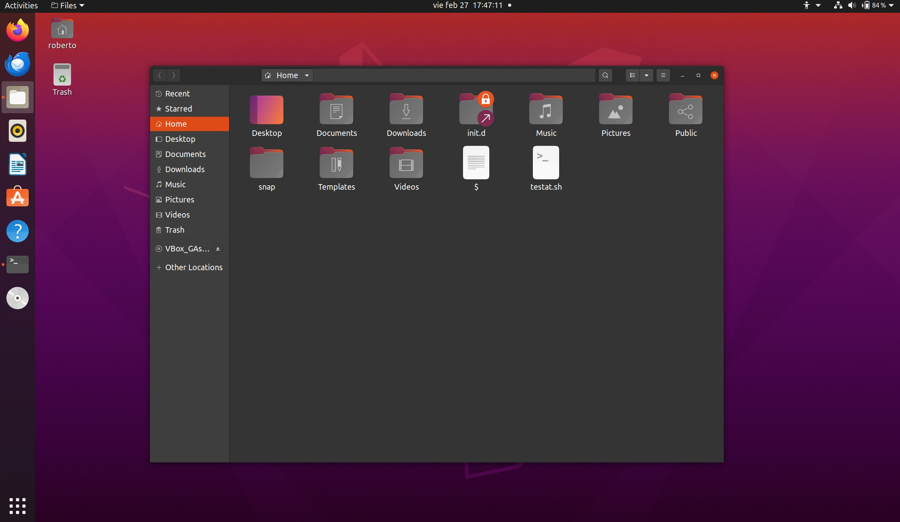
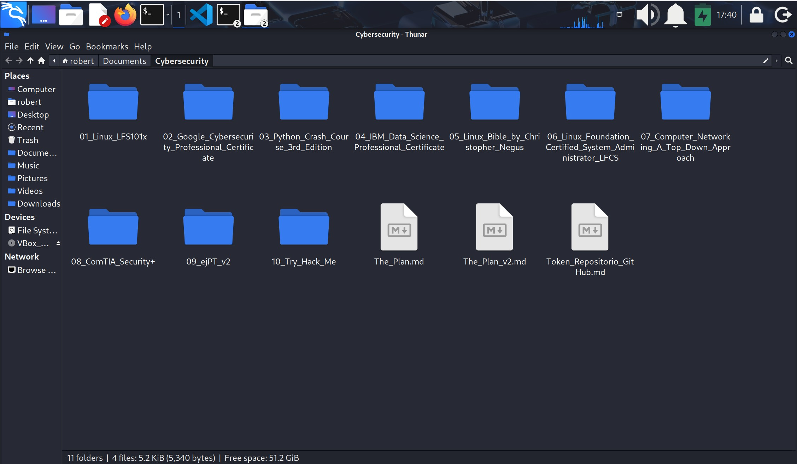

## IV.- GRAPHICAL INTERFACE
### 1.- Basic concepts and information
1. The **GUI** (Graphical User Interface) is easier than the **CLI** (Command Line Interface) for a begginer.
2. CLI is for repetitive tasks.
3. This course manages how to use the GUI for: Red Hat (CentOS, Fedora); SUSE (openSUSE) and Debian (Ubuntu, Mint).
4. All are quiet similar since they all use the **GNOME** variant.
5. The **graphical desktop** is one of the final steps in the **boot process** of a Linux desktop.
6. The Linux desktop was known historically as the **X Windows System**, often just called **X**.
7. The **Display Manager** is a **service** that keeps track of the displays being provied and loads the **X** server. It is called server because it provides **graphical serices** to applications, sometimes called **X Clients**.
8. **X** is old (from the 1980's). Now a system known as **Wayland** is used.
9. Display Manager executes these functions mainly:
    
    1. Display management.
    2. Loads Graphical Desktop (X or Wayland).
    3. Manage graphical logins (logs in the user).

10. **Desktop enviroment** consists on a **session managger** which starts and maintains the components of a graphical session, and on a **window manager** which controls placement and movement of windows, windows title-bars and controls.

11. You can run `startx` on the command-line to start the **graphical desktop** if the display manager is not started by default.
12. **GNOME** is a popular desktop enviroment (easy-to-use graphical interface) and is the default desktop enviroment for many Linux distros.
13. On the login screen (also called greeter) I will be able to see a gear icon that shows different types of desktops to log in: Standard (Wayland display server), Classic (X11 display server), Classic (Wayland display serer), custom, etc.
14. On this desktop enviroment you are able to change the desktop background and the desktop theme (that is the appareance of application windows).

### 2.- gnome-tweaks
1. The default settings utility is limited in modern GNOME-based distros.
2. There is a standard utility named **gnome-tweaks** which explores many more setting options.
3. It permits to install extensions by external parties.
4. Not all Linux distros install this tool by default. You may have to run it by hitting `Alt+F2` and then typing in the name.
5. You may want to add it to your favourites.

### 3.- GNOME Run Command
1. When you hit `Alt+F2` you call for the GNOME Run Command, which is a desktop function owned by **GNOME Shell**.
2. From here you can excecute different applications.

**For example**:

Type `gnome-terminal` to open a terminal\
Type `gnome-tweaks` to open gnome-tweaks\
Type `gnome-control-center` to open normal settings

and so on ...

3. The GNOME Run Command is also called "run dialog", "run command prompt" or "GNOME runner".
4. GNOME Run Command runs **binary** files only.
5. Binary files are executable files that contain machine language instructions only (0s and 1s).
6. They are `/bin` directory.

#### Gnome Run Command

#### gnome-teaks

### 3.- Locking the screen
1. If you lock the screen the computer will also be suspended.
2. All applications and processes continue to run while the screen is locked.
3. To lock the screen do as follow:\
    1. Click the inverted triangle icon located on the upper right corner of the screen ---> Lock screen.
    2. `Super Key+L` 
        * Super Key is a special key on all Linux distros used as a modifier. It is also used to launch system menus, move and manage windows and to excecute special combinations. It is the one with the **Windows** logo (if you are using Windows of course).
        * Note: do not confuse with the **Hot Key** which is used by your Hypervisor to escape the keyboard from the curren machine. You assign the Hot Key on your Hypervisor Settings.

### 4.- Basic concepts and information II
1. Simultaneous users can be logge in by **switching users**.
2. Having different users allos different individualized settings for each one.
3. Every user directory will be under `/home` directory.
4. **Suspend (or sleep) mode**: saves current system state while remainiing on, but uses very little power. It keeps everything in system RAM, and turns off all other hardware.
5. To suspend click on the power icon and hold for a short time and then release, you will get the double line icon displayed below, click it to suspend.
6. Click anywhere or press any key to awake this mode.

### 5.- Basic operations
1. Linux allows you to quickly open applications using the GUI (GNOME).
2. On the desktop you can find Activities and Applications menus.

#### Activities and Applications menus

### 6.- File Manager
1. The File Manager is to navigate the system, it is on Favorites or Accesories under the name "File".
2. The File Manager in Ubuntu is called Nautilus.
3. The File Manager in Kali is called Thunar.

**Basic operations in Nautilus and Thunar**
1. Toogle vew between list `Ctrl+1` and icons `Ctrl+2`.
2. `Ctrl+H` to see hidden files (this are configuration files mostly).
3. Arrange items by clicking on the list header.
4. `Ctrl+F` to search for an item.
5. `Ctrl+L` to type the directories path.

#### Nautilus

#### Thunar

You can open both graphical file systems from the terminal:
* `nautilus` for Ubuntu.
* `thunar` for Kali.
### 6.- Additional Information
1. Default text editor in GNOME is  **gedit**.
2. Removing a file in Nautilus will move it to `./local/shared/Trash/files`. This file is under the `/home` directory.
3. To delete a file --> select it --> `Ctrl+Del`, or right click --> move --> trash.
4. Delete a file permanently --> right click on `Trash` which is on the left panel --> Empty Trash, or `Shift+Del`.
5. The `/home` directory contains GNOME configuration files (and stuff to enable your log in), never erease/remove `/home`.

---
End of chapter **four**.

