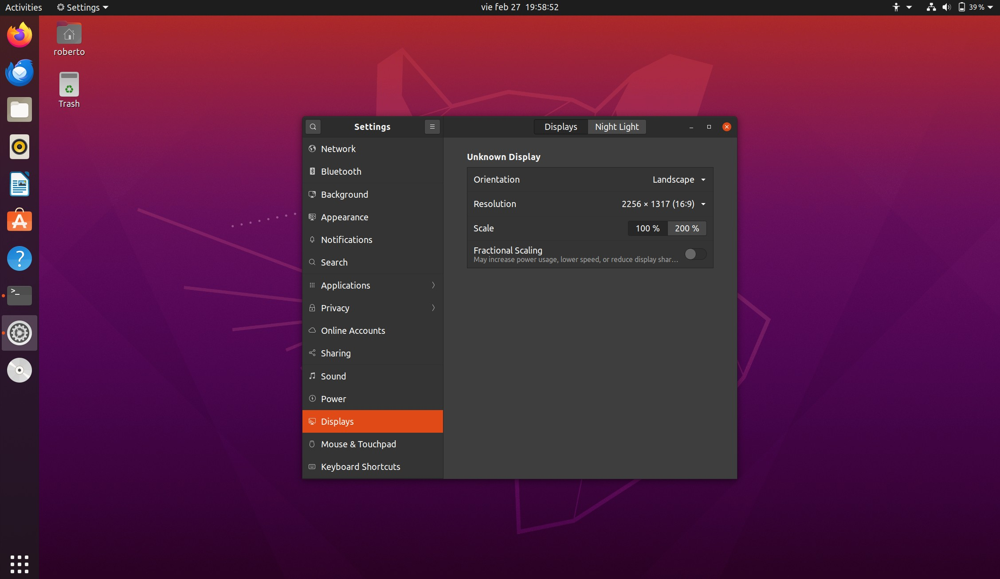
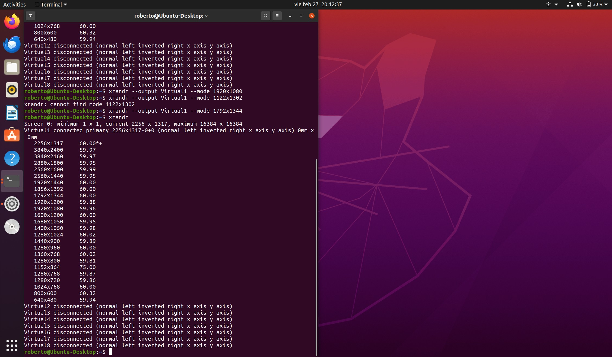
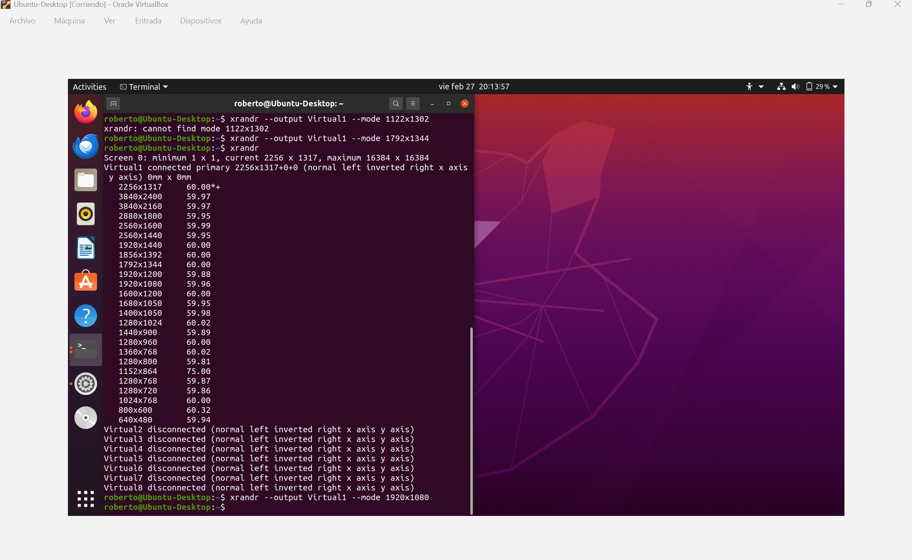
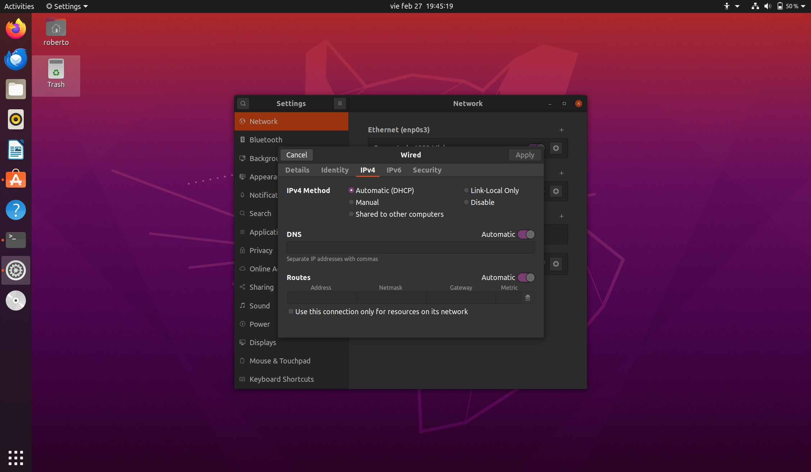
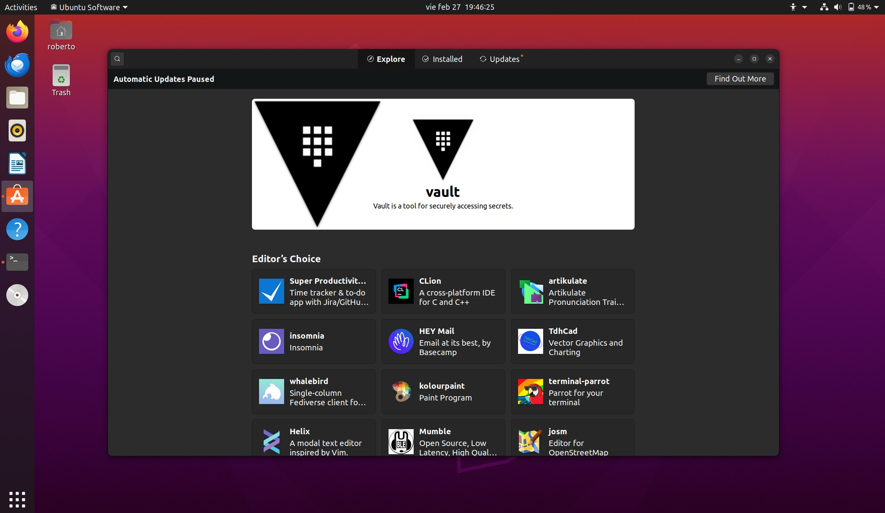
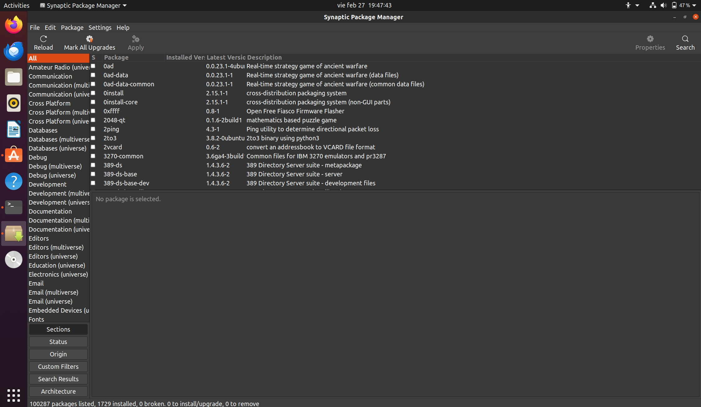

## V.- SYSTEM CONFIGURATION FROM THE GUI
### 1.- System settings
1. System settings control configuration options and desktop settings such as:\
    1. Screen resolution.
    2. Managing network connections, or
    3. Change date and time of the system.\

2. Find **System settings** by right clicking on the gear icon located on the upper-right corner of the screen.
3. This menu contains: display, keyboard, printers, etc.
4. Clicking on Applications lets you configure the options relevant to many installed programs.
5. Under `User` you can change: user profile picture, name and password.
* Note: This instructions are for Ubuntu, you can acces Kali settings by clicking on the dragon-like icon located on the upper-left corner on the screen, type and click on **settings manager**.\

6. In Ubuntu you will find more setting options using `gnome-tweaks`. Here you will find settings for:\
    1. Themes
    2. Extensions
    3. Fonts
    4. Keybord layout, and
    5. Starting up programs when you login

7. You can personalize your desktop even more adding functions with the `GNOME Extensions App`. Some of the modules you can modify are:\
    1. Upper pannel
    2. The Dock
    3. Keyboard short-cuts
    4. Window behaviour
    5. Appareance and themes.\

### 2.- Display settings
1. You can modify **display settings** by right clicking anywhere on the desktop and then click on display settings.
2. On systems utilizing the **X Window** system, the server which actually provide the **GUI** uses `/etc/x11/xorg.conf` as its configuration file if it exists. In modern systems this file may not be there.

#### Display settings using GUI

### 3.- Setting Resolution and Configure Multiple Screens
1. On **system settings** go to the **display panel**, there is a switch turn it to **apply**.
2. In most cases the configuration for multiple displays is set up automatically as one big screen spanning all monitors.
3. There is a check box to turn on **mirrored mode**.
4. You can configure the resolution for each monitor.
5. If you have multiple monitors by clicking on a tool-like icon you can access to displays where you can configure:
    1. Display arrangements (how they are laid out).
    2. Configure each monitor by selecting it (orientation, resolution, scale and night light).
7. You can use the `xrandr` tool in Ubuntu to mannually choose a specific resolution.
    1. `xrandr` will show the name of your screen and point the actual resolution with a **\***.
    2. It will also show a list of resolutions supported by your system.
    3. Type `xrandr --output <name of your screen> -- mode <listed resolution>` to change to the desired resolution.

#### Current resolution

#### New resolution

### 4.- Date and time settings
1. By default Linux uses Coordinated Universal Time (UTC); is more accurate than Greenwich Main Time (GMT).
2. To configure time click on the time displayed on the top panel to adjust the format.
3. For a more detailed adjustment go to Date and Time in **System Settings**.
4. You can set local time by using **Network Time Protocol** (NTP).

### 5.- Network configuration
1. **Network Manager** lists all available networks, handle passwords and setup **Virtual Private Network** (VPN).
2. Network Manager sets the actual network settings via **Dynamic Host Configuration Protocol** (DHCP).
3. You can change the **Media Access Control** (MAC) address if your hardware supports it.
4. MAC address is a unique hexadecimal number of your **network card**.

#### Network configuration in Ubuntu

### 6.- Mobile Broadband and VPN connections
1. You can set a mobile broadband connection with Network Manager which will launch a wizzard to set up the connection details or each connection.
2. Network Manager supports many VPN technologies such as native IPSec, Cisco OpenConnect, Microsoft PPTP and OpenVPN.

### 7.- Installing and updating software
1. Each package in a Linux distro provides one piece of a system.
2. Packages often depend on each other, e.g: 
>e-mail client - encrypt and decrypt SSL/TLS package

3. Debian package system has a high level utility and a lower level utility.

### 8.- Package management for Debian family
1. **dpkg**: 
    1. Is the underlying package manager for Debian (Kali, Ubuntu).
    2. It can install, remove, and build packages. It does not automatically download and install packages and atisfy their dependencies.\
2. **apt**:
    1. Stands for Advanced Package Tool
    2. Is the higher level package management system.
    3. There are some distros that use its own user interface on top of apt: apt-get, synaptic, gnome-software.

### 9.- Package management for Red Hat family
1. The lower level utility is **RPM** (Red Hat Package Manager).

### 10.- Package management for openSUSE
1. The lower level utility is **RPM** and the higher level utility is **YaST** (Yet another Setup Tool).

### 11.- Installing and updating software in Ubuntu (Using GUI)
1. Experienced Linux Administrators do their package management from the CLI.
2. However every Linux distro has at least one GUI option for managing packages.
3. You can see the already installed applications on Ubuntu and install new ones by going to:
    1. Applications menu
    2. Ubuntu software
4. This interface looks somewhat like an appStore. You will find bunch of apps, some may be installed on your system already. Some of its features are:
    1. Applications are grouped by category.
    2. There are 3 main tabs: Explore, Installed and Update.

#### Ubuntu Software

5. There is another GUI option for package management which is older, it is called **Synaptic**.
    1. It offers a more simply, easy-to-use method and gies you a clearer vision of exactly where everything came from.
    2. To access Synaptic go to the Applications Menu and type Synaptic Package Manager.

#### Synaptic

---
- End of chapter **five**

