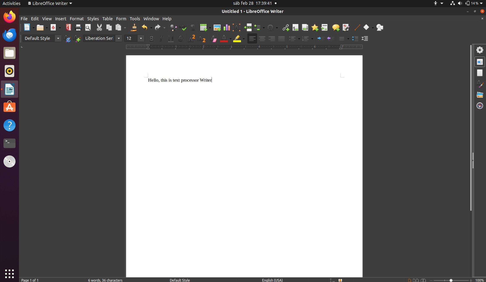
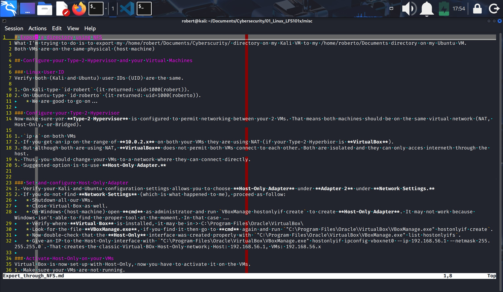
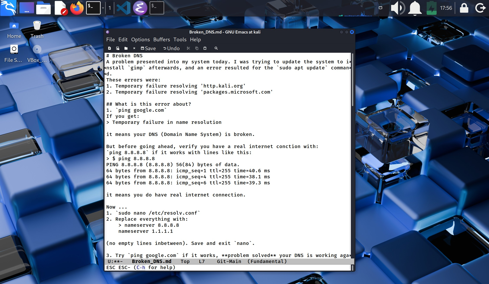
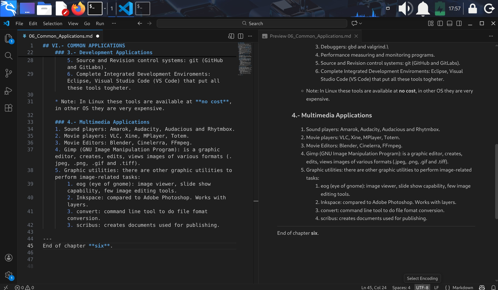

## VI.- COMMON APPLICATIONS

### 1.- Internet Applications
Linux has productivity applications, web browsers, e-mail clients, online media (streaming), and other apps.

1. Web Browsers: some of the web browsers supported by Linux are: Firefox, Google CHrome, Chromium, Epiphany, Konqueror, Lynx, w3m and Opera.
2. e-mail: most e-mail clients use **Internet Message Access Protocol** (IMAP) or the older Post Office Protocol (POP) to acces e-mails stores on a remote **mail server**.
    * Most e-mail applications use **HTML** (Hyper Text Mark Up Language).
3. Linux supports the following types of e-mail applications:
    1. Graphical e-mail clients: Thunderbird, Evolution, and Claws Mail.
    2. Text mode e-mail clients: Mutt and ***mail***.
    3. All web browser-based clients: gmail, yahoo, microsoft 365, etc.
4. Other applications for performing internet-related tasks:
    1. FileZilla: to transfer files to/from **FTP** (File Transfer Protocol) servers.
    2. Piding: to acces: GTalk, AIM, ICQ, MSN, IRC, and other messaging networks.
    3. Hexchat: to acces **Internet Relay Chat** (IRC) networks.

    ### 2.- Office Applications
    1. Most Linux distros offers **LibreOffice** (which started on 2010).
    2. Libre Office suit consists on: Writer, Calc (spread sheets), IMpress (for presentations), and Draw (to create and edit graphics and diagrams).

    #### LibreOffice Writer
    

    ### 3.- Development Applications
    1. Linux comes with a complete set of applications and tools for those who need them for **developing** and **maintaining** user applications and the kernel itself. These tools are tightly integrated and include:\
        1. Advanced editors for programer's needs: vi and emacs.\
        2. Compilers for programs in **"C"** and **"C++"**: gcc and clang.\
        3. Debuggers: gbd and valgrind.\
        4. Performance measuring and monitoring programs.
        5. Source and Revision control systems: git (GitHub and GitLabs).
        6. Complete Integrated Development Enviroments: Eclipse, Visual Studio Code (VS Code) that put all these tools togheter.

    * Note: In Linux these tools are available at **no cost**, in other OS they are very expensive. 

    #### vi
    

    #### emacs
    

    #### VS Code
    
    

    ### 4.- Multimedia Applications 
    1. Sound players: Amarok, Audacity, Audacious and Rhytmbox.
    2. Movie players: VLC, Xine, MPlayer, Totem.
    3. Movie Editors: Blender, Cinelerra, FFmpeg.
    4. Gimp (GNU Image Manipulation Program): is a graphic editor, creates, edits, views images of various formats (.jpeg, .png, .gif and .tiff).
    5. Graphic utilities: there are other graphic utilities to perform image-related tasks:
        1. eog (eye of gnome): image viewer, slide show capability, few image editing tools.
        2. Inkspace: compared to Adobe Photoshop. Works with layers.
        3. convert: command line tool to do file fomat conversion.
        3. scribus: creates documents used for publishing.

---
End of chapter **six**.

