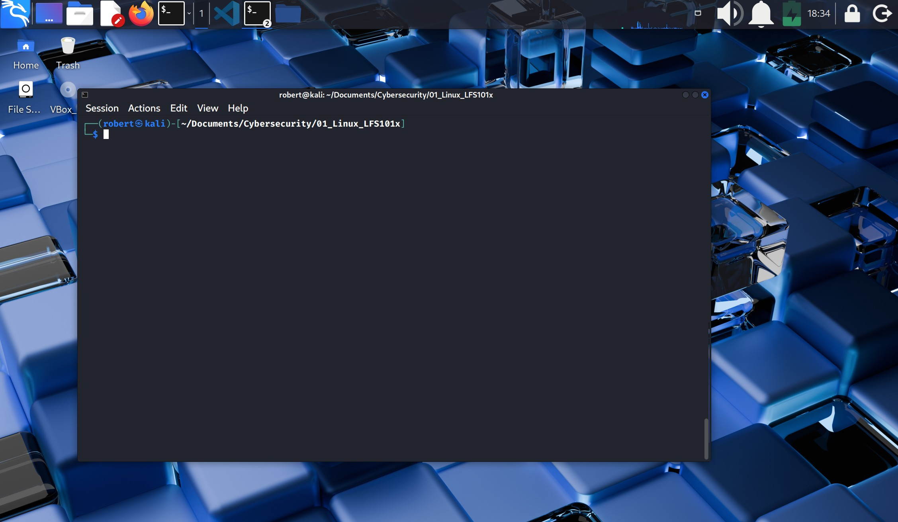
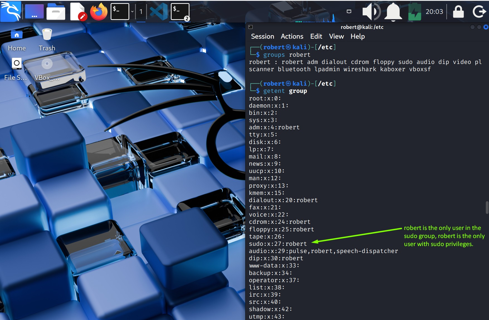
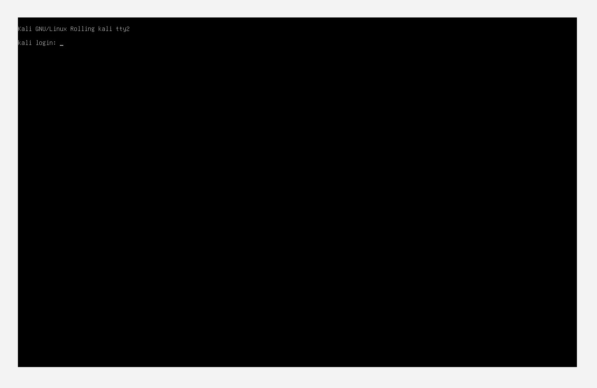
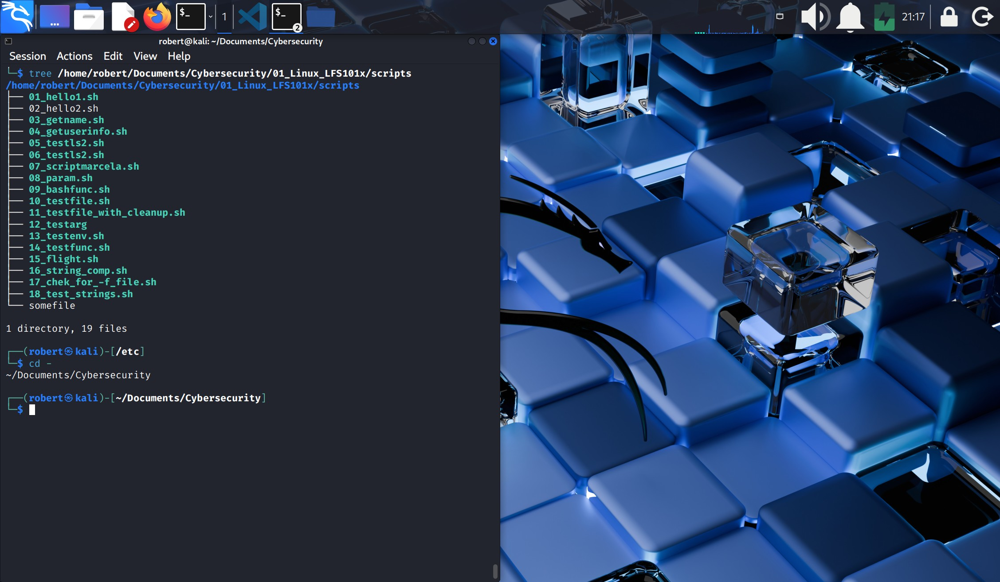
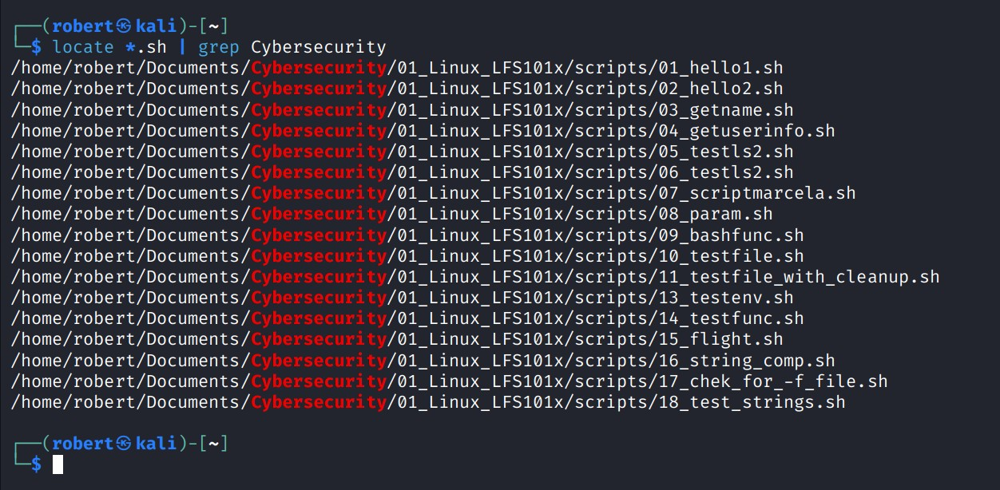
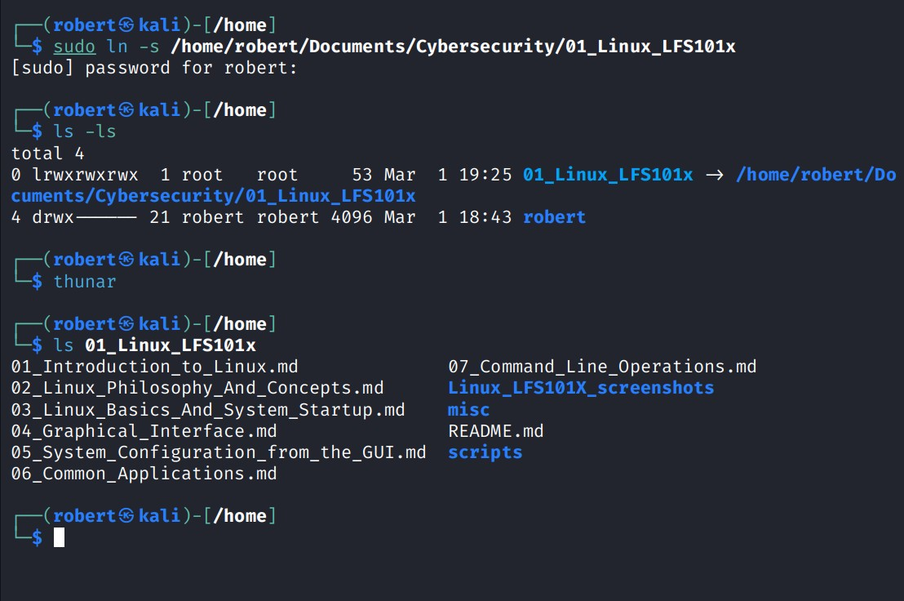

## VII.- COMMAND LINE OPERATIONS
1. Linux system administrators **automate** and **troubleshoot** tasks using the **command line prompt**.
2. There is a saying: ***"graphical user interfaces make easy task easier, while command line interfaces make difficult tasks possible".***
3. There are a lot of Command Line **tools**.

### 1.- Command Line advantages
1. No GUI overhead is incurred. Less system resources needed.
2. Every task can be accomplished at the CLI.
3. Scripts implementation for often (easy-to-forget) used tasks and series of procedures.
4. You can **sign into remote machines** anywhere on the internet.
5. Avoids GUI menus to launch graphical applications.
6. Graphical tools vary among Linux distros, the CLI does not.

### 2.- Using a Text Terminal on the Graphical Desktop
1. A **terminal emulator program** simulates a standalone terminal within a window on the desktop. It behaves as if you were logging into the machine at a pure text terminal with no running GUI.
2. On GNOME desktop enviroments, the gnome-terminal is used to simulate a text-mode terminal in a window. Other available terminal programs include: xterm, konsole, terminator.

### 3.- Launching Terminal windows
1. On GNOME desktop click on Applications --> system tools --> terminal applications --> utilities --> terminal.
2. Right click on desktop --> open terminal.
3. `Alt+F2` --> type ***gnome-terminal***.
4. `Ctrl+Alt+T` in both Ubuntu and Kali (shortcut).

#### A terminal launched in Kali 

### 4.- Basic Utilities
1. cat: used to type out a file (or combine files).
2. head: used to show the first few lines of a file.
3. tail: used to show the last few lines of a file.
4. man: used to view documentation.
5. Pipe symbol `|`: used to have one program take as input the output of another.

### 5.- The Command Line
Most input lines entered at the **shell prompt** have 3 basic elements:
1. Command: name of the comand or script you are executing.
2. Options: modify what the command may do. They start wit `-` or `--`.
3. Arguments: represent what the command operates on.

    * Plenty of commands have no options, no arguments, or neigther.
    * Other elements: enviroment variables can also appear on the command line.

### 6.- sudo
It means **super user do** and is used in the command line for tasks or operations that require administrative privileges.

### 7.- Steps for setting up and running sudo
1. At the CL type `su` and press enter. It will ask for the root password.
2. Create a configuration file to enable your user account to use sudo. Typically this file is created in `/etc/sudoers.d/` with the name of the file the same as your username.

**For example:**
For a user name called "student" create a configuration file by doing this:
1. `echo "student ALL=(ALL) ALL" > /etc/sudoers.d/student`
2. Change permissions on file by doing:\
    `chmod 440 /etc/sudoers.d/student`

**Important notes:**
1. Since 2020 Kali Linux no longer uses the root account as the default user, thus the installation program creates a normal user with sudo privileges
2. Root no longer has a password, that is why `su` fails.
3. Debian family distros now use a set of **groups** for specific commands and tools, you will have to add a new user to the group **sudo** for the user to be able to use sudo. For example:
    `sudo usermod -aG sudo john`
4. Another way to give a new user sudo privileges is:
    1. Create a configuration file for "john":
    `echo "john ALL=(ALL) ALL" | sudo tee /etc/sudoers.d/john`
    2. Configure file privileges:
    `sudo chmod 440 /etc/sudoers.d/john`

#### List of groups in Kali

### 8.- Switching between the GUI and the CL
You can drop the GUI temporarily or permanently

### 9.- Virtual Terminals (VT)
1. They are **console sessions** that use the entire display and keyboard **outside** of a graphical enviroment.
2. They are called **virtual** because, although there can be multiple active terminals, only one remains visible at a time.
> Virtual Terminals **are not** Command Line Terminal windows.\

* You can have multiple CL terminals visible at a time.
3. When you have problems with the graphical desktop use a Virtual Terminal to troubleshoot.
* Use `Ctrl+Alt+F2`, F3, F4, F5, F6, F7 to enter a Virtual Terminal.
* Use `Alt+F6` to switch between terminals.

#### Virtual Terminal

### 10.- Turning off the Graphical Desktop
You can start and stop the graphical desktop in various ways. For system-based distros **display manager** is run as a service and you can stop it with the `systemctl` utility, or with `telinit`
1. To stop the graphical desktop:
    `sudo systemctl stop gdm` or `sudo telinit 3`
2. To re-start the graphical desktop:
    `sudo systemctl start gdm` or `sudo telinit 5`

### 11.- Basic Operations
#### 11.1.- Basic Commands
1. cd: change directory
2. cat: display file content in terminal
3. echo: prints typed text in terminal output.
4. ls: display the contents of a directory
5. rmdir: removes a directory
6. man: displays information about commands and its options.
7. exit: closes current terminal.
8. login: initiates or switches to another user session.
9. mkdir: creates a new directory.

#### 11.2.- Logging In and Out
1. When you try to log in to a session, an available text terminal will prompt for a username.
2. You can also connect and log into **remote systems** by usinc **Secure Shell** (SSH).
    * **For example**: `ssh student@remote-server.com`
    * SSH would connect securely to the remote machine (remote-server.com) and give **student** a command line window using eigther a password or cryptographic key to sign in.

#### 11.3.- Rebooting and Shutting Down
1. The `shutdown` command is the prefered method to reboot. The `init` process takes control of it.
2. Reboot and shutting down the system requires `sudo` access.\
`shutdown -h` to halt the system
`shutdown -r` to reboot\
`shutdown now` to immediatly shut down the system.
`reboot now` to immediatly reboot the system.

#### 11.4.- Locating Applications.
1. In general, executable programs and scripts should live in the `/bin`, `/usr/bin`, `/sbin`, or `/usr/sbin` directories.
2. One way to locate programs is to employ the `which` utility: `which cat` will print the path for `cat`.
3. If `which` doesn't find the program, use `whereis`: `whereis cat`.
4. `whereis` gives you more locations. It finds the source and the **man files** packaged with the program.

#### 11.5.- Accessing Directories
1. Default directory: `/home`
2. `pwd`: prints working directory. Displays the present working directory.
3. `cd~`: changes to your `/home` directory. `~` is the shortcut for `/home`.
4. `cd ..`: change to parent directory.
5. `cd -`: change to previous working directory.
6. `popd`: changes to the original directory.
7. `pushd`: changes to an indicated directory. For example:
    1. /etc
    2. `pushd /var/log`
    3. /var/log   <--- you are now on.

### 12.- Understanding Absolute and Relative Paths
1. Absolute pathname:\
An absolute pathname begins with the root directory `/` and follows the tree, branch by branch until it reaches the desired directory or file.
2. Relative pathname:\
A relative pathname never starts with a dash `/`. It starts from the present working directory.

### 13.- Exploring the File System
1. The `tree` command is a good way to get a bird's eye view of the system tree.
2. Use `ls -a` to lists all files in a directory, including hidden files and directories.

#### tree and cd - commands

### 14.- Hard Links
1. They are used to create a shortcut to one directory to another one that has a long pathname.
2. They can point to different places.
1. The `ln` utility is used to create **hard links** and with the `-s` option you create soft links.
2. Hard links are also known as **symbolic links** or **symlinks**. They are very useful in UNIX-based operating systems.
`ln file1 file2` creates a hard link named **file2**.\
3. You can print out **inode** number which is a unique quantity for each **file object**.
4. Print the inode number with `ls -li file1 file2`, the `-i` option is for **inode**.
5. You will see that both file1 and file2 have the same inode number, this means there is only 1 file but it has 2 (or more) names associated to it.
6. They are very useful and save space.
7. If you edit one file, the other(s) will reflect it.

### 15.- Navigating the Directory History
1. The `cd` command remembers where you were last and lets you get back with `cd -`.
2. `dirs` shows/prints the history of the directories where you have been.

### 16.- Working with Files

1. `cat`: displays file content
    * `cat -n`: shows the line numbers.
2. `tac`: displays file content backwards.
3. `less`: it provides at each screen full of text, provides scroll-back capabilities, and lets you search and navigate within the file, is for larger files. 
    * Use `/` to search for a pattern in the forward direcction and...
        * `?` in the backward direction.
        * Use the `Space bar` to jump to the next page.
4. `wc`: (word count) shows you the number of lines.
5. `head` shows the first lines of the file.
    * `head -20 <filename>` to see the first 20 lines.
6. `tail`: shows the las lines of the file.
    * `tail -20 <filename>` to see the last 20 lines.
7. `touch`: 
    * is often used to set or update the access, change times of files. 
    * By default it resets a file's **timestamp** to match the current time.
    * You can create an empty file: `touch <filename>`.
8. `mkdir`: create a new directory.
9. `rmdir`: removes a directory with no content.
10. `rmdir -rf` removes a directory with content.
    * If you remove a file or a directory from the command line you won't be able to recover it.
    * If you remove a directory or a file from `Nautilus` or `Thunar` (GUI filesystem), the content will go to `~/.local/share/Trash/files.`.
11. `mv`: does double duty, it can"
    1. Rename a file
    2. Move a file to another location while possibly changing its name at the same time.
    
### 17.- Modifying the Comand Line Prompt.
1. The `PS1` is an enviroment variable that defines how the prompt looks the prompt shell.
2. The **Prompt` is the text that appears in the terminal just before anything is typed. It indicates the username, the hostname, and current working directory.

### 18.- Standard File Streams
When commands are excecuted, by default there are 3 standard file streams (or descriptors) always open to use:
1. standard input (stdin) is what you type on the keyboard and its descriptor is `0`.
2. standard output (stdout) is what is redirected to a file or printed on a terminal. Its descriptor is `1`.
3. standard error (stderr) is an error and the output goes to an error logging file. Its descriptor is `2`.

### 19.- I/O Redirection
1. Through the command shell, we can **redirect** the three standard file strems so that we can get input from either a file or another command, instead of from our keyboard, and we can write output and errors to files or use them to provide input for subsequent commands.

**For example**:
If we have a program called `do_something` that reads from **stdin** and writes to **stdout** and **stdout**:
>reads from **stdin** (input) --> `do_something` --> writes to **stdout** (output) and **stderr** (output).

You can:

1. Change (redirect) its input source by using the less-than sign `<` followed by the name of the file to be consumed for input data:
    
    `$ do_something < input_file`
2. Send the output to a file using the greater-than sign `>`:

    `$ do_something > output_file`, and is the same as doing:
    
    `$ do_someghing 1> output_file` (notice the usage of descriptor `1`).

3. You can do both at the same time as in:

    `$ do_something < input_file > output_file`

* Because **stderr** is not the same as **stdout**, error will still be sent to the terminal.
* If you want to redirect **stderr** to a a separate file, you use **stderr** description number `2`, the greater-than sign `>`, followed by the name of the file you want to receive everything the running command writes to **stderr**:

    `do_something 2> error-file`

* A special shorthand notation can send anything written to file description **2 (stderr)** to the same place as file description **1 (stdout)**, `2>&1`:

    `$ do_something > all_output_file 2>&1`

* Bash permits an easier syntax for the above:

    `$ do_something >& all_output_file`

### 20.- Pipes |
`$ command1 | command2 | command3`
1. The above represents what we often call a **pipeline**, and allows Linux to combine the actions of several commands into one.
2. Commands 2 and 3 **DO NOT** have to wait for the previous pipeline commands to complete before they can begin processing at the data in their input streams; on multiplye CPU systems or core systems, the available computing power is much better utilized and ghins get done quicker.
3. Many simple and short programs (or commands) work togheter to produce complex results.

### 21.- Searching for Files with: locate and find utilities
1. `locate`: takes advantage of a previously constructed database of files and directories on your system, matching all entries that contain a specified character string. This can result in a very long list.
    * To get a shorter list we can use the `grep` program as a filter. `grep` will print only the lines that contain one or more specific strings. 
    
    `$ locate zip | grep bin` will display all files and directories that contain **zip** and **bin**.

2. Wildcards and matching filenames:

You can search for a filename containing specific characters using **wildcards**:
* `?`: Matches any **single** character ---> `$ ls ba?.out`.
* `*`: Matches any **string** of characters ---> replace the unknown string: `$ ls *.out`.

#### locate, grep and wildcards

On the above example we are locating files with unknown names, .sh extension, and that the pathway contains the word "Cybersecurity".

### 22.- The find program
1. The `find` program uses options like `-name`, `-type` (f for files, d for directories: `-type f` or `-type d`).
2. Searching for **files** and **directories** named gcc:

    `$find /usr -name gcc`.
3. Searching only for **directories** named gcc:

    `$ find /usr -type d -name gcc` 
4. Searching only for **files** named gcc:

    `$ find /usr -type f -name gcc`

### 23.- Using advanced file options
1. `find` is able to run commands on the files that match your search criteria
2. The `exec` option is used for this purpose.
3. To find and remove all files that end with **.swp**:
    
    `$ find -name "*.swp" -exec rm {} ';'`
    * `{}` is a placeholder that will be filled with all the filenames that result from the find expression.
    * The preceding command `rm` will be run on each file individually.
    * `';'` or `\;` is to end the command.

### 24.- FInding files based on Time and Size
1. You may wish to find files by whn they were created, last used, etc or by size.
2. `time`:
    * `-ctime`: is when the inode metadata (i.e. file ownership, permissions, etc.) last changed; it is often when the file **was created**.
        * `$ find / -ctime 3`
    * `-atime`: last accessed/read
    * `-mtime`: last modified/ written
* The number is the number o dys and it can be expressed `n`, `+n`, `-n`.
3. `size`:
    * You can specify bytes (c), kilobytes (k), megabytes (M), gigabytes (G).
    * To find files greater than 10 MB and then run a command on those do:

        `$find / -size +10M -exec <command> {} ';'`
### 25.- Finding Directories and creating Symbolic links
1. Find the `/init.d` directory starting from `/`:
    
    `$ find / -type d -name init.d`
2. Create a symbolic link from within your home directory to this directory:

    `$ ln -s /etc/init.d`

#### symbolic link

Now you have new acces to /home/robert/Documents/Cybersecurity/01_Linux_LFS101x at your `/home` directory.

### 26.- Package Management Systems on Linux
1. The core partes of a LInux distribution and most of its add-on software are installed via the **Package Manager System**. There are two broad families of package managers widely deployed:
    1. Based on `Debian`, and
    2. Those which use `RPM`.

    For both families there are two types of packages:
    * **Low level packages**: `dpkg` for Debian and `rpm` for SUSE and Red Hat. Their purpose is to unpack individual packages and run scripts. They get the software installed correctly.
    * **High level packages**: `apt` for Debian and `dnf` and `zyper` for SUSE and Red Hat. They work with groups of packages, download packages and figure out dependencies.

2. **apt** (Advanced Packaging Tool) is the underlying package management system that manages software on Debian-based systems.
    * It forms the back-end for graphical package managers sush as the Ubuntu Software Center and Synaptic.
    * Its native user interface is at the command line, with programs that include `apt-get` and `apt-cache`.
3. **dnf**: is the open source command-line package-management utility for the RPM compatible LInux systems that belong to the Red Hat family.
4. **zypper**: is for the SUSE/openSUSE family. It is fairly straight forward to use.

#### Basic packaging commands for Debian (Ubuntu and Kali)

| Operation | Command |
|----------|---------|
| Install package (local `.deb`) | `dpkg --install foo.deb` |
| Install package with dependencies | `apt install foo` |
| Remove package | `dpkg --remove foo` |
| Remove package with dependency handling | `apt remove foo` |
| Update package (local `.deb`) | `dpkg --install foo.deb` |
| Update package with dependencies | `apt install --only-upgrade foo` |
| Update entire system | `apt dist-upgrade` |
| Show all installed packages | `dpkg --list` |
| Get info on package files | `dpkg --listfiles foo` |
| Search for package by name | `apt-cache search foo` |
| Show all available packages | `apt-cache dumpavail` |
| Find which package owns a file | `dpkg --search file` |

---
- End of chapter **seven**.

