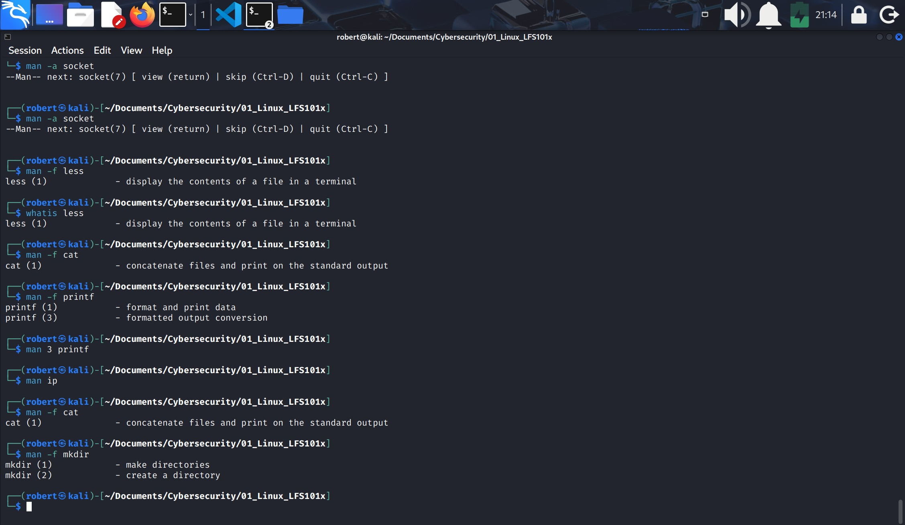
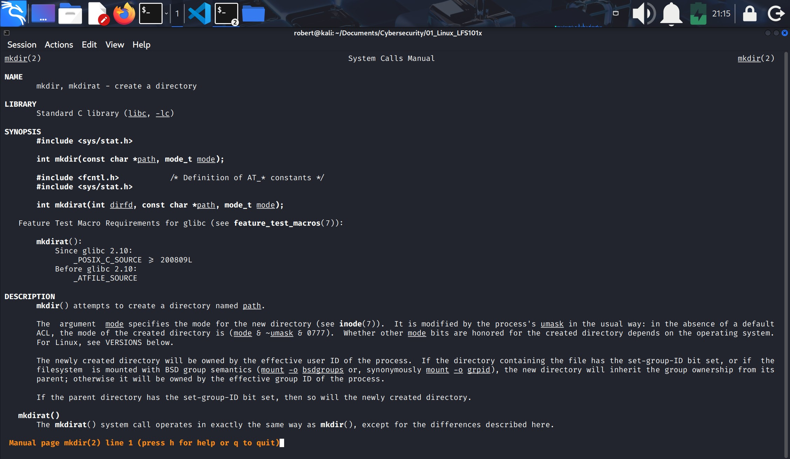
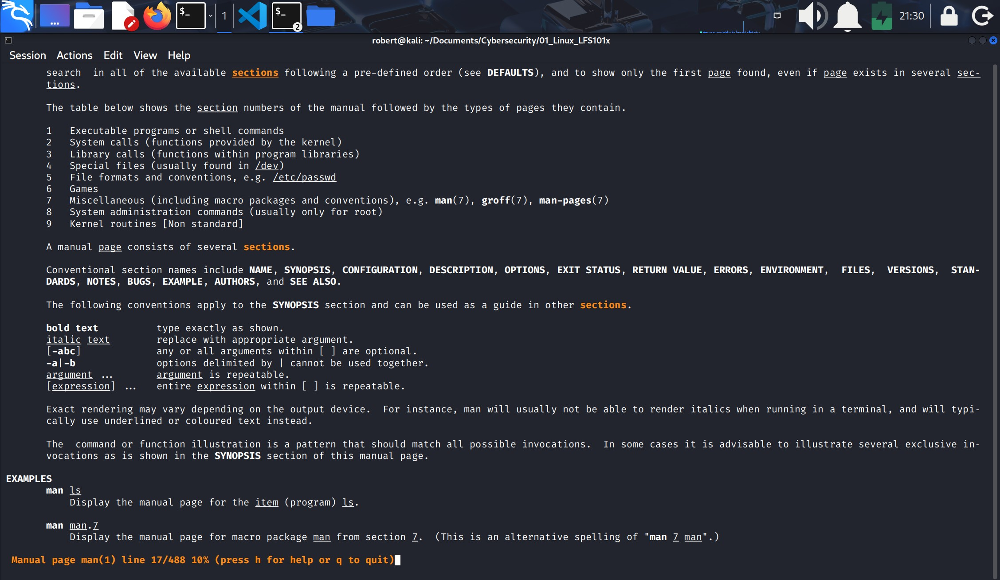
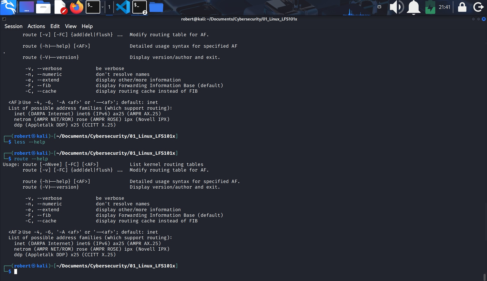

## VIII.- FINDING LINUX DISTROS
### 1.- Linux documentation sources:
1. Because Linux-based systems draw from a large variety of sources, there are numerous reservoirs of documentation and ways of getting help.
2. Importan documentation sources include:
    1. The `man` pages (short for manual pages).
    2. GNU info.
    3. The `help` command and `--help` option.
    4. Other documentation sources (Gentoo Handbook, Ubuntu documentation, or Fedora's)

### 2.- The man pages
1. The **man pages** are the most often-used source of Linux documentation (programs, utilities, topics including configuration files and programming APIs (Application Programming Interface)) for system calls, library routines, and the kernel.
2. Many man pages are converted to PDF, websites, etc.
3. The man program searches, formats and displays information contained in the man page system.
4. A gien topic may have multiple pages associated with it and there is a default order determining which one is displayed when no options or section number is specified.
5. To list all pages on the topic, use the `-f` option.
6. To list pages even if the specified subject is not present in the name, use the `-k` option (it prints more pages).
    * `man -f` generates the same result as typing `whatis`.
    * `man -k` generates the same result as typing `apropos`.
7. The default order is in `/etc/man_db.conf`. It is in ascending numerical order by section.
8. In most recent Ubuntu versions the file is `/etc/manpath.conf`.

### 3.- Manual chapters
1. Manual pages are divided into chapters from 1 to 9.
2. With the `-a` parameter, man will display all pages with the given name in all chapters, one after the other as in:

    `$ man -a socket`
3. `$ man -k .`: lists all man pages.
4. `$ ls /usr/share/man | sort` is to list man pages sections.
5. From the command line, bring up the man page for **man** itself; scroll down to the **EXAMPLES** section:

    * `$ man man` 
    * Then type `/EXAMPLES`.
6. Finding man pages by **topic**. 
    * What man pages that document **file compression** are available?:

        `$ man -k compress` or `apropos compress`

7. Finding man pages by **section**.
    * Bring up the man page for the **printf** library.
    * In which manual page section are **library** functions found?:

        `$ man 3 printf`

Notes:
1. A practical way to use man pages is to use is with the `-f` option first to see what sections are related to the specified topic.
2. When you have idetified the section you can then use the section numer as in:

    1. `man -f mkdir`
    2. `man 2 mkdir` will take you to man pages related to "create a directory"
#### -f option to see the topic sections

#### go into the desired section

3. To see all man pages sections:
    1. `man man`
    2. Type `/sections` to navigate to this part of the man page.
#### man pages sections

### 4.- The GNU info system
1. It is another form of Linux documentation.
2. Functionally `info` resembles man in many ways.
    * Topics are connected using links.
    * It can be viewed through:
        1. CLI
        2. Graphical help utility
        3. Printed, or
        4. Online.
    * Typing `info` in the terminal window displays a window of available topics.
        `$ info <topic_name>`
    * The topic which you view in an **info page** is called a **node**.
    * Nodes are sections and subsections in the documentation. 
    * Each node contain menus and linked topics or items.
    * Items function like browser links and are identified by an asterisks `*` at the beginning.

### 5.- The --help option
1. Is another source of Linux documentation. In example:
    1. `$ man --help` or `$ man -h`
    2. `$ less --help`
    3. `$ route --help`

#### --help option

### 6.- Graphical Help Systems
1. All Linux desktop systems have a grahpical help application  displayed as a `?` or a life-saver icon.
2. They contain help for desktop itself and sometimes graphically-rendered `info` and `man` pages.
3. To prompt it on a GNOME terminal: `gnome-help` or `yelp`.

### 7.- Package documentation
1. Linux documentation is also available as part of the **package management system**. It is placed under `/usr/share/doc`.

### 8.- Online resources
1. The book **The Linux Command Line** by William Shotts.

### 9.- Use yelp to open a GUI for help
1. Find the graphical help system and locate in the man pages for `printf`.
    `$ yelp man:printf`

2. Some other examples:
    `$ yelp man:route`
    `$ yelp man:cpio`

---
- End of chapter **eight**.