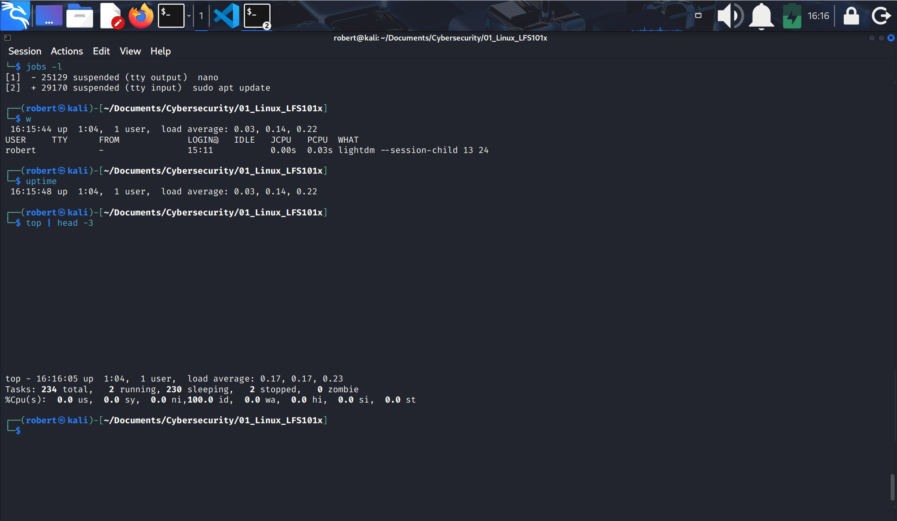
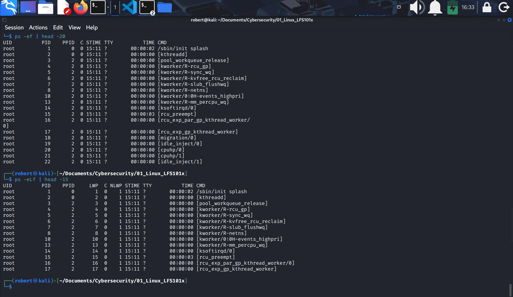
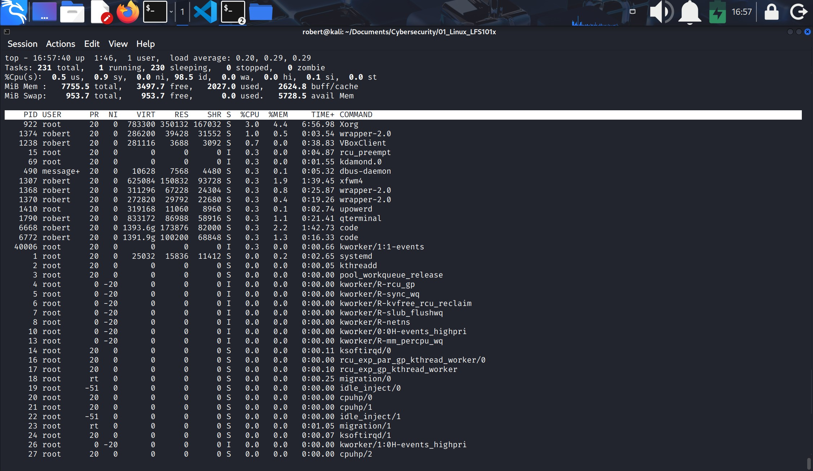
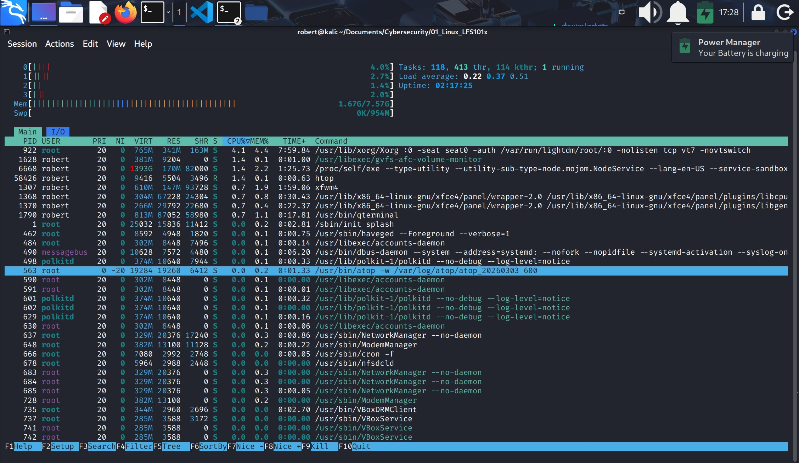
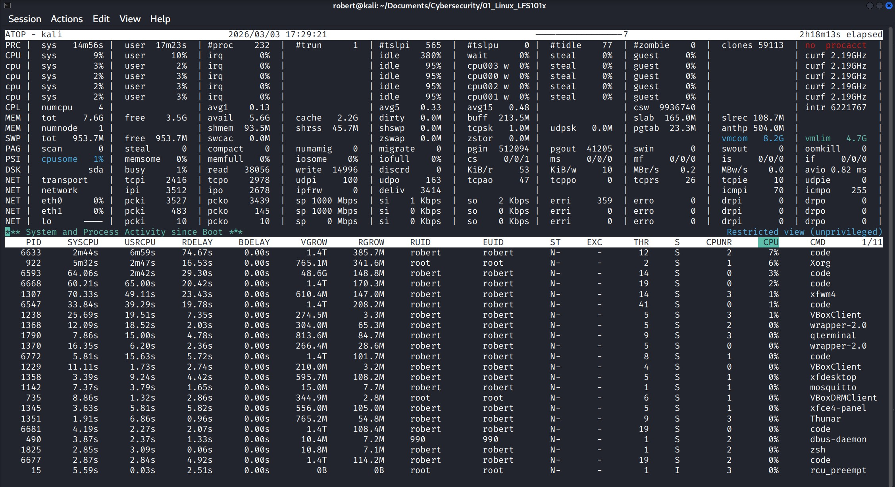
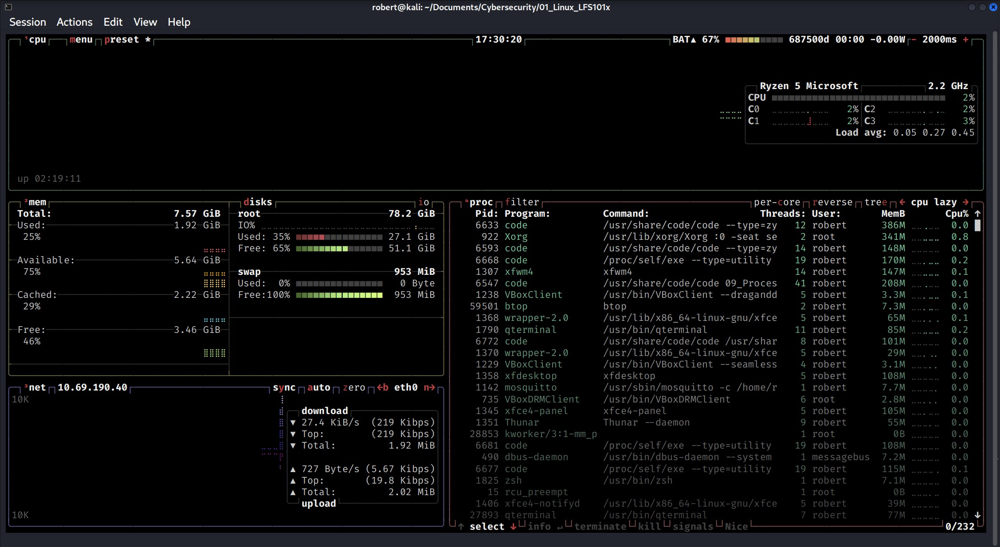
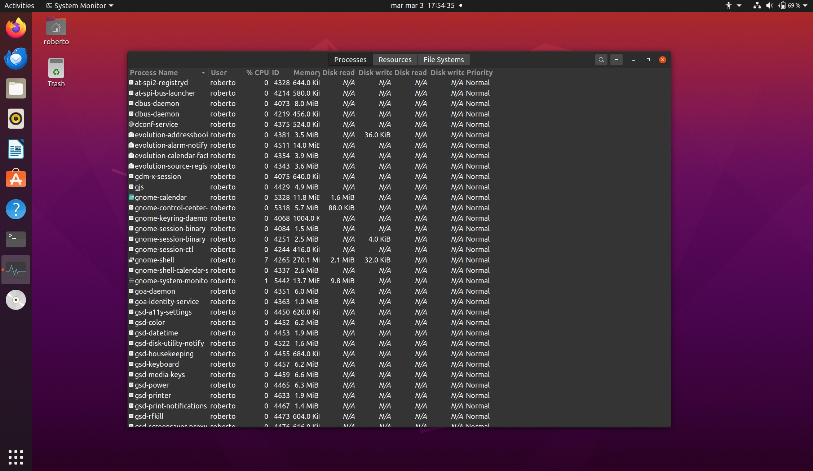
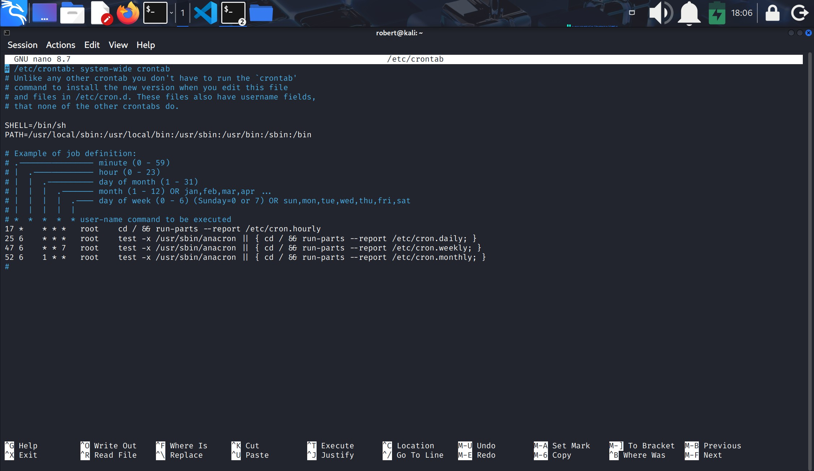
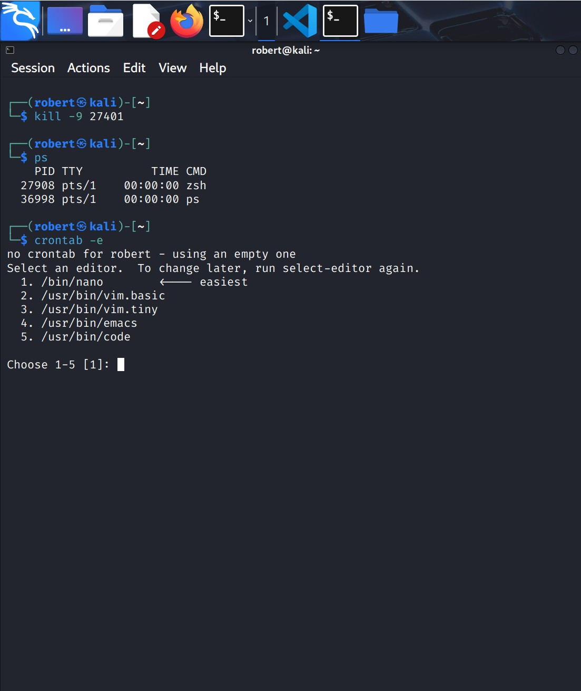

## IX.- PROCESSES
### 1.- What is a process?
1. A process is simply an instance of one or more related tasks (threads) executing on your computer.
2. It is not a progra or a command.
3. A single command may actually start several processes simultaneously.
4. Some processes are independent of each other, and others are related.

### 2.- Process types
1. Interactive processes:

Need to be started by a user, either at a command line or through a graphical interface. For example: bash, firefox, top, Slack, LibreOffice.

2. Batch processes:

Automatic processes which are scheduled from and then disconnected from the terminal. These tasks are queued and work on a FIFO (Firts-In, First-Out) basis. For example: updateb and idconfig.

3. Daemons:

Server processes that run continuosly. Many are launched under system startup and they wait for a user or system request indicating that their service is required. For example: httpd, sshd, libvirtd, cupsd.

4. Threads:

Lightweight processes. They run under the umbrella of a main process. They are scheduled on a run by the system on an individual basis. An individual thread can end without terminating the hole process; and a process can create new threads at any time. Many non-trivial programs are multi-threaded. For example dconf-service, gnome-terminal-server.
* A thread is the minimum execution unit within a process.

5. Kernel Threads:

Kernel tasks that users neither start or terminate and have little control over. For example: kthreadd, migration and ksoftirqd.

### 3.- Process schduling and states
1. A critical kernel function called the **scheduler** constantly runs on and off the CPU sharing time according to relative priority.
2. When a process is in a so-called **running state** means:
    1. It is either **currently** executing instructions on a CPU, or
    2. It is **waiting** to b granted a share of time so it can execute. All processes in this state reside on what is called a **run queue**.

3. **Sleep state**: is when a process is waiting for something to happen before they can **resume**. They are sitting in a wait queue.
4. **Zombie state**: is a process that has finished executing, but still remains listed in the process table because its parent process has not yet collected its exit status.

### 4.- Process and state IDs
1. The operating system keeps track of processes by assigning a unique process ID (PID).
2. PID is used to track process state, CPU usage, memory, etc.
3. New process IDs are usually assigned in ascending order. Thus, PID 1 denotes the **init** process (system initialization process).

### 5.- PID Types
1. Process ID **PID**: Unique Process ID number.
2. Parent Process ID **PPID**: Parent ptocess that started this process.
3. Thread ID **TID**: THread ID number: for multi-threaded process, each thread shares the same PID, but has a unique TID. 

### 6.- Terminating a process
1. At some point, one of your applications may stop working properly, to eliminate it:
    `$ kill -sigkill <PID>` or `kill -9 <PID>`

### 7.- User and Group IDs
1. Many users can access a system symultaneously, and each user can run multiple processes. The operating system identifies the user who starts the process by the Real User ID (RUID) assigned to the user.

2. The user that determines the access rights for the users is identified by the Effective UID (EUID).
3. Users can be organized into enumerated groups. Each group is identified by the Real Group ID (RGID).
4. The access rights of the group are determined by the Effective Group ID (EGID).

### 8.- More about priorities
1. Some processes are more important than others, so Linux allows you to set and manipulate process priority. Higher priority processes get preferential access to the CPU.
2. The priority for a process can be set by specifying a **nice value**, or ***niceness***.
3. The lower the **nice value** the higher the priority.
    * Nice values go from **-20** which is the highest priority, to **+19** which is the lower priority.
4. You can also set a so-called real-time priority to time sensitive tasks:
    * `$ ps`: to see PID for that terminal.
    * `$ ps if`: to see PID for that terminal and PPID, PID and NI (niceness).
    * `$ renice +5 <PID>` to lower the process priority.
5. From the graphical utility `$ gnome-system-monitor` ---> find process ---> change priority.

### 9.- Load Averages and uptime
1. Load Averages are the averages of the load number for a given period of time.
2. They can be viewed by running `w`, `top` or `uptime`.

### 10.- Interpreting Load Averages
1. Load average is displayed using 3 numbers: 0.45, 0.17 and 0.12. Assuming our system is a single-CPUsystem the 3 numbers are interpreted as follows:
    * 0.45: For the last minute the system has been 45% utilizeed on average.
    * 0.17: For the last 5 minutes utilization has been 17%.
    * 0.12: FOr the last 15 minutes utilization has been 12%.

### 11.- Background and Foreground Process
1. By default all **jobs** are executed in the foreground. 
2. A **job** in this context is just a command launched from a terminal window.
3. Foreground jobs run directly from the shell, and when one foreground job is running, other jobs need to wait for the shell access, until it is completed.
4. When a job is going to take a long time to complete (hours) you can run the job in the background.
4. The background job will be executed at **lower priority**, which, in turn, will allow you can type other commands.
5. You can put a job in the background by suffixing `&` to the command; for example: `updatedb &`.
6. Commands to manage jobs:
    * `Ctrl+Z`: to suspend a **foreground** job (put it in background).
    * `Ctrl+C`: to terminate a job.
    * `bg`: to run a suspended process in the background.
    * `fg`: to run a background process in the foreground.

### 12.- Managing jobs
1. The `jobs` utility displays all jobs running in **background**.
2. It displays the job ID, state, and command name.
3. `$ jobs -l` adds the PID.
4. To assertain how long your system has been up and display load averages use: `w`, `uptime` or `load | head -3`.

#### viewing jobs running on background and usage of some job utilities.

On this example you can see the uptime which is 1 hour 4 minutes, 1 user on system, and load averages: 0.17 (for the last minute), 0.17 (for the last 5 minutes) and 0.23 (for the last 15 minutes).

### 13.- The ps Command (system V style)
1. `ps`(process status): provides information about currently running processes keyed by PID underneath the current terminal.
2. `ps`: without options display all processes running under the current shell.
3. `ps -u`: to display processes for a specified username.
4. `ps -ef` to display processes in a full detail (all in the system)
5. `ps -eLf`: displays **one line** of information for all threads for each process.

#### ps -ef and ps -eLf 

### 14.- The ps Commnd (BSD style)
1. Is another style of option specification which stems from the BSD variety of UNIX where options are specified without preceding dashes; for example: 
    1. `ps aux` display all processes for all users.
    2. `ps axo` allows you to specify which attributes you want to view.
    3. `ps` command is used to gather information about what is running on the system, what resourses they are using.

### 15.- More ps options
1. `ps -f`: tells me the PPID.
2. `ps -l`: tells me the riority of the processes and PPID and niceness. A neutral niceness of **0** means the default priority of **80**.
3. Processes that show information within **[ ]** on the **CMD** column are running inside the kernel to do various kinds of background tasks.

### 16.- The process tree
1. `ps ejH`: dislpays the processes running in the form of a tree diagram showing the relationship between a process and its parent process. Threads are displayed in **{ }**.

### 17.- Top
1. `top` shows constant real-time updates for processes at regular intevals (2 seconds).
2. It highlights which processes are consuming the most CPU cycles and memory.

#### top actualizes constantly

### 18.- Interactive keyes with top
1. Besides reporting information, `top` can be used interactively for monitoring and controlling processes.

#### Keys to control **top**

| Key | Function |
|-----|----------|
| `h` or `?` | Display available interactive keys and their function |
| `t` | Display or hide summary information (rows 2 and 3) |
| `m` | Display or hide memory information (rows 4 and 5) |
| `1` | Show information for each CPU instead of totals |
| `d` | Change display update interval |
| `A` | Sort the process list by top resource consumers |
| `r` | Renice a specific process |
| `k` | Kill a specific process |
| `f` | Enter the **top** configuration screen |
| `o` | Interactively select a new sort order in the process list (most are toggles and revert to the original display) |

2. Other **top** related utilities.

`htop`: is the most popular alternative to `top`, designed to be easier to use and more visual.
* Colorful, interactive interface.
* Navigate processes with arrow keys.
* Tree view to show parent/child relationships.
* Visual bars for CPU, RAM, and swap
* Esy process management (kill, renice, search).

#### htop        

`atop`:  is built for in-depth analysis, especially on servers where you need historical data and detailed resource tracking.
* Record system activity over time (hictorical logs).
* Shows etailed per-process metrics (Real CPU usage, Disk I/O, Network usage, Memory consumption).
* Can report on processes that already ended but consumed resources.
* Often used for troubleshooting performance issues.
* **Best usages**: server monitoring and auditing, post-incident analysis ("what caused the spike yesterday?") and detecting bottlenecks in CPU, disk, or network.

#### atop

`btop`: is a modern system monitor with a polished, animated interface and excellent performance.
* Highly visual terminal UI.
* Real-time graphs for CPU, RAM, disks, network, and processes.
* Smooth navigation and animations.
* Highly configurable (themes, layout, colors).
* Written in **C++**, very fast and lightweight.

#### btop

### 19.- System monitor
With **System Monitor** you can have the same information you get from top on a GUI.

#### System monitor in Ubuntu

### 20.- Scheduling future processes usint **at**
1. You can use the `at` utility program to execute any **non-interactive** command at a specified time.

### 21.- cron
1. `cron` is a time-based scheduling utility program.
2. It can launch routine background jobs at specific times and/or days on an ongoing basis.
3. `cron` is driven by a configuration file called **/etc/crontab** (cron table) which contains the various shell commands that need to be run at the properly scheduled time.
4. Each line for a **crontab** file represents a **job**, and is composed of a so-called **cron expression**, followed by a shell command to excecute.
5. Typing `crontab -e` will open the **crontab editor**. Each line of the crontab file will contain 6 fields: min, hr, day, month, day of the week (0 - 6) and a command. **For example**: `30 08 10 06 * /home/sysadmin/full-backup` will schedule a full-backup at 08:30 am, 10 - june, irrespective of the day of the week (0 - 6).

#### crontab file

#### contab editor, crontab -e

### 22.- anacron
1. Linux distros have moved from `cron` to `anacron`.
2. When the machine power is off, `cron` wont run the scheduled job; `anacron` will run the necessary jobs in a controlled manner when the system is up and running.

### 23.- Sleep
1. `sleep` and `at` are quiet different; `sleep` delays execution for a specific period.

---
- End of chapter **nine**.

