## X.- FILE OPERATIONS
1. Linux treats just about everything as a file: ***"everything is a file".***
2. Input / Output (I/O) operations are the same when dealing with files and devices, that simplyfies things.
3. The filesystem is structured like a tree. Starts on the root directory **/**.
4. Root directory is diferent to **root user**.
5. The hierarchical filesystem also contains other elements in the path (directory names), which are separated by forward slashes **/**, as in **/usr/bin/emacs** where the last element is the actual **file name**.

### 1.- Filesystem varieties
1. Linux supports a number of native **filesystem types**, expressly created by Linux developers, such as: ext3, ext4, squashfs, btrfs.
2. It also offers implementations of filesystems used on other alien operating systems such as those from Windows (ntfs, vfat,exfat), SGI (xf3), IBM (jfs); and MacOS (hfs, hfst).
3. There could be more than one filesystem type on a machine.
4. The most advanced filesystem types in common use are the **journaling** varieties: ext4, xfs, btrfs and jfs. These have many state-of-the-art features and high performance and are not easy to corrupt accidentally.
5. Linux also makes use of **network** (or distributed) filesystems, where all or part of the filesystem is on external machines. Besides **Network File System** (NFS) includes, Ceph, Lustre and Open AFS.

### 2.- Linux partitions
1. In most situations, each filesystem on a Linux system occupies a disk partition.
2. Partitions help to organize the contents of disks according to the kind and use of the data contained; for example: programs required to run the system are on a separate partition known as **root** or **/**, files owned by regular users of that system are on **/home**.
3. `gparted` is a tool to see partitions on a machine.

#### gparted
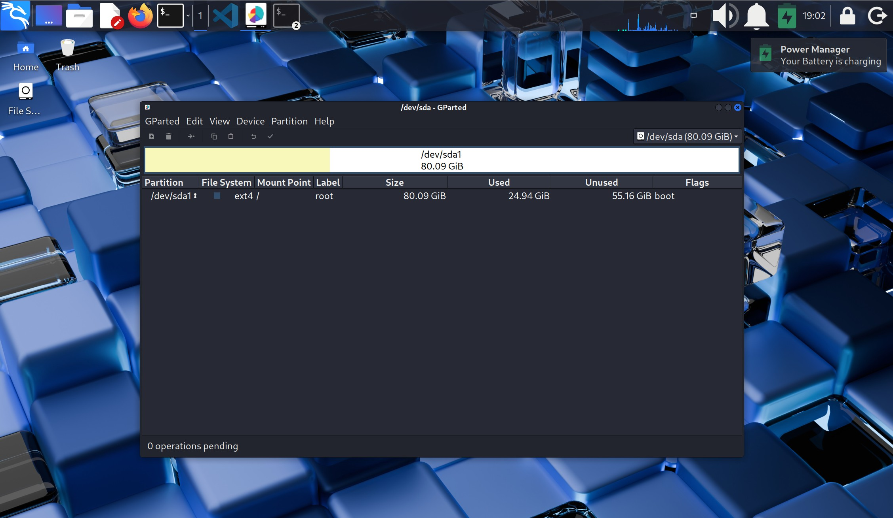

### 3.- Mount points
1. Before you can start using a filesystem, you need to **mount it** on the filesystem tree at a **mount point**.
2. This is simply a directory where the filesystem is to be grafted on.

    * Mount points: /, /home, /var.
    * Filesystems:  /dev/sda1, /dev/sda5, /dev/sda6.

    * Where:
        1. **sd**: is the device type, in this case means SCSI disk.
        2. **a, b, c..**: is the disk number. For default **sda** is the hard drive, a USB could be then **sdb**.
        3. **1, 2, 3..**: partitions within the disk.

* **Warning**: if you **mount** a filesystem on a **non-empty** directory, the former contents of that directory are coverd-up and **not accesible** until the filesystem is **unmounted**. Thus, mount points are usually empty directories.

### 4.- Mounting and unmounting
1. The `mount` command is used to attach a filesystem (which can be local to the computer or on a **network**) somewhere within the filesystem tree.
2. The basic arguments are the **device node** and **mount point**.

**For example**:
        
`$ sudo mount /dev/sda5 /home`
* Where:
    1. `/dev/sda5`  is the **device node**.
    2. `/home`      is the mount point

* This will attach the filesystem contained in the disk partition associated with **/dev/sda5** into the filesystem tree at **/home**.

#### mounting /dev/sda1 to a /mountpoint directory
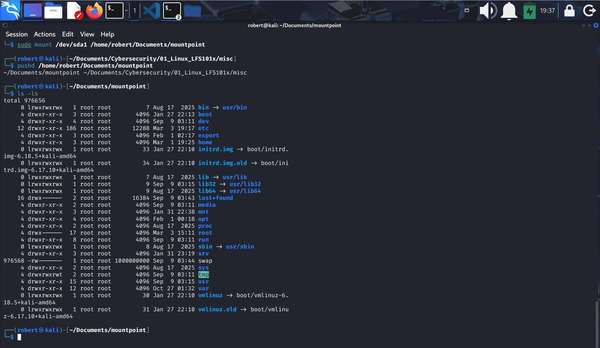
* **Note**: you can only mount filesystems which is diferent to a directory. For example you cannot mount **~/Documents/Cybersecurity/01_Linux_LFS101x/scripts** to **/home/mountpoint** unless you use the `--bind` option.

3. Instead of usint the devide node you can use the disk label or the  **Universally Unique Identifier** (UUID).

4. `sudo umount /home/mountpoint` to **unmount** the partition.
5. **/etc/fstab** is the file that shows you the configuration of all pre-configured filesystems.
6. Executing `mount` without any arguments will show you all presently mounted filesystems. You can do `$ cat /proc/mounts` too.
7. `df -Th` displays information about mounted filesystems including filesystem type, usage tactics.
8. There are many **tmpfs** filesystem types. They are not physical.

### 5.- NFS and Network Filesystems
1. A network filesystem (sometimes called distributed filesystem) may have all its data on one machine or have it spread out on more than one network **node**.
2. A variety of different filesystems can be used locally on individual machines.
#### The Client - Server Architecture of NFS
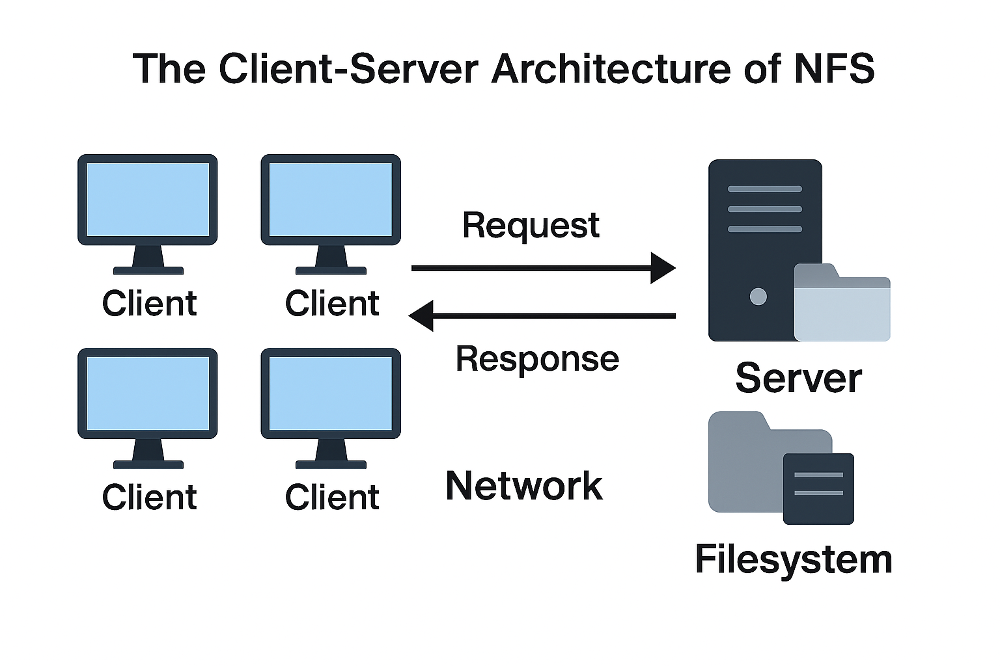
***(Generated with Copilot).***

3. Many **system administrators** mount remote user's home directories on a server in order to give them access to the same files and configuration files acrros multiple client systems. This allows the users to log in to different computers, yet still have access to the same files and resources.
4. The most common susch filesystem is named simply NFS. It has a very long story and was first developed by **Sun Microsystems**.
5. Another common implementation is **CIFS** (or SAMBA) which has Microsoft roots.

### 6.- NFS on the server
1. On the server machine, NFS uses **daemons** (built-in networking and service processes in Linux) and other system servers are started at the CL typing:
`$ sudo systemctl start nfs-server` to start **daemons**.
`$ sudo systemctl status nfs-server` to verify status.

* If nfs is not on your system you will have to install it.
2. The text file **/etc/exports** contain the directories and permissions that a host is willing to share with other systems over NFS.
3. A very simple entry in this file may lok like the following: **/projects *.example.com (rw)**.
4. That entry allows the directory **/projects** to be mounted using NFS with read and write **(rw)** permissions and shared with other hosts in the **example.com** domain.
5. Every file in LInux has three possible permisions:
    1. read (r),
    2. write (w) and
    3. execute (x).
6. After modifying the **/etc/exports** file, you can type `exportfs -dv` to notify Linux about the directories you are allowing to be remotely mounted using NFS.
7. You can restart NFS with `$ sudo systemctl restart nfs`.
8. Use `$ sudo systemctl enable nfs` to make sure NFS starts every time you boot the system
    * **/etc/exports** will be able only after you install NFS server.

### 7.- NFS on the client
1. On the client machine, if it is desired to have the remote filesystem mounted automatically upon system boot **/etc/fstab** is modified to accomplish this.
2. For example, an entry in the client's **/etc/fstab** might look like the following: 
>**servername:/projects /mnt/nfs/projects nfs defaults 0 0**

3. You can also mount the remote filesystem without a reboot or as a one-time mount bye directly using the `mount` command:
    `$ sudo mount servername:/projects /mnt/nfs/projects`
    * If you dont modify /etc/fstab, **servername:projects** will not be present the next time system is restarted.

### 8.- NFS in my lab
I will export my **/home/robert/Documents/Cybersecurity** directory in Kali to the mount point **/home/roberto/Documents/cyber_mnt_point** in Ubuntu.

#### a. Configure the NFS server on Kali
1. `ip --brief add show` on Kali to verify Kali's IP.
2. Check that NFS **server** is active with `$ sudo systemctl status nfs-server`.
3. Edit **/etc/exports** file on Kali to add the desired directory:
    * Add: /home/robert/Documents/Cybersecurity 192.168.56.0/24(rw,sync,no_subtree_check)
4. `sudo exportfs -r` to apply changes.
5. `sudo exportfs -v` to confirm that the export is active.

#### b. Preparing the NFS client on Ubuntu
1. `dpkg -l | grep nfs-common` on Ubuntu to verify client package is installed.
2. Create the mount point:
> /home/roberto/Documents/cyber_mnt_point

* The mount point is where the exported directory from Kali will appear on Ubuntu.

#### c. Mounting the NFS export from Ubuntu
1. In ubuntu do:
`sudo mount 192.168.56.101:/home/robert/Documents/Cybersecurity /home/roberto/Documents/cyber_mnt_point` 
* Where 192.168.56.101 is the Kali IP address.

2. Verify the NFS export works by creating an empty file from Ubuntu and check for it in the Kali directory:
    1. `touch /home/roberto/Documents/cyber_mnt_point/prueba_ubuntu.txt`
    2. `ls /home/robert/Documents/Cybersecurity`.

#### Preparing server
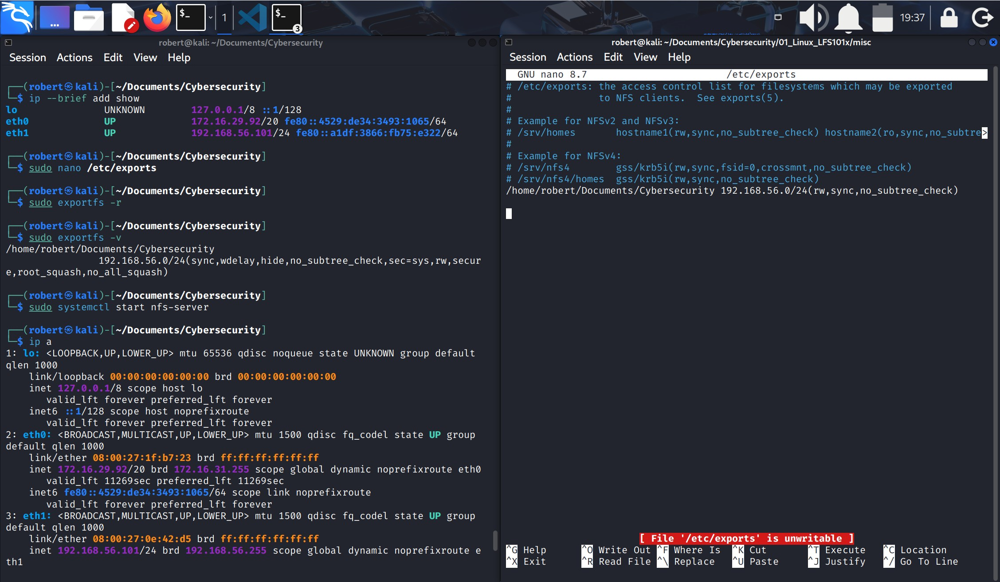

#### Creating mount point on client
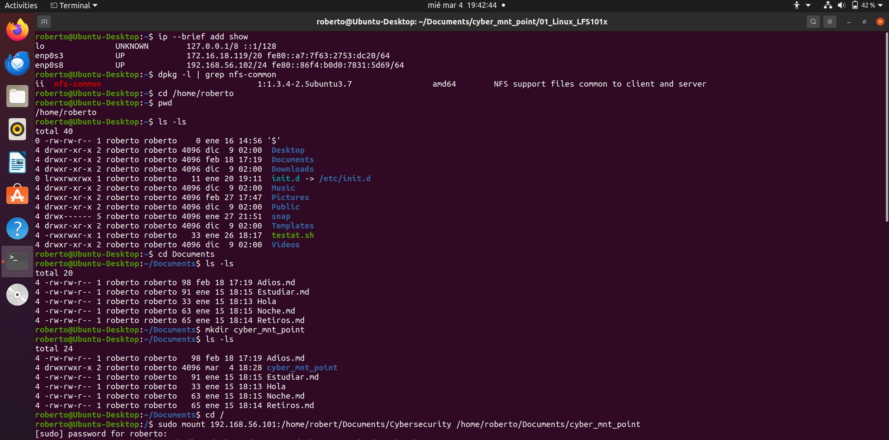

#### Exported directory on both server and client.
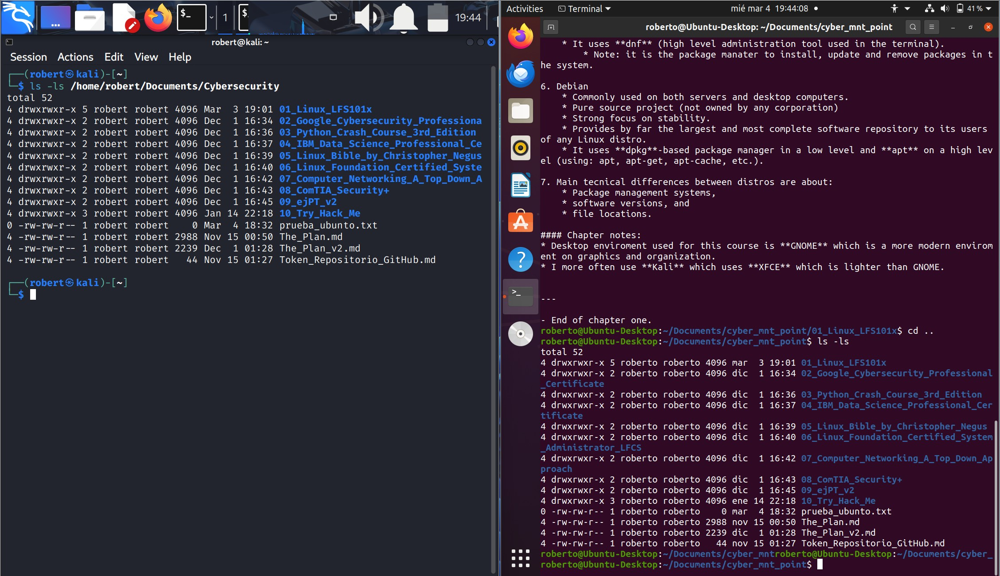

### 9.- Additional information on NFS
1. For NFS to work, server and client should have direct IP connectivity.
2. Server and client are usually on the same network.
3. NFS doesn't encrypt traffic.
4. Is designed for internal networks, not for Internet.
5. To make the mount permanent:
    1. `sudo systemctl enable nfs-server` on server's machine.
    2. Edit **/etc/fstab** on client's adding the line:
> 192.168.56.101:/home/robert/Documents/Cybersecurity /home/roberto/Documents/cyber_mnt_point

6. `sudo mount -a` on client to verify the new line on **/etc/fstab** works, everything should be ok unless an error message occurs.
7. Reboot the client system.
8. Check for the mount point on the client's filesystem, it should be there.

### 10.- Overview of the User Home Directories
1. Each user has a home directory, usually placed under **/home**.
2. On modern Linux systems **/root** is no more than the home directory of the root user (or superuser or system administrator account).
    * I'm not root, nobody (person) is root.
    * I'm **sudo** and can act like **root**.
    * **/root** is not my directory.
    * **root** is a system special account created on the system installation.
3. On a multi-user system, the **/home** directory infraestructure may be mounted as a separate file system on its own partition or even exported (shared) remotely on a network through NFS.

### 11.- /bin and /sbin directories
1. **/bin** contains **executable binaries**, commands to boot the system, and essential commands required by all system users, such as: cat, cp, ls, mv, ps and rm.
2. **/sbin** contains essential binaries related to system administration: fsck and ip.
3. Commands that are not essential for the system to boot or operate in single-user mode are placed in directories /usr/bin, /usr/sbin.
4. On most Linux distros **/usr/bin** and **/bin** are actually just symbolically linked together.
5. Same happens to **/usr/sbin** and **/sbin**.

    * So there are really just **2 directories** not 4.

### 12.- /proc filesystem
1. Certain filesystems, like the one mounted at **/proc** are called "pseudo filesystems" because they dont have actual permanent presence anywhere on the disk.
2. The **/proc** filesystem contains **virtual files** (files that exist only in memory) that permit viewing constantly changing kernel data.
3. It does not contain **real files**, but **runtime system information**, e.g. system memory, devices mounted, hardware configuration, etc.
4. Some important entry files in **/proc** are: cpuinfo, interrupts, meminfo, mounts, partitions, version.
5. **/proc** has subdirectories as well:
    1. **/proc/<process-ID-#>**: is a directory for a **running process** in the system which contain vital info about it.
    2. **/proc/sys**: is a virtual directory that contains a lot of information about the entire system, in particular its hardware and configuration.

### 13.- /dev
1. It contains **device nodes**, a type of pseudo-file used by most hardware and software devices, except for network devices.
It is empty on the disk partition when it is not mounted.
2. Contains entries which are created by the **udev** system.
3. Contains items such as: /dev/sda1 (first partition on the first hard disk), /dev/lp1 (second printer), /dev/random (a source of random numbers).

### 14.- /var 
1. It contains files that are expected to change in size and content as the system is running (var stands for variable), such as the entries in the following directories:
    1. **/var/log**: system log files.
    2. **/var/lib**: packages and database files.
    3. **/var/spool**: print queues.
    4. **/var/tmp**: temporary files.
    5. **/var/ftp**: network service directory for the FTP service.
    6. **/var/www**: network service directory for the HTTP web service.

### 15.- /etc
1. It has around 250 files.
2. It is the home for **system configuration files**.
3. It contains no binary programs, although there are some executable scripts.
    * For example **/etc/resolv.conf** tells the system where to go on the network to obtain a **hostname** to IP address mappings (DNS).
4. Files like passwd, shadow and group for managing user accounts are found here.

### 16.- /boot
1. Contains the few essential files needed to boot the system.
2. For every alternative kernel installd on the system there are 4 files:
    1. **vmlinuz**: the compressed Linux kernel, required for booting.
    2. **initramfs**: the initial ram filesystem, required for booting, sometimes called initrd.
    3. **config**: the kernel configuration file, only used for debugging and bookkeeping.
    4. **system.map**: kernel symbol table, only used for debugging.

> *  **bug**: any incorrect activity, unexpected or undesired.\
> * **debugging**: identify, analyze and fix error processes in a program, a system or a configuration.
> * Its name comes after an actual bug was found in real hardware around 1940.

3. The Grand Unified Bootloader (GRUB) files such as **/boot/grub/grub.conf** and **/boot/grub2/grub2.conf** are here.

### 17.- /lib and /lib64
1. **/lib** contains libraries for the essential programs in **/bin** and **/sbin**.
    * **libraries** are common code applications needed for them to run.
2. Most of these are what is called dynamically loaded libraries (also known as shared libraries or shared objects).
3. On some Linux distros there eexist a **/lib64** directory containing 64-bit libraries, while **/lib** contains 32-bit versions
4. Like for /bin and /sbin, the directories point to those under **/usr**:
    * **/lib** --> usr/lib
    * **/lib64** --> usr/lib64

### 18.- Removable media: /media, /run and /mnt
1. Most LInux systems are configured to notice any removable media automatically and mount them when they are plugged in.
2. Historically Linux used **/media**, modern Linux systems place these mount points under the **/run** directory.
    * USB label: **myusbdrive**
    * User: **student**
        * USB would be mounted on **/run/media/student/myusbdrive**.

### 19.- /mnt
1. Is for temporarily mounting systems like a removable media, but more often is for network filesystems which are not anormally mounted.
2. Or for termporary partitions, or so-called **loopbacks filesystems**, which are files pretend to be partitions.

### 20.- Additional directories under /
1. **/opt**: optional application software packages.
2. **/sys**: virtual pseudo-filesystem giving information about the system and the hardware. Can be used to alter system parameters and for debugging.
3. **/srv**: site-specific data served up by the system. Seldom used.
4. **/tmp**: temporary files; on some distributions erased across a reboot and/or may actually be a ramdisk in memory.
5. **/usr**: multi-user applications, utilities and data.

### 21.- The /usr directory tree:
1. The **/usr** directory tree contains theoretically non-essential programs and scripts (in the sense that they should not be needed to initially boot the system) and has at least the following sub-directories:
    1. **/usr/include**: header files used to compile applications.
    2. **/usr/lib**: libraries for programs in /usr/bin and /usr/sbin.
    3. **/usr/lib64**: 64-bit libraries for 64-bit programs in /usr/bin and /usr/sbin.
    4. **/usr/share**: shared data used by applications, generally architecture-independent.
    5. **/usr/src**: source code, usually for the Linux kernel.
    6. **/usr/local**: data and programs specific for the local machine, subdirectories include: bin, sbin, lib, share, include, etc.
    7. **/usr/bin**: This is the primary directory for executable programs and scripts.
    8. **/usr/sbin**: non-essential system binaries, such as system daemons and scripts

#### / directory tree
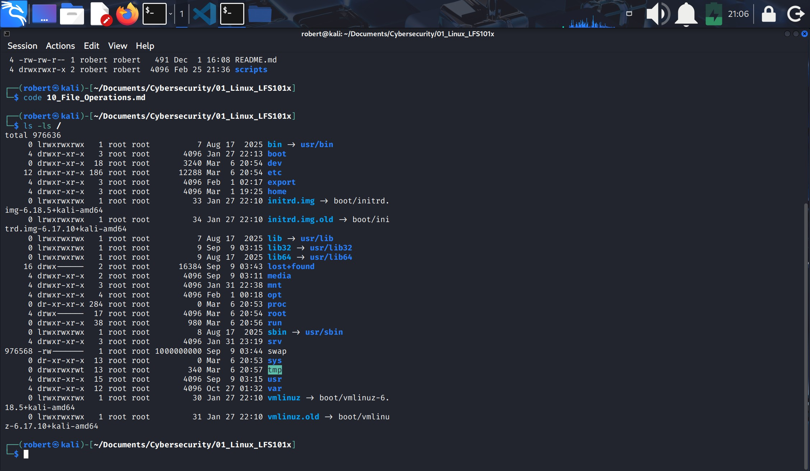

### 22.- Comparing files with diff
1. `diff` is use to compare files and directories, it is often used and has many useful options (see: man diff):

| diff option | Usage                                                                 |
|-------------|------------------------------------------------------------------------|
| `-c`        | Provides a listing of differences                                      |
| `-r`        | Recursively compares subdirectories as well as the current directory   |
| `-i`        | Ignores the case of letters                                            |
| `-w`        | Ignores differences in spaces and tabs (whitespace)                    |
| `-q`        | Quiet mode: only reports if files differ, without listing differences  |

2. `diff` is meant to be used for text files.
3. For binary files one can use `cmp`.
4. To compare two files at the command prompt type:
    
    `$ diff [options] <filename1> <filename2>`
5. If you prefer, there are multiple graphical interfaces to diff: diffuse, vimdiff and meld.

#### diff -c
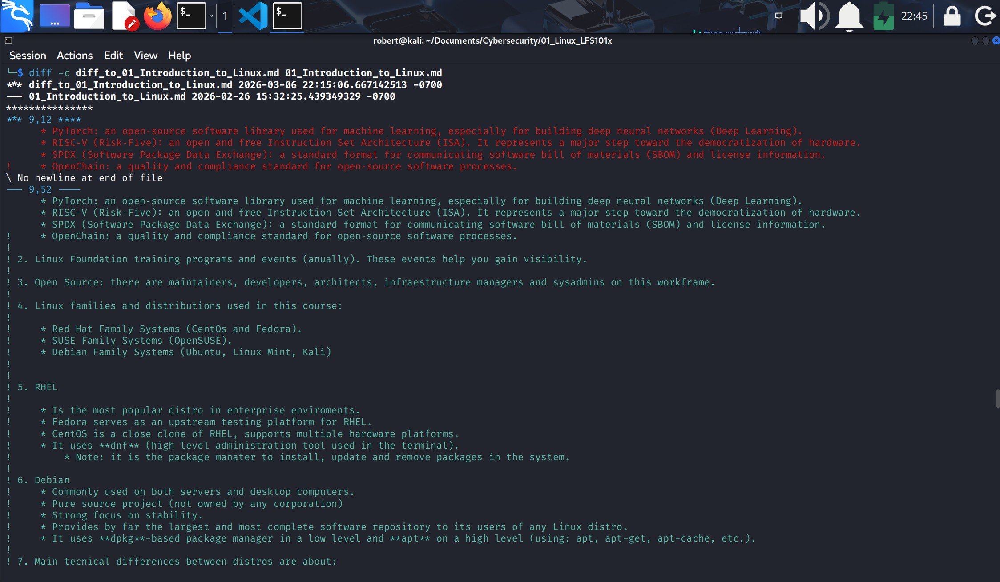

* Notice:
    1. The first file is within \*** and the difference is detected within the range of lines \*** 9 - 12 ***
    2. The second file is within --- and the difference is detected within the range of lines --- 9 - 52 ---.
    3. The first file is a shorter version of the second.
    4. The difference is detected  at the point where the first file ends and the second continues.
    5. Difference is marked with prefix: **!**.
    6. **!** means modified line.
    7. **-** means eliminated line.
    8. **+** means added line.

### 23.- Use diff3 and patch
#### 1.- diff
1. You can use `diff3` to comprare 3 files, it uses one file as the reference basis for the other two.
2. `$ diff3 my-file common-file your-file`
    * `diff3` shows the differences based on the **common-file**.

#### 2.- patch
1. Many modifications to **source code** and configuration files are distributed utilizing **patches**, which are applied, not surprisingly with a **patch program**.
2. A patch file contains the **deltas** (changes) required to update an older version of a file to the new one..
3. The patch files are actually produced by running **diff** with the correct options as in:

    `$ diff -Nvr originalfile newfile > patchfile` <--- is only to work with directories, **no files**.
4. Distributing just the patch is more concise and efficient than distributing the entire file.
    * For example, if only one line needs to change in a file that contains 1,000 lines, the patch file will be just a few lines long.
5. To apply a patch you can just do either of the two methods below:
    1. `$ patch -p1 < patchfile`: this is more commonly used, as it is used to apply changes to an entire directory tree.
    2. `$ patch original-file patchfile`: apply changes to just one file.

### 24.- Creating and applying a patch to a file
1. `diff -u <original_file> <new_content_file> > <patch_name>` to create a new patch, in this example the name is **patch_name**.
2. Verify the patch content with **cat**, it should detect the differences between **original_file** and **new_content_file**.
3. `patch -o <new_version_file> <original_file> < <patch_name>` to apply the patch in a new created file, in this example the contents of the patch will apply to the **new_version_file**.
4. Open the **new_version_file** to verify is updated.

#### diff -u and patch -o
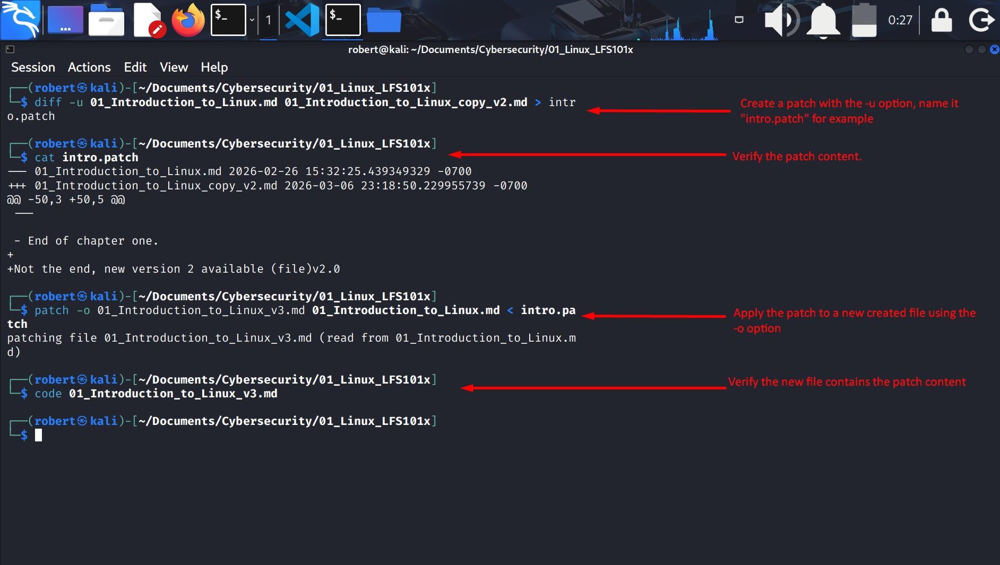

### 25.- Using the File Utility
1. In Linux a file extension **does not, by default, categorize its nature** the way it might in other Operating systems.
2. One cannot asume that a file named **file.txt** is a text file and not an executable program.
3. Most applications directly examine a file's content to see what kind of object it is rather than relying on an extension.
4. The real nature of a file can be ascertained by using the `file`utility.

#### file utility applied to a text and a script file
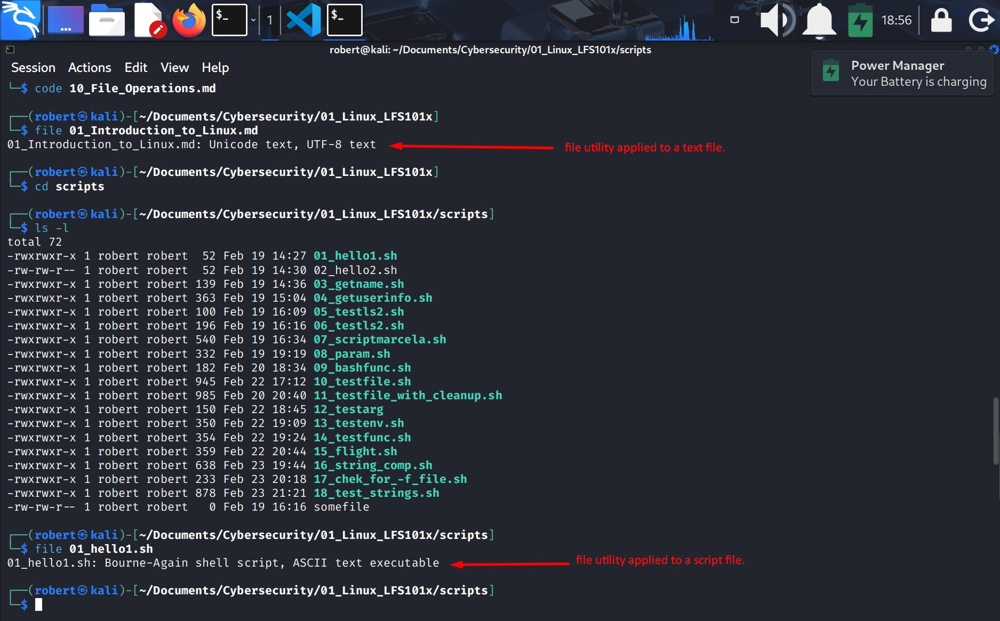

### 26.- Backing up Data
1. There are many ways you can backup data or even your entire system. Basic ways to do so include the use of simply coppying with `cp`: and use of the more robust `rsync`.
    1. `rsync`: if the file already exist and there is no change in size or modification time, it will avoid an unnecesary copy and save time.
        * Furthermore, `rsync` copies only the parts of files 
        that have actually changed, it can be very fast.
        * `rsync`: can copy files from one machine to another. Locations are designated in the `target:path` form.
        * A very useful way to back up a project directory might be to use the following command:
        > `$ rsync -r project-X archive-machine:archives/project-X`
        * First test your `rsync` using the `-dry-run` option to ensure that it provides the results that you want.

    2.  `cp`: can only copy files to and from destinations on the local machine (unless you are copying to or from a filesystem mounted using NFS).

    #### rsync on the same machine
    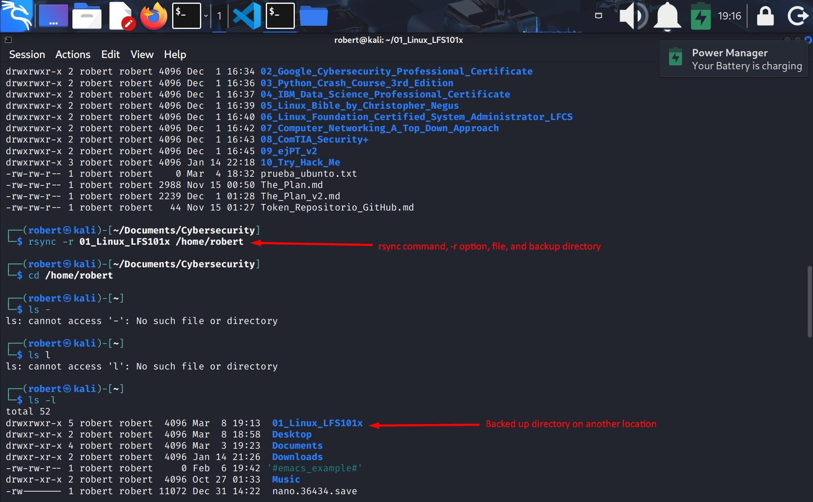

### 27.- Compressing data
1. File data is often compressed to save disk space and reduce the time it takes to transmit files over networks.
2. Linux uses a number of methods to perform this compression, including:

| Command | Description |
|---------|-------------|
| `gzip`  | The most common compression utility used in Linux. |
| `bzip2` | Produces significantly smaller files than those created with gzip. |
| `xz`    | The most space‑efficient compression utility available on Linux. |
| `zip`   | Often required to inspect and decompress archives from other operating systems. |

3. `tar` is often used to group files in an archive and then compress the whole archive at one.

### 28.- Compressing Data using gzip

| Command | Description |
|---------|-------------|
| `gzip *` | Compresses all files in the current directory. Each file is compressed and renamed with a **.gz** extension. |
| `gzip -r projectX` | Compresses all files inside the `projectX` directory, including all subdirectories. |
| `gunzip foo` | Decompresses **foo** from the file **foo.gz**. Internally, `gunzip` works the same as `gzip -d`. |

#### gzip * usage
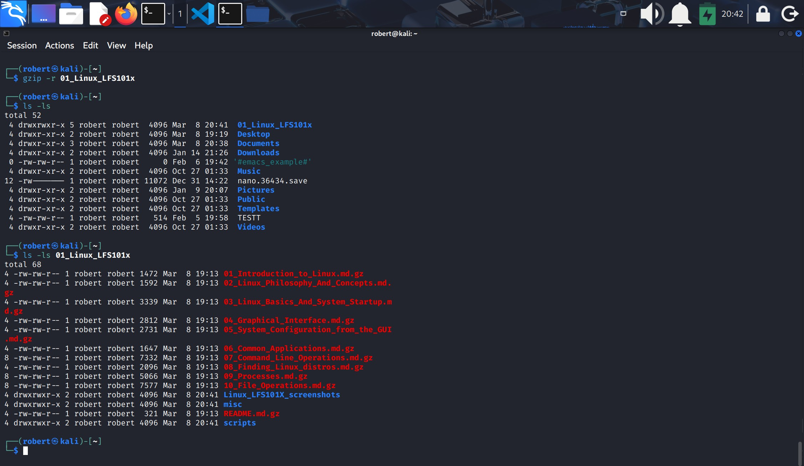

#### De-compressing with gunzip
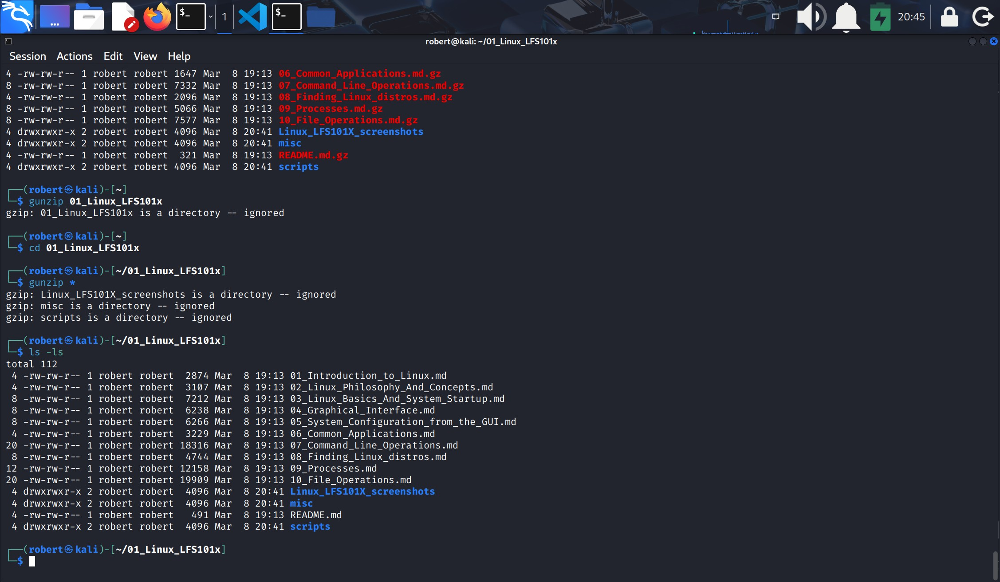

### 29.- Compressing data using bzip2
1. It is more likely to use it on larger files because it producess smaller files but it takes more time.

| Command | Description |
|---------|-------------|
| `bzip2 *` | Compresses all files in the current directory. The resulting files use the **.bz2** extension. |
| `bunzip2 *.bz2` | Decompresses all files with the **.bz2** extension in the current directory. It works the same as `bzip2 -d`. |

* `bzip2` suffers lack of maintenance. It should no longer be used to compress, only to decompress **.bzip2** files.

### 30.- Compressing data using xz
1. Is the most space-efficient compression utility frequently used in LInux and is the choice for distributing and storing archives of the LInux kernel.
2. It trades a slower compression speed for an even higher compression ratio.
3. Is the dominant compression method, specially for large files which may need to be downloaded from the internet.

| Command | Description |
|---------|-------------|
| `xz *` | Compresses all files in the current directory and replaces each file with one using the **.xz** extension. |
| `xz foo` | Compresses `foo` into **foo.xz** using the default compression level (`-6`) and removes the original file if compression succeeds. |
| `xz -dk bar.xz` | Decompresses **bar.xz** into `bar` and **keeps** the original `bar.xz` file even if decompression is successful. |
| `xz -dcf a.txt b.txt.xz > abcd.txt` | Decompresses a mix of compressed and uncompressed files to standard output using a single command, redirecting the result into `abcd.txt`. |
| `xz -d *.xz` | Decompresses all files in the current directory that were compressed using `xz`. |

### 31.- Handling files using zip
`zip`       is only needed when you get a zipped file from a WIndows user or Internet downloads. It is a legacy program, it is neither fast nor efficient.
`zip backup *`      Compresses all files in the curren directory and places them in the **backuup.zip** file.
`zip -r backup.zip ~`       Archives your login directory (**~**) and all files and directories under it in **backup.zip**.
`unzip backup.zip`      Extracts all files in **backup.zip** and places them in the current directory.

### 32.- Archiving and compressing data using tar
1. Historically `tar` stood for "tape archive" and was used to archive files to a magnetic tape.
2. It allows you to create or extract files from an archive file, often called **tarball** and decompress while extracting its contents.

| Command | Description |
|---------|-------------|
| `tar -xvf mydir.tar` | Extracts all files from **mydir.tar** into the **mydir** directory. |
| `tar -zcvf mydir.tar.gz mydir` | Creates an archive of `mydir` and compresses it using **gzip**. |
| `tar -jcvf mydir.tar.bz2 mydir` | Creates an archive of `mydir` and compresses it using **bzip2**. |
| `tar -Jcvf mydir.tar.xz mydir` | Creates an archive of `mydir` and compresses it using **xz**. |
| `tar -xvf mydir.tar.gz` | Extracts all files from **mydir.tar.gz** into the `mydir` directory. Note: you do **not** need to tell `tar` that it is gzip‑compressed. |

* Use of dashes (**-**) before options is often done, although it is usually unnecessary as in the `tar xvf mydir.tar`.

### 33.- Compressing and decompressing using tar
1. `tar -Jcvf 01_Linux_LFS101x.tar.xz 01_Linux_LFS101x`
* Where:
    1. **01_Linux_LFS101x.tar.xz**: is the name of the created compressed file.
    2. **01_Linux_LFS101x**: is the directory you want to compress.
    3. `-J`: is for **xz** compression.
    4. `-c`: creates a new tar file.
    5. `-v`: verbose (shows the files meanwhile they are added to the compressed file).
    6. `-f`: specifies the compressed file name.
2. The file **01_Linux_LFS101x.tar.xz** will be created.
    * You can check the file contents with `tar -tf 01_Linux_LFS101x.tar.xz`.

---
3. To extract (de-compress) a file do:
    `tar -xvf 01_Linux_LFS101x.tar.xz`
4. Make sure you de-compress on a different directory, to do that use:
    `tar -xvf 01_Linux_LFS101x.tar.xz -C <another_directory>`

#### Compress a directory using tar and xz
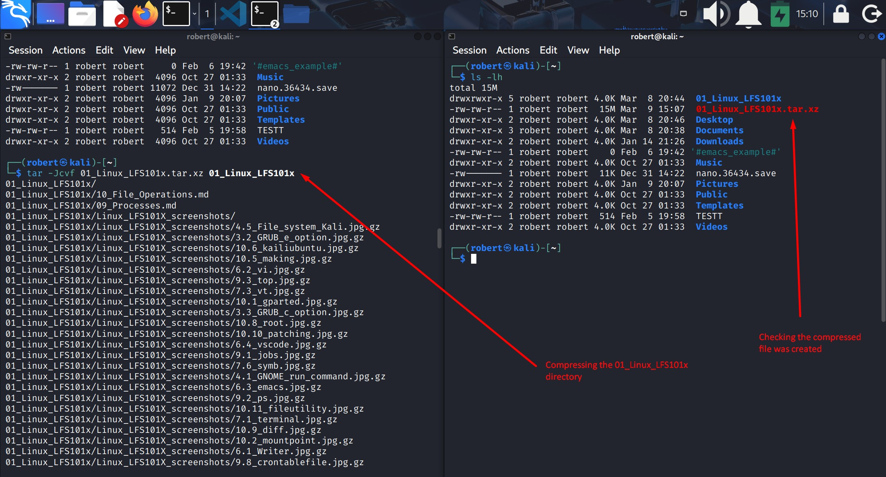

#### Decompress a file using tar and xz
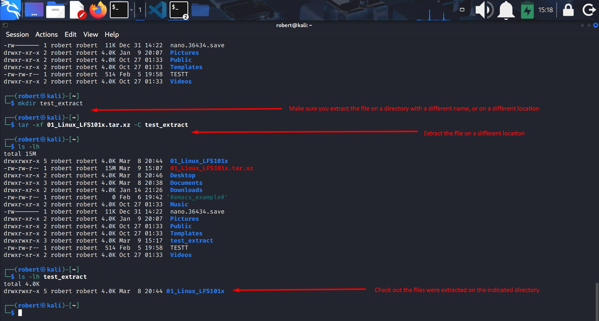
* You may want to extract the contents of the file on a different location using the **-C** option and indicating the new directory.

### 34.- Disk-to-disk copying (dd)
1. `dd` is very useful for making copies of raw disk space.
2. Execute `$ dd if=/dev/sda of=/dev/sdb` to do that.
3. To make a copy of one disk onto another will delete everything that previously existed on the second disk (sdb)
4. An exact copy of the first dis device (sda) is created on the second device (sdb).

---
- End of chapter **ten**.

