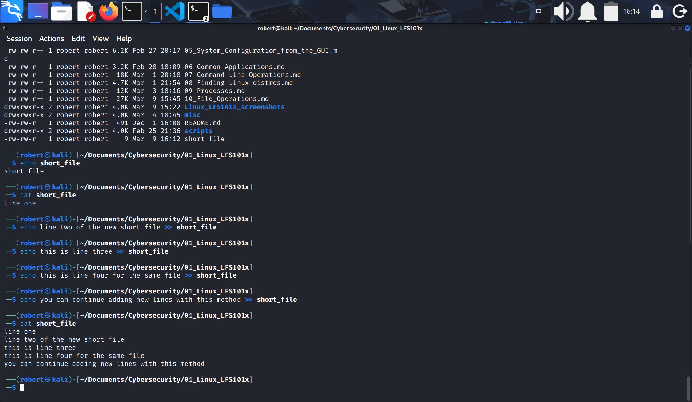
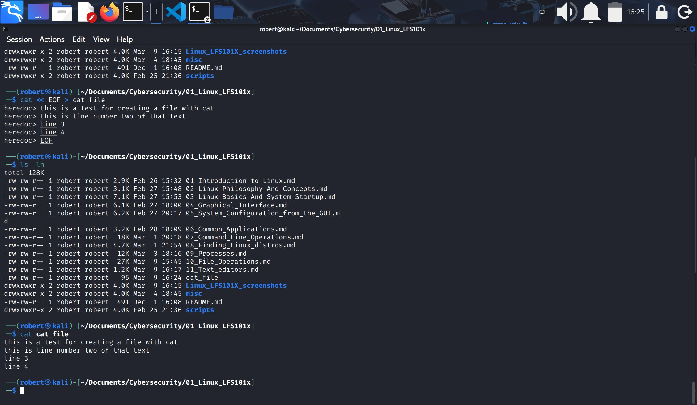
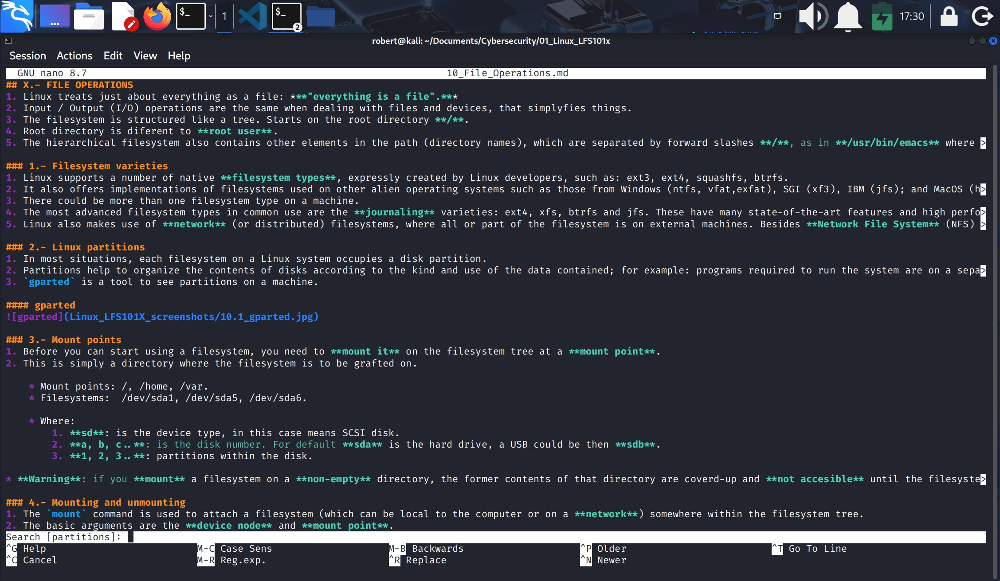
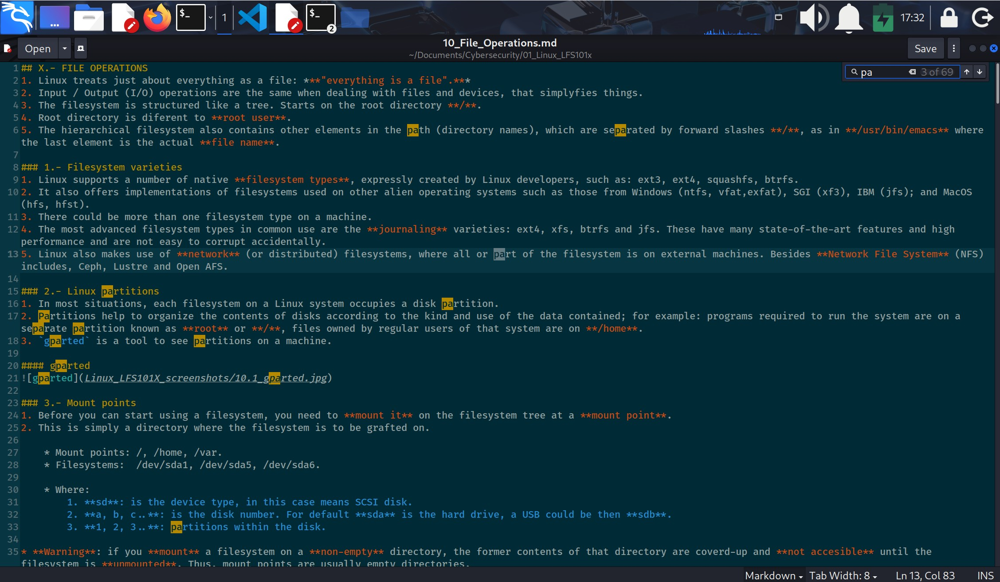
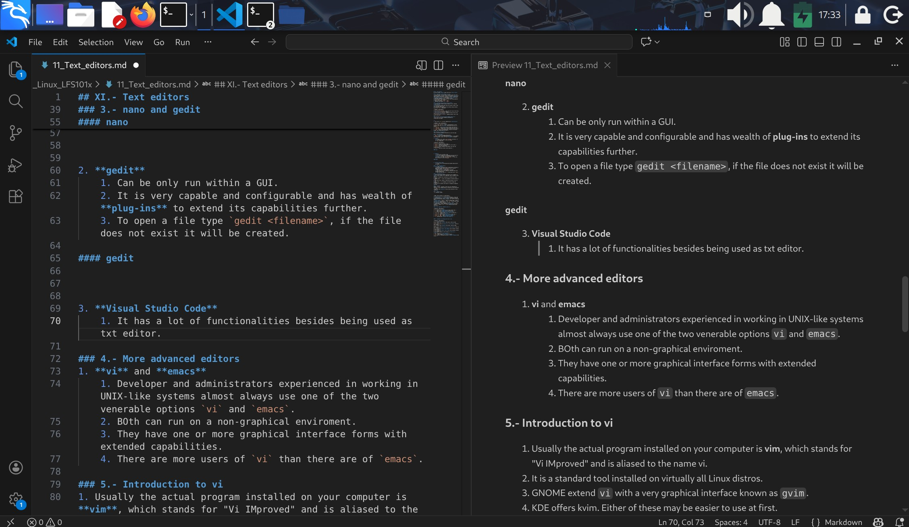
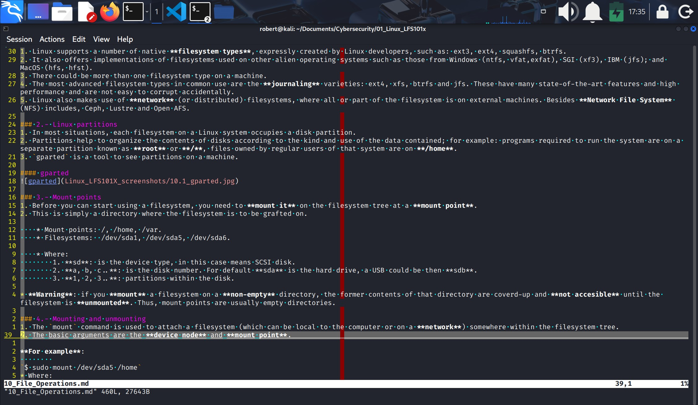
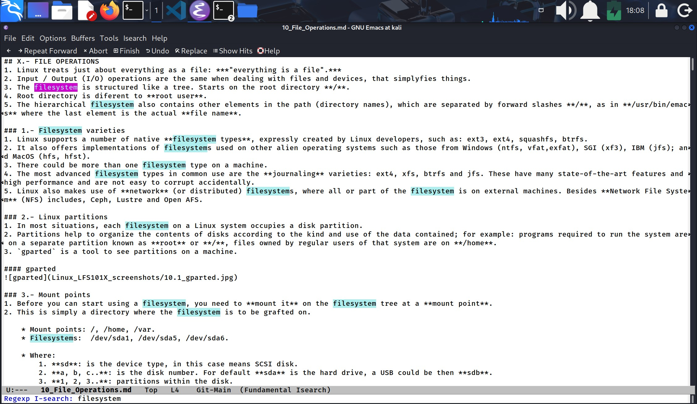

## XI.- Text editors
On Linux systems **data** takes the form of **text files**.

### 1.- Overview of Text Editors in Linux
1. At some point, you will need to manually edit text files. Composing e-mails, writing scripts to be used for **bash** or other command interpreters, altering a system or application **configuration file**, or developing **source code** for a programming language such as C, Python or Java.
2. Text editing files is less laborious than using graphical utilities and is less limited.
3. Basic text editors: `nano`, `gedit`.
4. Advanced text editors `vi`, `emacs`.

### 2.- Creating files without using an editor
1. Creating files without using an editor is for creating **short files**.
2. It can be very useful when used from within scripts, even when creating longer files.
3. If you want to create a new file without using an editor you can use `echo` repeatedly:

| Command | Description |
|---------|-------------|
| `echo line one > my-file` | Sets the first line of the file, **overwriting** any existing content. |
| `echo line two >> my-file` | Appends the next line to the file **without overwriting**. |
| `echo line three >> my-file` | Appends another line to the end of the file. |

#### Creating a file with echo and adding lines to it

---
4. You can use `cat` as well combined with **redirection**:

| Command / Line | Description |
|----------------|-------------|
| `cat << EOF > my-file` | Opens a here‑document to write multiple lines into **my-file**. Overwrites the file if it exists. |
| `> line one` | First line of text written into the file. |
| `> line two` | Second line of text written into the file. |
| `> line three` | Third line of text written into the file. |
| `> EOF` | Closes the here‑document, returns to the shell prompt, and creates/saves the file. |

#### Creating a file with cat

### 3.- nano and gedit
* `nano` is the text-terminal based editor.
* `gedit` is part of the GNOME desktop system, is vry capable and configurable, looks a lot like **notepad** in Windows.

1. **nano**
    1. To open a file, type `nano <filename>` and enter. If the file doesnt exist, it will be created.
    2. `nano` shortcuts:

| Shortcut | Description |
|----------|-------------|
| `Ctrl+G` | Display the help screen. |
| `Ctrl+O` | Write the current buffer to a file (save). |
| `Ctrl+X` | Exit the file/editor. |
| `Ctrl+R` | Insert contents from another file into the current buffer. |
| `Ctrl+C` | Show the current cursor position. |

#### nano

2. **gedit**
    1. Can be only run within a GUI.
    2. It is very capable and configurable and has wealth of **plug-ins** to extend its capabilities further.
    3. To open a file type `gedit <filename>`, if the file does not exist it will be created.

#### gedit

3. **Visual Studio Code**
    1. It has a lot of functionalities besides being used as txt editor.

#### VS Code

### 4.- More advanced editors
1. **vi** and **emacs**
    1. Developer and administrators experienced in working in UNIX-like systems almost always use one of the two venerable options `vi` and `emacs`.
    2. BOth can run on a non-graphical enviroment.
    3. They have one or more graphical interface forms with extended capabilities.
    4. There are more users of `vi` than there are of `emacs`.

### 5.- Introduction to vi
1. Usually the actual program installed on your computer is **vim**, which stands for "Vi IMproved" and is aliased to the name vi.
2. It is a standard tool installed on virtually all Linux distros.
3. GNOME extend `vi` with a very graphical interface known as `gvim`.
4. KDE offers kvim. Either of these may be easier to use at first.
5. When using `vi` all commands are entered through the keyboard.
6. You can use a pointer with mouse or touchpad on graphical versions.

### 6.- vimtutor
Typing `vimtutor` launches a short but very comprehensive tutorisl. It has enough material to make you a very proficient `vi` user.
* Check for the **vimtutor** file on misc directory of this repository.

### 7.- Modes in vi
`vi` provides 3 modes:

| Mode | How to Enter It | Description |
|------|------------------|-------------|
| **Command Mode** | `vi` starts here by default | Every key is interpreted as an **editor command**. Keystrokes perform actions like deleting, moving, copying, etc. Not for inserting text. |
| **Insert Mode** | Press `i` while in Command Mode | Used to **insert text** into the file. Press `ESC` to exit Insert Mode and return to Command Mode. |
| **Line Mode** (a.k.a. Command-Line Mode) | Press `:` while in Command Mode | Allows entering **ex commands** such as `w` (write), `q` (quit), `wq`, `x`, etc. Executes editor-level operations. |

### 8- Most important commands used in vi 

| Shortcut | Description |
|----------|-------------|
| `0` | Move to the **beginning** of the current line. |
| `$` | Move to the **end** of the current line. |
| `w` | Move to the **beginning of the next word**. |
| `:0` or `1G` | Move to the **first line** of the file. |
| `:n` or `nG` | Move to **line n**. |
| `:$` or `G` | Move to the **last line** of the file. |
| `Ctrl+F` or `PgDn` | Move **forward one page**. |
| `Ctrl+B` or `PgUp` | Move **backward one page**. |
| `^L` | Refresh and **recenter the screen**. |

### 9.- Commands for working with text in vim

| Shortcut | Description |
|----------|-------------|
| `a` | Append text **after** the cursor. Entra en modo Insert. |
| `A` | Append text al **final de la línea actual**. Entra en modo Insert. |
| `i` | Insert text **before** the cursor. Entra en modo Insert. |
| `I` | Insert text al **inicio de la línea actual**. Entra en modo Insert. |
| `o` | Crear una **nueva línea debajo** de la actual y entrar en modo Insert. |
| `O` | Crear una **nueva línea arriba** de la actual y entrar en modo Insert. |
| `D` | Delete desde el cursor hasta el **final de la línea**. |
| `dd` | Delete la **línea completa**. |
| `Nyy` | Yank (copiar) **N líneas** al buffer. |
| `p` | Paste el contenido del buffer **debajo o después** del cursor. |

#### vi

### 10.- Introduction to emacs
1. `emacs` is a popular text editor competitor for `vi`. It does not work with modes.
2. It can be used for e-mail, debbuging, etc.
3. Rather than having different modes for **command** and **insert**, `emacs` uses the `Ctrl` and `Meta` (`Alt` or `ESC`) keys for special commands.

### 11.- Working with emacs

| Shortcut | Description |
|----------|-------------|
| `emacs <file>` | Start Emacs and open **file** for editing. |
| `Ctrl+X i` | Insert the contents of another file at the current cursor position. |
| `Ctrl+X s` | Save **all** open files. |
| `Ctrl+X` `Ctrl+W` | Write the current buffer to a **new file name** (Save As). |
| `Ctrl+X` `Ctrl+S` | Save the **current** file. |
| `Ctrl+X` `Ctrl+C` | Exit Emacs, prompting to save modified files. |

* `emacs` commands are not case sensitive like they are on `vi`.

### 12.- Changing cursor positions in emacs

| Shortcut | Description |
|----------|-------------|
| `arrow keys` | Move cursor up, down, left, right. |
| `Ctrl+n` | Move **one line down**. |
| `Ctrl+p` | Move **one line up**. |
| `Ctrl+f` | Move **one character forward**. |
| `Ctrl+b` | Move **one character backward**. |
| `Ctrl+a` | Move to the **beginning of the line**. |
| `Ctrl+e` | Move to the **end of the line**. |
| `Meta+f` | Move to the **beginning of the next word**. |
| `Meta+b` | Move to the **beginning of the previous word**. |
| `Meta+<` | Move to the **beginning of the file**. |
| `Meta+g g n` | Move to **line n**. |
| `Meta+>` | Move to the **end of the file**. |
| `Ctrl+v` | Move **one page forward**. |
| `Meta+v` | Move **one page backward**. |
| `Ctrl+L` | Refresh and **recenter the screen**. |

### 13.- Searching for Text in emacs
| Shortcut | Description |
|----------|-------------|
| `Ctrl+s` | Search **forward** for the prompted pattern, or repeat the search forward. |
| `Ctrl+r` | Search **backward** for the prompted pattern, or repeat the search backward. |

* Note:
    1. Press `ESC` when search is finished to exit the prompt.
    2. Press `ESC` as many times needed to clean the prompt 
    3. Prompt has to be clean for the commands to work.

### 14.- Working with Text in emacs

| Shortcut | Description |
|----------|-------------|
| `Ctrl+O` | Insert a **blank line** at the cursor position. |
| `Ctrl+D` | Delete the **character at the cursor**. |
| `Ctrl+K` | Delete (kill) the text from the cursor to the **end of the line**. |
| `Ctrl+_` | **Undo** the last action. |
| `Ctrl+Space` / `Ctrl+@` | Set the **mark** (begin a selected region). |
| `Ctrl+W` | Delete (kill) the **selected region**. |
| `Ctrl+Y` | **Yank** (paste) the most recently killed text. |

* Note: `Ctrl+W` works as if you copied a selected text.

#### emacs

---
- End of chapter **eleven**.
