## XII.- USER ENIROMENT
### 1.- Identifying the current user
1. Linux is a multi-user operating system, meaning **more than one user** can log on at the same time.
2. `whoami` to identify the current user.
3. `who` to list the currently logged-on users.

### 2.- User startup files
1. The command shell program (usually bash) uses one or more **start up files** to configure the user enviroment.
2. Files in the **/etc** directory define global settings for **all users**.
3. Initialization files in the user's home directory (/home/user) can include and/or override the global settings.
4. The start up files can do everything the user would like to do in every command shell, such as:
    1. Customizing the prompt
    2. Defining command line shortcuts and aliases.
    3. Setting the default text editor.
    4. Setting the path for where to find excecutable programs.

### 3.- Order of the start up files
1. When you first log in to Linux **/etc/profile** is read and evaluated, after which the following files are searched (if they exist) in the listed order:
    1. ~/.bash_profile
    2. ~/.bash_login
    3. ~/.profile
        * If it finds ~/.bash_profile, it ignores the other 2.

2. However, everytime you create a new shell, or terminal window **you do not perform a full system login**, only a file named **~/.bashrc** is read and evaluated.

#### .zprofile and .zshrc files on my /home/robert directory
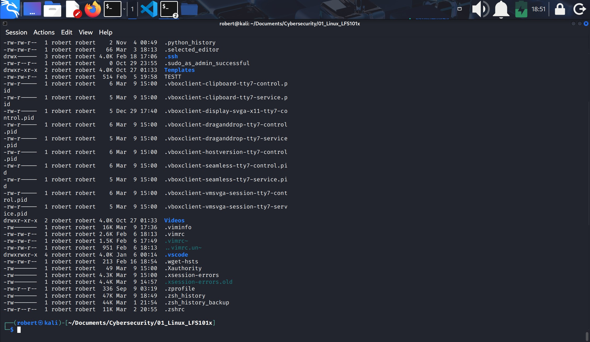

### 4.- Creating aliases
1. You can create customized commands or modify the behavior of already existing ones by creating aliases.
2. Most often, these aliases are placed in your **~/.bashrc** file so they are available to any command shell you create.
3. `unalias` removes an alias.
4. Typing `alias` with no arguments will list currently defined aliases.
    * Note: there should not be any spaces on either side of the equal (**=**) sign and the alias definition needs to be placed within either single or double quotes if it contains any spaces.
---
5. Creating an **alias** (example):
    1. `$ alias linuxmisc='cd /home/robert/Documents/Cybersecurity/01_Linux_LFS101x/misc'`
        * **linuxmisc** is the name of the alias.
        * **cd** is the command to be executed.
    2. To make the alias persistent, just place it in your **~/.zshrc** file.
    3. Apply changes with `$ source /home/robert/.zshrc`.
    4. Now everytime you type the alias even in different new terminals it will execute the command.

#### alias created and stored in .zshrc file to make it permanent
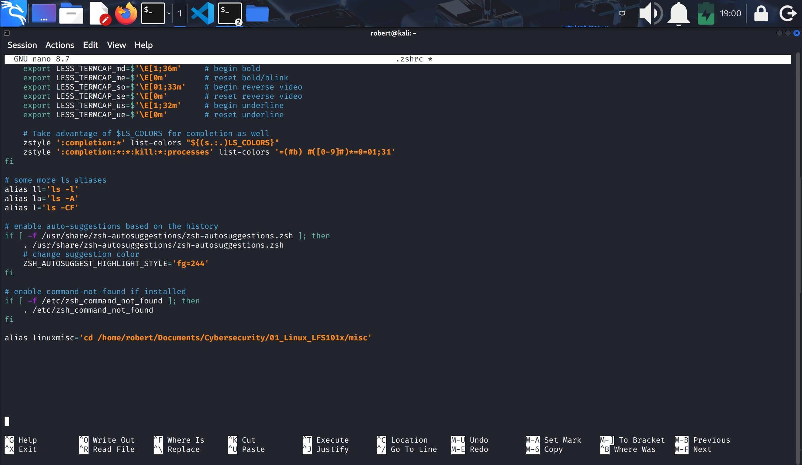

### 5.- Basics of users and groups
1. All Linux users are assigned a unique user ID (UID), which is just an integer; normal users start with a UID of 1,000 or greater.
2. Linux uses **groups** to organize users. 
3. Groups are collections of accounts with certain shared permisions; they are used to establish a set of users who have common interests.
4. **Control of group** membership is administrated through the **/etc/group** file which shows the list of groups and their members.
5. By default, every user belongs to a default (primary) group.
6. When a user logs in, the group membership is set for their primary group and all the members enjoy the same level of access and privilege.
7. Permissions on various files and directories can be modified at a **group level**.
8. Users also have one or more group ID's (GID) including a default one that is the same as the user ID.
9. These numbers are associated with names through the files **/etc/passwd** and **/etc/group**.

#### /etc/group file
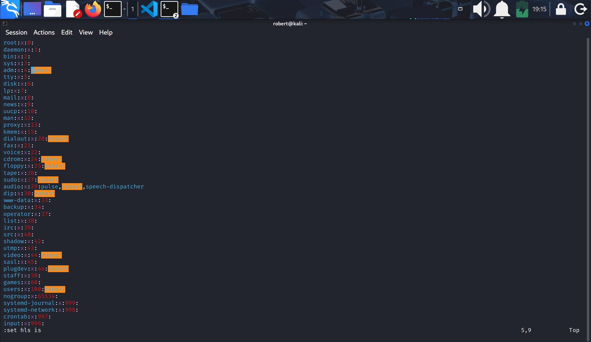

* Where:
    * You can see a list of all the system groups.
    * What groups I form part of (highlighted).

### 6.- Adding and Removing Users
1. Linux grahpical interfaces offers ways to add/remove users.
2. It is often useful to do it from the CL.
3. Adding a new user is done with `useradd`, removing it with `userdel`. For example:
    `$ sudo useradd bjmoose`
    * Sets the home directory **/home/bjmoose** and populates it with basic files copied from /etc/skl.
    * Adds the line: **bjmoose:x:1002::/home/bjmoose:/bin/bash** to /etc/passwd.
4. Typing `id` with no argument gives information about current user:

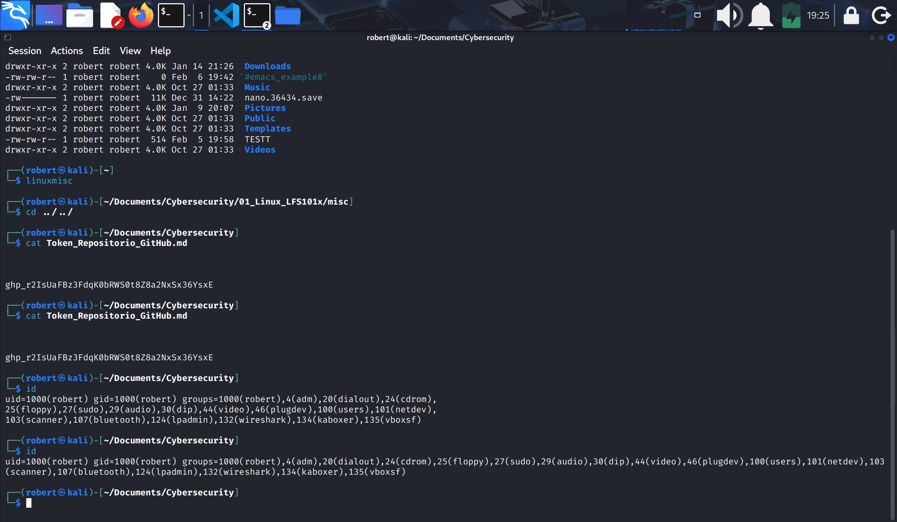

* Notice: you can see the user id, the group id and all the groups the user is part of.

### 7.- Adding and Removing Groups
1. `$ sudo /usr/sbin/groupadd anewgroup` to add a new group.
2. `$ sudo /usr/sbin/groupdel anewgroup` to delete it.
---
3. Adding a user to an already existing group is done with `usermoed`
4. For example, you would first look at what groups the user already belongs to:
    `$ groups rjsquirrel` --> rjsquirrel:rjsquirrel
5. And then add the new group:
    1. `$ sudo /usr/sbin/usermod -a -G anewgroup rjsquirrel`
    2. `$ sudo rjsquirrel` --> rjsquirrel: rjsquirrel anewgroup

#### adding a new group, adding a user to the new group
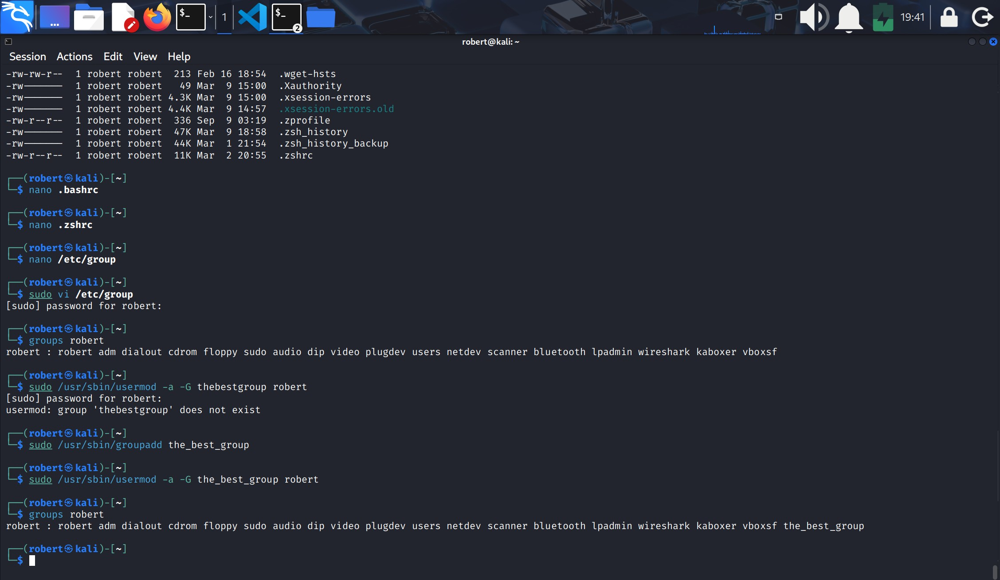

* Note: these utilities update /etc/group as necessary:

| Option | Description |
|--------|-------------|
| `-a` | Append: agrega información sin eliminar los grupos ya existentes. |
| `-G` | Modify group properties. |
| `-n` | Change the group name. |

### 8.- The root directory
1. Other OS's call this the **administrator account**, in Linux is often called the **superuser** account.
2. External attacks often consist of tricks used to elevate to the root account.
3. You can use `sudo` to assign more limited privileges to user accounts:
    * Only on a temporary basis.
    * Only for a specific subset of commands.

### 9.- su and sudo
When assigning **elevated** privileges you can use `su` or `sudo`:
1. `su` (switch or substitute user): to launch a **new shell running as another user** (you must type the password of the user you are becoming).
    * Most often, this other user is root.
    * It is almost always a bad-dangerous practice to use `su` to become root.

2. `sudo` is less dangerous and is preferred.

### 10.- Elevating to a root account
1. To temporarily become the **superuser** for a series of commands, type `su` and then be prompted for the root password.
2. To execute **just one command** with root privileges type `sudo <command>`.
    * When the command is complete, you will return to being a normal unprivileged user.
    * `sudo` configuration files are stored in the **/etc/sudoers** file and in the **/etc/sudoers.d/** directory.
    * By default, the **/etc/sudoers.d/** is empty.

#### /etc/sudoers file
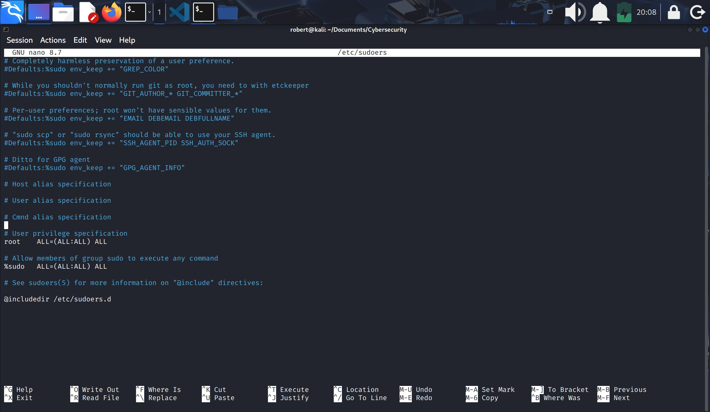

### 11.- Enviroment variables
1. Enviroment variables contain information so the shell and other programs know how to work (behave) in the current session.
1. Enviroment variables are **quantities** that have specific **values** which may be utilized by the command shell, such as bash or zsh, or other utilities and applications.
2. Some are given by the system, some are set directly by the user.
3. An enviroment variable is actually just a **character string** that contains information used by one or more applications.
4. To view the values of currently set enviroment variables one can type `set`, `env` or `export`.

#### Enviroment variables executing env
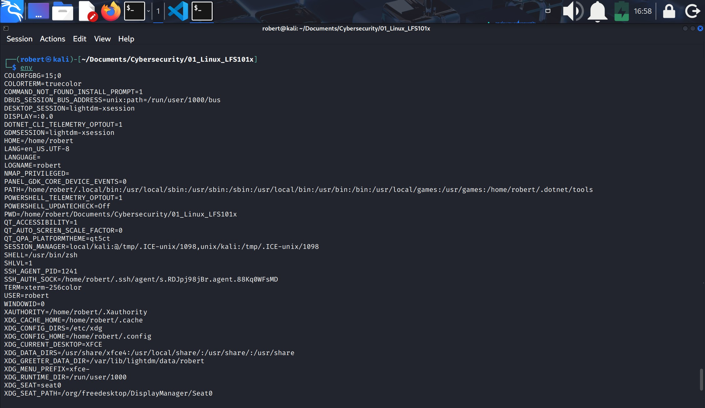
* Each line is an enviroment variable

### 12.- Setting Enviroment Variables
1. By default, variables created within a script are only available to the current shell; child processes (sub-shells) will not have access to values that have been modified.
2. Allowing child processes to see the values requires use of the `export` command.

| Command | Value | Task |
|---------|--------|------|
| `echo $SHELL` | /usr/bin/zsh | Show the value of a specific variable. |
| `export VARIABLE=value` *(o)* `VARIABLE=value; export VARIABLE` | — | Export a new variable value. |

* Add a variable permanently:

    1. Edit ~/.bashrc (or ~/.zshrc) and add the line: **export VARIABLE=value** 
    2. Type `$ source ~/.bashrc` or just `.~/.bashrc`; or just start a new shell by typing `bash`.

### 13.- The HOME variable: $HOME
1. **HOME** is an enviroment argument variable that represents the home directory of the user.
2. `$ echo $HOME` shows the value of the HOME enviroment variable which is **/home/robert**

### 14.- The PATH variable: $PATH
1. **PATH** is an ordered list of directories (the path) which is scanned when a command is given to find the appropiate program or script ro run.
2. Each directory in the path is separated by colons (**:**).
3. A null (empty) directory name (or **./**) indicates the current directory at any given time.

### 15.- The SHEL variable: $SHELL
1. **SHELL** points the default command line shell and contains the full pathname to the shell.
2. `$ echo $SHELL`: /bin/bash (or /usr/bin/zsh for Kali).

### 16.- The PS1 variable and the Command Line Prompt
1. PS1 is not an enviroment variable, it is an internal shell variable.
1. Prompt Statement (PS) is used to customize your prompt string in your terminal windows to display the information you want.
2. **PS1** is the primary prompt variable which controls what your command line prompt looks like.
3. One can go fancy with the prompt and do things like add colors or even sounds!

#### Personalized $PS1 variable, variable in .zshrc file
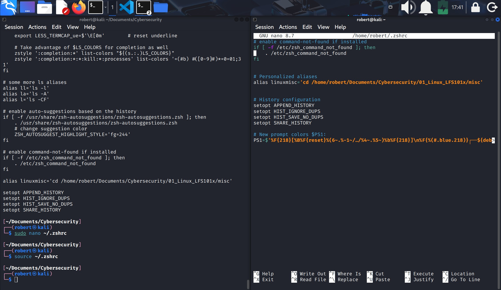
* Notice:
    1. Now the path work directory is one line above the username.
    2. Green color was replaced by magenta.
    3. To make the changes permanent, add the PS1 configuration line to the **~/.zshrc** file.

### 17.- Recalling Previous Commands
1. **bash** keeps track of prevously entered commands and statements in a history buffer.
2. `history` to see the list of previously executed commands.
    * **~/.bash_history** is the file where are set the variables.
    * **~/.zsh_history** is the file for Kali.

### 18.- Using HIstory Enviroment Variables
1. Several associated enviroment variables can be used to get information about the history file.
2. You can find those variables in **~/.bash_history** or **~/.zsh_history**.

| Variable       | Descripción |
|----------------|-------------|
| **HISTFILE**       | Ubicación del archivo donde se guarda el historial de comandos. |
| **HISTFILESIZE**   | Número máximo de líneas que puede contener el archivo de historial (por defecto 500). |
| **HISTSIZE**       | Número máximo de comandos que se mantienen en memoria durante la sesión. |
| **HISTCONTROL**    | Controla cómo se almacenan los comandos (por ejemplo, ignorar duplicados). |
| **HISTIGNORE**     | Define qué comandos NO deben guardarse en el historial. |

### 19.- Finding and using previous commands

| Shortcut / Key        | Description |
|------------------------|-------------|
| **↑ / ↓ arrow keys**  | Browse through the list of previously executed commands. |
| **!!**                | Execute the previous command. |
| **Ctrl + R**          | Search previously used commands. Start typing to filter results. Press **Ctrl + R** again to continue searching or to exit. |

### 20.- Executing previous commands
Syntax used to execute previously used commands:
| Syntax        | Description |
|---------------|-------------|
| **!**         | Begins a history substitution. |
| **!$**        | Refers to the last argument of the previous command. |
| **!n**        | Refers to command number *n* in the history (e.g., `!200`). |
| **!string**   | Refers to the most recent command that starts with *string*. |

* Notice: 
    1. All history substitutions start with `!`.
    2. When typing the command: `ls -l /bin/etc/var`, `!$` will refer to `/var` the last argument to the command.

### 21.- Keyboard shortcuts and tasks on the terminal

| Shortcut / Key | Description |
|----------------|-------------|
| **Ctrl + L**   | Clears the screen. |
| **Ctrl + S**   | Temporarily halts output to the terminal window. |
| **Ctrl + Q**   | Resumes output to the terminal window. |
| **Ctrl + D**   | Exits the current shell. |
| **Ctrl + Z**   | Suspends the current process and sends it to the background. |
| **Ctrl + C**   | Terminates (kills) the current process. |
| **Ctrl + H**   | Works the same as Backspace. |
| **Ctrl + A**   | Moves the cursor to the beginning of the line. |
| **Ctrl + W**   | Deletes the word before the cursor. |
| **Ctrl + U**   | Deletes from the beginning of the line to the cursor position. |
| **Ctrl + E**   | Moves the cursor to the end of the line. |
| **Tab**        | Auto‑completes files, directories, and binaries. |

* Note: the case of the **Hotkey** does not matter.

### 22.- File ownership
1. In Linux every file is associated with a user who is the owner.
2. Every file is associated to a group too.
3. The owners have certain rights, or permissions: **read, write, execute**.

| Command   | Description |
|-----------|-------------|
| **chown** | Used to change the user ownership of a file or directory. |
| **chgrp** | Used to change the group ownership of a file or directory. |
| **chmod** | Used to change file permissions for the **owner**, **group**, and **others**. |

### 23.- File permission modes and chmod
1. Files have three kind of permissions: 
    1. read **(r)**,
    2. write **(w)** and
    3. execute **(x)**.
        * These are generally represented as **rwx**.
2. These permissions affect 3 groups of owners:
    1. user/owner **(u)**,
    2. group **(g)** and
    3. others **(o)**.

3. As a result you have the following three groups of three permissions:

| Category            | Values | Values | Values |
|---------------------|--------|--------|--------|
| **Permissions**     | rwx:   | rwx:   | rwx:   |
| **Groups of owners**| u:     | g:     | o:     |

4. In the first column on a file description you will see the permissions for that file, for example:
> -rw-rw-r-- 1 robert robert 2946 Jan 13 20:57 Broken_DNS.md

* Where:
    1. The first position reflects the type of file (normal, directory, symlink, etc).
    2. The next 3 positions are the **user** permisions, in the example above user has read, write, and no execute permissions.
    3. The next 3 positions are the **group** permissions, and
    4. The last 3 positions are the **others** permissions.

#### groups and permissions on files and directories
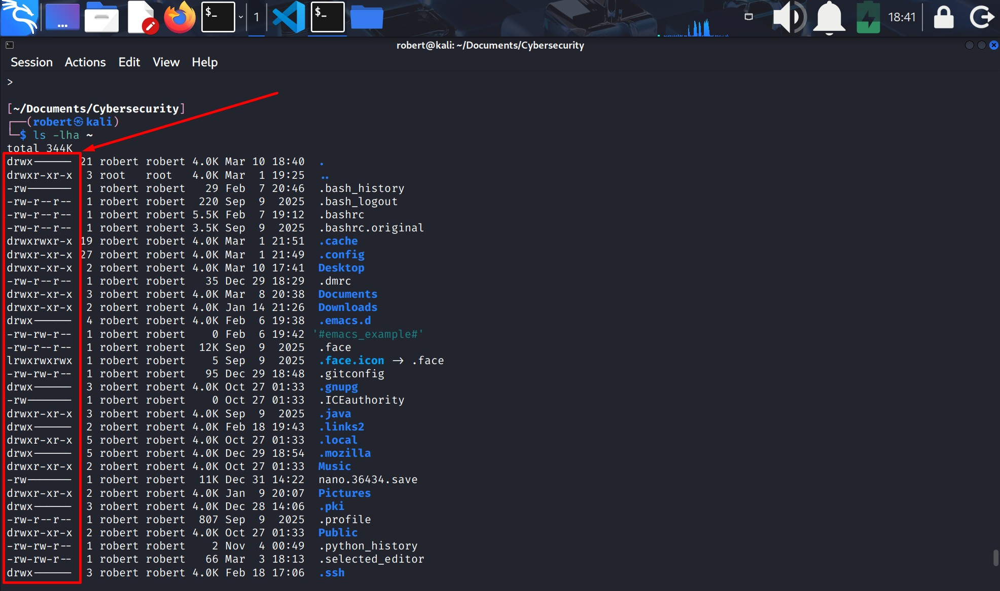

---

5. **chmod**

There are a number of different ways to use `chmod`, for instance:
* To give the owner and others permissions to execute: `uo+x`.
* Remove the group the write permission: `g-w`.

`$ ls -l somefile`

`-rw-rw-r--  ...somefile`

`$ chmod uo+x, g-w somefile` <-- gives user and others execute permissions, removes write permissions to group

`$ls -l somefile`

`-rwxr--r-x`

6. This kind of syntax can be difficult to type and remember, so one uses a shorthand which lets you set all the permissions in one step
7. This is done with a **symply algorithm**, and a single digit suffices to specify all three permissions bits for each entity.
8. This digit is the sum of:
    * 4: if the read permission is desired.
    * 2: if the write permission is desired.
    * 1: if the execute permission is desired.

9. **Thus, 7 means read-write-execute, 6 means read-write, 5 means read-execute, 4 means read, 3 means write-execute, 2 means write, 1 means execute.**

10. When you apply this to the `chmod` command, you have to give three digits for each degree of freedom, such as in:
    
    `$ chmod 755 somefile`
    
    `$ ls -l somefile`

    `$ -rwxr-xr-x somefile`

24. Change file ownership using `chmod`

    `$ sudo chown root file6`
    * Changes file ownership from **robert** to **root**.

    `$ sudo chown root:root file?`
    * `?` any filename starting with file.
    * changes both file5 and file6 ownership to **root**.

25. Change the group ownership using `chgrp`.

    `$ sudo hgrp bin file`

#### permission changes to a file or directory
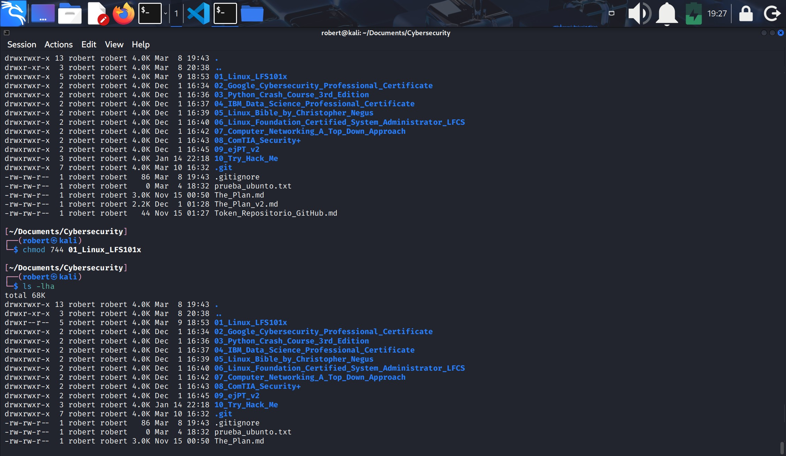
* With `chmod 744 01_Linux_LFS101x` permissions of writing and executing were removed to the groups of **groups** and **others** on directory **/01_Linux_LFS101x**

#### ownership changes to a file or directory
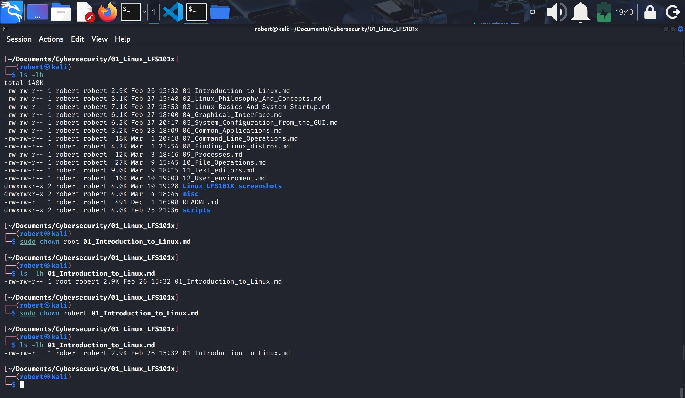
* File Introduction_to_Linux.md was first owned by user robert, then changed to root and back again to robert.

---
- End of chapter **twelve**.