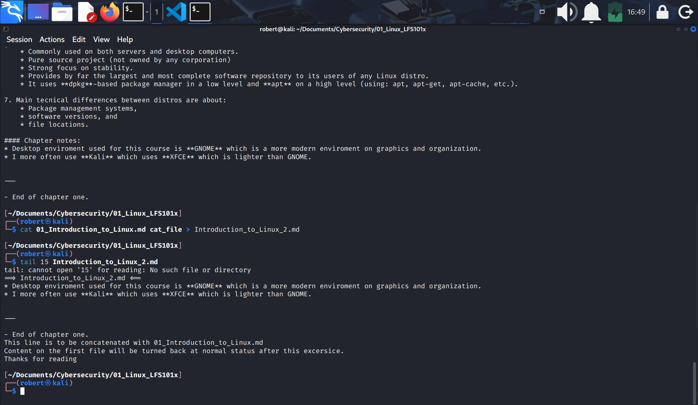
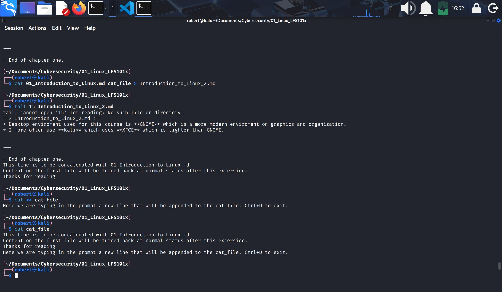
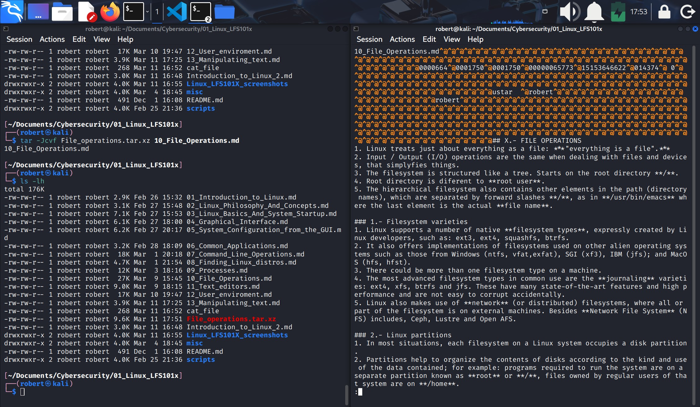
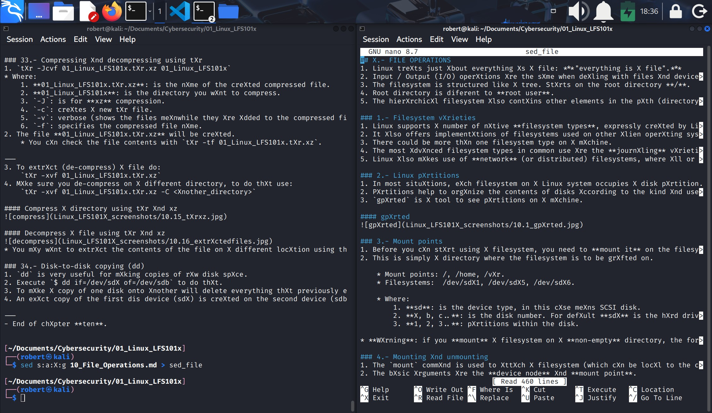
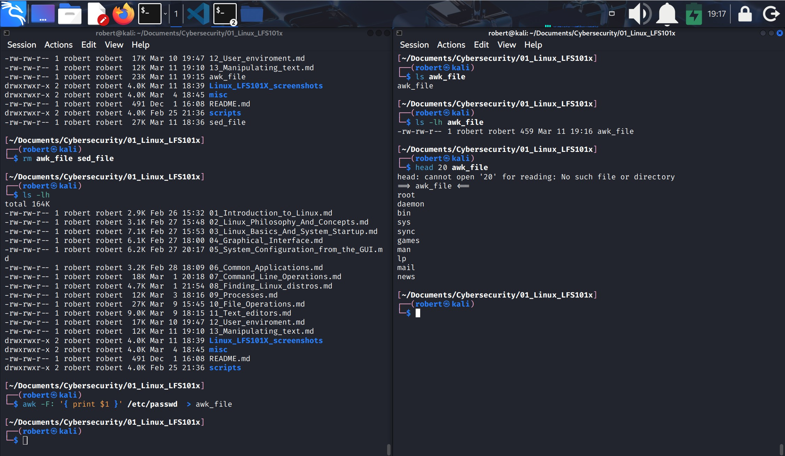
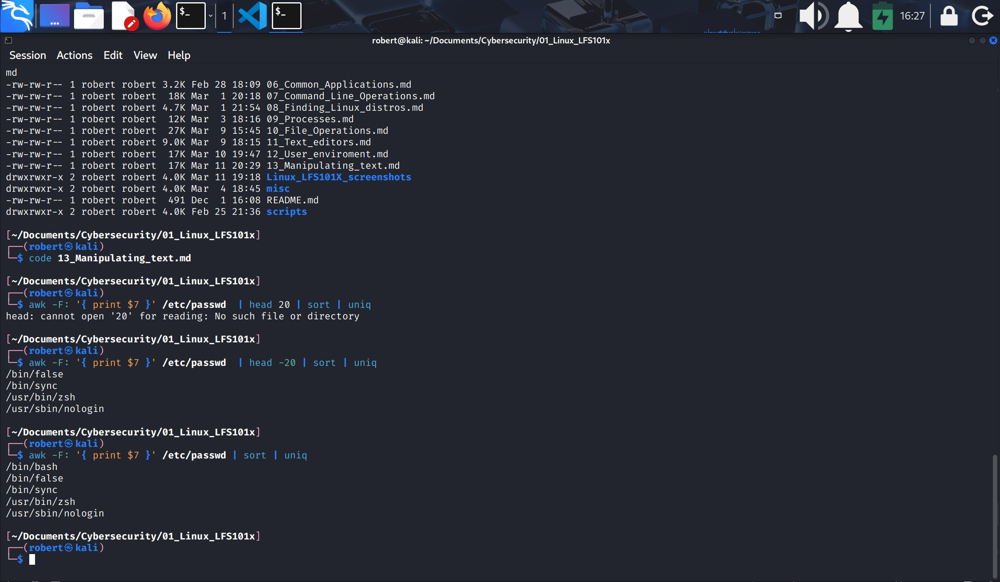
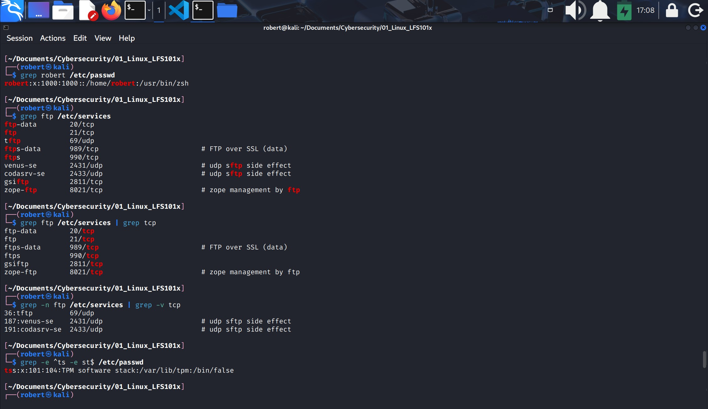
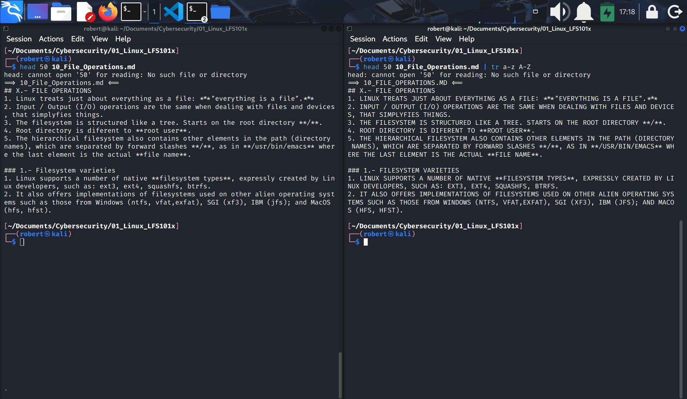
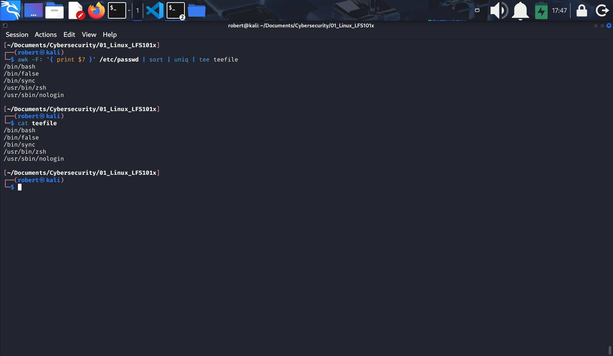

## XIII.- MANIPULATING TEXT
* In this lesson we will learn and work on editing, sorting, manipulating and searching strings of text.
* String of text is chain/sequence of characters treated as a unit.

### 1.- Command Line tools for manipulating text files.
1. You often need to browse through and parse text files or extract data from them.
2. Those are file manipulation operations: browse, parse, extract.
3. Most of the time, such file manipulation is done at the command line rather than on a GUI because is more efficient.
4. The command line is more suitable for automating often executed tasks.
5. Experienced system administrators write customized scripts to accomplish often executed tasks.

### 2.- cat
1. `cat` is short for **concatenate**, it is used to read and print files.
2. The main purpose of `cat` is often to combine (concatenate) multiple files together.
3. `tac` shows (reads) the file backwards: cat --> tac.

Commands and usage
`cat file1 file2`       concatenate multiple files and dislay the output; i.e. the entire content of the first file is followed by that of the second file. It doesnt save changes.
`cat file1 file2 > newfile`     combine multiple files and save the output into a new file.
`cat file >> existingfile`      Append a file to the end of an existing file.
`cat > file`        Anything typed will go into the file, until `Ctrl+D` is typed. Creates a new file if it didn't exist, or replaces the new content if the file existed removing the original content.
`cat >> file`       Any subsequent lines are appended to the file, until`Ctrl+D` is typed. Adds new lines to existing file.

| Command            | Description |
|------------------------------|-------------|
| **cat file1 file2**          | Concatenates multiple files and displays the output; the full content of the first file is followed by the second. Does not save changes. |
| **cat file1 file2 > newfile**| Combines multiple files and saves the output into a new file. |
| **cat file >> existingfile** | Appends the content of a file to the end of an existing file. |
| **cat > file**               | Anything typed is written into the file until **Ctrl + D** is pressed. Creates a new file if it doesn't exist, or overwrites it if it does. |
| **cat >> file**              | Appends new lines to the file until **Ctrl + D** is pressed. Does not overwrite existing content. |

#### cat two files creating a new one

#### Append new lines to a file from the prompt

### 3.- Using cat interactively
| Operator | Description |
|----------|-------------|
| **>**    | Used to create and add lines into a **new file**. Overwrites the file if it already exists. |
| **>>**   | Used to append lines (or files) to an **existing file** without overwriting its content. |

* Note:
`>` and `>>` are calles operators.

### 4.- echo
1. `echo` simply displays (echoes) text. It is used simply, as in `$ echo string`.
2. `echo` can be used to display a **string** on standard output (the terminal), or to: 
    1. **place in a new file** (using the `>` operator) or
    2.  append to an **already existing file** (using the `>>` operator).

* `-e` option, along with the following switches is used to enable special character sequences, such as the new line character or horizontal tab:
    * `\n` represents new line.
    * `\t` represents horizontal tab.

| Command / Usage              | Description |
|------------------------------|-------------|
| **echo string > newfile**        | Places the specified string into a **new file**. Overwrites the file if it already exists. |
| **echo string >> existingfile**  | Appends the specified string to the end of an **existing file**. |
| **echo $variable**               | Displays the contents of the specified environment variable. |

### 5.- Working with large files
1. Configuration files, text files, documentation files and log files requiere both **viewing** and **administrative updating**.
2. Sometimes, directly oppening a file in a text editor will probably be inneficient (due to high memory utilization) because most text editors try to read the hole file in memory first.

#### less
1. Instead, one can use `less` to view the contents of a large file, scrolling up and down page by page. This is much faster than using a text editor.
4. There are two ways:
    1. `$ less somefile`, use `q` to quit.
    2. `$ cat somefile | less`.

#### head
1. `head` reads the first few lines of each named file (10 by default) and displays it on standard output.
2. You can give a different number of lines in an option:
    * `$ head -n 5 /etc/default/grub`, or
    * `$ head -5 /etc/default/grub`.

#### tail
1. `tail` prints the las few lines of each named file and displays it on standard output.
2. By default it displays 10 lines, but you can give a different number of lines in an option.
3. `tail` is specially useful when you are troubleshooting any issue using log files as you probably want to see the most recent lines of output.
    * `$ tail -n 15 somefile.log`, or
    * `$ tail -15 somefile.log`.
4. To continually monitor new output lines in a **growing** log file:
    
    `$ tail -f somefile.log`.

#### Viewing compressed files
1. When working with compressed files, many standard commands cannot be used directly.
2. For many commonly-used file and text manipulating programs there is also a version especially designed to work directly with compressed files.
3. These associated utilities often have the letter `z` prefixed to their name.
4. For example: zcat, zless, zdiff, zgrep

#### z Family Commands and Descriptions
| Command / Usage                         | Description |
|------------------------------------------|-------------|
| **zcat compressed-file.txt.gz**          | View the contents of a compressed file without decompressing it. |
| **zless somefile.gz / zmore somefile.gz**| Page through a compressed file interactively. |
| **zgrep -i less somefile.gz**            | Search inside a compressed file (case‑insensitive with `-i`). |
| **zdiff file.txt.gz file2.txt.gz**       | Compare two compressed files. |

#### Compression tools combined with text tools

| Combination Commands                 | Compression Tool |
|-------------------------------------|------------------|
| **zcat**, **zless**, **zgrep**, etc | gzip             |
| **xzcat**, **xzless**, **xzgrep**, etc | xz            |
| **bzcat**, **bzless**, **bzgrep**, etc | bzip2         |

#### xzless usage on a compressed file

### 6.- Introduction to sed and awk
1. It is very common to create and then repeatedly edit and/or extract contents from a file. For that we can use `sed` or `awk`.
2. Many Linux users and administrators will write scripts using comprehensive scripting languages such as Pyton and perl, rather than use sed and awk (and some other utilities we'll discuss later).
3. However the utilities described here are much lighter and execute faster.
4. They are more useful than Python or perl during booting the system.
5. Simpler tools will always be needed.

#### 6.1.1.- sed
1. `sed` is a powerful text processint tool and is one of the oldest, earliest and most popular UNIX utilities.
2. It is used to **modify the contents** of a file or **input stream**, usually placing the contents into a new file or output stream. 
3. It's name is an abbrevation for **stream editor**.
4. `sed` can filter text, as well as perform substitution in data streams.

#### 6.1.2.- sed Command Syntax

| Command / Usage                     | Description |
|-------------------------------------|-------------|
| **sed -e command <filename>**       | Specifies editing commands directly in the command line, processes input from a file, and outputs the result to standard output (the terminal). |
| **sed -f scriptfile <filename>**    | Uses a script file containing `sed` commands, operates on the input file, and outputs the result to standard output. |
| **echo "I hate you" \| sed s/hate/love/** | Uses `sed` to filter standard input and send the transformed output to standard output. |

#### 6.1.3.- sed Basic Operations
1. The table explains some basic operations, where **pattern** is the currnt string and **replace_string** is the new string.
2. `s` is for substitute.
3. `g` is for global, for all occurrences
4. `-i` is for in place, it saves the changes in file.

| Command / Usage                               | Description |
|------------------------------------------------|-------------|
| **sed s/pattern/replace_string/ file**         | Substitutes the **first** occurrence of the pattern in **every line**. |
| **sed s/pattern/replace_string/g file**        | Substitutes **all** occurrences of the pattern in **every line**. |
| **sed 1,3s/pattern/replace_string/g file**     | Substitutes all occurrences of the pattern **only in lines 1 through 3**. |
| **sed -i s/pattern/replace_string/g file**     | Performs the substitution and **saves the changes directly in the same file** (in‑place). |

* Notice:
    * You can use `$ sed s/pattern/replace_string/g file1 > file2` to replace all occurrences of **pattern** with **replace_string** in file1 and move the contents to file 2.
    * You can use colons instead of dashes:

        `$ sed s:pattern:replace_string:g file1 > file2`

#### sed usage on a file

* Notice: all "a" where replaced for "X" and saved into a new file named sed_file.

---

#### 6.2.1.- awk
1. `awk` is used to extract and then print specific contents of a file and is often used to construct reports.
2. It was creatd in the Bell Labs in the 1970's and derived its name from the las names of its authors: Alfred Aho, Peter Weinberger and Brian Kernighan = awk.
3. `awk` is a powerful utility and interpreted programming language.
4. Is used to manipulate data files, and for retrieving and processing text.
5. It works well with fields (containing a single piece of data, **essentially a column**) and records (a collection of fields, essentially a line in a file).
6. Ass with `sed`, short `awk` commands can be specified directly at the command line, but a more complex script can be saved in a file that you can specify using the `-f` option.
    * `$ awk 'command' file` specify a command directly at the command line.
    * `$ awk -f scriptfile file` specify a file that contains the script to be executed.

#### 6.2.2.- awk Basic Operations

| Command / Usage                           | Description |
|--------------------------------------------|-------------|
| **awk '{ print $0 }' /etc/passwd**         | Prints the entire file (each full line). |
| **awk -F: '{ print $1 }' /etc/passwd**     | Prints the **first field** of every line, using `:` as the field separator. |
| **awk -F: '{ print $1 $7 }' /etc/passwd**  | Prints the **first** and **seventh** fields of every line (no space unless added manually). |

#### 6.2.3.- Basic tasks
1. The input file is read one line at the time, and for each line, `awk` matches the given pattern in the given order and performs the requested action.
2. The `-F` option allows you to specify a particular **field separator character**.
3. The **/etc/passwd** file contains lots of ":" (colons) to separate fields, therefore the option used is `-F:`.
    * For a simplier file (that does not contains lots of collons), use comma (,).
4. The command action needs to be surrounded with apostrophes (').

#### awk

* Notice:
    * awk command generated the new file **awk_file** with the operator `>`.
    * Contents are viewd with `head` for only the first 20 lines.

### 7.- File manipulation utilities
1. In managing your files, you may need to perform tasks such as sorting data and copying data from one location to anoter.
2. Linux file anipulation utilities: sort, uni, paste, join, split.

#### 7.1.1.- sort
1. `sort` is used to re-arrange the lines of a text file, in either ascending or descending order according to a sort key.
2. You can apply the `t` to sort according to a particular field (column) in a file.

Syntax      Usage
`sort <filename>`       sort the lines in the specific file, according to the character at the beginning of each line.
`cat file1 file2 | sort`        combine the two files, then sort the lines and display the output on terminal.
`sort -r <filename>`        sort the lines in reverse order.
`sort -k 3 <filename>`      sort the lines by the third field on each line instead of the beginning.

* When using the `-u` option, `sort` checks for unique values after sorting the records (lines). It is equivalent of running `uniq` on the output of sort.

#### 7.2.1.- uniq
1. `uniq` removes **duplicate consecutive lines** in a text file and is useful for simplifying the text display.
2. Because `uniq` requires that the duplicate entries must be consecutive, one often runs `sort` first and then pipes the output into `uniq`.
3. If `sort` is used with the `-u` option, it can do all this in one step.
4. To duplicate entries from multiple files at once, use the following command:

    `$ sort file1 file2 | uniq > file3`, or

    `$ sort -u file1 file2 > file3`
    * The `-u` option is used, no other command is needed, there is no need to pipe neither.

5. To count the number of duplicate entries, use the following command:

    `$ uniq -c filename`.

#### 7.3.1.- paste
1. Supouse you have a file that contains the full name of employees and another file that lists their phone number and employee's ID's. 
2. You want to create a new file that contains all that data listed in three columns: name, employee's ID, and phone number.
3. `paste` can be used to do that. The different columns are identified based on **delimiters** (spacing used to separate two fields).
    * For example, delimiters can be a blank space, a tab, or an enter.
4. `paste` accepts the following options:
    1. `-d`: 
        * delimiters, which specify a list of delimiters to be use instead of tabs for separating consecutive values on a single line.
        * Each delimiter is used in turn; when the list has been exhausted, `paste` begins again at the first delimiter.
    2. `-s`:
        * causes `paste` to append the data in series rather than in parallel; that is, in a horizontal rather than vertical fashion.

#### 7.3.2.- using paste
1. As well `paste` can be used to combine lines from multiple files.
2. For example, line one from file1 can be combine with line one of file2, and so on.
3. To paste contents from two files one can do:
    
    `$ paste file1 file2`
4. The syntax to use a different delimitr is as follows:
    
    `$ paste -d, file1 file2`
5. Common delimiters are: space, tab, |, comma, etc. For example:

    `$ paste -d':' phone names` (phone file, names file).

#### 7.4.1.- join
1. Suppouse you have two files with some similar columns:
    1. Employee's phone numbers, first name.
    2. Employee's phone numbers, last name.

... and you want to combine the files without repeating the data of common column "Employee's phone numbers".

2. You can use `join` (an enhance version of `paste`). It first checks whether the file share **common fields**, and then joins the lines in two files based on the common field.

#### 7.4.2.- using join
`$ join file1 file2`

#### 7.5.1.- split
1. `split` is used to break up (or split) a file into equal-sized segments for easier viewing and manipulation, and is generally used only on relatively large files.
2. By default it breaks up a file into 1000-line segments.
3. The original file remmains unchanged.
4. A set of new files with the same name plus an added prefix is created.
5. By default the prefix is x.
6. To split a file into segments use:

    `$ split infie`

7. To split a file using different prefix, use:

    `$ split infile <prefix>`

#### 7.5.2.- Using split
1. We will apply `split` to a dictionary of almot 500,000 lines.

    `$ wc -l linux.words`

    * `wc` (word count) is to count lines, words, characters and bytes on a file.

2. Then, typing: 

    `$ split linux.words lwords`

... will split the American-English file into equal-sized segments named lwordsxx. The last one will be the smaller.

### 8.- Regular Expressions and Search Patterns
1. Regular Expressions are **text strings** used for **matching a specific pattern**, or to **search for specific location**, such as the start or end of a line or a word.
2. Regular Expresions can contain both normal characters or so-called **meta-characters** such as `*` and `$`.
3. These regular expressions are different from the wildcards (or-metacharacters) used in filename matching in command shells such as bash.

#### Search patterns and usage example

| Pattern | Description |
|---------|-------------|
| **.**   | Matches **any single character**. |
| **a \| z** | Matches **a** or **z**. |
| **$**   | Matches the **end of a line**. |
| **^**   | Matches the **beginning of a line**. |
| **\***  | Matches the **preceding item 0 or more times**. |

#### Using regular expressions and search patterns
1. Consider the following sentence:
    * **the quick brown fox jumped over the lazy dog.**

| Pattern / Example        | Description |
|--------------------------|-------------|
| **a**                    | Matches **azy** (from the word *lazy*). |
| **b. \| j.**             | Matches **br** and **ju** (from *brown* and *jumped*). |
| **..$**                  | Matches **og** (from the end of the word *dog*). |
| **l.\***                 | Matches **lazy dog**. |
| **l.\*y**                | Matches **lazy**. |
| **the.\***               | Matches the **entire sentence** starting with “the”. |

---

### 9.- Lab 13.2.- Parsing Files with awk (and sort and uniq).
1. Generate a column containing a unique list of all the shells used for users in **/etc/passwd**.
2. You may need to consult the manual page for **/etc/passwd** as in: `$ man 5 passwd`.
3. Which field in **/etc/password holds the account's default shell?
4. How do you make a list of unique entries (with no repeats)?.

#### Solution
1. **/etc/passwd** contains one line for each user account, with seven fields delimited by colons. These fields are:

| Login name | Optional encrypted password | Numerical user ID | Numerical group ID | User name / comment field | User home directory | User command interpreter |
|------------|-----------------------------|--------------------|---------------------|----------------------------|----------------------|---------------------------|
| robert:     | x                           | 1000               | 1000                | -                          | /home/robert         | /usr/bin/zsh             |

`robert:x:1000:1000::/home/robert:/usr/bin/zsh`

**Solution**
    
`$ awk -F: '{ print $7 }' /etc/passwd | sort -u`

* Where:
    
    1. `awk` is the command to extract and print.
    2. `-F` is the option for field
    3. `:` is the indicated delimiter
    4. `$7` because the sevent field is the field that holds the accounts default user shell in /etc/passwd
    5. `sort` is the comand to sort
    6. `-u` is the option to eliminate duplicates. You can use ` sort | uniq` instead of `| sort -u`.

---

### 10.- grep
1. `grep` is extensible used as primary text searching tool. It scans files or specified patterns and can be used with regular expressions, as well simple sstrings as shown in the table:

`grep [pattern] <filename>`      searches for a pattern in a file and prints all matching lines.
`grep -v [pattern] <filename>`      prints all lines that **do not** match the pattern.
`grep [0 - 9] <filename>`       prints the lines that contain the numbers 0 through 9.
`grep -c 3 [pattern] <filename>`     prints context of lines (specified number of lines above and below the pattern) for matching the pattern. Here the number of lines is specified as 

* **Regular expression**: is a language to describe patterns, is not literal text. For example: `grep -E "ba.*h" /etc/passwd`
* **Simple string**: there are no metacharacters (*, ., ?, |, etc), there are no interpretations, text matches exactly with what you write. For example `grep "bash" /etc/passwd`.

### 11.- strings
1. `strings` is used to extract all printable character strings found in the file or files given as arguments.
2. It is useful in locating human-readable content embedded in binary files.
3. For text files one can just use `grep`.
4. For example, to search for the string **my_string** in a spreadsheedt:

    `$ strings book1.xls | grep my_string`

---

### 12.- Lab 13.3: Using grep
1. Search for your username in file **/etc/passwd.
2. Find all entries in /etc/services that include the **ftp** string.
3. Restrict to those that use the **tcp** protocol.
4. Restrict to those that not use the **tcp** protocol, while printing out the line number.
5. Get all strings that start (^) with **ts** or end sith **st**.
#### Solution
1. `$ grep robert /etc/passwd`
2. `$ grep ftp /etc/services`
3. `$ grep ftp /etc/services | grep tcp`
    * Notice you are using `grep twice.
4. `$ grep -n ftp /etc/services | grep -v tcp`
    * Where:
        1. `-n` diplays line number
        2. `-v` displays the strings that not contain the argument.
5. `$ grep -e ^ts -e st$ /etc/services`

---

### 13.- tr
1. The `tr` utility is used to **translate** specified characters into other characters or delete them.
2. The general syntax is as follows:

    `$ tr [options] set1 [set2]`
    * Where:
        * set1 is argument 1, and lists the characters in the tet to be replacer or removed.
        * set2 is argument 2, and lists the characters that are to be substituted for the characters listed in the first argument (set1).
3. It is usually safe (and may be required) to use the single-quotes (') around each of the sets.
4. Suppouse you have a file named **city** containing several lines of text in mixed case.
    * To translate all lower case characters to upper case, type:

    `$ cat city | tr a-z A-Z`

#### tr

5. `tr` commands:

| Command / Usage                                           | Description |
|-----------------------------------------------------------|-------------|
| **tr abcdefghijklmnopqrstuvwxyz ABCDEFGHIJKLMNOPQRSTUVWXYZ** | Converts lowercase letters to uppercase. |
| **tr '{}' '()' < inputfile > outputfile**                 | Translates braces `{}` into parentheses `()`. |
| **echo "This is for testing" \| tr [:space:] '\t'**       | Translates whitespace characters into tab characters. |
| **echo "This is for test" \| tr -s [:space:]**            | Squeezes repeated whitespace characters into a single one using `-s`. |
| **echo "the geek stuff" \| tr -d 't'**                    | Deletes all occurrences of the specified characters using `-d`. |
| **echo "my username is 432234" \| tr -cd [:digit:]**      | Uses `-c` to complement the set and keep only digits (deletes everything else). |
| **tr -cd [:print:] < file.txt**                           | Removes all non‑printable characters from a file. |
| **tr -s '\n' ' ' < file.txt**                             | Joins all lines into a single line by squeezing newlines into spaces. |

6. You can send the output of `tr` into a new file doing:

    `$ tr a-z A-Z < original_file > new_file`

### 14.- tee
1. `tee` takes the output from any command, and, while sending it to standard output it also saves ir to a file.
2. In other words it tees the output stream from the command:
    * One stream is displayed on the standrard output and
    * the other is saved to a file.
3. For example, to list the contents of a directory on the screen and save the output to a file, type:

    `$ ls -l | tee newfile`
    `$ cat newfile`

#### tee (awk, sort, uniq)

### 15.- wc
1. `wc` (word count) counts the number of lines (l), words (-w), and character in a file.
2. `-c` counts the number of bytes.
3. `wc` with no options prints number of lines, words and characters at once for a specified file.

### 16.- cut
1. `cut` is used for manipulating column-based files and is designed to extract specific columns.
2. The default column separator is the TAB character.
3. A different delimiter can be given as a command option (-d).
4. For example, to display the third column delimited by a blank space, at the command prompt type:

    `$ ls -l | cut -d " " -3`

5. Another example could be on the /etc/passwd file:

    `$ cat /etc/passwd | cut -d ":" -f2` (field 2 are only "x").

6. To save the output into a new file add `> newfile` at the end.

---
- End of chapter **thirdteen**.