## XIV.- NETWORK OPERATIONS

### 1.- Introduction to Networking
1. A network is a group of computers and computer devices connected together through communication **channels**, such as cables or wirless media.
2. The connected **devices** are often termed **nodes**.
3. A network is used to:
    1. Connect devices to communicate with each other.
    2. Enable multiple users to share devices (multimedia servers, printers, scanners, etc.).
    3. SHare and manage information such as databases and filesystems.
4. Most organizations have both: **Internal Network** and **Internet**.

### 2.- IP address
1. Devices attached to a network must have at least one unique network address identifier known as the IP (**Internet Protocol**) address.
2. This address is essential for **routing** the **packets** of information through the network.
3. Exchanging information across the network requires using **streams** of **small packets**, each of which contains a piece of the information going from one machine to another.
4. These packets contain **data buffers**, toghether with **headers** which contain information about **where** the packet is **going to** and **comming from** and where it fits in the **sequence of packets** that constitute the **stream**.

---

### 2.1.-   Exchanging Information
    FL Studio download (.exe file).

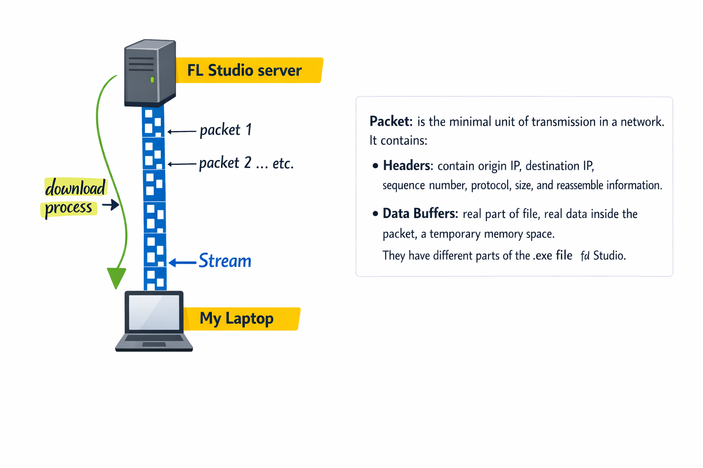
***Generated with Copilot***

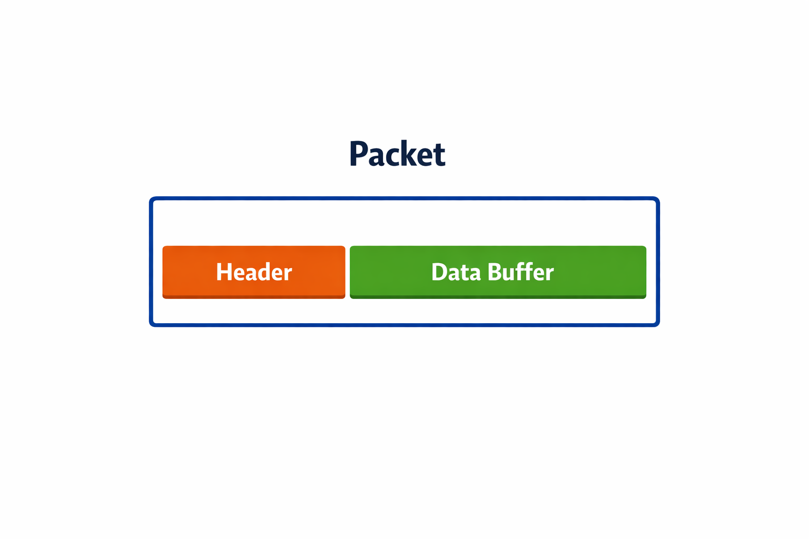
***Generated with Copilot***

---

### 3.- IPv4 and IPv6
1. There are two different types of IP addresses available:
    1. **IPv4**
        * Is older and by far the more widely used.
        * Uses 32-bit for addresses; there are only 4.3 billion unique addresses available.
        * It is consider inadequate for meeting future needs because the number of devices available on the global network has increased enormously in recent years.
    2. **IPv6**
        * Is newer and is designed to get past limitations inherent in IPv4 and can furnish man more possible addresses.
        * Uses 128-bits for addresses, this allos 3.4x10^38 unique addresses.
2. The two protocols do not always inter-operate well.
3. One reason IPv4 has not disappeared is there are widely-used ways to effectively make many more addresses by methods such as NAT (**Network Address Translation**).
4. **NAT** enables sharing one IP address among many locally connected computers, each of which has a unique address only seen on the local network.
    * For example, if you have a router hooked up to your **Internet Provider** it gives you one externally visible address, but **issues** each device in your home an individual local address, which is invisible to the outside world.

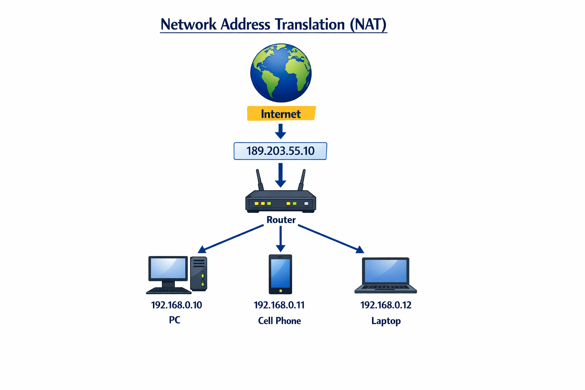
***Generated with Copilot***

### 4.- Decoding IPv4 addresses
1. A 32-bit IPv4 address is divided into four 8-bit sections called octets.
2. Example:

| IP Address Component | 172 | 16 | 31 | 46 |
|----------------------|-----|----|----|----|
| Binary Format        | 10101100 | 00010000 | 00011111 | 00101110 |

### 4.1.- Network classes
1. Network addresses are divided into five classes: A, B, C, D, and E.

#### 4.1.1.- A, B, and C classes 
1. Classes A, B and C are classified into two parts: Network addresses (Net ID) and Host addresses (Host ID).
    * **Net ID** is used to identify the network
    * **Host ID** is used to identify a host in the Network.

#### 4.1.2.- D class
1. Class D is used for special multicast applications (information is broadcast to multiple computers simultaneously).

#### 4.1.3.- E class
1. Class E is reserved for future use.

#### Network classes
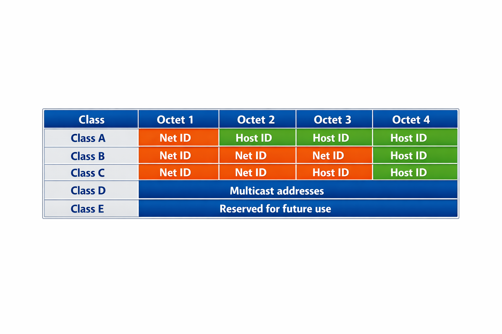
***Generated with Copilot***

* Note: table above shows rather the Net ID or the Host ID occupies a specific octate according to its class.

### 5.- Class A Network Addresses
1. The first bit of the first octet is always set to zero as in **0**0001010 (10). So you can use only 7-bits for unique network numbers.
2. As result, there are maximum 126 Class A networks available.
3. Each class A network can have up to 16.7 million unique hosts on its network.
4. The range of hosts addresses is from 1.0.0.0 to 127.255.255.255
    * Note: the value of an octate, or 8-bits, can range from 0 to 255.

### 6.- Class B Network Addresses
1. The first two bits of the first octate are always set to binary 10, as in **10**000111 (135), so there are maximum of 16,384 (14-bit) Class B Networks.
2. The first octate has values from 128 to 191.
3. Each class B Network can support a maximum of 65,536 unique hosts on its network.
4. Range of host addresses is from 128.0.0.0 to 191.255.255.255

### 7.- Class C Network Addresses
1. The first three bits of the first octet are set to binary 110 as in **110**00000 (192), so almost 2.1 millions (21-bits) Class C Networks are available.
2. The first octate has values from 192 to 223. These are most common for smaller networks which don't have many unique hosts.
3. Each Class C Network can support up to 256 (8-bit) unique hosts.
4. The range of hosts addresses is from 192.0.0.0 to 223.255.255.255

#### Networks, hosts and first octate range for each class

| Class   | Networks Available | Unique Hosts per Network | First Octet Range  |
|---------|--------------------|---------------------------|---------------------|
| Class A | 126                | 16.7 million              | 1 to 127            |
| Class B | 16,384             | 65,536                    | 128 to 191          |
| Class C | 2.1 million        | 256                       | 192 to 223          |

---
### 8.- Network Address Allocation
1. Typically a range of IP addresses are requested from your Internet Service Provider (ISP) by your organization's network administrator.
2. For domestic networks, the ISP automatically asigns an IP to the house router.
    * If NAT is in operation, such as in a home network, you only get one externally visible address.
3. You can assign IP addresses to computers over a network either **manually** or **dynamically**.
    * **Manual assigment**: adds static (never changing) addresses to the network.
    * **Dynamically assigment**: can change every time you reboot or even more often.
        * The **Dynamic Host Configuration Protocol** (DHCP) is used to assign IP addresses.

* Notice:
    1. At home I can assign the IP address for my laptop in my home network, because that network is managed by my **router**, not by the ISP.
    2. If I don't assign an IP manually, my **router** will use **DHCP** to assign it automatically.

### 9.- Name resolution
1. Name resolution is used to convert numerical IP address values into human-readable format known as the **hostname**.
2. For example 3.13.31.214 is the numerical IP address that refers to the hostname [linuxfoundation.org](linuxfoundation.org).
3. Hostnames are much easier to remember.
4. Type `hostname` to see your system's hostname.

#### hostname and host
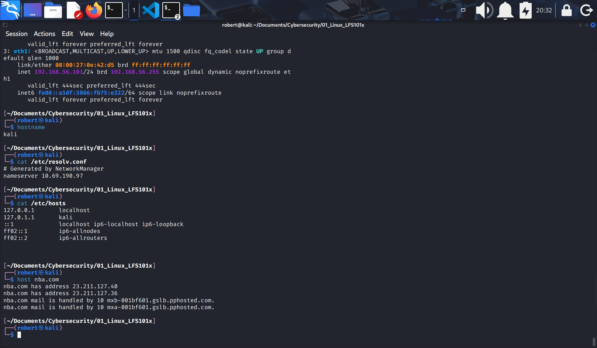

### 10.- Network configuration files
1. They are essential to ensure that interfaces function correctly. They are on /etc.
2. Modern systems emphasize the use of `Network Manager`.
3. `nmtui` utility (related to Network Manager) is a graphical network manager.
4. `nmcli` command line utility.

#### nmtui
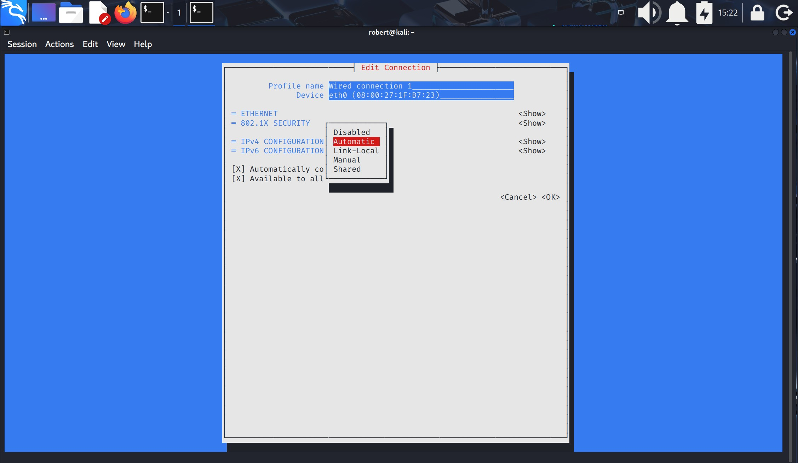

* With `nmtui` you can:
    1. Activate a connection.
    2. Edit the connection: change from DHCP to static or viceversa.

5. `nmcli` basic commands:

| Command                                   | Description                                                                 |
|-------------------------------------------|-----------------------------------------------------------------------------|
| nmcli device status                       | Shows all network interfaces and their current state                        |
| nmcli device show <interface>             | Displays detailed information about a specific interface                    |
| nmcli connection show                     | Lists all saved network connections                                         |
| nmcli connection up "<name>"              | Activates a specific network connection                                     |
| nmcli connection down "<name>"            | Deactivates a specific network connection                                   |
| nmcli device connect <interface>          | Connects a network interface                                                |
| nmcli device disconnect <interface>       | Disconnects a network interface                                             |

#### nmcli
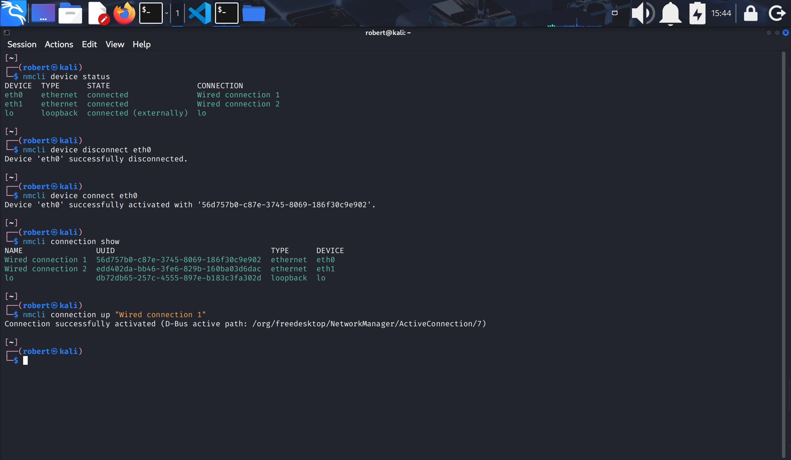

* On the image above you can see how to:
    1. Check the status of all network devices using `nmcli device status`.
    2. Disconnect the active device (eth0) using `nmcli device disconnect eth0`.
    3. Reconnect the device using `nmcli device connect eth0`.
    4. List all available connection profiles with `nmcli connection show`.
    5. Reactivate the appropriate connection profile using `nmcli connection up "<profile-name>"`.

### 11.- Network Interfaces
1. They are **connection channels** betwen a device and a Network.
2. Physically, network interfaces can proceed through a Network Interface Card (NIC).
3. Or can be more abstract implemented as software.
4. There are multiple network interfaces operating at once.
5. Specific interfaces can be brouth UP (activated) or DOWN (deactivated) at any time.
6. `ip`, `ipa a`, or `ifconfig` utilities report information about a particular network interface.

#### Interfaces
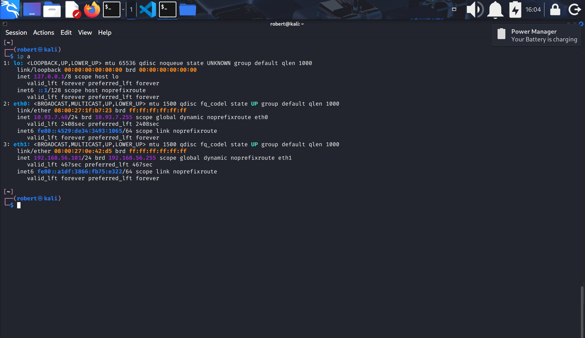

---

#### Differences betwen Interface, Connection Device and Connection Profile

| Concept            | Description                                                                                     | Examples                                 |
|--------------------|-------------------------------------------------------------------------------------------------|-------------------------------------------|
| **Interface**      | The actual network interface at the OS level. It is the hardware or virtual NIC recognized by Linux. | eth0, eth1, wlan0, lo                     |
| **Connection Device** | A device managed by NetworkManager. It represents the interface *as controlled* by NM, including its state (connected, disconnected). | eth0 (connected), wlan0 (disconnected)    |
| **Connection Profile** | A logical configuration stored by NetworkManager. Defines how a device should connect (DHCP, static IP, DNS, Wi‑Fi SSID, etc.). | “Wired connection 1”, “MyWiFi”, “System eth0” |

---

### 12.- The ip utility
1. To view IP address: `$ /sbin/ip addr show`
2. To view the **routing** information: `$ /sbin/ip route show`

---
3. `route show` tells you the path your packets take to reach other networks.

#### $ /sbin/ip addr show
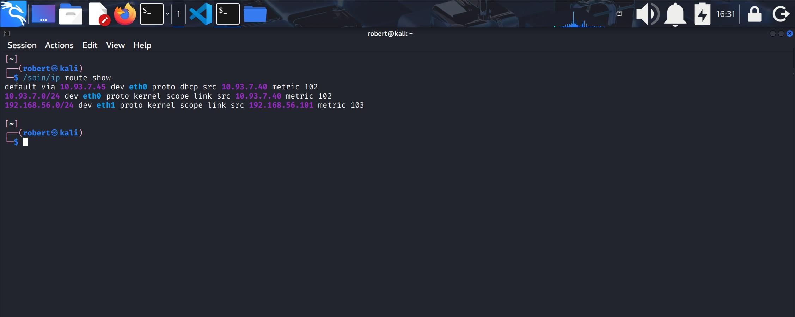

**Where:**
1. **Default route** 
`default via 10.93.7.45 dev eth0 proto dhcp src 10.93.7.40 metric 102`
* What is means:
    1. `default`: any traffic that is not local goes through this route.
    2. `via 10.93.7.45`: this is my **gateway**, which is my phone's hotspot.
    3. `dev eth0`: the interface used to reach the internet.
    4. `proto dhcp`: this route was assigned automatically by DHCP.
    5. `src 10.93.7.40`: my local IP address on the hotspot network.
    6. `metric 102`: route priority (lower = higher priority).
    7. **All internet traffic goes out through your hotspot using eth0**.

2. **Local hotspot network**
`10.93.7.0/24 dev eth0 proto kernel scope link src 10.93.7.40 metric 102`
* What it means:
    1. `10.93.7.0/24`: this is the private network created by my phone.
    2. `dev eth0`: handled by the eth0 interface.
    3. `src 10.93.7.40`: my IP inside this network.
    4. `scope link`: this network is directly reachable without a gateway.
    5. **My VM is part of the 10.93.7.0/24 network provided by my hotspot.**

3. **VirtualBox Host-Only network**
`192.168.56.0/24 dev eth1 proto kernel scope link src 192.168.56.101 metric 103`
* What it means:
    1. `192.168.56.0/24`: VirtualBox's internal host-only network.
    2. `dev eth1`:  handled by the eth1 interface.
    3. `src 192.168.56.101`: my VM's IP on that internal network.
    4. `metric 103`: slightly lower priority than eth0.
    5. **This network is only for communication between my VM and my host machine. It does not provide internet access.**

* Note: Linux correctly chooses **eth0** as the main route because it has the default gateway.
---
### 13.- ping
1. `ping` is used to check wether or not a machine attached to the network can **receive** and **send** data.
2. To check the status of a **remote host**, at the command line type: `ping <hostname>`.

#### ping
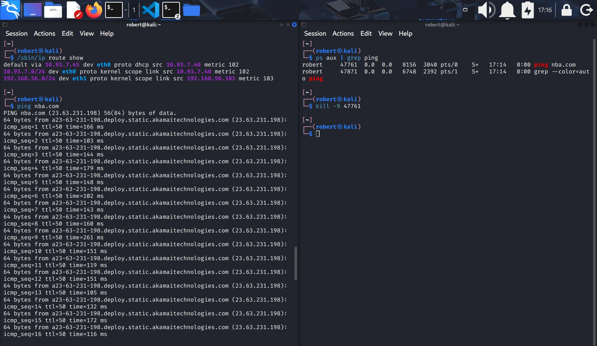

* Notice:
    1. If you run `ping` with no options to stop it will run forever.
    2. You can get the Process Identification Number with `$ ps aux | grep ping` and then kill the process with `$ kill -9 <PID>`.
    3. Or you can set the number of packets being sent with the `-c` option:

    `$ ping -c 5 nba.com` for 5 packets to be sent and then the process stops.
----
### 13.1.- If ping does not respond ...
1. Verify `ping 8.8.8.8` works, if it does then the problem is the Domain Name Service (DNS). In that case ...
2. Check the **/etc/resolv.conf** file,
    * If it shows:
        * nameserver: 8.8.8.8
        * nameserver: 1.1.1.1
    * It means that those domains are manually forced, so...
3. `nm-connection-editor`: to open the connection editor.
4. Select active connection.
5. Go to **IPv4** section and configure:
    * Method: Automatic (DHCP).
    * DNS servers: empty.
    * Search domains: empty.
6. Save changes.
7. Re-start **Network-Manager** with `sudo systemctl restart Network Manager`.
8. Edit **/etc/NetworkManager/system-connections/Wired connection 1.nmconnection** leaving 
    * **IPv4** in standard mode, 
    * **[IPv4]**
    * **method**: auto
9. Eliminate lines that read: `dns=... ignore-auto-dns=true ,etc`.

#### fixing DNS
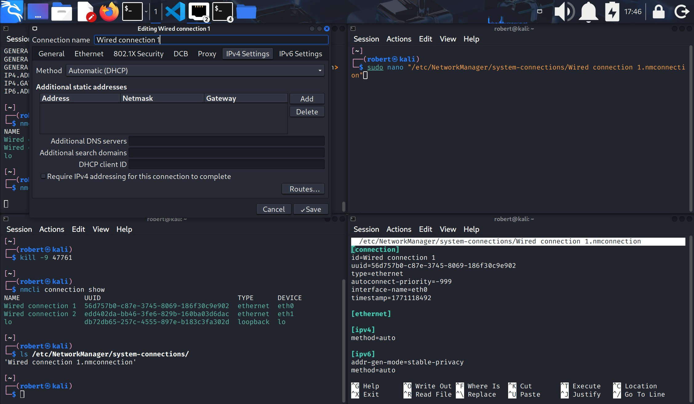

* Note: there are some hostnames that doesn't allow `ping`, i.e. amazon.com

---

### 14.- route
1. **A network requires the connection of many nodes**.
2. Data moves from soure to destination passing through a **series of routers** and potentially across **multiple networks**.
3. Servers maintain **routing tables** containing the addresses of each node in the network.
4. The IP routing protocols enable routers to build up a forwarding table that correlates final destinations with the next **hop** address.
    * **hop**: each intermediary device a packet passess through.

### Commands that can be used to manage IP routing:

| Purpose                     | Legacy Command (`route`)              | Modern Command (`ip route`)        |
|-----------------------------|----------------------------------------|-------------------------------------|
| Show current routing table  | `route -n`                             | `ip route`                          |
| Add a static route          | `route add -net <address>`             | `ip route add <address>`            |
| Delete a static route       | `route del -net <address>`             | `ip route del <address>`            |

### 15.- traceroute
1. `traceroute` is used to **inspect the route** which the **data packet** takes to reach the destination host, which makes it quite useful for **troubleshooting** network delays and errors.
2. By using `traceroute`, you can isolate connectivity issues between hops, which helps resolve them faster.
3. `traceroute <address>` to print the route taken by the packet to reach the network host.

---

### 15.1- traceroute nba.com
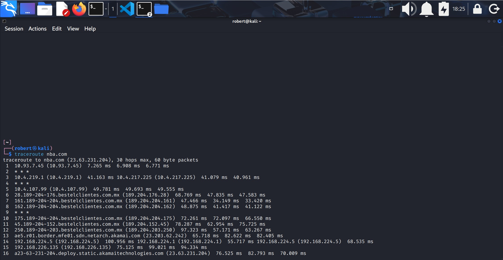

#### Hop descriptions (route description)
| Hop | IP / Hostname | Description |
|-----|----------------|-------------|
| 1 | 10.93.7.45 | Your **hotspot gateway**. This is your phone acting as the first router. |
| 2 | * * * | A router that **does not respond to ICMP TTL‑expired messages**. Common in carrier networks. |
| 3 | 10.4.219.1 / 10.4.217.225 | Internal routers inside your mobile carrier’s private network (CGNAT infrastructure). |
| 4 | * * * | Another non‑responsive carrier router. |
| 5 | 10.4.107.99 | More internal routing inside the carrier’s private backbone. |
| 6 | 189.204.176.28 | First **public Bestel (ISP) router**. You’ve exited the private CGNAT space. |
| 7 | 189.204.204.161 | Bestel backbone router. |
| 8 | 189.204.204.162 | Another Bestel backbone hop. |
| 9 | * * * | A router that blocks ICMP responses. Normal behavior. |
| 10 | 189.204.204.175 | Bestel edge router approaching external peering. |
| 11 | 189.204.152.45 | Bestel router closer to international/peering exit. |
| 12 | 189.204.203.250 | Final Bestel hop before leaving the ISP’s network. |
| 13 | 23.203.62.242 | **Akamai border router**. You’ve now entered the CDN that hosts nba.com. |
| 14 | 192.168.224.x | Internal Akamai load‑balancing or CDN fabric network (private IPs used internally). |
| 15 | 192.168.226.135 | Another internal Akamai hop. |
| 16 | 23.63.231.204 | **Final destination: nba.com**, served by Akamai CDN. |

#### Hop 13 description
1. Hop 13 on the route:

`ae5.r01.border.mfe01.sdn.netarch.akamai.com (23.203.62.242)  65.718 ms  82.622 ms  82.405 ms`.
1. `ae`: stands for ***Aggregated Ethernet*** (also known as a link aggregation grop or LAG).
2. `5`: is the logical interface number.
    * This is a high-capacity link inside **Akamai's** infraestructure.
3. `r01`: means Router 01. It is the first router in that Akamai point of presence (PoP)
4. `border`: this is the key part. A boarder router is the device where Akamai peers with external networks.
    * It receives traffic from ISP's and hand it off to Akamai's internal CDN fabric.
5. `mfe01`: is an internal Akamai code for a specific PoP.
    * It typically corresponds to a regional hub near **Mexico** or the southern **US**.
    * It is the closest Akamai facility to my geographic region.
6. `sdn`: Software-Defined Network.
7. `netarch`: Network Architecture.
8. `23.203.62.242`: This is a public IP, belongs to Akamai.
    * Is a boarder router that:
        1. Receives your packets from Bestel.
        2. Determines the best internal path.
        3. Forwards traffic toward the correct CDN edge server.
9. `65.718 ms, 82.622 ms and 82.405 ms` are latency values.

* **Important**: Hop 13 is the Akamai border router where your traffic exits your ISP's network and enter Akamai's global CDN infraestructure on its way to **nba.com**.

---

### 16.- More networking tools

`$ ethtool`     queries network interfaces and can also set various parameters such as the speed. Usage: `$ sudo ethtool eth0`.
`$ netstat`     displays all active connections and routing tables; useful for monitoring performance and troubleshooting. Usage: `$ sudo netstat -r`.
`$ nmap`        scans open ports on a network, important for security analysis. Usage: `$ sudo nmap -sn`.
`$ tcpdump`     dumps network traffic analysis.
`$ iptraf`      monitors network traffic in text mode.
`$ mtr`     combines functionality of `ping` and `traceroute`, and gives a continously updated display.
`$ dig`     tests DNS workings; a good replacement for `host` and `nslookup`.

#### ethtool, netstat, nmap, and dig
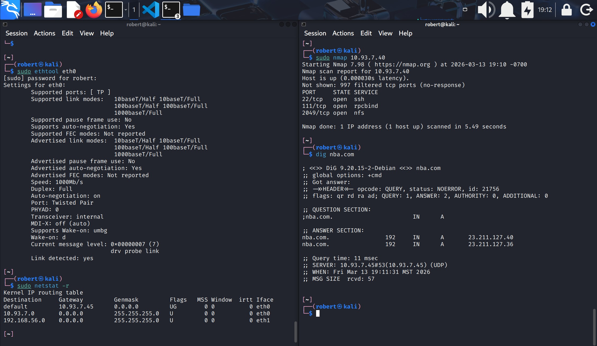

---

### 17.- Graphical and Non-Graphical browsers
1. Linux users commonly use both graphical and non-graphical browsers
2. The common graphical browsers in linux are: Firefox, Google Chrome, Chromium, Konqueror and Opera.
3. Sometimes you have reasons for not using a graphical browser but still you need to access the web resourses.
    * You can use the following non-graphical browsers:
        * `lynx`: configuable text-based web browser; the earliest such browser and still in use.
        * `elinks`: based on `lynx`; it can display tables and frames.
        * `w3m`: another text-based web browser with many features.

#### lynx
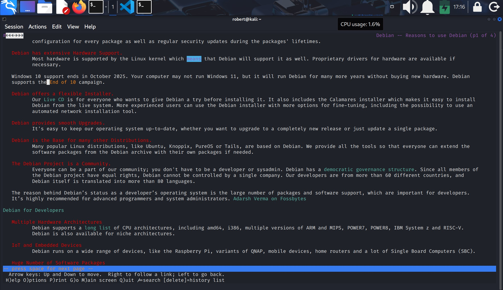

#### elinks
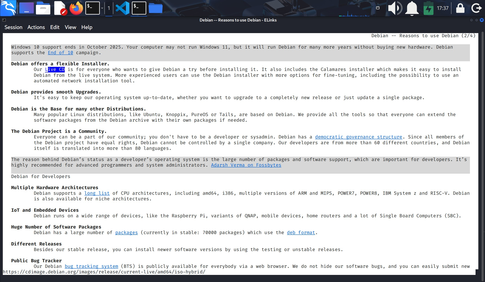

#### w3m
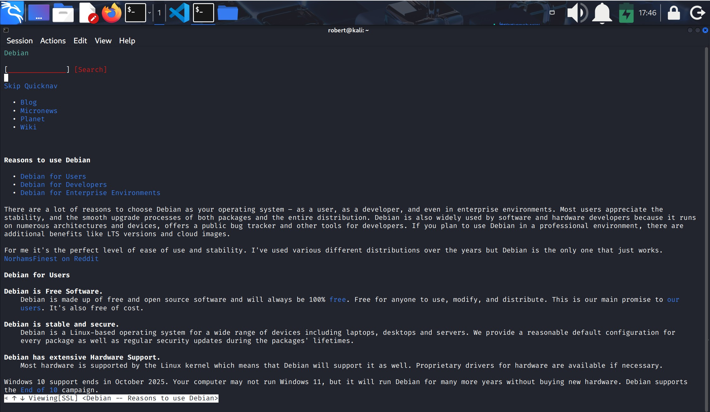

* Notice: all threee non-graphical web browsears have pretty much the same features:
    1. They don't support JavaScript based websites, they only works on simple, static text based webs sites.
    2. Usages:
        * On non-graphical servers to verify HTTP/HTTPS connectivity, test end points, etc.
        * Cybersecurity and traffic analysis: verify suspicious websites without executing JavaScript, analyize HTML content without loading malicious scrpts, verify headers, redirections and basic behaviour of a site.
        * For web web application testing (QA/DevOps).
        * Automatic tasks and scripting: download pages, extract text, basic scraping.

### 18.- wget
1. Sometimes, you neet to download files and information, but a browser is not the best choice, either because you want to download multiple files or directories, or you want to perform the action from a command line or a **script**.
2. `wget` is a command line utility that can capably handle the following types of download:
    * **Large** file downloads.
    * **Recursive**: downloads, where a web page refers to other web pages and all are downloadable at once.
    * **Password** required downloads
    * **Multiple** file downloads.
3. To download a web page, you can syply type `wget <URL>` and then you can read the downloaded page as a local file using a graphical or non-graphical browser.
    * The downloaded file, sometimes called **html.index** will be downloaded in the directory you executed the command.

### 19.- curl
1. `curl` can be used to obtain information about a URL, such as the code being used.
2. `curl` can be used from the command line or a **script**.
3. Allows you to save the contents of a web page to a file, as does `wget`.

### 20.- FTP (File Transfer Protocol)
1. Is a well-known and popular method for transferring files between computers using the Internet.
2. Is built on a client-server model.
3. Can be used within a browser or with **stand-alone client programs**.
4. It dates back to the 1970's.
5. Is considered **inadequate** for modern needs as well as being **intrinsically insecure**.
6. However it is still in use and when security is not a concern (such as with so-calle **anonymous FTP**) it can make sense.
7. Many web-sites have abandoned its use.

### 21.- FTP clients
1. FTP clients enable you to transfer files with remote computers usint the FTP protocol
2. This clients can be either **graphical** or **command line tools**.
3. All web browsers support FTP: `ftp://ftp.kernel.org` where the usual `http://` becomes `ftp://`.
4. SOme command line FTP clients are: ftp, sftp, ncftp, yafc (Yet Another FTP Client).
5. The reason FTP has fallen into disfavor on modern systems is that it is intrisically insecure: passwords are user credentials that can be transmitted **withoug encryption** and are thus **prone to interception**.
6. Thus it was removed in favor of using `rsync` and web browser `https` access for example.
7. As alternative `sftp` is a very secure mode of connection, which uses the **Secure Shell Protocol (SSH)**.
    * `sftp` **encrypts** its data.
    * It does not work with so-called anonymous FTP (guest user credentials).

### 22.- SSH: Executing Commands Remotely
1. Secure Shell is a cryptographic network protocol used for secure data communication.
2. It is also used for remote services and other secure services between devices on the network and is very useful for:
    * Administering systems which are not easily availible to physicaly work on, but to which you have **remote access**.

#### SSH diagram

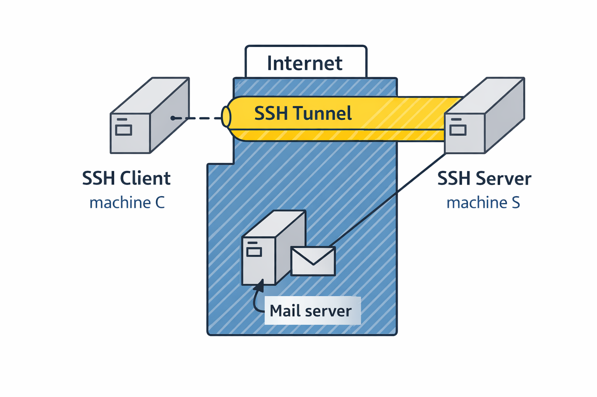

3. To login a remote system using your username you can just type:

    `ssh some_system`
4. `ssh` then prompts you for the **remote password**.
    * You can configure `ssh` to securely allow your remote access without typing a password each time.

| Command Example                          | Purpose / Action                          | Description |
|-------------------------------------------|--------------------------------------------|-------------|
| `ssh -l someone some_system`              | Connect as a specific user (method 1)      | Uses the `-l` flag to specify the username you want to log in as. |
| `ssh someone@some_system`                 | Connect as a specific user (method 2)      | Embeds the username directly before the host; most common syntax. |
| `ssh some_system my_command`              | Run a command on a remote system           | Connects to the remote host, executes the command, and returns the output locally. |

### 23.- Copying Files Securely with scp
1. We can also move files securely using **secure copy** `scp` between two networked hosts.
2. `scp` uses the **SSH protocol** for transfering data.
    * `scp <localfile> <user@remotesystem>: /home/user` to copy a local file to a remote system. Password will be required.
    * `scp -r <local directory> <user@remotesystem>: /home/user/` to copy a local directory.

### 24.- Using SSH between two virtual machines
To remotely enter another machine do:
1. `ip --brief add show` on both machines to know their IP's
2. From the client's machine (Kali in this case) run:

    `$ ssh roberto@172.16.18.119`

... to enter the server machine.

* Where:
    1. `roberto` is the user name.
    2. `@` at.
    3. `172.16.18.119` is the system IP.

* Notice:
    1. You will be prompt for the password for `roberto`.
    2. `ssh` must be installed on the server.
        * `$ sudo apt install openssh-server` to install ssh.

3. Now you from Kali you are able to work on the remote machine Ubuntu.

#### Entering a server machine with ssh
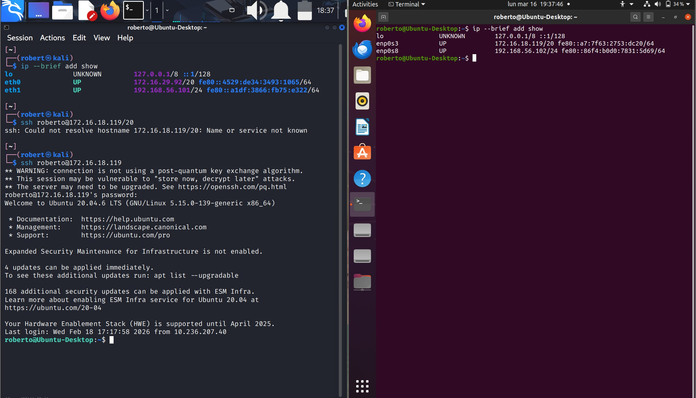

### 25.- To copy from one computer to another
1. Be sure to be exited from the other machine.
2. `$ scp <localfile> roberto@172.16.18.119/tmp` to copy a file from the client to the server.
    * /tmp is the directory where you are copying the <localfile> on the server.
3. `$ scp -r /home/robert/Documents/Cybersecurity roberto@172.16.18.119:/tmp` to copy a directory from the client to the server.
    * /tmp is the directory where you are copying the </home/robert/Documents/Cybersecurity> directory on the server.

#### scp
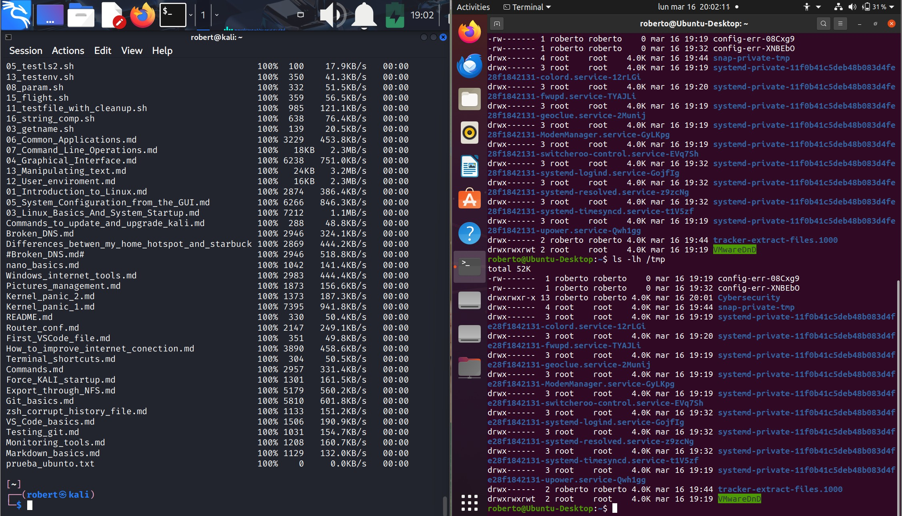

* Notice:
    1. Connection between machines were DOWN.
    2. `scp` copied a whole directory (Cybersecurity) from the client's to the server's machine at once.

### 26.- Additional notes about ssh
1. To exit the connection just run `exit` on the client's machine.
2. Any computer that has used `ssh` and gained acces to a remote machine will create a file named **/home/robert/.ssh/known_host** which will show who logged in recently.
3. If you open it it will show the **public key** from the other machine.
4. Install **ssh** on client's machine (in case it isn't installed) with:
    `$ sudo apt install openssh-client`.
4. Check for ssh status on client's machine with:
    `$ sudo systemctl status ssh`.
5. If it isn't active, start it with:
    `$ sudo systemctl start ssh`.

---
- End of chapter **fourteen**.

