## XV.- THE BASH SHELL and BASIC SCRIPTING

### Contents
1. **Scripts**: tell the system a series of actions that it needs to take to reuse them in the future and automate a lot of the things you do.
2. Featurs and capabilities of various shells.
3. Shell syntax
4. Enviroment variables and how to pass arguments from the outside.
5. Arithmetic expressions.

### 1.- Shell scripting
1. In order to **automate a set of commands**, you will need to learn how to write **shell scripts**.
2. Most commonly in Linux, these scripts are developed to be run under the **bash** command shell interpreter.
3. Several of the benefits of deploying scripts:
    1. Automate tasks and reduce risk of errors.
    2. Combine long and repetitive sequences of commands into a single command.
    3. Share procedures among several users.
    4. Quick prototyping, no need to compile.
    5. Create new commands using combination of utilities.
    6. Provide a controlled interface to users.

### 2.- Command Shell Choices
1. Commonly used interpreters include:
    * /bin/perl
    * /bin/bash
    * /bin/csh
    * /bin/python, and 
    * /bin/sh

2. You can save shell scripts in a file, you can use it to create a new script variation and share it.
3. LInux provides a wide choice of shells; exactly what is available on the system is listed in **/etc/shells**.

#### Available shells on my system
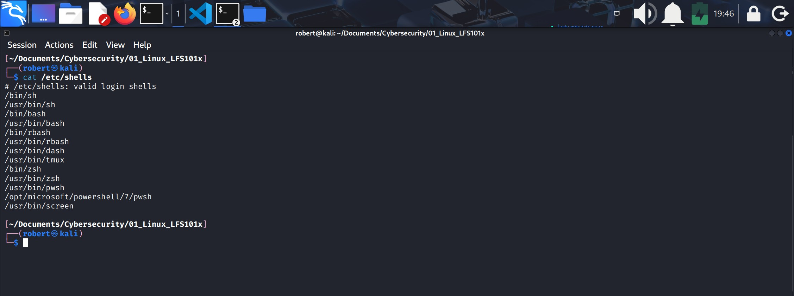

### 3.- History of Command Shells
1. The history of command shells begins in the early days of time‑sharing systems in the 1960s and 1970s, when computers first allowed multiple users to interact with a machine through text-based interfaces. Early shells like the Multics shell and the Thompson shell (sh), created for Unix in 1971, introduced the idea of interpreting user commands, running programs, and supporting simple scripting. As Unix evolved, so did its shells: the Bourne shell (sh) became the standard for scripting, while later shells such as the C shell (csh) and Korn shell (ksh) added features like command history, aliases, and improved programming constructs.

2. By the 1980s and 1990s, shells became central to system administration and automation. The Bourne Again Shell (bash), released in 1989, combined the strengths of earlier shells and became the default on most Linux systems. Meanwhile, other operating systems developed their own shells, such as CMD and later PowerShell on Windows, which introduced object‑based pipelines instead of text-based ones. Today, command shells remain essential tools for developers, administrators, and cybersecurity professionals, offering powerful scripting capabilities, automation, and direct control over operating systems.

### 4.- Shell scripts
1. A shell is simply a **command line interpreter** which provides the user interface for terminal windows.
2. A **command shell** can also be used to **run scripts**, even in non-interactive sessions without a terminal window, as if the **commands** were being directly typed in.
    * For example:
        * Typing `find . -name "*.c" -ls` at the CLI, accomplishes the same thing as executing a **script file** containing the lines:
            1. #!/bin/bash
            2. find . -name "*.c" -ls

    * The first line of the script which starts with **#!** contains the full path of the command interpreter, in this case **/bin/bash** that is to be used on the file.
    * The special two-character sequence **#!** is often called **shebang**, and avoids the usual rule that the pound sign (#), delineates the following text as a comment.
        * Usually the pound sign alone means the line is a comment within the file.

### 5.- A simple bash script
1. Write:
    1. `cat > hello3.sh`
    2. #!/bin/bash
    3. echo "Hello Linux Foundation Student"
2. Enter
3. `Ctrl+D` to save the file
4. Run:
    * `./hello3.ssh` this way of running the command requires the file has execute permissions; or
    * `$ bash hello.sh` this way **does not** requires execute permissions for the file.

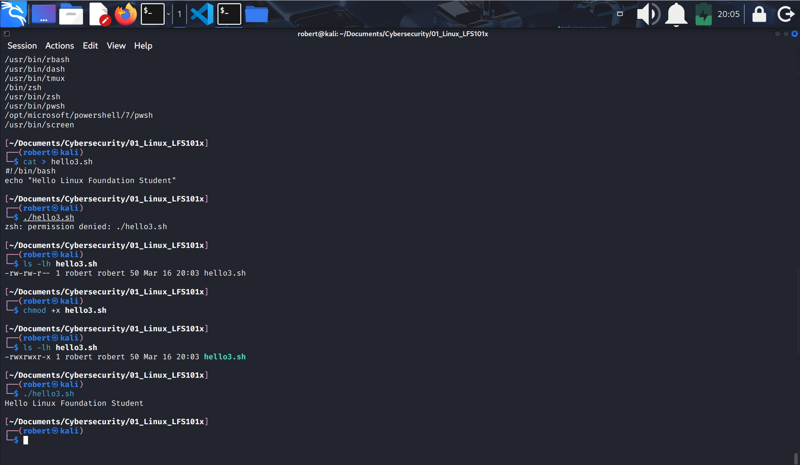

### 6.- Interactive example using Bash Scripts
1. The user will be prompted (asked-instructed) to enter a value, which is then displayed on the screen.
2. The value is stores in a termporary variable **name**.
3. We can reference the value of a shell variable by using a **$** in front of the variable name, such as **$name**.
4. Create the file **getname.sh** in your favourite text editor with the following content:

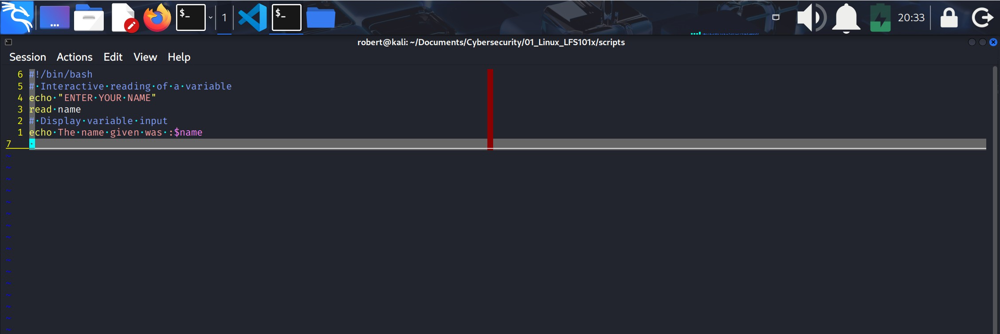
***You can see the actual script [here](https://github.com/roberto17orozco/Personal-Cybersecurity-Learning-Method/blob/Main/01_Linux_LFS101x/scripts/03_getname.sh).***

* Where:
    1. **#** followed by text is a comment related to the actions taken by the script.
    2. **read** is a shell built‑in command that reads input from standard input and assigns it to one or more shell variables.
    3. **name** is the variable that receives the input captured by read.
    4. Whatever the user types is later accessed using **$name**.

### 7.- Return Values
1. All shell scripts generate a return value upon finishing execution, which can be explicitly set with the **exit** statement.
2. Return values permit a process to monitor the exit state of another process, often in a **parent-child** relationship.

### 8.- Viewing Return Values
1. As a script executes, one can check for a specific value or condition and return success or failure as a result.
2. By convention, **success** is returnes as zero **0**.
3. And **failure** as any **non 0 value**.
4. The return value is stored in the enviroment variable represented by **$?**.

#### Return Value, Enviroment Variable $?
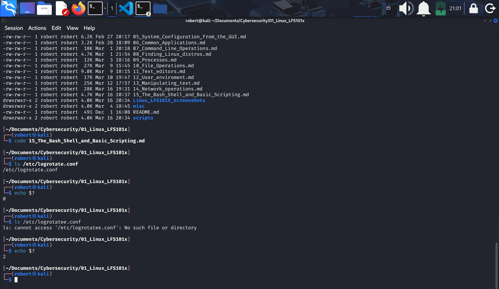

### Lab 15.1: Exit Status Codes
1. Write a script which:
    1. Does `ls` for a non-existing file, and then displays the resulting **exit status**.
    2. Creates a file and does `ls` for it, and once again displays the resulting **exit status**.
2. Create the file **testls2.sh** with the content below:

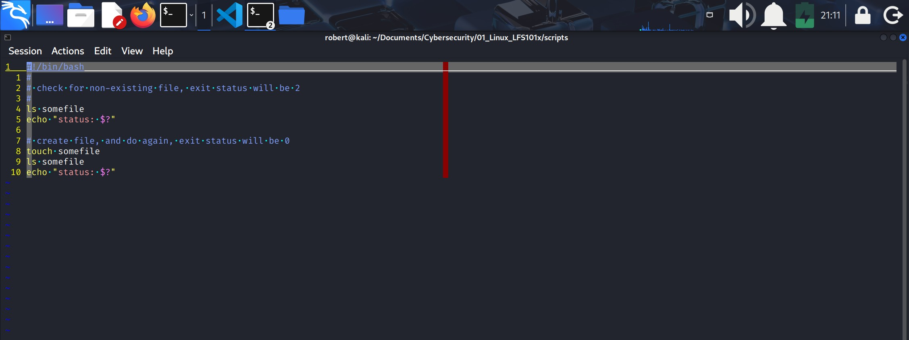
***You can see the actual script [here](https://github.com/roberto17orozco/Personal-Cybersecurity-Learning-Method/blob/Main/01_Linux_LFS101x/scripts/06_testls2.sh).***
* Where:
    1. **somefile** is a file that does not exist on your directory.

* **Important:**
    1. The script execute the commands in order. What is entered in line 5 will be executed before what is entered in line 8.
    2. On this script, `ls` will be first executed, then `echo` for enviroment variable **$?**, and then will `touch` to create a file named "somefile".

### 9.- Basic Syntax and Special Characters
1. Scripts require you to follow a standard language syntax.
2. Rules delineate how to define variables and how to construct and format allowed statementes, etc.

#### Character usages and their description

| Symbol | Meaning |
|--------|---------|
| `#` | Used to add a comment, except when escaped as `\#`, or when used as `#!` at the start of a script (shebang). |
| `\` | Used at the end of a line to indicate continuation on the next line, or to escape the next character so it is interpreted literally, as in `\$`. |
| `;` | Separates commands so the next one runs after the current one finishes. |
| `$` | Indicates that what follows is an environment variable or a variable expansion. |
| `>` | Redirects standard output, overwriting the target file. |
| `>>` | Redirects standard output, appending to the target file. |
| `<` | Redirects standard input from a file. |
| `|` | Pipes the output of one command into the input of the next command. |

* Oter special characters: `()`, `{}`, `[]`, `&&`, `||`, `'`, `"` and `$((...))`.

### 10.- Spliting Long Commands into/over Multiple Lines
1. When there are very long commands, the concatenation operator `\` is used to continue long commands over several lines.
### 11.- Putting Multiple Commands on a Single Line
1. Users sometimes need to combine several commands and statements and even conditionally execute them based on the behavior of operators used in between them.
2. This method is called **chaining of commands**.
3. `;` (semicolon) is usd to separate these commands and execute them sequentially.
4. The commands in the following example will all execute even if the ones preceding them fail:

    `$ make` ; `make install` ; `make clean`.

5. When earlier commands fail you can abort subsequent commands using `&&` (**and** operator):

    `$ make` && `$ make install` && `$ make clean`.

6. A final refinement is to use the `||` (**or** operator), in this case you proceed until something succeeds and then you stop executing any further steps:

    `$ cat file1` || `$ cat file2` || `cat file3`.

7. Chaining commands is **different** to piping commands.
8. **Piping**: creates a live data flow between commands: the output stream of one command becomes the input stream of the next, and this handoff happens while both commands are running. 

9. **Chaining**: controls execution order rather than data flow. Each command in a chain must finish completely before the next one begins, and no data is passed automatically between them unless you explicitly redirect it.

### 12.- Output Redirection
1. With shell commands and scripts you can send the ouput to a file.
2. This process is called **output redirection**.
3. The `>` operator is used.

    `$ free > /tmp/free.out`.

### 13.- Input Redirection
1. The input of a command can be read from a file.
2. Input redirection uses the `<` operator.
3. The following commands are equivalent and involve input redirection, and a command (wc) operating on the contants of a file:

    1. `$ wc < /etc/passwd`
    2. `$ wc /etc/passwd`
    3. `$ cat /etc/passwd | wc`

### 14.- Built-In Shell Commands
1. Shell scripts execute sequences of commands and other types of statements.
2. These commands can be:
    1. Compiled applications.
    2. Built-in bash commands.
    3. Shell scripts or scripts from other interpreted languages (such as perl or Python).

#### Compiled Applications
1. They are binary executable files.
2. Shell scripts always have access to applications in the default path.
3. Examples: `rm`, `ls`, `df`, `vim` and `gzip`.

#### Built-In Bash Commands
1. Can only be used to display the output within a terminal shell or shell script.
2. Slightly different behavior can be expected from the built-in version of a command such as `echo` as compared to `/bin/echo`.
    * `echo`: shell built-in, lives within bash.
    * `/bin/echo`: system binary, independent program of the system. Used for scripts.

### 15.- Script parameters
1. Users often need to pass parameter values to a script, such as a filename, a date, etc.
2. Scripts will take different paths or arrive at different results according to the **parameters** (command arguments) that are **passed** to them.
3. These values can be text or numbers as in:
    * `$ ./script.sh /tmp`
    * `$ ./script.sh 100 200`
4. Within a script, the parameter or an argument is represented with a `$` and a number or special character.

#### Parameters and their meanings

| Parameter | Meaning |
|--------|---------|
| `$0` | The script name (or the path used to invoke the script). |
| `$1` | The first positional parameter passed to the script. |
| `$2`, `$3`, ... | The second, third, and subsequent positional parameters. |
| `$*` | All positional parameters as a single string. |
| `$#` | The number of positional parameters passed to the script. |

### 16.- Using Script Parameters
1. Create the **param.sh** script with the content below:

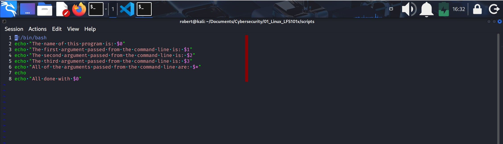
***You can see the actual script [here](https://github.com/roberto17orozco/Personal-Cybersecurity-Learning-Method/blob/Main/01_Linux_LFS101x/scripts/08_param.sh)***.

#### param.sh output
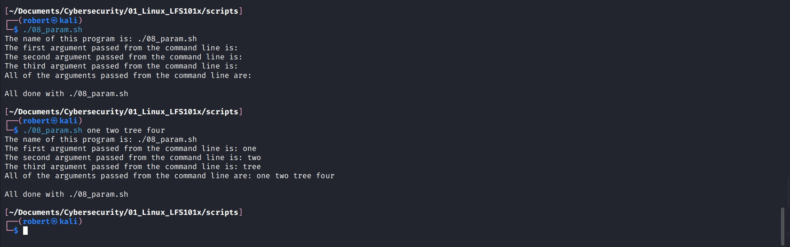

* Notice:
    * The parameters used on every `echo` line.
    * The arguments given when executing the script.

### 17.- Command Substitution
1. At times you may need to substitute the result of a command as a portion of another command.
2. It can be done in two ways:
    1. By enclosing the inner command in `$(...)`.
    2. By enclosing the inner command with back ticks (**`**).
3. No matter what method is used, the specified command will be **executed in a newly (invisible) launched shell enviroment**, and the standard output of the shell will be inserted where the command substitution is done.
4. `$(...)` method allows **command nesting.** Use this one always.
5. For example:
    
    `echo "Today's date is: $(date)"`

#### Command substitution for date, ls and cat

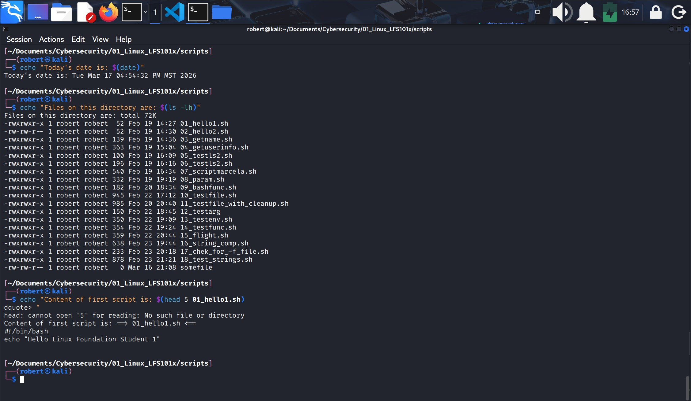

### 18.- Enviroment variables
1. Some examples of standard enviroment variables are: `HOME`, `PATH`, and `HOST`.
2. When **referenced** they must be prefixed with `$`: `$HOME`, `$PATH` and `$HOST`.
    * To view the value of enviroment variables do:

        `$ echo $PATH`, `$ echo $HOME`, etc.
    * To **set** or modify the variable value do

        `$ <enviroment_variable>=<value>`
    
3. You can get a list of enviroment variables with the `env`, `set`, or `printenv` commands.

#### Enviroment variables list
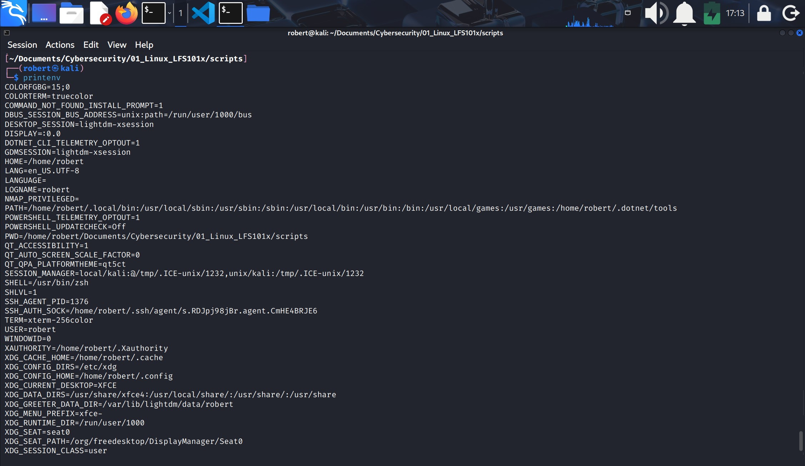

### 19.- Exporting Enviroment Variables
1. By default, the variables created within a script are available only to the subseqent steps of that script.
2. Any child processes (sub-shells) do not have **automatic** access to the values of these variables.
3. To make them available to child processes, they must be prompted to enviroment variables using the **export statement**, as in:

    * `export VAR=value`, or
    * `VAR=value ; export VAR`

4. Child processes are allowed to modify the value of exported variables.
5. The parent will not see any changes.
6. Exported  variables are not shared, they are only copied and inherited.
7. Typing export with no arguments will give a list of all currently exported enviroment variables.

#### Parent process and child process within a script
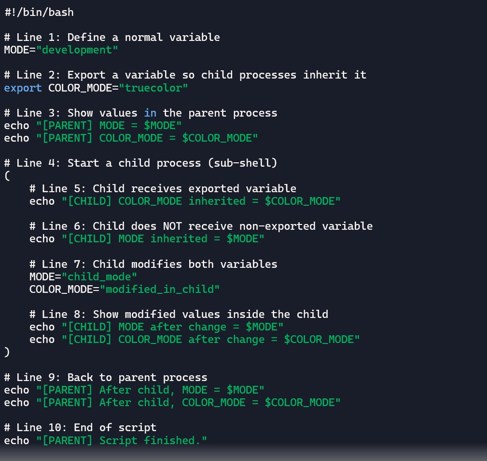
***Generated with Copilot***
* Notice:
    * The child process is written inside the parent process within parenthesis **(...)**

### 20.- Functions
1. A function is a **code block** that implements a set of operations.
2. Functions are useful for executing **procedures multiple times**, perhaps with varying input variables.
3. They are also often called **subroutines**.
4. Using functions in scripts requires two steps:
    1. Declaring a functions.
    2. Calling a function.
5. The function declaration requires a **name** which is used to invoke it.
6. The proper syntax is:

function_name () {

command...

}

7. For example, the following fuction is named **display**:

display () {
    
echo "This is a sample function that just displays a string"

}

8. The function can be as long as desired and have many statements.
9. Once defined, the function can be called later as many times as necessary.

#### A function
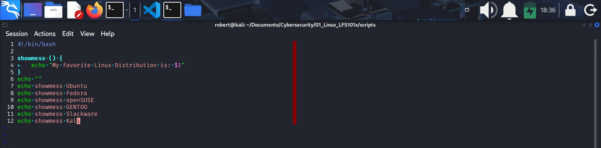

---

### Lab 15.2: Working with Files and Directories in a Script
Write a script which:
1. Prompts the user for a directory name and then creates it with `mkdir`.
2. Changes to the new directory and prints out where it is using `pwd`.
3. Using `touch`, creates several empty files and runs `ls` on them to verify they're empty.
4. Puts some content in them using `echo` and redirection.
5. Displays their content using `cat`.
6. Says goodbye to the user.

**Solution**
1. Create a file named **10_testfile.sh** with the content below:

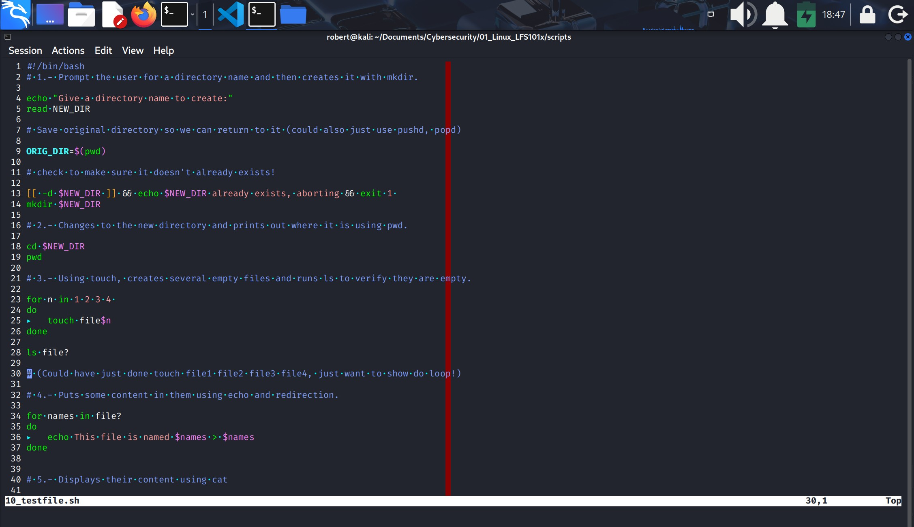
***You can see the actual script [here](https://github.com/roberto17orozco/Personal-Cybersecurity-Learning-Method/blob/Main/01_Linux_LFS101x/scripts/10_testfile.sh).***

#### ./10_testfile.sh output
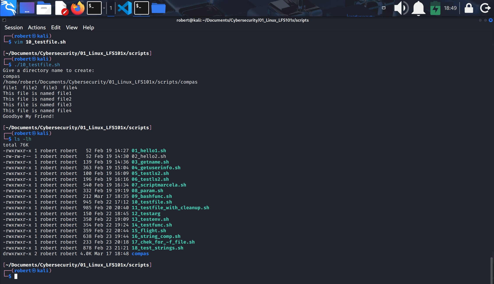
* Notice:
    1. The script asked for a name for a new directory.
    2. If you give a name that already exists it prompts a message related to it and aborts.
    3. New directory "compas" is created with files under it.

#### Important notes on writing 10_testfile.sh 
1. Variables usage:
    * `VAR=value`: you assign the value when writing the script.
    * `read VAR`: the user assigns the vale (**read** asks for it).
    * `$VAR`: calls for its content.

2. Conditional test on the line that contains: 

    1. `[[ -d $NEW_DIR ]] && echo "$NEW_DIR already exists, aborting" && exit 1`
        * `[[ -d $NEW_DIR ]]` is a conditional tests in which:
            * `[[...]]` is the test structure in bash.
            * `-d` is the operator that looks for an existing directory with the given name.
    2. If `$NEW_DIR` exists: the condition is **TRUE**.
    3. if `$NEW_DIR` does not exists: the condition is **FALSE**.

3. `&&` operator that means "execute what is next **ONLY** if the last result is **TRUE**.
4. `mkdir $NEW_DIR` will execute only if `exit 1` didn't activate.

### Lab 15.3: Passing Arguments
Write a script that takes exactly **one argument**, and prints it back out to standard ouput. Make sure the script generates a usage message if it is run without giving an argument.
**Solution**
1. Create a file named **testarg.sh**, with the content below:

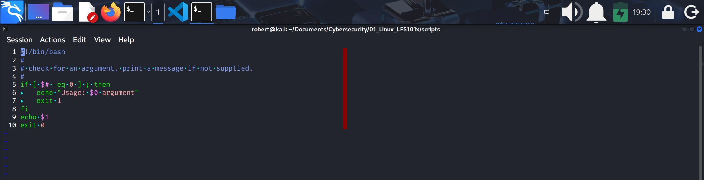
***You can see the actual script [here](https://github.com/roberto17orozco/Personal-Cybersecurity-Learning-Method/blob/Main/01_Linux_LFS101x/scripts/12_testarg).***

#### testarg output
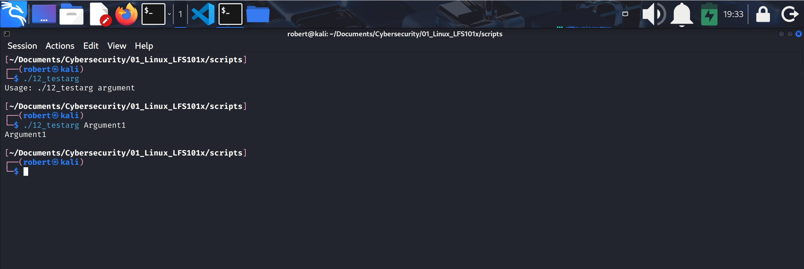

* Notice:
    1. `if [ $# -eq 0 ]` means "if the number of arguments equals 0.
        * `$#` number of arguments given by user.
        * `-eq` "equals"
    2. If you give 0 arguments, then the condition is **TRUE**, thus, `then` is to be executed.
    2. `then`: do the next.
    3. The next is `echo` "Usage: $0 argument" ***(This is the usage message if the script is run without giving an argument)***.
        * `$0` is the name of the script.
        * `echo` is indicating the file needs an argument.
    4. `exit 1` script ends because the condition was **TRUE**
    5. `fi` end of `if`.
    6. `echo $1` if the user passed an argument, `if` wont execute and the script continues here.
        * `$1` being the first argument.
    7. `exit 0` the script ends here with 0 as exit code, which means everything came out well.

### Lab 15.4: Enviroment Variables
Write a script which:
1. Asks the user for a number, which should be 1 or 2. Any other input should lead to an error report.
2. Sets an enviromental variable to be "Yes" if it is "1", "No" if it is "2".
3. Export the enviromental variable and displays it.

**Solution**
Create a file named **testenv.sh**, with the content below:

