## XVI.- MORE ON BASH AND SHELL SCRIPTING

**Contents:**
1. Manipulating strings.
2. Evaluating Boolean expressions.
3. Debbuging scripts.

### 1.- String manipulation
1. A string variable contains a sequence of text characters. It can include letters, numbers, symbols and punctuation marks.
2. For example: `abcde`, `123`, `abcde 123`, `abcde-123`, `&abcde=%123`

| String Operator | Meaning |
|-----------------|----------|
| `[[ string1 > string2 ]]` | Compares the **lexicographical (sorting)** order of `string1` and `string2`. |
| `[[ string1 == string2 ]]` | Compares whether the **characters** in both strings are identical. |
| `myLen1=${#string1}` | Stores the **length** of `string1` in the variable `myLen1`. |

### 2.- Example of string manipulation
1. Compare two strings and display an appropiate message using the **if statement**. Create a script with the content below:

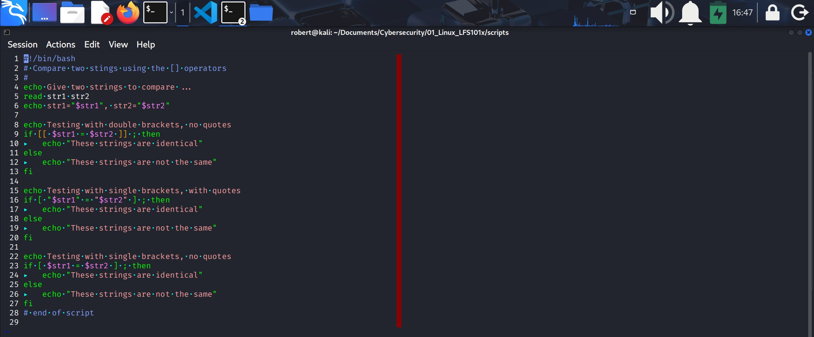
***You can see the actual script [here](https://github.com/roberto17orozco/Personal-Cybersecurity-Learning-Method/blob/Main/01_Linux_LFS101x/scripts/16_string_comp.sh).***

#### ./16_string_comp.sh output:
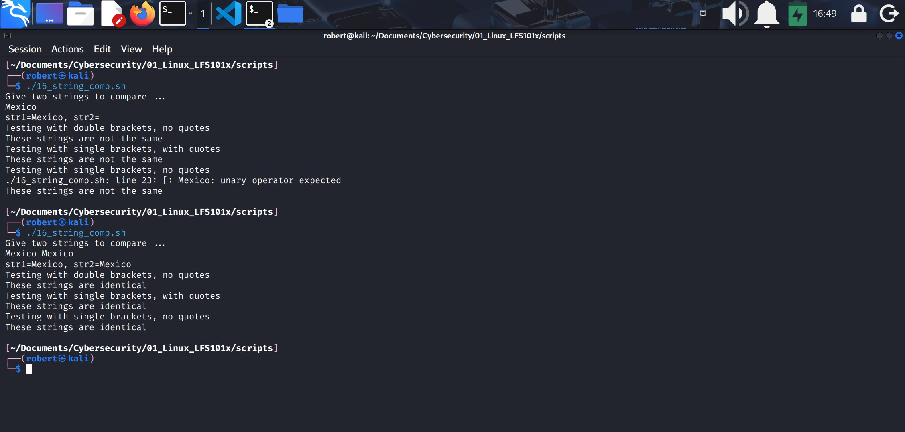
* Notice:
    1. You can use the **if statement** in 3 different ways:
        1. Double brackets, no quotes.
        2. Single brackets, quotes, and
        3. Single brackets, no quotes.

---

2. Pass a file name and see if that file exists or not. Create a script with the content below:

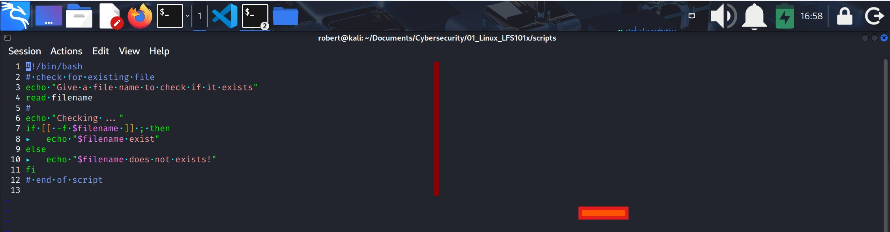
***You can see the actual script [here](https://github.com/roberto17orozco/Personal-Cybersecurity-Learning-Method/blob/Main/01_Linux_LFS101x/scripts/17_chek_for_-f_file.sh).***

#### ./check_for_-f_file.sh output:
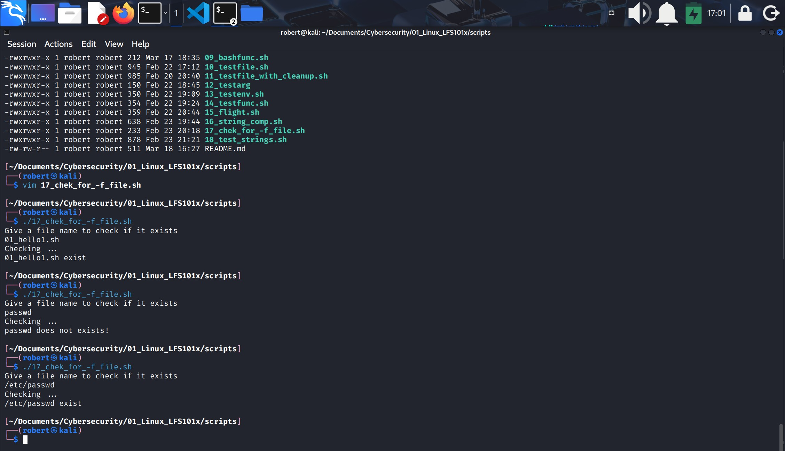.
* Notice:
    1. `-f` operator looks for regular files.
    2. **filename** is saved as a variable and then is used in the if statement, and then in the `echo` utility.

### 3.- Parts of a string
1. At times, you may not need to compare or use an entire string.
2. To extract the firts **"n"** characters of a string, we can specify:

    `${string:0:}`
    * Here **0** is the offset in the string (i.e. which character to begin from). Is where the straction needs to start.
    * `n` is the number of characters to be extracted.

3. To extract all characters in a string after a dot (.), use the following expression:

    `${string#*.}`

---
### Lab 16.1: String tests and operations
Write a script which reads two strings as arguments and then:
1. Test to see if the first string is of 0 lenght, and if the other is of non-zero lenght, telling the user of both results.
2. Determines the length of each string, and reports on which one is longer or if they are of equal lenght.
3. Compares the strings to see if they are the same, and reports on the result.

**Solution**
1. Create a file named **teststrings.sh**, with the content below:

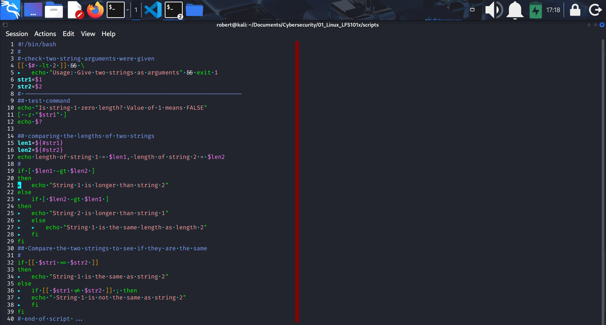
***You can see the actual script [here](https://github.com/roberto17orozco/Personal-Cybersecurity-Learning-Method/blob/Main/01_Linux_LFS101x/scripts/18_test_strings.sh).***

#### ./test_strings.sh output:
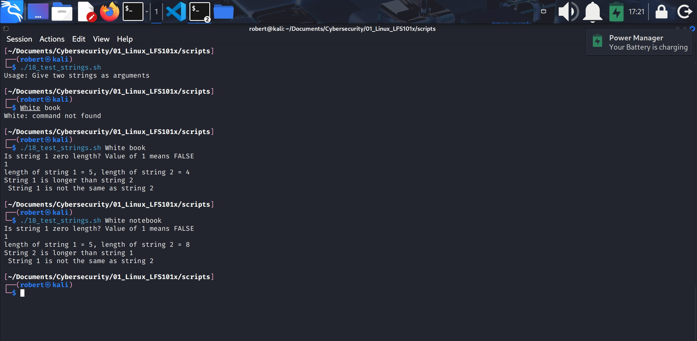
* Check two string arguments were given:
    1. `[[ $# -lt 2 ]]` its an early conditional test that means "if less than 2 arguments given..
    2. `echo` "Usage: Give two strings as arguments" and
    3. `exit 1`.
        * Notice the **if statement** is not in use, the `[[..]]` and `&&` are used instead.
    4. `str1` is the name for first arguement `$1`; the same way `str2` is the name for the second argument `$2`
    
* Test command    
    1. `[ -z "$str1" ]` is a conditional test that means "is the string lenght zero?".
        * If it is true return code will be 0.
        * If it is false, return code will be 1.
        * `$?` contains the return code for the last command.

* Comparing the lenghts of two strings.
    1. In `len1=${#str1}`, `${#str1}` is the lenght for variable **len1**.
    2. In `len2=${#str2}`, `${#str2}` is the lenght for variable **len2**.
    3. An **if statement** is used to compare the lenghts of variables len1 and len2 with the numerical test `-gt`.

* Compare the two strings to see if they are the same.
    1. Using the **if statement** and the `==` operator you can compare if the strings are the same.

#### Lenght and values evaluated in two strings

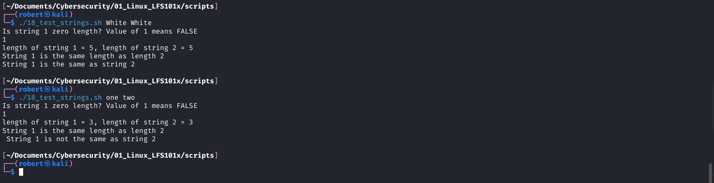

* Notice:
    1. Arguments **White** and **White** are evaluated as identical strings.
    2. On the other hand strings **one** and **two** are evaluated as different strinst, although they have the same lenght.

### 4.- The case statement
1. The `case` statement is used in scenarios where the actual value of a variable can lead to different execution paths.
2. `case` statements are often used to handle **command-line** options.
3. Features of case statement:
    1. Easier to read and write.
    2. Good alternative to nested, multi-level if-then-else-fi statements.
    3. Enables you to compare a variable against several values at once.
    4. Easy to use.
    5. Reduces complexity of a program

### 5.- Structure of the case statement
1.      case expression in
2.          pattern 1)  execute commands ;;
3.          pattern 2)  execute commands ;;
4.          pattern 3)  execute commands ;;
5.          pattern 4)  execute commands ;;
6.          *)          execute some default commands or nothing ;;

* As soon as the expression matches a pattern successfully, the execution path **exits**.

### 6.- Example of using the case construct
Note you can have multiple possibilities for each **case value** that take the same action.

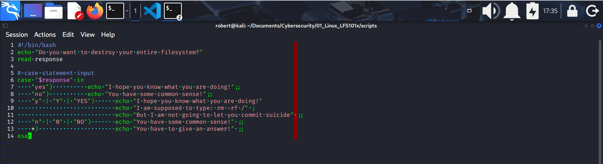
***You can see the actual script [here](https://github.com/roberto17orozco/Personal-Cybersecurity-Learning-Method/blob/Main/01_Linux_LFS101x/scripts/19_case_statement.sh)***.

#### case_statement.sh output

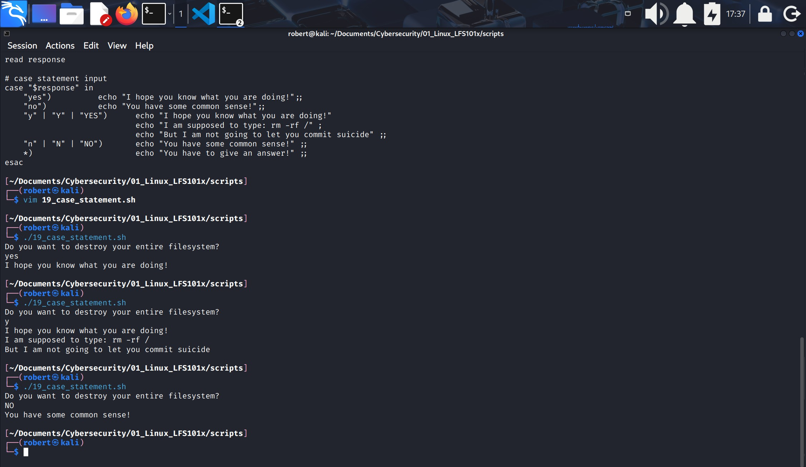

### Lab 16.2: Using the case statement
1. Write a script that takes as an argument a month in numerical form (i.e. between 1-12) and translates this to the month name and display the result on standard out (terminal).
2. If no argument is given, or a bad number is given, the script should report the error and exit.

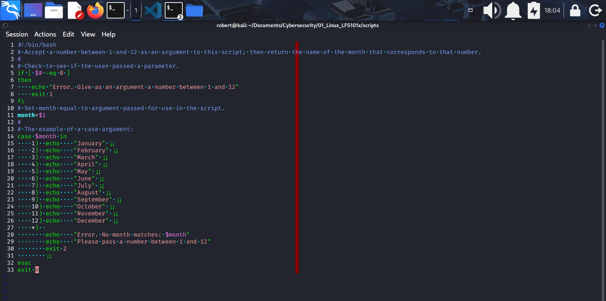
***You can see the actual script [here](https://github.com/roberto17orozco/Personal-Cybersecurity-Learning-Method/blob/Main/01_Linux_LFS101x/scripts/20_months.sh).***

**Note:**
1. First verify if the user passed a parameter with the if statement.
2. If user didn't pass a parameter then `exit 1`.
3. Set the variable **$month** equal to the first argument **$1**.
4. Apply the **case** construct.
5. Stablish `echo` comands for `*)` (which means "any other value that does not match the given parametters).
6. If any argument does not match the parametters `exit 2`.
7. Close with `esac`.
8. `exit 0` for no errors.

#### months.sh output
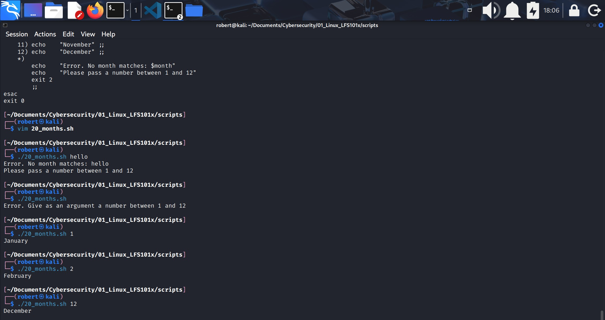

### 7.- Looping constructs
1. By using looping constructs, you can execute one or more lines of code repetitively, usually on a selection of values of data such as individual files.
2. Usually you do this until a conditional test returns either **TRUE** or **FALSE**, as is required.
3. Three freqently used types of loops are often used in bash and in many programming languages:
    1. for
    2. while
    3. until

4. All these loops are easily used for repeatedly executing one or more statements until the **exit** condition is **TRUE**.

### 8.- The for loop
1. The `for` loop operates on each element of a list of items.
2. The syntax for loop is:
    1.      for <variable-name> in <list>
    2.      do
    3.          execute one iteration for each item in the list until the list is finished.
    4.      done

3. In this case **variable-name** and **list** are substituted by you as appropiate.
4. As with other looping constructs, the statements that are separated should be enclosed by `do` and `done`.

#### for loop example
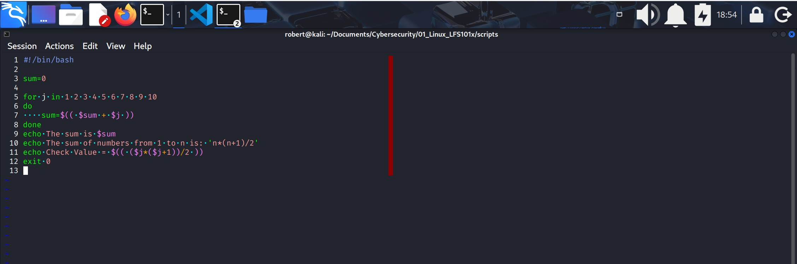
***You can see the actual script [here](https://github.com/roberto17orozco/Personal-Cybersecurity-Learning-Method/blob/Main/01_Linux_LFS101x/scripts/21_for_loop.sh)***

**Notes:**
1. The purpose of the script is to calculate the sum of the numbers from 1 to 10.
2. This is achieved by updating the variable **sum** during **each iteration** of the **loop.**

3. The value of **j** changes on every pass of the for loop.
The loop iterates through the explicit list:
1 2 3 4 5 6 7 8 9 10  
Therefore, in each iteration, **j** takes one of these values.

The variable **sum** acts as an accumulator.
In each iteration, the following operation is executed:

`sum=sum+𝑗`

4. This means that sum always stores the **partial result of the addition up to that moment**.

5. When the loop finishes, **sum** contains the total sum (55).
And **j** retains the last processed value (10), which allows the script to verify the result using the mathematical formula:

`𝑛(𝑛+1)/2`

### 9.- The while loop
1. The `while` loop repeats a set of statements as long as the control command returns **TRUE**.
2. The syntax is:
    1.      while condition is true
    2.      do
    3.          Commands for execution
    4.          ----
    5.      done

3. You can use any command or operator as the **condition**.
4. Often it is enclosed in brackets `[]`.

#### the while loop
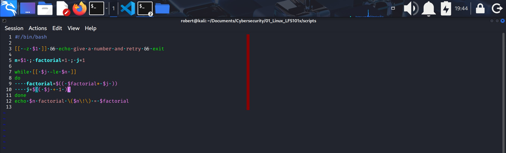
***You can see the actual script [here](https://github.com/roberto17orozco/Personal-Cybersecurity-Learning-Method/blob/Main/01_Linux_LFS101x/scripts/22_while_loop.sh)***.

#### ./while_loop.sh output
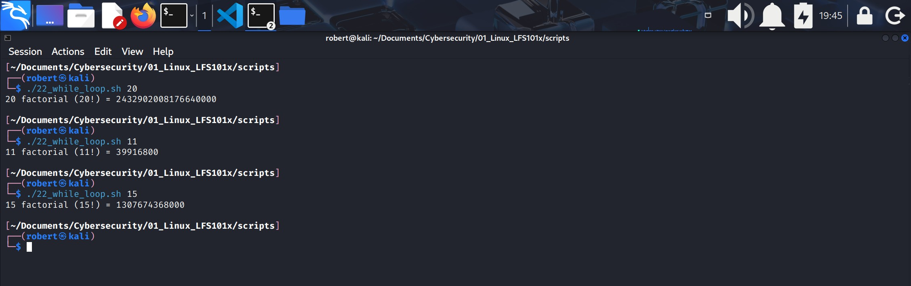

**Notes:**
1. Script purpose is to calculate a factorial for **n** number passed as argument.
    * A **factorial** is a multiplication by a given number times all the numbers that preceed it. It is used to calculate combinations.
    * For example, the factorial of number 3, **3!** is: 3x2x1= **6**. The factorial of 3 is 6.

2. While **j** is less or equal to **n**, the loop will continue executing. This is due to the condition:

    `while [[ $j -le $n ]]`

### 10.- The until loop
1. The until loop repeats a set of statements as long as the control command is **FALSE**.
2. Thus, it is essentially the opposite of the `while` loop.
3. It's syntax is:
    1.      until condition is false
    2.      do
    3.          Commands for execution
    4.          ----
    5.      done

### 11.- Debugging bash scripts
1. Debugging bash helps troubleshoot and resolve such errors and is one of the most important tasks a system administrator performs.
2. While working with scripts and commands, you are likely to incur errors.
3. This may be due to:
    1. An error in the script, such as incorrect syntax
    2. A missing file, or
    3. Insufficient permission to do an operation.
4. These errors may be reported with a specific **error code** but often yield incorrect or confusing output.
5. So, how do you go about identifying and fixing an error?

### 12.- Script debug mode
1. Before fixing an error (or bug), it is vital to locate the source.
2. You can run a bash script in **debug mode** either by doing:
    * `bash-x ./script_file.sh` or,
    * bracketing parts of the script with:
        * `set -x` and `set + x`.
3. The **debug mode** helps identify the error because:
    1. It traces and prefixes each command with the `+` character.
    2. It displays each command before executing it.
    3. It can debug only selected parts of a script (if desired) with:
        * `set -x` turns on debugging.
        * `set +x` turns off debugging
* **Important:**
Debug mode does NOT fix any errors in the script, nor it indicate possible errors, it only shows you the commands to be executed in chronological order, you must detect possible errors with its output.

### 13.- Redirecting errors to File and Screen
1. In UNIX/Linux, all programs that run are given three open file streams when they are started as listed in the table:

#### File streams

| Descriptor | Description | File Descriptor (FD) |
|-----------|-------------|-----------------------|
| `stdin`   | Standard input; by default the keyboard or terminal for programs run from the command line | 0 |
| `stdout`  | Standard output; by default the screen where programs display their normal output | 1 |
| `stderr`  | Standard error; where error messages are shown or saved; by default it goes to the same place as `stdout` | 2 |

2. By using redirection, we can save the **stndard output** and **error** streams to one file or two separate files for later analysis after a command or program is executed:

    `./tesbasherror.sh 2> error.log`

### 14.- Creating temporary files and directories
1. Consider a situation where you want to retrieve 100 lines from a file with 10,000 lines. You will need a place to store extracted information, perhaps in a temporary file, while you do further processing on it.
2. Temporary files and directores are meanto to store data for a short time.
3. Usually, one arranges it so that these files disappear when the program using them terminates.
4. While you can also use `touch` to create a temporary file, in some circumstances this may make it easy for hackers to gain access to your data. This is particularly true if the name and the file locatin of the temporary file are predictable.
5. The best practice is to create **random** and **unpredictable** file names for temporary storage.
6. One way to do this is with the `mktemp` utility, as in the following examples:

`TEMP=$(mktemp /tmp/tempfile.XXXXXXXX)`     to create temporary file.
`TEMP=$(mktemp -d /tmp/tempdir.XXX)`        to create temporary directory.

* The `XXXXXXXX` is replaced by `mktemp` with random characters to ensure the name of the temporary file cannot be easy predicted and is only known **within** your program.
* You have to have at least 3 **X**'s in the supplied template, and the number of **random characters** will be equal to the number of **X**'s given.

#### Important
* Mostly temporary files are created within a script for its own purposes.
* Temporary files or directories will not be removed unless the script indicate so.

### 15.- Discarding output with /dev/null
1. Certain commands (such as `find`) are quite capable of spewing voluminous and overwhelming amounts of output.
2. To avoid this, we can redirect the large output to a special file (a device node) called /dev/null.
3. This pseudo-file is also called **the bit bucket** or **black hole**.
4. All data writen to /dev/null is discarded.
5. Furthermore, write operations never return failure conditions.
6. Using the proper redirection operators, it can make the uninteresting output disappear from commands that would normaly generate output to **stdout** and/or **stderr**.
7. For example:

    `$ ls -lR /tmp > /dev/null`: the entire standard output stream is ignored, but any errors will still appear on the console.

    `$ ls -lR /tmp >& /dev/null`: both, **stdout** and **stderr** will be dumped into /dev/null

#### Redirecting to /dev/null
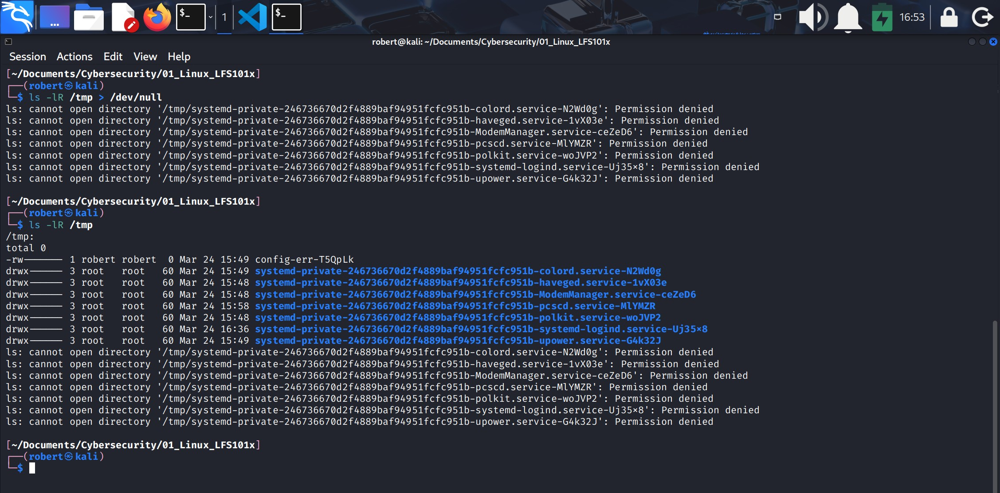

### 16.- Random numbers and data
1. It is often useful to generate random numbers and other random data when performing tasks such as:
    * Performing security-related tasks.
    * Reinitializing storage devices.
    * Erasing and/or obscuring existing data.
    * Generating meaningless data to be used for tests.

2. Such random numbers can be generated by using the **$RANDOM** enviroment variable:

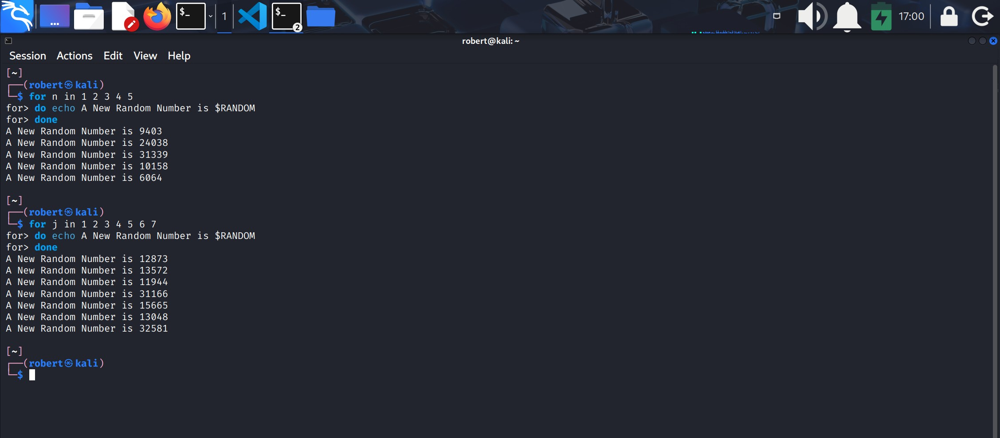
* **Note:**
    1. This exercise was made directly in the terminal not in a specific bash file.
    2. The usage of the `for` utility.

### 17.- How the Kernel Generates Random Numbers
1. System maintains a so-called **entropy-pool** which generates random numbers.
2. Linux kernel offers:
    1. **/dev/random**: used where very high-quality randomness is required such as one-time pad or key generation.
    2. **/dev/urandom**: is faster (good enough) for most cryptographic purposes. It reuses the entropy pool.

### Lab 16.3: Using random numbers
Write a script which:
1. Takes a word as an argument.
2. Appends a random number to it.
3. Displays the answer.

**Solution**
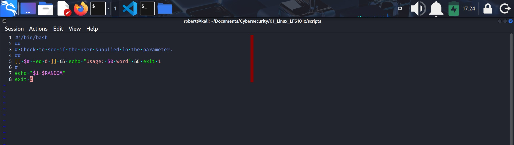
***You can see the actual script [here](https://github.com/roberto17orozco/Personal-Cybersecurity-Learning-Method/blob/Main/01_Linux_LFS101x/scripts/23_random_numbers.sh)***.

#### ./random_lab.sh output
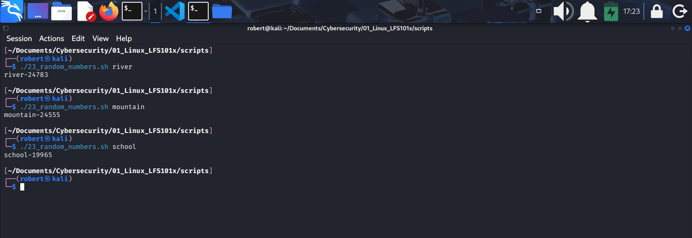

* **Note:**
    * `echo "$1-$RANDOM"` is what produces the output of the given parameter ($1) attached by a random number ($RANDOM).

---
- End of chapter **sixteen**.

