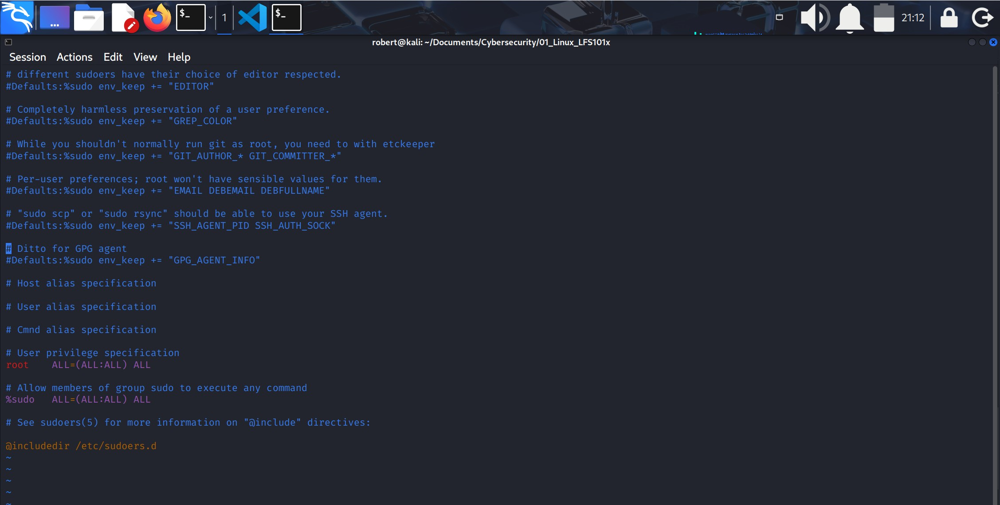
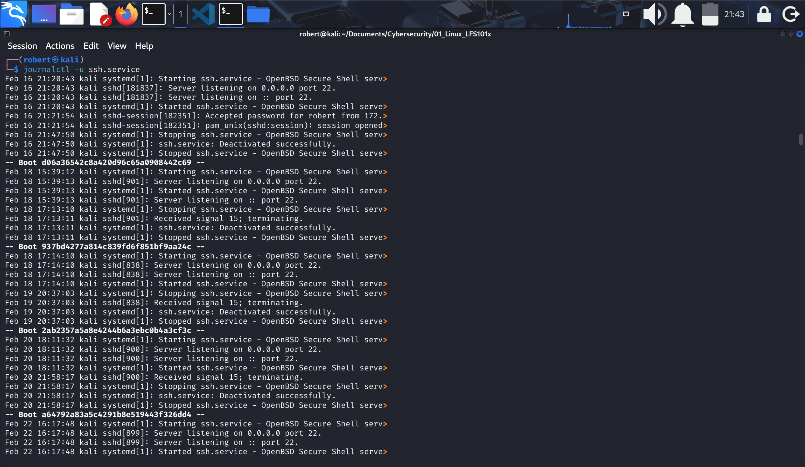
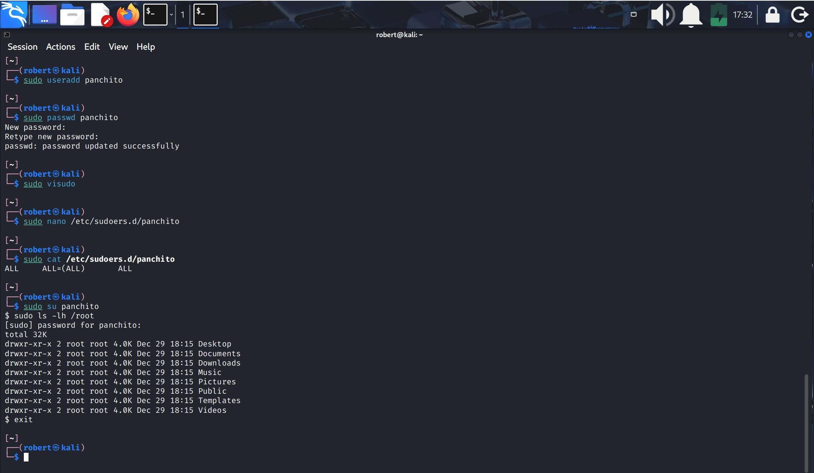
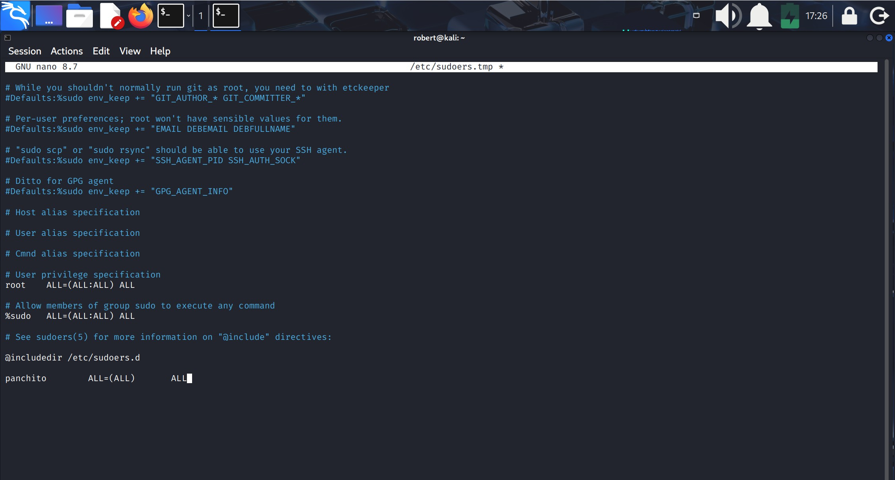
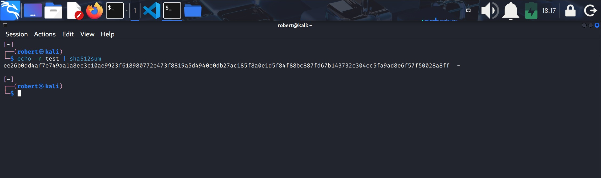
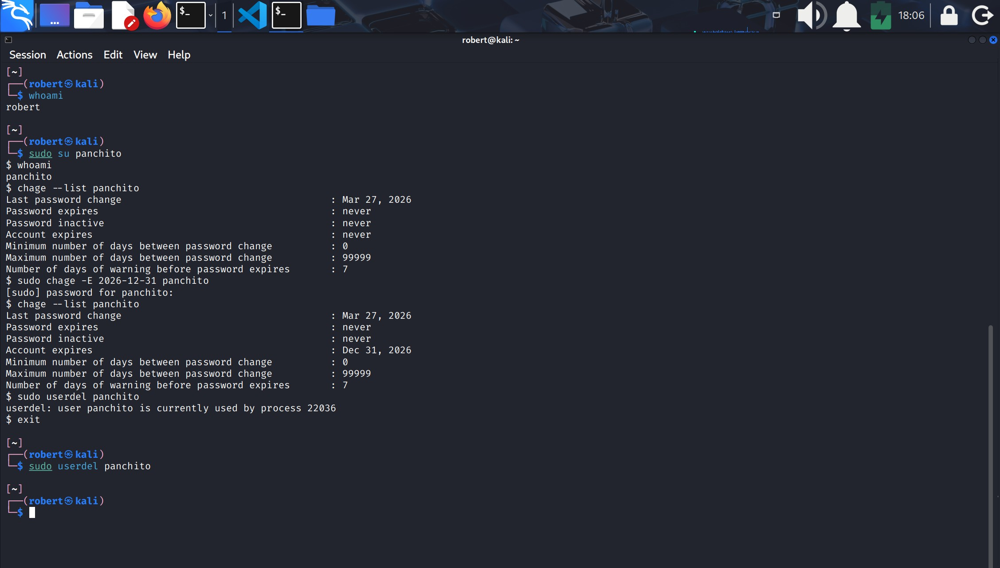

## XVIII.- LOCAL SECURITY PRINCIPLES

### 1.- User Accounts
1. Upon account creation, new user information is added to the user database and the user's **home** directory must be created and populated with some essential files.
2. Command-line tools `useradd` and `userdel` are used to add and remove accounts.
3. For each user, the following seven fields are maintained in **/etc/passwd** file:

| Field Name       | Details                                                                 | Remarks                                                                                                   |
|------------------|-------------------------------------------------------------------------|-----------------------------------------------------------------------------------------------------------|
| Username         | User login name                                                         | Should be between 1 and 32 characters long.                                                               |
| Password         | User password (or the character **x** if stored in **/etc/shadow**) in encrypted format | Is never shown in Linux when it is being typed.                                                           |
| User ID (UID)    | Every user must have a User ID (UID)                                    | - **UID 0** is reserved for root user. - **UID 1–99** are reserved for predefined accounts. - **UID 100–999** are for system accounts and groups. - **Normal users** have UIDs of **1000 or greater**. |
| Group ID (GID)   | Primary Group ID (GID); stored in the **/etc/group** file               | Covered in detail in the Processes chapter.                                                               |
| User Info        | Optional field for extra user information (e.g., full name)             | For example: `Rufus T. Firefly`.                                                                          |
| Home directory   | Absolute path to the user’s home directory                              | For example: **/home/rtfirefly**                                                                          |
| Shell            | Absolute path to the user’s default shell                               | For example: **/bin/bash**                                                                                |
---
### 2.- Types of accounts
1. By default, LInux distinguishes between several account types in order to isolate processes and workloads.
2. Linux has four types of accounts:
    1. root
    2. system
    3. normal, and
    4. network

### 3.- root account
1. **root** is the most privileged account on a Linux/UNIX system. This account has the ability to carry out all facets of system administration, including:
    * Adding accounts
    * Changing user passwords
    * Examining log files
    * Installing software, etc.
2. Utmost care must be taken when using this account.
3. It has no security restrictions imposed upon it.
4. When you are signed in as, or acting as **root**, the shell prompt displays `#`.

### 4.- Operations requiring root privileges
1. **root** privileges are required to perform operations such as:
    1. Creating, removing and managing user accounts.
    2. Managing software packages.
    3. Removing or modifying system files.
    4. Restarting system services.

### 5.- Operations not requiring root privileges
1. SUID (Set owner User ID upon execution - similar to Windows "run as" feature) is a special kind of permission given to a file.
2. Use of SUID provides temporary permissions to a user to run a program with the permissions of the owner instead of the permissions held by the user.

### 6.- Comparing sudo and su
1. In Linux you can use either `su` or `sudo` to temporarily grant **root** access to a normal user.
2. However these methods are quite different. Listed below are the differences between the two commands:

| su | sudo |
|----|------|
| *When elevating privilege, you need to enter the root password. Giving the root password to a normal user should never, ever be done.* | *When elevating privilege, you need to enter the **user's** password, not the root password.* |
| *Once a user elevates to the root account using `su`, the user can do anything that the root user can do for as long as they want, without being asked again for a password.* | *Offers more features and is considered more secure and configurable. Exactly what the user is allowed to do can be precisely controlled and limited. By default, the user must keep giving their password for further `sudo` operations, unless a timeout is configured.* |
| *The command has limited logging features.* | *The command has detailed logging features.* |

### 7.- sudo features
1. `sudo` has the ability to keep track of unsuccesful attempts at gaining **root** access.
2. User's authorization for using `sudo` is based on configuration information stored in **/etc/sudoers** file and the **/etc/sudoers.d** directory.
3. A message such as the following would appear in a system **log file** (usually /var/log/secur) when trying to execute `sudo` for **badperson** without succesfully authenticating the user:

*       badperson: USER NOT in sudoers ; TTY=pts/4 ; PWD=/var/log ; USER=root ; COMMAND=/usr/bin/tail secure

### 8.- The sudoers file
1. Whenever `sudo` is invoked, a trigger will look at **/etc/sudoers** and the files in **/etc/sudoers.d** to determine has the right to use `sudo` and what the scop of their privilege is.
2. The basic entries in these files is:
*       who where = (as_shom) what

3. The file **/etc/sudoers** contains the individual user's `sudo` configuration, and one should leave the main configuration file untouched exept for changes that affect all users.
4. You should edit any of these configuration files by using `visudo`, which ensures that only one person is editing the file at a time, has the propper permissions, and refuses to write out the file and exit if there are syntax errors in the changes made.
5. The editing can be accomplished by doing a command such as the following ones:
    1. `visudo /etc/sudoers`
    2. `visudo -f /etc/sudoers.d/student`

#### /etc/sudoers file

### 9.- Command logging
1. By default `sudo` commands and any failures are logged in **/var/log/auth.log** under the Debian distribution family.
2. This is an important safeguard to allow for tracking and accountability of `sudo` use.
3. Running a command such as `sudo whoami` results in a log file entry such as:
*       Dec 8 14:20:47 server1 sudo : op : TTY=pts/6 PWD=/var/log USER=root COMMAND=/usr/bin/whoami

* **IMPORTANT:**
1. On Debian families /var/log/auth.log does no longer exist anymore, instead `systemd-journald` is used.
2. This is because Debian systems do not install **rsyslog** for default which is what produced /var/log/auth.log.
3. Authentication logs are now in the **systemd journal**.
4. You can see log information with the following commands:
    1. `journalctl -u ssh.service` to see all authentication events.
    2. `journalctl -u ssh.service -f` to see recent authentication events.
    3. `journalctl-xe` to see all system security events.
        * You can redirect the output to a file using `> authfile.txt`.

#### journalctl -u ssh.service

### 10.- Process isolation
1. Linux is considered to be more secure than any other OS because processes are naturally isolated from each other.
2. One process normally cannot access the resources of another process.
3. Linux thus makes it difficult for users and security exploits to access and attack random resources on a system.
4. More recent additional security mechanisms that limit risks even further include:
    1. Control Groups (cgroups)
    2. Containers, and
    3. Virtualization (VIrtual machines used with hypervisors).

### 11.- Hardware device access
1. Linux limits user access to non-networking hardware devices in a manner that is extremely similar to regular file access:
    1. Applications interact by engaging the filesystem layer (which is independent for the actual device or hardware the file resides on).
    2. This layer will then open a device **special file** (often called a **device node**) under the /dev directory that corresponds to the device being accessed.
    3. Each device special file has standard owner, group and world permissions fields.

2. Hard disks, for example, are represented as **/dev/sd\***
3. While a root user can read and write to the disk in a raw fashin, for example by doing something like:

    `# echo hello world > /dev/sda1`

4. Writing to a device in this fashion can easily obliterate the filesystem stored on it in a way that cannot be repaired without great effort, if at all.
---
### Lab 18.1: sudo
1. Create a new user, using `useradd`, and give the user an initial password with `passwd`.
2. Configure this user to be able to use `sudo`.
3. Login aas or switch to this new user and make sure you can execute a command that requires root privilege.
4. For example, a trivial command requiring root privilege could be:

    `$ ls /root`

**Solution**
1. `sudo useradd <newuser>`.
2. `sudo passwd <newuser>`.
    * Give the password for this user when prompted.
3. With root privilege, (use `sudo visudo`) add this line to **/etc/sudoers**:

    `newuser    ALL=(ALL)   ALL`

4. Alternatively, create a file named **/etc/sudoers.d/newuser** with just that one line as content.
5. You can login by doing:
    1. `sudo su newuser` or,
    2. `ssh newuser@localhost` which will require giving `newuser`'s password, and is probably a better solution. Instead of `localhost` you can give your hostname, IP address or 127.0.0.1.
6. Then as `newuser` just type:

    `sudo ls /root`

#### Creating a new user and using its account

#### New user line in sudoers file

---

### 12.- How passwords are stored

1. The system verifies authenticity and identity using user credentials.
2. Originally, encrypted passwords were stored in the **/etc/passwd** file, which was readable by anyone.
    * This made it rather easy for passwords to be cracked.
3. On modern systems, passwords are actually stored in an encrypted format in a secondary file named **/etc/shadow**.
    * Only those with root access can read or modify this file.

### 13.- Password Encryption
1. Most Linux distributions rely on a modern password encryption algorithm called **SHA-512** (Secure Hashing Algorithm 512 bits), developed by the U.S. National Security Agency (NSA) to encrypt passwords (2001).
2. The **SHA-512** is used widely for security applications and protocols. These security applications ans protocols include: TLS, SSL, PHP, SSH, S/MIME and IPSec.
3. **SHA-512** is one of the most tested **hashing** algorithms.
4. For example, if you wish to experiment with **SHA-512** encoding, the word `test` can be encoded using the program `sha512sum` to produce the **SHA-512** form:

    `$ echo -n test | sha512sum`

#### Encoding the word "test" with sha512sum

### 14.- Good password practices
1. **Password aging** is a method to ensure that users get prompts that remind them to create a new password after a specific period.
    * This feature is implemented using `chage`, which configures the password expiry information for a user.
2. Another method is to force users to set strong passwords using Pluggable Authentication Modules (PAM).
    * PAM can be configured to automatically verify that a password created or modified using the `passwd` utility is sufficiently strong.
    * PAM configuration is implemented using a library called `pam_cracklib.so`, which can also be replaced by `pam_passwdqc.so` to take advantage of more options.

### 15.- Requiring Boot Loader Passwords
1. You can secure the boot process with a secure password.
2. This can work in conjunction with password protection for the BIOS.
    * If only use a password for the boot loader, it will stop user from editing the bootloader configuration during the boot process, but it will not prevent a user from booting from an alternative boot media (optical disks, pen drives, etc.) thus, it is recomended to set a password for both the boot loader and the BIOS.

### 16.- Hardware Vulnerability
1. When hardware is **physically** accesible, security can be comprimised by:
    1. **Key logging**: recording the real-time activity of a computer.
    2. **Network sniffing**: capturing and viewing the network packet level data on your network.
    3. **Booting**: with a live or rescue disc.
    4. **Remounting and modifying** disk content.

2. The guideliness of security are:
    1. Lock down workstations and servers.
    2. Protect your network links such that it cannot be accessed by people you do not trust.
    3. Protect your keyboards where passwords are entered to ensure the keyboards cannot be tempered with.
    4. Ensure a password protects the **BIOS** in such a way that the system cannot be booted with a live or rescue DVD, or USB key.

### 17.- Software vulnerabilities
1. Like all software, hackers occasionally find weakness in the Linux ecosystem.
2. The strenght of Linux (and open source community in general) is the speed in which such vulnerabilities are exposed and remediated.
3. SPecific coverage of vulnerabilities is beyond the scope of this course, but the Discussion Board can be used to carry out further discussion.

---
- End of chapter **eighteen**.

### Lab 18.2: Password Aging
1. With the newly created user from the previous exercise, lok at the password aging for the user.
2. Modify the expiration date for the user, setting it to be something that has passed, and check to see what has changed.
3. When you are finished and wish to delete the newly created account, use `userdel`, as in:

    `$ sudo userdel newuser`

**Solution**
1. `chage --list newuser`
2. `sudo chage -E 2014-31-12 newuser`
3. `chage --list newuser`
4. `sudo userdel newuser`

#### password age and delete user

### IMPORTANT: creating accounts and switching between them

1. On Linux (Debian families) there are two main ways to create user accounts:

    1. `sudo useradd newuser`

    2. `sudo adduser newuser`

2. `useradd` is a low‑level command that creates the account but does not configure it fully:

    * It does not create the /home directory unless you use the `-m` option.

    * It does not set a password; you must run:

    `sudo passwd newuser`

    * To grant sudo privileges, the recommended method is:

    `sudo usermod -aG sudo newuser`

    * Alternatively, you may manually edit /etc/sudoers or create a file in /etc/sudoers.d/, but this is less safe.

    * To switch to the new user:
    
    `su - newuser`

    * `useradd` is typically used in scripts or automated setups.

---

3. `adduser` is a high‑level, interactive script that creates a fully configured user account:

* It automatically creates the /home directory.

* It copies default configuration files from /etc/skel.

* It asks for and sets the user’s password during creation.

* It creates a user group with the same name as the account.

* To grant sudo privileges, use:

    `sudo usermod -aG sudo newuser`

* To switch to the new user:
`su - newuser`

* `adduser` is recommended for normal system administration because it is safer and easier to use.

#### See "human" users created in the system
1. To see all the accounts created for different people in your system type:

    `awk -F: '$3 >= 1000 {print $1}' /etc/passwd`

2. You can also use the `last` command to take a look for all the users that have recently logged in the system.
