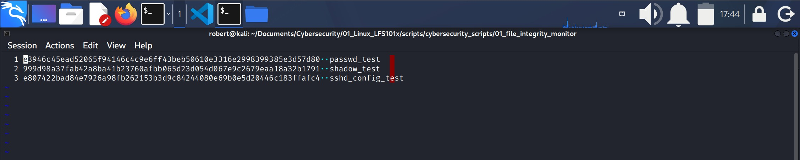
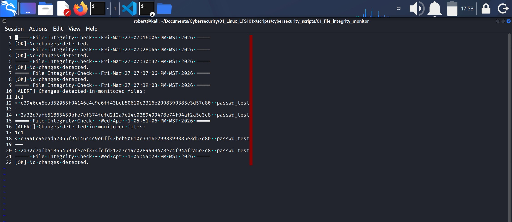

## File Integrity Monitor (Bash Script)
A simple Bash-based file integity monitor that detects unauthorized changes by comparing SHA-256 hashes.

### 1.- Purpose and enviroment

1. This script detects if a critical file has been maliciously modified.
2. Due to permission privileges, a **test enviroment** was created to avoid the usage of the following system files:
    * /etc/passwd
    * /etc/shadow
    * /etc/sshd_config
3. Test enviroment files created are:
    * **passwd_test**
    * **shadow_test**
    * **sshd_config_test**
4. All files used for the execution of this script are in the same local directory, including **test environment** files. Directory is **/01_file_integrity_monitor**.
5. Thus, the script detects a modification on the critical (test) files:
    * **passwd_test**
    * **shadow_test**
    * **sshd_config_test**

### 2.- Add content to the test files
1. **passwd_test**: "user:x:1000:1000:Test User:/home/user:/bin/bash"
2. **shadow_test**: "root:*:19500:0:99999:7:::"
3. **sshd_config_test**: "Port 22"

### 3.- Create the file that tells the script which files to monitor.
1. The script uses a file that tells what files to monitor.
2. File **monitored_files.txt** was created for this purpose.
3. The following content was added to **monitored_files.txt**:

passwd_test
shadow_test
sshd_config_test

4. Note that the content is the names for the monitored files.

### 4.- Generate the baseline hashes
1. In order to verify if any of the files has been modified, these files have to have **an original, clean** reference state. 
2. Creating **baseline hashes** for the files is that, an original and clean digitial code assigned to the involved files at a moment we know there has not been an undesired modification.
3. At the terminal execute:

    `$ sha256sum $(cat monitored_files.txt) > baseline_hashes.txt`

    * This command will :
        * Calculate a SHA-256 for every listed file in **monitored_files.txt**
        * Create **baseline_hashes.txt** file
        * This file is the official reference to detect modifications.

4. Protect the baseline:
    * Once the baseline is created it should not be modified or automatically regenerate, for that reason change file permissions with:

        `$ chmod 400 baseline_hashes.txt`

#### baseline_hashes.txt

### 5.- Create the script

1. Set variables:
    1. MONITORED_FILES="monitored_files.txt"
    2. BASELINE="baseline_hashes.txt"
    3. LOGFILE="integrity_log.txt"

        * Note that for file **monitored_files.txt** corresponds variable MONITORED_FILES.
        * For **baseline_hashes.txt** corresponds variable BASELINE.
        * For **integrity_log.txt** corresponds variable LOGFILE.

2. Check required files:
    1. **The conditional test** `[[ ! -f "$MONITORED_FILES" || ! -f "$BASELINE" ]]` verifies the existence of variable $MONITORED_FILES and therefore the existence of file **monitored_file.txt**.
    * It does the same for variable and file $BASELINE **baseline_hashes.txt**.

        * `!` means logical NO.
        * `-f` means "file exists"
        * `! -f` means "file does not exists"
    2. Therefore if the conditional test is **TRUE** (the files don't exist) the script will proceed with:
        * `then`
        * `echo`, and then
        * `exit 1` (error code 1)
        * `fi` end of conditional test.
        * Script stops and exit execution.
3. **Print checking date on screen and saves the output into integrity_log.txt**:
    1. `echo "===== File Integrity Check - $(date) ====="`
        * prints text as header
        * `$(date)` calls date variable for printing and saving (into **integrity_log.txt**).
    2. `| tee -a "$LOGFILE"` sends the output of `echo` to variable $LOGFILE, therefore to file **integrity_log.txt**:
        * `tee` command duplicates an input into two outputs: standard (terminal) and a file (integrity_log.txt).
        * `-a` option is to append the output text to the file. `tee -a` allows the **integrity_log.txt** file to:  
            * keep growing.
            * keeps a record of script execution with date.
            * use is as an historical file.
        * `|` is to indicate `tee -a` to take the `echo` output as an input.
4. **Recalculate current hashes**:
    1. `sha256sum` calculates the **SHA-256** hash for every indicated file.
        * A **hash** is a digital cryptographic fingerprint of a file. It is:
            * A unique value.
            * Generated by a mathematical algorithm.
            * Based on the exact content of the file.
            * If a single byte is modified, the hash will be modified too.
            * For example this is a 64 characters hash generated with the SHA-256 algorithm:

        `3f1c2a8b9d7e4f0c1a6b8e2d4c9f7a1e5b3d8c6f0a2e9b7c4d1f3a8e6b9c2d4`

    2. ` $(cat "$MONITORED_FILES")` 
        1. Executes `cat` to the variable **$MONITORED_FILES"**, therefore to the contents of **monitored_files.txt**, therefore to the files:
            * passwd_test
            * shadow_test
            * sshd_config_test
        2. The usage of the syntax **$(...)** executes the `cat` command to $MONITORED_FILES and replaces it for its output.
        3. For that reason, `sha256sum` will execute to the output of `cat`.
            * `sha256sum` will calculate and assign a hash for the files:
                * passwd_test
                * shadow_test
                * sshd_config_test
        4. `>` will redirect the output of `sha256sum $(cat "MONITORED_FILES") to a file named **current_hashes.txt**.
5. **Compare with baseline**
    1. Declare variable **DIFF_OUTPUT=$(diff "$BASELINE" current_hashes.txt)**
        * `diff` checks differences between files, in this case between the file related to variable **$BASELINE** and file **current_hashes.txt**.
            * Remember that:
                * **current_hashes.txt** is created when you run the script, and
                * **baseline_hashes.txt** was created before even creating the script.
        * Text output created by `$(diff "BASELINE" current_hashes.txt)` is saved into the **DIFF_OUTPUT** variable.

    2. Conditional test `if [[ -z "$DIFF_OUTPUT" ]]; then` checks if **"$DIFF_OUTPUT"** variable is empty.
        * That is, if there is no differences between files **baseline_hashes.txt** and **current_hashes.txt**.
            * `z` means "string length is zero".
        * If conditional test is **TRUE** (no differences), `then` script will execute: `echo "[OK] No changes detected."`, and
            * Will execute `| tee -a "$LOGFILE"` to append the output of `echo` to the file related to **$LOGFILE** variable (integrity_log.txt).
        * `else` is executed only if conditional test is **FALSE** (differences detected), and will `echo` two messages:
            1. `echo "[ALERT] Changes detected in monitored files:"` which will be append to **$LOGFILE** with ` | tee -a`.
            2. `echo "$DIFF_OUTPUT"` which will indicate the hash's differences and append the output to **$LOGFILE** (integrity_log.txt). 
        * `fi` ends this conditional test.
6. **Cleanup**
1. File **current_hashes.txt** is no longer needed, automate its removal with `rm current_hashes.txt` at the end of the script.

#### integrity_log.txt

**Remember:** 
1. The integrity_log.txt file records the script execution (date and time) and the outcomes for conditional tests.
2. Notice that when it detects a difference in the same file it displays the differente hashes.

### 6.- Make it executable
1. Use `chmod +x file_integrity_monitor.sh`

### 7.- Run the script for the first time
1. Run it with `./file_integrity_monitor.sh`
2. The expected output is: **[OK] No changes detected.**

### 8.- Simulate a real attack (safely)
1. Modify one of the fake files, for example **passwd_test**:

    `echo "# attacker modified this" >> passwd_test`

2. Run the script again.
3. Expected output: **[ALERT] Changes detected in monitored files:**