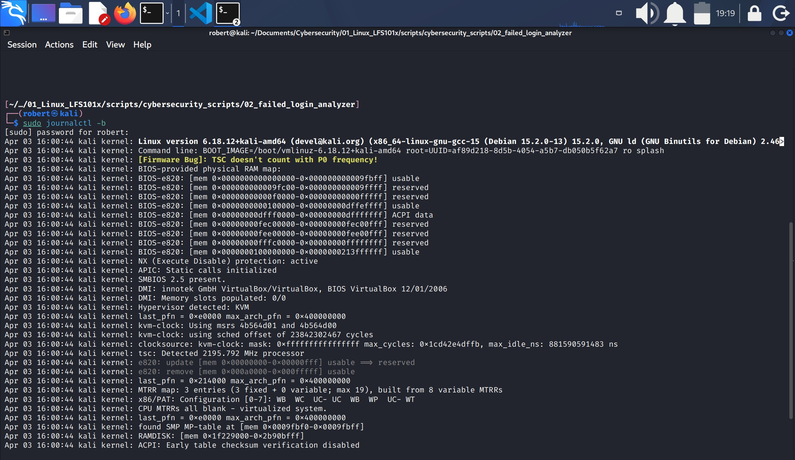
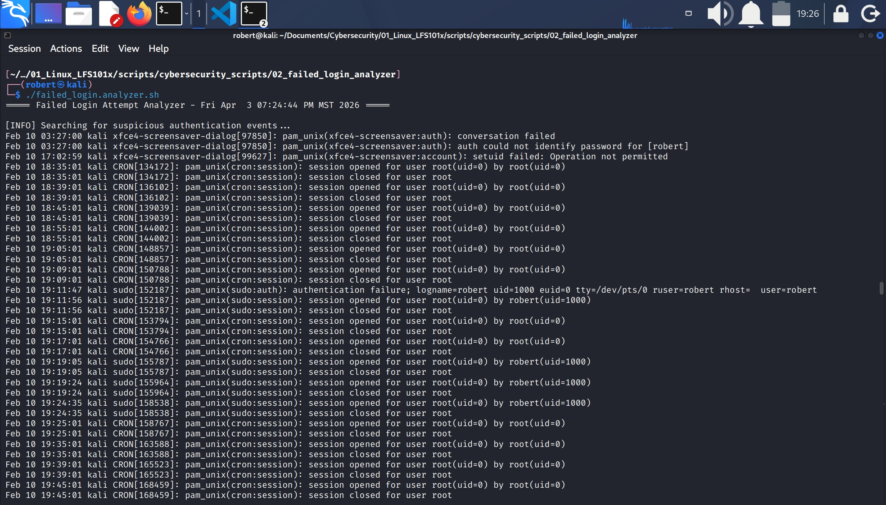
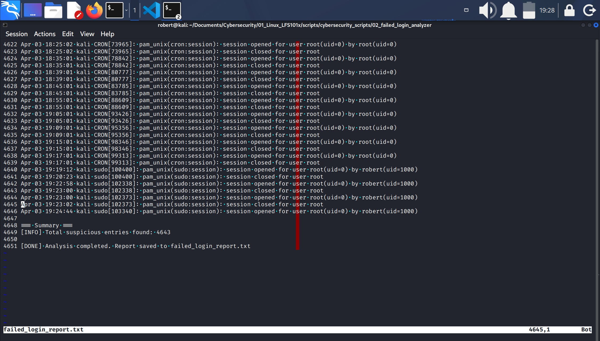

## FAILED LOGIN ATTEMPT ANALYZER (JOURNALD VERSION)

Purpose and environment:
1. This script analyzes failed authentication attempts using **systemd-journald**.
    1. **systemd-journald** is the central log brain in modern Linux distributions.
    2. **systemd-journald** is a **service** that:
        * collects
        * organizes
        * stores
        * indexes 
        * and allows querying for all system events, 
    
    * including:
        * authentication failures
        * login attempts
        * service errors
        * network activity
        * kernel messages
        * sudo events
        * SSH events
        * etc.
    3. **journald** replaces the traditional logging system that used files like **/var/log/auth.log**
    4. **/var/log/auth.log**, **/var/log/syslog** and **/var/log/messages** used to depend on **rsyslog**, an older system which is not available in modern distros anymore.
    5. Modern distros now use **journald** because is:
        * faster
        * more secure
        * doesn't depend on text files
        * allows advanced searches, and
        * saves additional metadata
    6. **journald** saves the logs in binary files in **/var/log/journal/**
        * That is why you cannot open them using `cat`, `nano` or `grep` in a direct way.
2. This script reads logs directly from **journalctl**.
    * **journalctl** is the official tool to read logs saved by system-journald.
    * Is the system log viewer, searcher and filter.
    * There are many options and arguments you can use depending on what you want to do.
    * For example:
        * `sudo journalctl` to see all system logs
        * `sudo journalctl -b` to see all events since current boot.
        * `sudo journalctl -u ssh` to see all logs for a specific service, in this case **ssh**.
        * `sudo journalctl -t sudo` to see all the logs for a specific program, in this case **sudo**.
        * `| grep -Ei` to filter using key words, for example `sudo journalctl | grep -Ei "failed|invalid|password"`.

#### sudo journalctl -b

3. Output is saved to **failed_login_report.txt**.

### 1.- Create project structure
1. Create project directory
2. Create suspicious patterns file: **suspicious_patterns.txt**.
    1. **suspicious_patterns.txt** is created by the system administrator or the security analyst.
    2. Its content and creation relies on the professional in charge of the system knowledge and expertise.
    3. That is because every environment has different services, configurations, traits and log messages.
    4. For example:
        * In SSH servers exposed to Internet, `Failed password` and `Invalid user` are interesting patterns.
        * In a web server, you may be interested in patterns like `403`, `SQL injection`, and `unauthorized`.
        * In a database server you would look for `authentication failed` and `connection refused`.
    5. You create the file **suspicious_patterns.txt** with the content you are pointing to analyze.
    6. In this case, the file contains patterns related to failed authentication events, therefore...

3. Add the following content to **suspicious_patterns.txt**
    * Failed password
    * Invalid user
    * authentication failure
    * pam_unix
    * incorrect password

### 2.- Create the script
Create the file **failed_login_analyzer.sh**
1. Use the "shebang: **#!/usr/bin/env bash** instead of #!/bin/bash. Here are the reasons:
    * **#!/bin/bash**:
        * Works but is more rigid.
        * You are directing the script to execute using bash which is exactly in /bin/bash.
        * That works in Kali, Ubuntu, Debian, Fedora, but it doesn't work in systems where bash is in some other place, minimalist environments, containers, BSD systems, macOS.
        * In other words **/bin/bash** doesn't always exists.
    * **#!/usr/bin/env bash**:
        * You are telling the system: "search the correct bash location on system and use it"
        * `env` job is to search for bash in /bin/bash, /usr/bin/bash, /usr/local/bin/bash, any other route defined by **$PATH**.
        * In this way, the script is more portable, professional, compatible with different distros

2. Declare variables.
    1. PATTERNS_FILE="suspicious_patterns.txt" where PATTERNS_FILE is the variable for suspicious_patterns.txt file.
    2. REPORT_FILE="failed_login_report.txt" where REPORT_FILE is the variable for failed_login_report.txt.

3. Check patterns file
    1. Use conditional test `if [[ ! -f "$PATTERNS_FILE" ]]; then` to check if file related to "$PATTERNS_FILE" variable does not (`! -f`) exists.
    2. If conditional variable is **TRUE**(file does not exist), then...
    3. `echo "[ERROR] Patterns file '$PATTERNS_FILE' not found."`
    4. `exit 1` exit with code one (error).
    5. `fi` closes conditional test.

4. Header
    1. Establish a header for the program and the user.
    2. `echo "===== Failed Login Attempt Analyzer - $(date) =====" | tee "$REPORT_FILE"`
        * `echo` will print the header.
        * `$(date)` will print the date.
        * `| tee "$REPORT_FILE"` will add the output of `echo` to file related to "$REPORT_FILE" variable.
    3. `echo "" | tee -a "$REPORT_FILE"`
        * `echo ""`: is to print a blank line, is the equivalent to pressing `Enter` key. It is used to separate report sections.
        * `tee -a` will add a blank line to file related to "$REPORT_FILE". (You will see a blank line in standard output/screen and in the file).

5. Build grep pattern from patterns file
    1. Here you instruct the script to take the multiple lines in the patterns file which is **suspicious_patterns.txt** to convert them into a single line string using `|` as delimiter and save the output to GREP_PATTERN variable.

    2. Declare variable: GREP_PATTERN=$(paste -sd '|' "$PATTERNS_FILE")
        * As you may know this far `$(...)` is to expand a command and save its output into a variable, in this case GREP_PATTERN.
        * `paste` is a command that merges lines.
        * `-s` transform multiple lines into a single line.
        * `-d '|'` indicates to use `|` as delimiter.
    3. The `paste` command takes all lines in "$PATTERNS_FILE" which is related to suspicious_patterns.txt file and merges thenm into a single string. Every line will be separated by a `|`.

    Then the script will...

    4. `echo "[INFO] Searching for suspicious authentication events..." | tee -a "$REPORT_FILE"` print echo on screen and append to "$REPORT_FILE".
    5. `echo "" >> "$REPORT_FILE"` print a blank line on screen and append to "$REPORT_FILE".
    6. `echo "=== Matching log entries ===" >> "$REPORT_FILE"` print echo on screen and append to "$REPORT_FILE".

6. Query journald and filter

    1. `sudo journalctl --no-pager | grep -Ei "$GREP_PATTERN" | tee -a "$REPORT_FILE"` will:
        * Run `sudo journalctl --no-pager` to retrieve all logs from **systemd-journald**.
            * `--no-pager` option is to get all system logs in a continuous way (no pagination).
        * Pipe (`|`) the output into `grep -Ei "$GREP_PATTERN"` to filter only the lines that match any of the suspicious patterns defined in **"$GREP_PATTERN"**.
            * This step compares the log entries from **journald** against the combined regular expression built from `suspicious_patterns.txt`.

        * Pipe the filtered results into `tee -a "$REPORT_FILE"` so the output is:
            * displayed on screen, and  
            * appended to the report file without overwriting previous content.

7. Summary
    1. `echo "" | tee -a "$REPORT_FILE"`
    2. `echo "=== Summary ===" | tee -a "$REPORT_FILE"`
    3. `MATCH_COUNT=$(sudo journalctl --no-pager | grep -Ei "$GREP_PATTERN" | wc -l)`
        1. Declare variable MATCH_COUNT
            * Match the lines contained in **systemd-journald** and in **"$GREP_PATTERN** and count them (with `| wc -l`)
            * Counted lines will be saved in MATCH_COUNT.

    4. `echo "[INFO] Total suspicious entries found: $MATCH_COUNT" | tee -a "$REPORT_FILE"`
        1. Displays the counted lines on screen and,
        2. Appends them in "$REPORT_FILE".

    5. `echo "" | tee -a "$REPORT_FILE"`
        1. Displays a blank line and,
        2. Appends the blank line to "$REPORT_FILE".
    6. `echo "[DONE] Analysis completed. Report saved to $REPORT_FILE" | tee -a "$REPORT_FILE"`
        1. `echo` a message indicating report was saved to "$REPORT_FILE".
        2. Appends `echo` to "$REPORT_FILE".

8. **Script ends here.**

### 3.- Make failed_login_analyzer.sh executable
1. `chmod +x failed_login_analyzer.sh`

### 4.- Execute the script
1. `./failed_login.analyzer.sh`
2. Script will create file **failed_login_report.txt**
3. Check the report with `cat`, `head`, `tail` or use any text editor to open it.

#### ./failed_login.analyzer.sh

**Remember:**
1. Script will show matches found in **journald logs** that match the patterns: **Failed password, Invalid user, authentication failure, pam_unix** and **incorrect password** contained in **suspicious_patterns.txt file.
2. Script will count the lines and add that to the report with `wc -l`.

#### failed_login_report.txt

### 5.- Generate failed events
1. Generate new failed events to see them the next time you run the script.
2. For example:
    1. **SSH Invalid user**: `ssh wronguser@localhost` and type any password when prompted.
    2. **SSH valid user, wrong password**: `robert@localhost` and type a wrong password.
    3. **sudo with wrong password**: `sudo ls` and type a wrong password.
    4. **su with an inexistent user**: `sudo su - notexistinguser`
    5. **Failed login on TTY**: open a TTY and enter an invalid user and password.
    6. **passwd with a wrong password**: `passwd robert` and type a wrong password.

### 6.- Manually verify events on journald
1. As mentioned before, all logs are managed by **systemd-journald** and are not saved into a specific text file.
2. Therefore you can type `sudo journalctl | grep -Ei "failed|invalid|auth|password"` to manually verify the failed events recently made.

---
End of project **two**.
