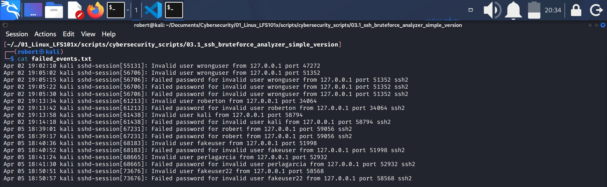
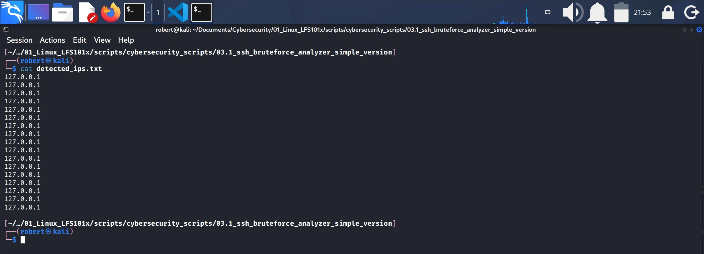
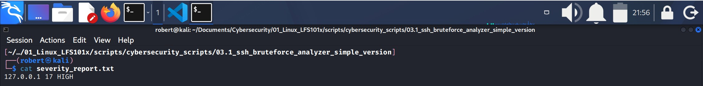
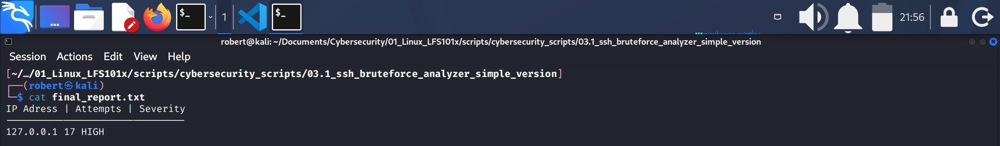

## BRUTE FORCE ANALYZER FOR SSH (simple version)

### 1.- Script purpose
1. This script analyzes failed authentication attempts for SSH.
2. Extracts IPs, users and ***severity***.
3. Creates a final report.
4. This is a simple version, therefore it won't:
    * be modular (won't use functions)
    * manage errors
    * validate entries
    * contain timestamps
    * detect advanced patterns

### 2.- Create a directory for the project

`/03.1_ssh_bruteforce_analyzer_simple_version`

### 3.- Create the script

1. Check permissions
    1. `if [[ $EUID -ne 0 ]] ; then`:
        * `$EUID`: is bash variable for the user running the script.
        * `-ne`: "not equal" option.
        * `0`: is the UID for root.
            * Therefore this conditional test means "if user is not equal to 0 (root)" then ..
            * If conditional test is **TRUE**: user is not root or does not have **sudo** privileges it will `then`...
    2. `echo`: "This script requires sudo privileges."
    3. `exit 1`
    4. `fi` close conditional test.

If conditional test is **FALSE** (user has sudo privileges) it will proceed with `echo` message: "OK: running with root privileges."

2. Obtain logs (Kali-compatible)
    1. `sudo journalctl -u ssh > ssh_logs.txt`
        * `journalctl` has two ways to filter: by **tag** (`-t`) and by **systemd unit** (`-u`).
        * In Kali we use `-u` because **OpenSSH** does not use **tag** `-t -ssh` in journald.
        * `journalctl` result will pass to new file **ssh_logs.txt**.

3. Filter events
    1. `grep -E "Failed password|Invalid user|maximum authentication attempts exceeded" ssh_logs.txt > failed_events.txt`
        * `grep` will look for the indicated patterns within `""` in file **ssh_logs.txt** and will pass them to new file **failed_events.txt**.
        * Those patterns are considered **Relevant SSH events**.
#### failed_events.txt

4. Extract IPs
    1. `awk '{for(i=1;i<=NF;i++) if ($i=="from") print $(i+1)}' failed_events.txt > detected_ips.txt`
        * This line scans each word of every log entry in **failed_events.txt**, finds the word from, and prints the word immediately after it (the IP address). The extracted IPs are saved into **detected_ips.txt.** 
       
        1. `awk ' ... ' failed_events.txt` means:
            1. use `awk`.
                * `awk` is a text processing tool that analyzes line by line in a text, and understands columns automatically.
                * Every word or field in a line is assigned with a value: `$1` for field one, `$2` for field two, etc.
                * `NF` is the number of fields in the line.
                * `$0` is the complete line.
            2. Execute code in `' ... '`
            3. Apply the code to **failed_events.txt**.
        2. `for(i=1;i<=NF;i++)` is a **for** loop within `awk`.
            1. `i=1`: start on the first word of the line.
                * `i`: is optional, you can use any other word but is the most common way to name a counter. In mathematics it represents an **iteration index**.
                * By writing `i=1` we are creating and initializing the variable `i` which we will later reference as `$i`.
            2. `i<=NF`: continue while `i` is less than or equal to NF. Number of Fields (number of fields in the line).
            3. `i++`: increase `i` one by one. Advance word by word.
                * In other words: read every word of the line one by one.
            4. `;` is a delimiter, is part of the `for` loop  format.
                * This loop in particular has 3 sections delimited by `;`:
                    1. Initialization: `i=1`, is where the counter starts.
                    2. Condition: `i<=NF`, continue with loop execution meanwhile `i` is less or equal to NF.
                    3. Increment: `i++`, after each loop execution, increment `i` by 1.
        3. `if ($i=="from")` means:
            1. If the actual word (variable`$i`) is exactly the word `from`...
        4. `print $(i+1)` print the next word.
        5. `> detected_ips.txt` redirect the output to file **detected_ips.txt**.
    2. Is important to note that `awk` is running a loop and we can identify 2 sections to understand it better:
        1. `for(i=1; i<=NF; i++)`: is the loop header, and
        2. `if ($i=="from") print $(i+1)` is the loop action.
    3. The importance of the word **from**:
        1. In SSH logs, the client IP address always appears immediately after the keyword `from`, which makes it a reliable anchor for extraction.

#### detected_ips.txt

5. Count attempts
    1. `sort detected_ips.txt | uniq -c > ip_attempts.txt`
        * This line transforms list of IPs into a real attempt counter for each unique IP. This step is essential for calculating severity in the next section.

        1. `sort` sorts all extracted IPs alphabetically on file **detected_ips.txt**.
        2. Sorting is required because `uniq` only detects consecutive duplicates.
        3. `uniq -c`:
            * `uniq`: detects and removes consecutive duplicate lines.
            * `-c`: is an option that prefixes each unique line with the number of occurrences. The result is a list where each line contains:
                * <count><IP>
        4. `> ip_attempts.txt` redirects the output into the file **ip_attempts.txt**
            * **ip_attempts.txt** is fundamental because it contains number of failed attempts per IP, it is the input for the "Calculate severity" step, it reveals which IPs generated the most failed login attempts.

#### ip_attempts.txt
[ipattempts](21.3_ipattempts.jpg)

6. Extract users
    1. `awk '{for(i=1;i<=NF;i++) if($i=="for") print $(i+1)}' failed_events.txt > detected_users.txt`
    * This line scans each word of every log entry in **failed_events.txt**, finds the word **for**, and prints the word immediately after it (the user). The extracted users are saved into **detected_users.txt.**
    * It is practically the same line as in extracting IPs in step 4.
    * **Note** the differences, in this line:
        1. We replace the word from with the word **for**.
        2. We redirect the output to **detected_users.txt**

7. Calculate severity
    1. `awk '{if($1<=3)sev="LOW"; else if($1<=10)sev="MEDIUM"; else sev="HIGH"; print $2, $1, sev}' ip_attempts.txt > severity_report.txt`
    * This line will define the level of severity based on the number of failed login attempts for each IP.
        1. `awk ' ... ' ip_attempts.txt` will read each line of the file, each line has the structure: <count><IP>
            * On each line:
                1. `$1`: count (number of failed attempts).
                2. `$2`: IP
        
        2. Severity conditions:
            1. `if($1<=3) sev="LOW";`
            2. `else if($1<=10) sev="MEDIUM";`
            3. `else sev="HIGH";`
        
        3. `print $2, $1, sev` to print IP, COUNT, SEVERITY
        4. `> severity_report.txt` redirects the output to file **severity_report.txt**.
    
    2. This time `awk` is not applying a loop like in steps 4 and 6, this time is only applying conditional tests and assigning a severity label (LOW, MEDIUM, HIGH)
   
    * **IMPORTANT**: We use `awk` in this step because we need to read each line of `ip_attempts.txt` and access its columns (`$1` for the count and `$2` for the IP). Bash alone cannot automatically split lines into fields or reference them as `$1`, `$2`, etc. `awk` is the right tool because it understands text in columns and allows us to apply conditional logic based on those fields.

#### severity_report.txt

8. Generate report
    * Here is where the file **final_report.txt** is generated
    1. `echo "IP Address | Attempts | Severity" > final_report.txt`
        * Writes the first line and redirects it to **final_report.txt**
    2. `echo "-------------------------------" >> final_report.txt`
        * Appends the a line with `--------------` to **final_report.txt**
    3. `cat severity_report.txt >> final_report.txt`
        * Appends the content of **severity_report.txt** to the file **final_report.txt**
    4. `echo "Final report generated: final_report.txt"`
        * Prints on screen a final message indicating the creation of a final report.

#### final_report.txt

---
- End of script.

### 4.- Make the script executable

`chmod +x ssh_bruteforce_analyzer_simple_version.sh`

### 5.- Run it with sudo

### 6.- Check the generated files

---
- End of project **three**.

