## SSH BRUTE FORCE ANALYZER (PRO VERSION)
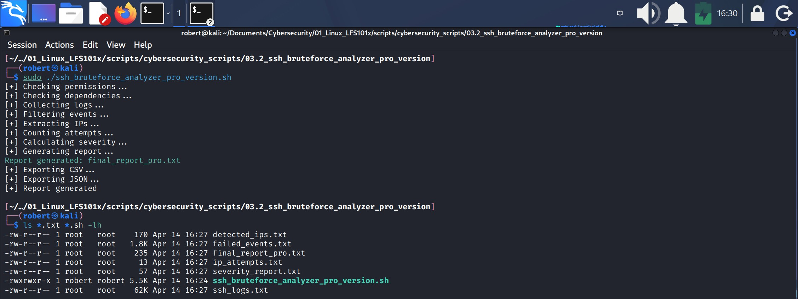

1. This pro version of a SSH brute force analyzer constitutes the tool used by SOC analysts, sysadmins and pentesters.
2. Simple vs PRO Version - Feature Comparison:

| Aspect | Simple Version | PRO Version |
|--------|----------------|-------------|
| **Execution** | Single fixed command | Flexible CLI flags (`--logfile`, `--output`, `--csv`, `--json`, `--geo`) |
| **Architecture** | Linear script | Fully modular (functions for each stage) |
| **Error Handling** | None | Validates permissions, dependencies, files, and arguments |
| **Log Source** | Only `journalctl -u ssh` | Journalctl or any log file (`--logfile`) |
| **Output Format** | Plain text only | Text, CSV, JSON |
| **Geolocation** | Not available | Optional IP geolocation (`--geo`) |
| **Portability** | Works mainly on Kali/systemd | Works on any Linux distribution |
| **Severity Logic** | Basic thresholds | Advanced logic + country info |
| **Pattern Detection** | Only counts attempts | Detects suspicious patterns and multi‑IP behavior |
| **User Control** | None | Full control through flags and parameters |
| **Terminal Output** | No colors | Color‑coded severity (LOW/MEDIUM/HIGH) |
| **Use Case** | Educational script | Professional‑grade analysis tool |

### 1. Create project directory

* **03.2_ssh_bruteforce_analyzer_pro_version**
---
### 2. Create script

`vim ssh_bruteforce_analyzer_pro_version.sh`

* Script Header

#!/bin/bash\
############################################\
\# SSH BRUTE FORCE ANALYZER (PRO VERSION)\
\# Author: Roberto Orozco (2026)\
############################################

* For this projct `#!/bin/bash` is used instead of `#!/usr/bin/env bash` because:
    1. In modern distros **bash** is always on /bin/bash.
    2. **/usr/bin/env bash** is used for portable purposes, like when the script is going to be ran in macOS, BSD, NixOS, or in minimalist containers.
    3. It is faster, it doen't use $PATH to find bash
    
  

#### 1.- COLORS
Define colors for variables RED, YELLOW, GREEN and BLUE
1. `RED="\e[31m"`
    1. `RED`: is the name of the variable
    2. `\e`: is an escape sequence that represents character ESC.
        * It means: start a new ANSI sequence
    3. `[31m`: is ANSI code for color **red**
2. Same logic applies for the other colors.
3. `\e[0m` is code to return to normal color, we use this code for variable **RESET**.

#### 2.- DEFAULT VALUES
Declare defult variables:

1. `LOGFILE=""`

    1. This variable starts empty on purpose.
    
    2. In Bash scripting, an empty variable is often used as a placeholder. 
       * It means: “This variable exists, but the script will decide later whether to assign it a value.”

    3. In this script, `LOGFILE` will only receive a value if the user 
       provides one through the argument:
       
           --logfile <path_to_log>

       Example:
           
           --logfile /var/log/auth.log

    4. If the user DOES provide a log file, the script assigns that value to `LOGFILE` and later executes:

           cp "$LOGFILE" ssh_logs.txt

       * This copies the user‑specified log file and prepares it for analysis.

    5. If the user does NOT provide `--logfile`, then `LOGFILE` remains empty.The script detects this and automatically falls back to:

           
           journalctl -u ssh > ssh_logs.txt

       This means the script collects SSH logs directly from the system.

2. `OUTPUT="final_report_pro.txt"`
    1. It is the variable for file **final_report_pro.txt** which is where the final result will be saved.
    2. This variable can change if the user passes an specific and different file as an argument (`--output`) for exmple: `--output <personalized_report.txt>`.

3. `CSV_OUTPUT=""`
    1. This empty variable means that it won't export **CSV** by default.
    2. This variable can change if the user passes an specific file to save export data as an argument (`--csv`), for example: `--csv results.csv`.
        * In that case, the script will generate: `IP,Attempts,Severity,Country` in **results.csv**...

4. `JSON_OUTPUT=""`
    1. Is the same situation than `CSV_OUTPUT=""`.
    2. This variable can change if the user passes an specific file to save export data as an argument (`--json`), for example: `--json results.csv`.
        * In that case, the script will generate JSON like:
        
        `[

        {"ip":"127.0.0.1","attempts":"severity":"HIGH","country":"-"}
        
        ]`

#### script functionality when --csv and --json are passed as arguments
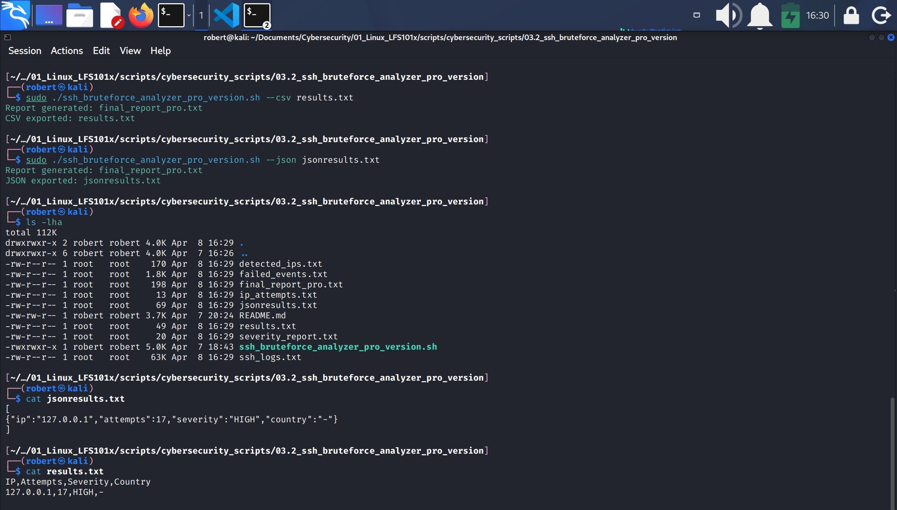

4. `ENABLE_GEO=false`
    1. It means that IPs gelocation is disabled by default
        * That is because:
            * it requires internet conection (I'm using a HotSpot for most of my studies).
            * makes calls to ipinfo.io.
            * Can slow the analysis.
            * Is not always necessary.
    2. Like in the other variables, this one can change if the user passes an argument (`--geo`).
        * Then the variable will change to `ENABLE_GEO=true` and the script will execute: 
        `curl -s "https://ipinfo.io/$ip/country"`

#### script functionality when --geo is passed as an argument

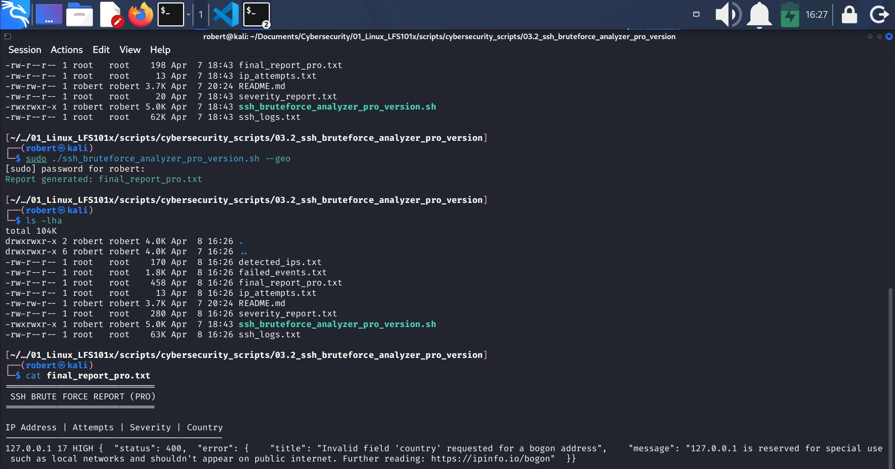

* **IMPORTANT**: The default values define the basic script behavior when the user DOES NOT passes arguments, allowing it to work automatically, but also in a flexible way when using flags like: `--logfile`, `--csv`, `--json` or `--geo`. 

    

#### 3.- HELP MENU
This section defines a function called `show_help()`. Its purpose is to display the user a help menu when `--help` is executed, or when the user provides invalid arguments.

#### --help function
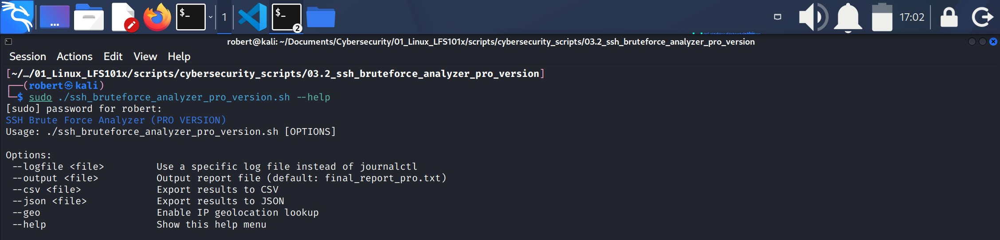

1. `show_help() {` is where the function starts
2. Everything within `{ ... }` will execute when the user calls this function (with `--help`).
3. `echo -e "${BLUE}SSH Brute Force Analyzer (PRO VERSION)${RESET}"` is the first action of the function, and it will:
    1. `echo -e`: allows `echo` to interpret special characters like line breaks (`\n`), tabs (`\t`) and colors in ANSI code (in this case `\e[34m` for color blue).
    2. `${BLUE}`: applies blue color to text.
    3. `${RESET}`: returns to normal color.
        * This line shows the title of the program applying a blue color to the output (terminal).
        * `${ ... }`: is to expand a variable.
        * `$( ... )`: is to execute a command and save the result in a variable.
        * Space between ${BLUE} and the title is optional.
4. `echo "Usage: $0 [OPTIONS]"`
    1. Prints the name of the script (`$0`) followed by "[OPTIONS]"
5. `echo ""`: prints a blanck line
6. `echo "Options"`: prints "Options"
7. `echo " --logfile <file> .... Use a specific log file instead of journalctl"`: prints the `--logfile <file>` usage description.
8. Same for the rest of the arguments, including `--help`.
9. `exit 0`: exits the function, stops the script.
    * `0`: is for successful exit.

#### 4.- PARSE ARGUMENTS
The script will read and process the arguments passed by the user.
1. `while [[ $# -gt 0 ]]; do`
    1. This is a `while` loop, which means: while arguments are left to process, keep reading.
        * `while`: the execution of the loop starts.
        * `[[ ... ]]`: a conditional test, if the result is **TRUE** the script will `do` the following action or actions.
        * `#`: number of arguments left.
        * `-gt 0`: greater than 0.
2. The "following action" mentioned before is the execution of `case`. Inside the loop it uses:
    1. `case $1 in`.
        * `$1` represents the first pending argument to analyze.
    2. When `$1` matches one of the options, for example `--logfile)` the script takes the next value (`$2`), which is the value that follows `--logfile`, and stores it in the variable `LOGFILE`.
        * The variable that was empty at the beginning of the script is updated to `LOGFILE=$2`
        * `LOGFILE=$2` could be something like this:

        `./script.sh --logfile /var/logs.txt`
        
        * `--logfile` is an option and is `$1`.
        * `/var/logs.txt` is the log file and is `$2`.
    3. After that, it executes `shift 2`: this removes the two arguments that were just processed ($1 and $2) and shifts the remaining arguments forward.
    4. The process repeats for each option: --output, --csv, --json, --geo, --help.
    5. If the argument does not match any valid option: 
        * `*)`: the script displays an error message in red and exits:
            * `echo -e "${RED}Unknown option: $1${RESET}"`
            * `exit 1`
            * `;;` (closes the `case` block)
            * `esac`
            * `done` 
    

#### 5.- CHECK PERMISSIONS
`sudo` privileges are required to run this script, we will ensure the program checks for this condition with the function `check_permissions()`:
1. `check_permissions ()` is the definition of the function.
2. `if [[ $EUID -ne 0 ]]; then` is the conditional test inside the function.
    1. `$EUID` is the effective user ID. It equals 0 when the user has root privileges.
    2. `-ne`: not equal to
    3. `0`: is the UID for users with root privileges
        * If the conditional test is **TRUE** (the user does not have root privileges), `; then` it wil take the following action, which is:
    4. `echo` prints the message in `${RED}` color: "This script requires sudo/root privileges."
    5. `exit 1` exits the program with error code 1.
    6. `fi` closes conditional test
3. `}`: to close the function.

#### 6.- CHECK DEPENDENCIES
This section is to verify that all necessary tools required for the script to run are installed in the system. We do that with a function named `check_dependencies()`.
* Check dependencies means "verify that a program is installed"

1. `check_dependencies() {`: to define and start the function.
    * It will be executed later from `main()`.
2. Inside the function there is a **for** loop:

    1. `for cmd in awk grep sort uniq curl; do` ...

        * This line defines a list of commands that the script needs: awk, grep, sort, uniq and curl.
            * The loop will check them all one by one.
            * `cmd` will be the name for those commands in every iteration.
    
    2. `if ! command -v $cmd >/dev/null; then`
        * This line verifies the command exists in the system, if it doesn't (`!`) the `then` block will be executed.
            * `command -v`: is an internal bash tool used to verify if a command exists and if it is available in the $PATH.
            * For example:
                * `command -v awk`: will verify if `awk` is installed.
                * If installed, the output will be something like `/usr/bin/awk`.
                * If not installed the output is empty.
            * `$cmd` takes the values in the previous **for** list.
            * `!`: negates the result of `command -v $cmd`.
        * Therefore, this line means if the commands called with `command -v $cmd` **DON'T** (`!`) exist:
            * `>/dev/null` don't print results, and
            * Execute the `then` block:
    3. `echo -e "${RED}ERROR: Missing dependency: $cmd${RESET}`
    4. `exit 1`: if any dependency (tool, program) is missing, the script stops.
        * This is important because it prevents the script from stopping unexpectedly later on.
    5. `fi`: end of conditional test.
    6. `done`: end of loop.
    7. `}` end of function.

#### 7.- COLLECT LOGS
In this step the script collects and analyzes the SSH logs. Depending on wether the user specified a file with `--logs`, the script takes one of this two paths:
1. Use the file provided by the user.
2. Use `journalctl` to obtain the SSH service logs.

---
1. `collect_logs () {` defines the function.
2. `if [[ -n "$LOGFILE" ]]; then` is the first conditional test.
    1. `-n`: means "not empty".
    2. If the user provided a file through `--logfile`, then the variable will not be empty and this condition will be true.
3. `if [[ ! -f "$LOGFILE" ]]; then` is the second conditional test.
    1. `-f`: verifies the file exists.
    2. `!`: negates the condition.
    3. This condition means: "If the file does not exist".
4. `then`
5. `echo -e "${RED}ERROR: Log file not found: $LOGFILE${RESET}"`
    * The script displays a message in red and stops.
6. `exit 1`: exits with error code 1.
7. `fi`: closes conditional test 2.
8. `cp "$LOGFILE" ssh_logs.txt`
    1. If the file exists, the script copies the file provided by the user to a local file named **ssh_logs.txt**.
        * This is the file the script will analyze later.
9. `else` is executed if the user didn't provide a log file with `--logfile` (in this scenario LOGFILE is empty).
10. `journalctl -u ssh > ssh_logs.txt`
    * `journalctl -u ssh`: obtains the SSH logs from `systemd`.
    * `> ssh_logs.txt`: redirects the exit to file **ssh_logs.txt**.
11. `fi`: closes conditional test 1.
12. `}`: closes `collect_logs () {` function.

#### ssh_logs.txt
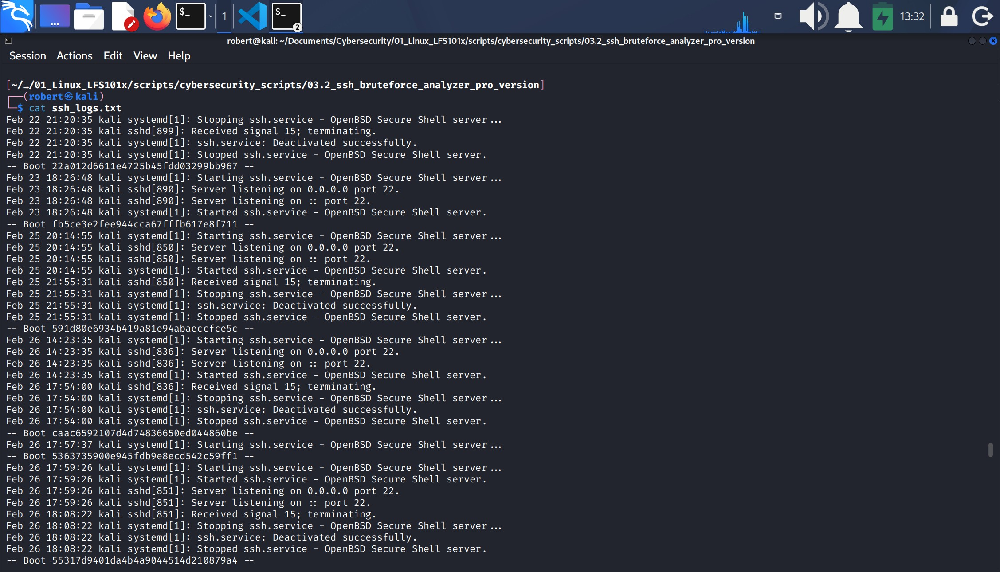

#### 8.- FILTER EVENTS
In this section, the script filters the **relevant events** in **ssh_logs.txt**.

The purpose of th function is to keep only the lines that indicate failed SSH authentication attempts.

1. `filter_events() {`: defines the function.
2. `grep -E "Failed password|Invalid user|maximum authentication attempts exceeded" ssh_logs.txt > failed_events.txt`
    * `grep`: searches text in **ssh_logs.txt**.
    * `-E`: activates **extended regular expressions**, which allows the use of the operator `|` (OR).
    * What is inside the `""` is what `grep` will search in the file.
        * That string contains typical signs of brute-force attacks, automated bots, and unauthorized access attempts.
    * `> failed_events.txt`: redirects the output to this file.

#### failed_events.txt
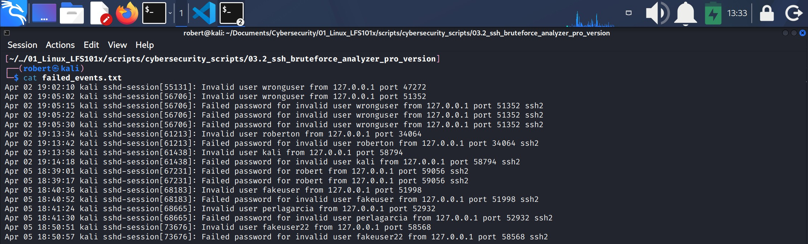

#### 9.- EXTRACT IPS
In this section, the script extracts the IP addresses filtered into the **failed_events.txt** file and writes the output to the **detected_ips.txt** file.

Again, this is done with a function.

1. `extract_ips () {`: defines the function.
2. `awk '{for(i=1;i<=NF;i++) if ($i=="from") print $(i+1)}' failed_events.txt > detected_ips.txt`
    * This line does all the work.

    1. `awk`: is a tool to process text based on columns.
        * Reads every line in **failed_events.txt**.
        * Checks each.
        * Searches for the word **from**.
        * When **from** is found, the script prints the next word which is normally the attacker **IP**.
    2. Inside the `{}` there is a **for** loop. This is the only loop in the whole line.
        * `for(i=1;i<=NF;i++)` is the loop, where:
            * `for`: starts the loop.
            * `i`: is the counter. Any character can be used to declare the counter, but `i` is the most used.
            * `i=1`: means "start the counter in the first word `1`."
                * In `awk` the words in a line are numbered like this: $1, $2, $3, $4 ...
            * `i<=NF`: means "keep reading until the end of the line." `NF` means "number of fields".
            * `i++`: means increment (go to next word/field).
        * **REMEMBER**: the **for** loop order is: `for (<initialization>; <condition>; <increment>)`
            * In this case:
                1. `i=1`: initialization.
                2. `i<=NF`: condition.
                3. `i++`: increment.

    3. `if ($i=="from")`
        * When `$i` is the word **from** ...
    4. `print $(i+1)`
        * Prints the next word / field `(i+1)` which is the IP address in the file **failed_events.txt**.
    5. `failed_events.txt`: is where `awk` will do its job.
    6. `> detected_ips.txt` passes the output to the file **detected_ips.txt**.

#### detected_ips.txt
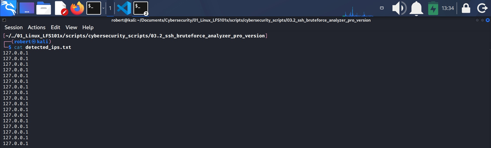

#### 10. COUNT ATTEMPTS
In this section the script counts how many times each IP appears in the file **detected_ips.txt**

Again, this is done with a function.

1. `count_attempts () {`: defines the function.
2. `sort detected_ips.txt | uniq -c > ip_attempts.txt` is the main instruction. Is the line that performs all the work.
3. This process is divided in two stages:
    1. `sort detected_ips.txt`: sorts IPs alphabetically.
        * Sorting is required because `uniq` only detects consecutive duplicates.
        * If you don't sort first, `uniq` won't work properly.
    2. `uniq -c`:
        * `uniq`: eliminates consecutive duplicate lines.
        * `-c`: adds a counter at the beginning of each line.
            * `> ip_attempts.txt`: redirects the result to the file **ip_attempts.txt**

#### ipattempts.txt
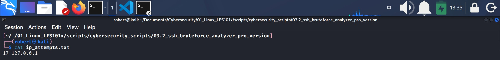

#### 11.- GEOLOOKUP
In this section the script retrieves the country associated with each IP using the public service `ipinfo.io`.

It only performs this query if the `--geo` option is enabled.

Again, this is done with a function.

1. `geolocat_ip () {`: defines the function.
2. `local ip="$1"`: the function receives **one** parameter (an IP). This parameter is stored in a local variable named `ip`.
    1. `local` means that this variable exists only in this function.
        * The variable `ip` lives only inside this function.
        * It does not affect variables with the same name outside the function.
        * When the function ends, the variable disappears.
            * This is to prevent errors, conflicts and accidental overwriting.
    2. `ip="$1"`: stores the first argument passed to the function in the `ip`.
        * For example:
            * `<geolocate_ip> <185.22.33.44>`
            * Results in `ip="185.22.33.44"`
3. `if [[ "$ENABLE_GEO" = true ]]; then`: checks whether geolocation is enabled.
    1. `ENABLE_GEO`: is a global variable in the script.
    2. It is activated only when the user types the option `--geo`.
    3. If the user enabled geolocation the script proceeds with:
4. `curl -s "https://ipinfo.io/$ip/country" | tr -d '\n'`
    1. `curl -s`:
        * `curl` performs an HTTP request.
        * `-s`: puts `curl` in silent mode: progress bars and messages are omitted.
        * `"https://ipinfo.io/$ip/country"` queries the endpoint (/country) of `ipinfo.io`.
        * That endpoint returns only the country code; for example: US, MX, RU, CN, BR, etc.
    2. `| tr -d '\n'`:
        * `tr`: 
            * Removes the final newline character. 
            * This allows the country to be printed on the same line as other data.
5. `else`: if geolocation is not enabled:
    1. `echo "-"`
        * If the user did not enable `--geo`, the function returns only `-`.
6. `fi`: end of the conditional test.
7. `}`: end of the function.

* **IMPORTANT**: this function:
    1. Does not search for IPs.
    2. Does not process files or logs.
    3. Only takes a single IP and returns a country.
    4. In a later section of this script, the file **detected_ips.txt** will be processed each IP will be geolocated.

#### 12.- CALCULATE SEVERITY
This is one of the most important sections in the script because it combines: attempts count, severity classification, geolocation and final report creation.

1. `calculate_severity () {`: defines the function that will calculate the severity for each IP and will create the final report.
2. `> severity_report.txt`, this means:
    1. If the file does not exist, create it with no content.
    2. If the file exists, remove all content.
3. `sed -i 's/^ *//' ip_attempts.txt` removes initial spaces that `uniq -c` creates by default in the file **ip_attempts.txt**.
    1. `sed` is a text editor that automatically processes each line, it can: remove, insert, replace and filter. Use `sed` here to remove spaces at the beginning of the lines.
    2. `-i` means that the modifications are applied directly to the file, without creating a new one.

    3. `'` opens the block that contains the editing instruction.

    4. `s` indicates that this is a substitution operation.

    5. `/` marks the beginning of the pattern to be replaced.

    6. `^` means “the beginning of the line.”

    7. A `blank space` followed by `*` means:
        * “zero or more occurrences of a space character.”

    8. The next `/` marks the beginning of the replacement text.

    9. Leaving the replacement (`//`) empty means:
        * “replace with nothing,” i.e., delete the matched spaces.

    10. The final `'` closes the editing instruction.

4. `while read -r count ip; do`
    1. `while`: starts a **while** loop. It will repeat while there are available lines to read.
        * The file where **while** loop will be applied is **ip_attempts.txt**, this is instructed after `done` at the last line of the while loop with `< ip_attempts.txt`, which is an **input redirection** to the while loop.
    2. `read`: takes a line as input and divides it into variables, in this case:
        * `read -r count ip`
            1. The first word of the line goes to variable `count`.
            2. The second word of the line goes to variable `ip`.
    3. `do`: proceed with next instruction.
    4. Conditional test `if (( count <= 3 )); then`
        * This means " if variable `count` is equal or less than 3", `then` ...
        * Create variable `sev` and assign "LOW" as its value: `sev="LOW`
        * `elif` means "else if", it introduces an addtional conditional check after an `if` statement.
            * `elif` introduces an additional conditional test on the same line.
            * `else` does not introduce another conditional test, it simply defines the default action.
        * Therefore if conditional test `if (( count <= 3))` is **FALSE**, `elif` (else if) proced with next conditional test, which in this case is `elif (( count <= 10 )); then`, create variable `sev` and assign "MEDIUM" as its value: `sev="MEDIUM"`.
        * `else` (if none of the previous conditions is **TRUE**), create variable `sev` and assign "HIGH" as its value: `sev="HIGH"`.
        * `fi` closes conditional test.
    5. `country=$(geolocate_ip "$ip")` is a command substitution, and it does two things:
        1. It executes the `geolocate_ip` function defined previously in this script, using the current `"$ip"`.
        2. And saves the output (country) in the variable `country`.
            * `"$ip"` is retrieved from file **ip_attempts.txt** which as mentioned before is called after `done` at the last line of this function.
    6. `echo "$ip $count $sev $country" >> severity_report.txt` retrieves the values for the variables in the current loop and appends the output to the file **severity_report.txt**.
    7. `done < ip_attempts.txt`: ends the loop indicating **ip_attempts.txt** as the input file to process the loop.
    8. `}` closes the function.

#### severity_report.txt

            

#### 13.- GENERATE REPORT
The purpose of this function is to add content to the **$OUTPUT** variable, hence, to the file **final_report_pro.txt** as declared on section 2: DEFAULT VALUES.

The content of the file **severity_report.txt** is the most important to be passed to this variable, this is done with `cat` as we will see later on
1. `generate report () {` defines the function.
2. After the function declaration there are 7 simple `echo` lines that append text to the variable **$OUTPUT**.
3. After those `echo` lines, `cat` will append the **severity_report.txt** content to the variable **$OUTPUT**. 
    * **REMEMBER**: **severity_report.txt** content was created with `echo` in the **while** loop in the previous section.
4. Finally, the message "Report generated: $OUTPUT" is displayed in the terminal in a green color:
    * `echo -e "${GREEN}Report generated" $OUTPUT${RESET}"`
        * Remember that the `-e` option allows `echo` to interpret special characters, in this case the ansi code for color green and then reset to normal.
5. `}`: closes the function.

#### final_report_pro.txt
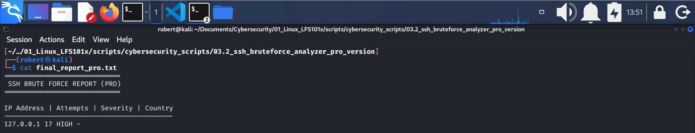

#### 14.- EXPORT CSV
**CSV** (Comm-Separated Values) is a plain-text file format used to store tabular data.

Each line represents a row, and each value inside the row is separated by a comma.

The CVS export function transforms the data contained in the file **severity_report.txt** into a clean, tabular format, this allows the user to: open the results in **Excel** or **Google Sheets**, import them into a **SIEM**, run data analysis, create charts or dashboards, etc.

This section exports the content of the file **severity_report.txt** to the variable **$CSV_OUTPUT**.

1. CSV export is only done if the user specified an output file, for example `--csv output.csv`.
2. `export_csv () {` defines the function.
3. Conditional test:
    1. `if [[ -n "$CSV_OUTPUT" ]]; then`
        * `-n "$CSV_OUTPUT`: if the variable $CSV_OUTPUT is **not empty** (if the user specified a CSV output file).
        * `-n`: not empty.
        * `then`: proceed with default action(s).
    2. `echo "IP,Attempts,Severity,Country" > "$CSV_OUTPUT"`
        * Passes the string to the variable **$CSV_OUTPUT**.
    3. `awk '{print $1","$2","$3","$4}' severity_report.txt >> "$CSV_OUTPUT"`
        * `awk`: processes the file **severity_report.txt** in a way that will print fields 1, 2, 3, and 4 and appends the output to the variable **$CSV_OUTPUT**.
            * This way, the `awk` output line will be placed under the `echo` output line.
    4. `echo -e "${GREEN}CSV exported: $CSV_OUTPUT${RESET}"`
        * Displays on screen the message in green color.
    5. `fi`: ends conditional test.
4. `}`: ends function.

#### csvoutput.csv
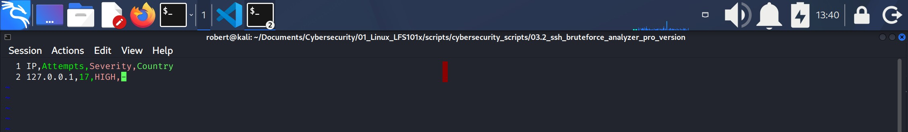

#### 15.- EXPORT JSON
JSON (JavaScript Object Notation) is a structured data format used to represent informatin as **key-value** pairs. It is commonly used in APIs, web applications, data exchange, and lightweight data storage.

The purpose of exporting the file **severity_report.txt** to **JSON** is to allow other programs, tools and services lightweight data storage.

JSON is a standard, universal format understood by: Python, JavaScript, SIEMs, APIs, Dashboards, NoSQL databases, and many other systems.

1. JSON export is only performed if the user specifies an output file, for example `--json output.json`.
2. `export_json () {` defines the function.
3. Conditional test:
    1. `-n "$JSON_OUTPUT"` if the variable **$JSON_OUTPUT** is not empty (if the user specified a JSON output file), `then` proceed with default actions.
    2. `echo "[" > "$JSON_OUTPUT]"`
        * Creates the **json file**.
        * `"["` is the beginning of a JSON **array** (structure)
            * A JSON array is an ordered list of values enclosed in square brackets `[]`.
        *  `>`: creates or overwrites the json file.
        * In other words, this line creates a json file with `[` as the only content, or if the json file  exists, it overwrites the content with `[`.
    3. `awk '{printf "{\"ip\":\"%s\",\"attempts\":%s,\"severity\":\"%s\",\"country\":\"%s\"},\n", $1,$2,$3,$4}' severity_report.txt >> "$JSON_OUTPUT"`
        * This line transforms every line of the file **severity_report.txt** into a JSON **object** and appends it to the json file.
        * `awk`: processess the **severity_report.txt** file into columns ($1 for column 1, $2 for column 2, etc.).
        * `printf`: prints without an automatic newline (the new line is added manually with `\n`)
            * `"`: opens the **JSON template**.
            * `{`: starts the listing of **key-value** pairs
            * `\"ip\":\"%s\",\"attempts\":%s,\"severity\":\"%s\",\"country\":\"%s\"`
                1. This string is a **JSON template** used by `awk` to format each line of the report into a JSON object.
                2. Each `%s` is a placeholder that gets replaced by the corresponding field from the input file.
                    1. `"ip":"%s"`
                        * `"ip"` is the JSON **key**.
                        * `%s` is replaced with the IP address ($1 in `awk`).
                            * The value is wrapped in quotes because it is a **string**.
                        * Example output: `"ip":"8.8.8.8"`.
                    2. `"attempts":%s`
                        * `"attempts"` is the **key**.
                        * `%s` is replaced with the "number of attempts" ($2).
                            * No quotes around `%s` because it is a **numeric value** not a string.
                        * Example: `"attempts":12`
                    3. `"severity":"%s"`
                        * `"severity"` is the **key**.
                        * `"%s"` is replaced with "severity level" ($3).
                        * Wrapped in quotes because it is a string.
                        * Example `"severity":"HIGH"`
                    4. `"country":"%s"`
                        * `"country"` is the **key**.
                        * `"%s"` is replaced with "country name" ($4).
                        * Also a string, so it uses quotes.
                        * Example: `"country":"United_States"`.
                3. The template uses backslashes `\"` because it is inside a double-quoted string in `awk`.
                    * To print a literal double quote, you must escape it with the backslash.            
                4. Commas `,` separate every **key-value** pair.
            * `}`: ends the listing of **key-value** pairs.
            * The `,` after the `}` is used to separate the JSON objects.
            * `\n`: performs a line break for every JSON object.
            * `"`: ends the **JSON TEMPLATE**.
        * Next `,` separates the `printf` string, from the arguments.
            * The structure is: `awk (printf (string),(arguments))`
        * The **arguments $1, $2, $3, and $4** are inserted into the JSON template in order: $1 fills the first **placeholder (%s)**, $2 fills the second (%s), $3 fills the third (%s), and $4 fills the fourth (%s).
    4. `sed -i '$ s/,$//' "$JSON_OUTPUT"`: this instruction is to remove the last comma (`,`) of the **JSON** file created with `awk`.
        * Every JSON object ends with a comma (`},`), but the last object shouldn't end with a comma.
        * That is why `sed` is needed here.
        * `'` starts the search
        * `$` means "the last line in the file"
        * `s` to indicate a substitution.
        * `/` indicates what to substitute.
        * `,` substitute a comma.
        * `$` at the end of the line.
        * `/` indicates what is to be substituted for.
        * `.../` indicates empty space
        * `"$JSON_OUTPUT"` indicates where to apply `sed`.
    5. `echo "]" >> "$JSON_OUTPUT"` is to append `]` to the variable **$JASON_OUPUT**.
    6. `echo -e "${GREEN}JSON exported: $JSON_OUTPUT${RESET}"` displays a message in green color.
4. `fi` closes conditional test.
5. `}` closes the function.

#### jsonoutput.json
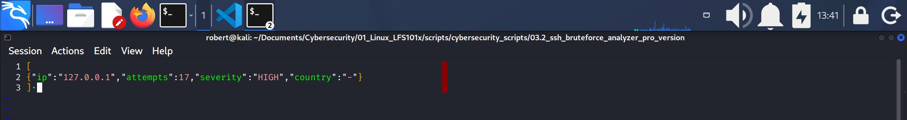

#### 16.- MAIN
The `main ()` function is the **central controller** of the entire script. It defines the **exact order** in which all the previously defined functions must run.

1. `main () {` defines the function. It contains a sequence of **function calls**, each one performing a specific step in the analysis process:
    1. `check_permissions`: Ensures the script has the required permissions (usually root or sudo) to read logs and exxecute system commands.
    2. `check_dependencies`: Verifies that all required tools (like `awk`, `sed`, `grep`, `uniq`, etc) are installed before continuing.
    3. `collect_logs`: Retrieves or reads the log files that contain authentication attempts or security events.
    4. `filter_events`: Filters the raw logs to extract only the relevant authentication or security events.
    5. `extract_ips`: Extract IP addresses from the filtered events.
    6. `count_attempts`: Counts how many times each IP appears (i.e., how many attempts each IP made).
    7. `calculate_severity`: Assigns a severity level based on the number of attempts and adds geolocation data.
    8. `generate_report`: Builds the human-readable final report (final_report_pro.txt) using the processed data.
    9. `export_csv`: If the user requested a CSV output (`--csv file.csv`), this function exports the data in CSV format.
    10. `export_json`: If the user requested a JSON output (--json file.json`), this function exports the data in JSON format.
2. Final line: **calling main**
    1. `}` closes the function.
    2. `main`.
        * This executes the `main ()` function. 
        * Without this line, the script would define all functions **but never run anything.**
    3. The reason this section is placed at the end of the script is that main must be executed only after all functions have been defined.
    4. It is not mandatory for a script to include a main section that calls all functions, but it is considered good practice because it:

        * prevents execution errors,
        * defines a clear function execution order,
        * allows individual functions to be executed independently for testing or debugging:
            1. In the terminal type `bash -c 'source scriptname.sh; calculate_severity'`.
                * This will execute only the `calculate_severity` function.
        * Eases reading and comprehension for other people.

---

### 3.- Make the Script Executable

### 4.- Check created files

---
End of project **three, pro version**.

