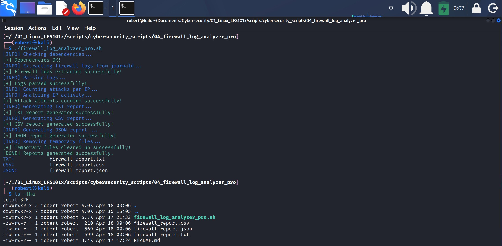
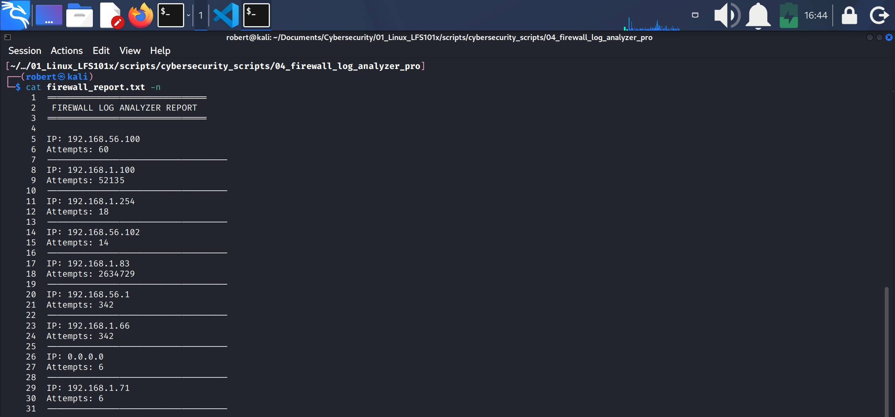
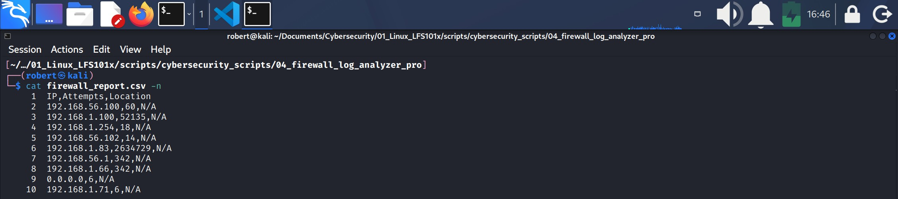
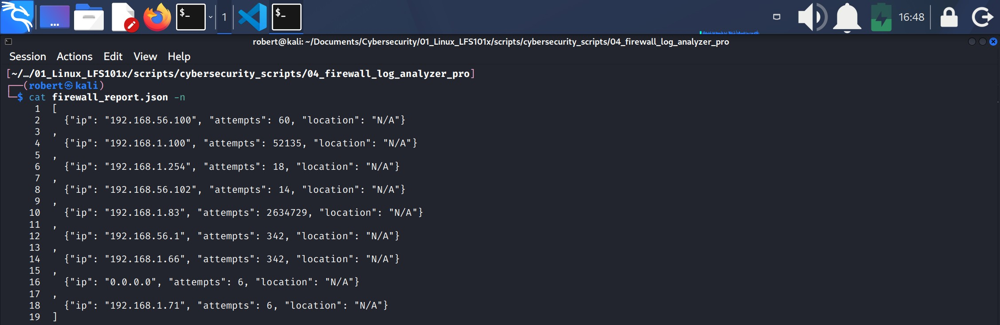

## 4.- FIREWALL LOG ANALYZER (PRO)

In Linux, the actual firewall is **Netfilter**, a kernel‑level subsystem responsible for inspecting, filtering, and manipulating network packets.
The **iptables** tool is a user‑space interface that allows you to configure Netfilter through rules.
When you write rules in iptables, you are actually modifying Netfilter’s behavior to allow, block, or log network traffic within a system.

### Project purpose
**Firewall Log Analyzer PRO** is an advanced Bash tool designed to analyze security events registered by the **firewall** in Linux systems based in **systemd-journald**.

It's pupose is to identify suspicious activity in network traffic, detect attack patterns and generate professional reports for forensic analysis or security monitoring.

This script retrieves events directly from the **kernel log** using `journalctl -k`, extracts relevant information from each blocked packet by **iptables** (like IP origin, destination port, protocol and TCP flags).

* **Note**: Although the parsing stage extracts SRC, DST, DPT, and PROTO, the final report **intentionally focuses only on the source IP (SRC).** The goal of this version of the tool is to count how many times each source address appears in the logs. The additional fields are extracted for completeness and for potential future enhancements.

**Firewalls** are the first line of defense in any infrastructure. Nevertheless, its logs tend to be extensive, complex and difficult to interpret manually. 

* This script shows the capacity of:
    1. Convert raw data into practical intel.
    2. Automate analysis tasks that normally require SIEM tools.
    3. Understand how kernel level network events are stored.
    4. Detect attack patterns like a real SOC analyst.

---

### Project environment
1. **Kali** Linux doesn't store firewall logs in directories like those in other distros (i.e., Ubuntu).
2. Firewall logs are managed by `journald` just like the `ssh` service.
3. `journald` doesn't generate **firewall** logs by default.
4. Logging must be activated manually
    1. Confirm there are no firewall logs with:

        * `journalctl -k | grep -E "DROP|REJECT"`

            * `-k`: this option shows all **kernel messages**
            * DROP and REJECT are firewall actions (iptables/nftables). They are not log types, files or services.
                * They are decissions made by the firewall when it receives a packet.
                * `DROP`: discards a packet without responding.
                * `REJECT`: discards a packet and sends a response.

    2. If it doesn't return anything, then **there are no active logging rules**.
5. Activate a LOG and a DROP rule for **iptables** with:

    1. `sudo iptables -A INPUT -j LOG --log-prefix "IPTABLES DROP: "`:
        * `-j LOG` is the rule target, meaning “every time a packet reaches this rule, write an entry in the kernel logs”.
        * This rule adds a log entry every time a packet matches it.
        * Everything else in the command are parameters for the rule.

    2. `sudo iptables -A INPUT -j DROP`:
        * `-j DROP` is the rule target; it discards the packet without sending a response.
        * This is the final action after the LOG rule, so packets are logged first and then dropped.

6. Confirm the rules were created with:
    * `sudo iptables -L -n -v`
    * Look for lines similar to:
        1. `LOG        all  --  *      *       0.0.0.0/0            0.0.0.0/0            LOG flags 0 level 4 prefix "IPTABLES DROP "`
        2. `DROP       all  --  *      *       0.0.0.0/0            0.0.0.0/0`
            * If they appear, firewall logging and blocking are now active.

7. Once the firewall logging rule is active, try again `journalctl -k | grep -E "DROP|REJECT"`. You should see firewall logs now.

    * **IMPORTANT:** Kali Linux stores firewall rules only in RAM. This means any rules you create will be removed every time you reboot or shut down the system.
    * This happens because **Kali**:
        1. Is a Linux distribution specialized in penetration testing.
        2. Is not intended for productivity or long‑term system administration.
        3. Is not used as a server‑grade operating system.
        4. Requires frequent firewall rule changes during pentesting tasks, so persistent rules would get in the way.
    * Therefore, if you need to work with firewall logs, you must re‑enable the required rules every time you start the system unless you configure rule persistence manually.

8. You can generate fake malicious traffic so this project has more material to work on; for example:
    1. `sudo hping3 -S --flood -V 192.168.1.83`: generates a high volume of SYN packets to simulate a **DoS** attack.
    2. `sudo hping3 --udp --flood -p 9999 192.168.1.83`: sends massive UDP packets to a **non‑existent** port.
    3. `nmap -sS 192.168.1.83`: performs a quick SYN port scan and generates multiple connection attempts.
    4. `curl http://192.168.1.83:9999`: generates connection attempts to **disconnected** ports.
    5. `ssh test@192.168.1.83`: generates failed SSH login attempts.

        * Note: some of these actions where performed from my other VM.

---

### Project development

#### 1.- Create project directory
 * `/04_firewall_log_analyzer_pro`

#### 2.- Create script
* `vim firewall_log_analyzer_pro.sh`

* Use the **#!/usr/bin/env bash** shebang.
1. **COLORS**

    * Define variables for colors to be used in the script messages: RED, GREEN, BLUE, YELLOW and RESET.

2. **OUTPUT FILES**

    * Define variables for output files:
        1. OUTPUT_TXT="firewall_report.txt"
        2. OUTPUT_CSV="firewall_report.csv"
        3. OUTPUT_JSON="firewall_report.json"

3. **CHECK DEPENDENCIES**
    * Check the existence of dependencies `jornalctl` and `geoiplookup`.
        1. `check_dependencies () {`: defines the function.
        2. A colored message is defined to describe this function. The output is sent to stdrerr (`>&2`).
        3. Conditional test `if ! command -v journalctl &>/dev/null; then` verifies that the command `journalctl` DOES NOT exist (`!`). 
            * `!` negates result.
            * `command -v`: verifies if the binary exists in the system's PATH.
            * `&>/dev/null` hides the command output.
                1. If `journalctl` **DOES NOT** exists, the conditional test evaluates TRUE and then: 
                    * prompts a message that indicates the script requires `systemd-journald`,
                    * and then will stop with `exit 1`.
                2. If `journalctl` **DOES** exists the conditional test is FALSE, and the script will continue executing. 
            * `fi` closes the first conditional test.
        4. Conditional test `if ! command -v geoiplookup &>/dev/null; then` verifies that the command `geoiplookup` DOES NOT exists (`!`). 
            * Where
                1. If `geoiplookup` **DOES NOT** exists the conditional test evaluates TRUE therefore:
                    * the script creates the variable **GEO_AVAILABLE=false**.
                2. `else` (If `geoiplookup` **DOES** exist the conditional test evaluates FALSE, therefore:
                    * the script creates the variable **GEO_AVAILABLE=true**).
            * `fi` closes the second conditional test.
        5. A color message is prompted to indicate dependencies are ok.
        6. `}`: closes the function. 

4. **EXTRACT FIREWALL LOGS**
    * Extract the firewall logs from **journald**.
        1. `extract_logs () {`: defines the function.
        2. A colored message describes the function purpose. Sends the output to stdrerr `>&2`.
        3. `LOGS=$(journalctl -k | grep -E "IPTABLES DROP|DROP|REJECT")`
            * Defines the variable **LOGS** expanding the code: 
            
            `(journalctl -k | grep -E "IPTABLES DROP|DROP|REJECT")` 

            * Where:
                1. `journalctl -k`: looks for logs in the kernel (`-k`).
                2. `|`: pipe operator.
                3. `grep`: filters the outpu.
                4. `-E`: Extended Regular Expressions option.
                5. `"IPTABLES DROP|DROP|REJECT"`: are the strings filtered by grep. These words are used because they are the words contained in **iptables** rule results.
        4. `}`: closes the function.
    * **Notice**: I store the firewall logs in the LOGS variable rather than writing them to a temporary file. This keeps the script simpler, avoids extra cleanup steps, and makes the data flow between functions easier to understand.

5. **PARSE LOGS** 
    * Organize data from the **LOGS** variable in order to analyze them later.
        1. `parse_logs () {`: defines the function.
        2. A colored message describes the function purpose. Sends the output to stdrerr `>&2`.
        3. The `awk` command:
            1. It starts with `echo "$LOGS"` because `awk` cannot read a Bash variable directly like it does with a file. Therefore...
                * `echo "$LOGS" | awk`: prints the **$LOGS** variable and pipes (`|`) the result to `awk`.

            2. `awk` executes the command.
            3. `'`: opens the `awk` script.
            4. `{`: encloses the `awk` processess. It means "for every input line  (of the LOGS variable), execute this code".
            5. **for** loop: 
                1. `for(i=1;i<=NF;i++){`: defines how the loop operates: It sets a start value `i=1`, the loop condition `i<=NF`, and the increment `i++`>.
                    * `for`: loop start. Means: "repeat this block several times".
                    * `i=1`: **Initiation**. `i` is the counter variable. It starts at 1.
                    * `i<=NF`: **Condition**. NF: Number of Fields (in the line). It means: as long as `i` is less than or equal to the number of fields, keep iterating.
                    * `i++`: **Increment**. After every iteration, increase `i` by 1 (Until it reaches the last field, `NF`).
                    * `{`: starts the loop block.
                2. `if($i ~ /^SRC=/){src=substr($i,5)}`: this is the action executed **inside the loop**, but only when the field `$i` matches the pattern `SCR=`. It's purpose is to detect the field that starts with `SRC=` and extract the source IP address, storing it in the variable `src`.
                    1. `if($i ~ /^SRC=/)` is a conditional statement where:
                        * `$i`: is the current field being processed inside the `for` loop.
                        * `~`: AWK's operator that means "matches this regular expression".
                        * `/SRC=/`: a regex (regular expression) that means:
                            * `/`: in AWK, regular expressions are always written between forward slashes. 
                            * `^`: the beginning of the string.
                            * `SRC=`: the literal text "SRC=". **SRC** means **Source Address** ( the origin IP address of the packet registered by the firwall).
                        * `()`: the expression inside the parentheses contains the conditional test.
                        * Meaning: "If the current field starts with `SRC=`..."
                    2. `{src=substr($i,5)}` is the action executed when the condition is true, where:
                        * `substr` is an AWK built-in function that extracts a **substring** from a **string**.
                        * `substr($i,5)` extracts the **substring** of `$i` starting at character 5.
                        * Why 5?, because the first four characters are S R C =. For example:
                        S R C = 1 9 2 . 1 6 8 . 1 . 8 3. The fifth characther is the first digit of the source ip address (SRC) 1.
                        * `src=` stores the value returned by `substr($i,5)` in the variable `src`.
                        * `{}`: the braces enclose the action that is executed when the conditional test is true.

                3. The same procedure is applied to extract the remaining fields: `DST`, `DPT`, and `PROTO`. 
                    * Each conditional statement checks whether the current field matches the corresponding pattern (e.g., `^DST=`, `^DPT=`, `^PROTO=`) and then uses `substr` to remove the prefix and store the extracted value in the variables `dst`, `dpt`, and `proto`. 
                        * Note: `PROTO=` uses `substr($i,7)` because the prefix has six characters.

                    * **DST** (Destination Address): is the IP address where the packet was going to.
                    * **DPT** (Destination Port): is the destination port of the packet. Is the port the packet was trying to connect.
                    * **PROTO** (Protocol): is the network protocol used by the packet. Most common used values are: TCP, UDP and ICMP.
                    * Remember that **SRC** (Source Address) is the IP address where the packet was comming from. 
                4. `}`: closes the loop.
            6. AWK continues with the following instructions after the loop:

                1. `if(src != ""){print src "," dst "," dpt "," proto}`, this is a conditional test where:

                    * `if(src != "")` checks whether the `src` variable is not empty.
                    * If the condition is true, AWK executes the action inside the braces `{}`: `{print src "," dst "," dpt "," proto}`

                    * `print` is the AWK command used to output text.
                    * This line prints the extracted values in CSV format, for example:
                        * `192.168.1.10,10.0.0.5,22,TCP`

                2. `src=dst=dpt=proto=""` this resets all variables for the next log line.

                    * This ensures that every log line is processed independently and that no value is carried over from a previous line.

            7. `}` closes the AWK processing block.

            8. `'` closes the AWK script.

            9. `> parsed.tmp` redirects the AWK output to the file **parsed.tmp**.

        4. A colored message indicates that the function completed successfully and sends the output to stderr.

        5. `}` closes the function.

**HOW AWK PROCESSES EACH LOG LINE**

AWK executes the `for` loop to analyze each field of every log line stored in the
`LOGS` variable. During this loop, it looks for fields that begin with `SRC=`, `DST=`,
`DPT=`, and `PROTO=`. When a match is found, the corresponding value is extracted and
stored in the variables `src`, `dst`, `dpt`, and `proto`.

After the loop finishes processing all fields of the current line, AWK evaluates the
condition `if(src != "")`. If `src` is not empty, AWK prints the values of `src`,
`dst`, `dpt`, and `proto` in CSV format.

Finally, the variables `src`, `dst`, `dpt`, and `proto` are reset to empty strings to
ensure that each log line is processed independently.

| Log Line | Step | AWK Action | Description |
|---------|------|------------|-------------|
| **Line 1** | 1 | `for(i=1;i<=NF;i++){...}` | AWK scans each field of line 1 and extracts `SRC`, `DST`, `DPT`, `PROTO`. |
| | 2 | `if(src != ""){print src "," dst "," dpt "," proto}` | AWK prints the extracted values for line 1 **to stdout** (only if `src` is not empty). |
| | 3 | stdout → (redirected) | Because stdout is already redirected, the printed line is written **immediately** into `parsed.tmp`. |
| | 4 | `src=dst=dpt=proto=""` | Variables are reset for the next line. |
| | 5 | `}` | AWK finishes processing line 1 and moves to line 2. |
| **Line 2** | 1 | `for(i=1;i<=NF;i++){...}` | AWK scans each field of line 2 and extracts values. |
| | 2 | `if(src != ""){print src "," dst "," dpt "," proto}` | AWK prints the extracted values for line 2 **to stdout**. |
| | 3 | stdout → (redirected) | The printed line is written **immediately** into `parsed.tmp`. |
| | 4 | `src=dst=dpt=proto=""` | Variables are reset again. |
| | 5 | `}` | AWK finishes processing line 2. |
| **Line 3** | 1 | `for(i=1;i<=NF;i++){...}` | AWK scans each field of line 3 and extracts values. |
| | 2 | `if(src != ""){print src "," dst "," dpt "," proto}` | AWK prints the extracted values for line 3 **to stdout**. |
| | 3 | stdout → (redirected) | The printed line is written **immediately** into `parsed.tmp`. |
| | 4 | `src=dst=dpt=proto=""` | Variables are reset again. |
| | 5 | `}` | AWK finishes processing line 3. |
| **After all lines** | 6 | `}' > parsed.tmp` | The AWK script ends (`}` + `'`). The redirection `> parsed.tmp` was active **from the beginning**, capturing all stdout output. |

* **NOTICE**: The `awk` command can be written on a single line or across multiple lines.  
Using multiple lines improves readability, provides a more professional structure, and makes it easier to work with longer or more complex AWK scripts.

6. **COUNT ATTACKS PER IP**
    * Number of packets detected by IP.
        1. `analyze_ips () {`: defines the function.
        2. A colored message describes the function purpose.
        3. A colored message describes the status of the process.
        4. `sort parsed.tmp | awk -F','`: 
            * `sort parsed.tmp`: sorts the file parsed.tmp alphabetically.
                * Though `uniq` is not used here because we are not removing duplicates, `sort` provides a more readable file.
            * `|`: pipes the output to awk.
            * `awk`: executes awk 
            * `-F','`: indicates to awk that the field delimiter is a comma.
            * `'`: starts the `awk` script.
                * `{`: starts an `awk` block, in this case `count`.
                    1. `count[$1]++`: Increments a counter for each IP found in `$1`.
                        * `count` is an associative array.
                            * The **keys** are strings (not numbers) for example: "192.168.1.83". Each unique string represents one IP being counted.
                            * The **values** are numbers (in this case, counters or occurrences for each string).
                            * When `awk` processes each line of **parsed.tmp**, it extracts the **source IP** from the first field `$1`, then it executes:
                            * `count[$1]++`, this line means "increase the counter associated with this IP (string) by 1".
                            * So, for this first occurrence, the value is 1 (because `awk` initializes non-existing array elements to 0).
                            * When `awk` finds the same string (IP) again in a later line it executes `count[$1]++` again, so the second occurrence becomes 2, the third becomes 3, and so on.
                            * `count`: is an associative array where the counters are stored.
                            * `[$1]`: is the key of the array, the field whose occurrences are being counted.
                            * `++`: increments the current counter by 1.

                * `}`: closes the `count` block. **This block is executed once for every line in the file parsed.tmp**
            * `END`: is a key word in `awk` that defines a special block.
                * In `awk` there are 3 block types:
                    1. **BEGIN {...}**: executed only one time at the begining, before awk reads the lines.
                    2. **{...}**: executed one time for every input line (like the one used in the last block for `count[$1]++`, and before for creating the file **parsed.tmp**.
                    3. **END{...}**: executed only one time at the end, after awk reads all the lines.
                * `END`: marks the introduction of the special block:
                * `{`: starts the block.
                    * `for (ip in count)`: introduces the `for` loop that iterates over the associative array.
                        * `for`: reserved awk keyword. It executes the `for` loop.
                        * `(`: opens the loop expression.
                        * `ip`: is the loop variable; it takes each key of the array (`SRC` IPs).
                        * `in`: reserved awk keyword. Means "iterate over".
                        * `count`: is the associative array containing the counters.
                        * `)`: closes the loop expression.
                            * `for` loop structure:
                            * `for` (variable `in` array).
                    * `{`: opens the action block executed for each key in the array.
                        * `printf "%s,%d\n", ip, count[ip]`
                            * `printf`: reserved awk keyword. Prints formatted output to stdout.
                        * Arguments:
                            * **First argument:** `"%s,%d\n"`
                            * `"`: opens the format string.
                            * `%s`: placeholder for **string** (the IP address). **Prints literal text**.
                            * `,`: literal coma printed between fields.
                            * `%d`: placeholder for an **integer** (the counter). Means "decimal integer". **Prints a number**.
                            * `\n`: new line character.
                            * `"`: closes the format string.
                            * `,`: separates the format string from the arguments.
                            * **Second argument:**
                            * `ip`: the current key being printed. First argument that replaces `%s`.
                            * **Third argument:**
                            * `count[ip]`: the number of ocurrences for that key. Second argument that replaces `%d`.
                                * `[]`: provides access to an array element.                 
                    * `}`: closes the action of the `for` loop.
                * `}`: closes the `END` block.
            * `'`: closes the `awk` script.
        5. `ip_count.tmp`: redirects the `awk` output to the file **ip_count.tmp**.
        6. `}`: closes the function.

7. **GENERATE TXT REPORT**
    1. `generate_txt () {`: defines the action.
    2. A colored message describes the function purpose and redirects the output to sdrerr `>&2`.
    3. A series of `echo` commands add content to the variable **$OUTPUT_TXT**.
    4. The last `echo` appends an empty line to the variable.
    5. `while IFS=',' read -r ip count; do`
        * It is a loop that executes the actions between `do` and `done` as long as `read` can read a valid line.
        * `while`: executes the while loop.
        * `IFS` (Internal Field Separator) is a special **Bash** environment variable that indicates how input fields should be separated.
        * `IFS=','`: In this case it means "use a comma as the field separator".
        * `read`: is a Bash built-in command. It takes the fields separated by `IFS` and assigns them to variables. It reads from the **input** file **ip_count.tmp** specified at the end of the loop.
        * `-r`: prevents Bash from interpreting backslashes (`\`).
        * `ip`: receives the first field (from the input file **ip_count.tmp**)
        * `count`: receives the second field (from the input file **ip_count.tmp**).
    6. `echo "IP: $ip" >> "$OUTPUT_TXT"`
        * Appends "IP: `$ip`" to the file stored in the variable **$OUTPUT_TXT**.
        * `$ip`: is the value assigned to `ip` by the `read` command inside the `while` loop.
    7. `echo "Attempts: $count" >> $OUTPUT_TXT`
        * Appends "Attempts: `$count`" to the file stored in the variable **$OUTPUT_TXT**.
        * `$count`: is the value assigned to `count` by the `read` command inside the `while` loop.
    8. Conditional test:
        1. `if [[ "$GEO_AVAILABLE" == true ]]; then`
            * Evaluates whether **$GEO_AVAILABLE** is true, meaning the `geoiplookup` dependency is available.
            * If the condition is **TRUE**, the script will proceed with:
                * `GEO=$(geoiplookup "$ip" | head -n 1)`
                    * `geoiplookup "$ip" | head -n 1)` expands and the result is stored in the variable `GEO`.
                    * `geoiplookup`: is a Linux command that queries a **GeoIP** database to obtain the country related to an IP address.
                    * `geoiplookup` will be applied to the `$ip` and pipe (`|`) the result to `head -n 1`, which means the first line of the `geoiplookup` will be stored in the variable **GEO**.
                * The **$GEO** variable will be appended to the file contained in the variable **$OUTPUT_TXT** with `echo`.
        2. `fi`: closes the conditional test.
    9. `echo` appends a line to the file contained in the variable **$OUTPUT_TXT**.
    10. `done`: the `while` loop ends.
    11. `< ip_count.tmp`: sets **ip_count.tmp** as the input file for the `while` loop.
    12. `}`: closes the function.

#### firewall_reports.txt

**HOW THE WHILE LOOP PROCESSES EACH LINE**
The while loop reads the ip_count.tmp file line by line. For each line, the loop uses the read command with a comma as the field separator (IFS=',') to split the line into two values: the IP address and the number of attempts. These values are assigned to the variables ip and count, respectively.

After extracting both fields, the loop appends the IP address and the number of attempts to the output file defined in the OUTPUT_TXT variable. If GeoIP lookup support is available, the script runs geoiplookup on the current IP address, stores the first line of the result in the GEO variable, and appends the location information to the output file.

Finally, the loop adds a blank line to separate entries and continues processing the next line of the input file until no more lines are available.HOW THE WHILE LOOP PROCESSES EACH LINE
The while loop reads the ip_count.tmp file line by line. For each line, the loop uses the read command with a comma as the field separator (IFS=',') to split the line into two values: the IP address and the number of attempts. These values are assigned to the variables ip and count, respectively.

After extracting both fields, the loop appends the IP address and the number of attempts to the output file defined in the OUTPUT_TXT variable. If GeoIP lookup support is available, the script runs geoiplookup on the current IP address, stores the first line of the result in the GEO variable, and appends the location information to the output file.

Finally, the loop adds a blank line to separate entries and continues processing the next line of the input file until no more lines are available.

**HOW THE WHILE LOOP PROCESSES EACH LINE - TABLE**
               
| Input Line | Step | While/Read Action | Description |
| --- | --- | --- | --- |
| **Line 1** | 1 | ``IFS=',' ``read ``-r ``ip ``count`` | The loop reads line 1, splits it by comma, and assigns the first field to ``ip`` and the second to ``count``. |
|  | 2 | ``echo ``"IP: ``$ip"`` | Appends the IP address from line 1 to the output file (``$OUTPUT_TXT``). |
|  | 3 | ``echo ``"Attempts: ``$count"`` | Appends the number of attempts from line 1 to the output file. |
|  | 4 | ``if ``[[ ``"$GEO_AVAILABLE" ``== ``true ``]]; ``then`` | Checks whether GeoIP lookup is available. |
|  | 5 | `GEO=$(geoiplookup "$ip" | head -n 1)` | If enabled, runs ``geoiplookup`` on the IP from line 1 and stores the first line of the result in ``GEO``. |
|  | 6 | ``echo ``"Location: ``$GEO"`` | Appends the GeoIP location to the output file. |
|  | 7 | ``echo`` | Appends a blank line to separate entries. |
|  | 8 | ``done`` (loop continues) | The loop finishes processing line 1 and moves to line 2. |
| **Line 2** | 1 | ``IFS=',' ``read ``-r ``ip ``count`` | Reads line 2, splits it by comma, assigns fields to ``ip`` and ``count``. |
|  | 2 | ``echo ``"IP: ``$ip"`` | Appends the IP from line 2. |
|  | 3 | ``echo ``"Attempts: ``$count"`` | Appends the attempt count from line 2. |
|  | 4 | ``if ``[[ ``"$GEO_AVAILABLE" ``== ``true ``]]; ``then`` | Checks GeoIP availability. |
|  | 5 | `GEO=$(geoiplookup "$ip" | head -n 1)` | Runs GeoIP lookup for the IP from line 2. |
|  | 6 | ``echo ``"Location: ``$GEO"`` | Appends the location. |
|  | 7 | ``echo`` | Appends a blank line. |
|  | 8 | ``done`` (loop continues) | The loop finishes processing line 2. |
| **Line 3** | 1 | ``IFS=',' ``read ``-r ``ip ``count`` | Reads line 3 and assigns fields. |
|  | 2 | ``echo ``"IP: ``$ip"`` | Appends the IP from line 3. |
|  | 3 | ``echo ``"Attempts: ``$count"`` | Appends the attempt count. |
|  | 4 | ``if ``[[ ``"$GEO_AVAILABLE" ``== ``true ``]]; ``then`` | Checks GeoIP availability. |
|  | 5 | `GEO=$(geoiplookup "$ip" | head -n 1)` | Runs GeoIP lookup for the IP from line 3. |
|  | 6 | ``echo ``"Location: ``$GEO"`` | Appends the location. |
|  | 7 | ``echo`` | Appends a blank line. |
|  | 8 | ``done`` (loop continues) | The loop finishes processing line 3. |
| **After all lines** | 9 | ``read`` fails (EOF) | When no more lines are available, ``read`` returns a non‑zero exit code. |
|  | 10 | ``done`` | The ``while`` loop ends. |
|  | 11 | `` | The input redirection that fed the loop from the beginning. |

8. **GENERATE CSV REPORT**
1. This function (`generate_csv () {`) works in a similar way as the previous one.
2. It uses a `while` loop with the `read` command to process each line of the **input** file **ip_count.tmp**.
3. The only differences are the following:
    1. The function adds the header "IP,Attempts,Location" to the variable **$OUTPUT_CSV**.
    2. For the variable **GEO**:
        1. `cut -d ':' -f2`: extracts the text after the first colon.
            * `cut`: a Linux tool used to split text into fields based on a delimiter.
            * `-d ':'`: defines the delimiter
                * `-d`: specifies the delimiter to use.
                * `:`: indicates that the delimiter is a colon.
                * This tells `cut` to split the line every time it finds a `:`.          .
            * `-f2`: selects field number 2.
                * After splitting the line using `:`, `cut` returns the second field.
        2. `sed 's/^ //'`: removes the leading blank space.
    3. If the instruction `GEO=$(geoiplookup "$ip" | head -n 1 | cut -d ':' -f2 | sed 's/^ //')` cannot be executed, the variable **GEO="N/A"** is created.
    4. The valued `$ip`,`$count`,`$GEO` are appended to the file referenced by **$OUTPUT_CSV** in CSV format.

#### firewall_report.csv

9. **GENERATE JSON REPORT**
    1. `generate_json () {`: generates the function.
    2. Create the output file and write the opening bracket `[`.
    3. `FIRST`: is a logical flag used to control when to add a comma between the **objects** in a JSON array.
    4. `FIRST=true`: is a logical flag used by the script to know whether the **first JSON object** is processing within an array.
        * This variable responds to the question "I'm I writting the first JSON object?".
            1. If the answer is **yes**, then `FIRST=true`.
            2. If the answer is **no**, then `FIRST=false`.
    4. `while IFS=',' read -r ip count; do`: reads each line of the input file.
        * Splits each line by a comma
        * Assigns:
            1. first field: ip
            2. second field: count.
    5. `if [[ "$FIRST" == false ]]; then`
        
        `echo ","`: which means "if this is not the first loop iteration, add a comma before the next JSON object".
        * This conditional is used because in a JSON array there should not be a comma before the **first** JSON object.
        * A comma should go before subsequent JSON objects.
    6. `fi`: closes the conditional test.
    7. `FIRST=false`: is a logical flag used by the script to know if the **first JSON object** has been written.
        * The idea is:
            1. **Before** writing the first JSON object: `FIRST=true`.
            2. **After** writing the first JSON object: `FIRST=false`.
    
**How the FIRST Flag Controls JSON Formatting**
Before the loop starts, FIRST=true is set because no JSON object has been processed yet.
Inside the loop, the condition if [[ "$FIRST" == false ]] is evaluated to determine whether a comma should be added before the next object.
After writing the first object, FIRST=false is assigned to indicate that all subsequent objects are no longer the first one and therefore must include a comma before them.

*  Continuation...
    8. The JSON report includes the variable **GEO**, which is created the same way it was generated in the previous section **8. GENERATE CSV REPORT**.
    9. Append the line `{\"ip\": \"$ip\", \"attempts\": $count, \"location\": \"$GEO\"}` to the variable **$OUTPUT_JSON**
    10. `done`: to end the `while` loop.
    11. `< ip_count.tmp`: sets **ip_count.tmp** as the input file for the loop.
    12. Append `]` to the output file to close the JSON array.
    13. `}`: to close the function.

#### firewall_report.json

10. **CLEANUP**
    1. `cleanup () {`: to define the function.
    2. Add a colored message to describe the function purpose, send the output to stdrerr `>&2`.
    3. `rm -f parsed.tmp ip_count.tmp`: to remove temporary files no longer needed.
        * `-f`: force remove, without confirmations.
    4. `}`: closes the function.

11. **MAIN**
    1. `main () {`: defines the function. This function is the central controller of the entire script. It defines the **exact order** in which all the previously defined functions must run.
    2. Enlists all the script functions.
    3. Displays the files generated by the script.
    4. `}`: closes the function.
    5. `main`: 
        * This executes the `main ()` function.
        * Without this line, the script would define all functions **but never run anything**.

#### 3.- Make the Script Executable
* `chmod +x firewall_log_analyzer_pro.sh`

#### 4.- Check created files

#### 5.- Analyze results and take propper security actions.

### FIREWAL REPORT INTERPETATION

| Detected IP        | Attempts  | Traffic Origin               | Tool / Traffic Type                 | Technical Explanation                                                                 | Suspicious? |
|--------------------|-----------|------------------------------|-------------------------------------|-----------------------------------------------------------------------------------------------------|-------------|
| **192.168.56.100** | 60        | Ubuntu VM (Host‑Only)        | **curl** (10×6 ports)               | These entries correspond to 60 `curl` connection attempts generated intentionally for testing.       | ❌ No       |
| **192.168.1.100**  | 52,135    | Ubuntu VM (NAT/Bridged)      | **SSH**, **Nmap**, TCP retries      | This IP produced SSH login attempts, a full‑port Nmap scan, and TCP retransmissions caused by DROP. | ❌ No       |
| **192.168.1.254**  | 18        | Local Router / Gateway       | **DHCP / ARP / SNMP**               | The router periodically sends broadcast, ARP, and management packets that are logged by the firewall.| ❌ No       |
| **192.168.56.102** | 14        | Another VirtualBox VM        | **DHCP / ARP**                      | This VM generates normal Host‑Only network traffic such as DHCP and ARP requests.                   | ❌ No       |
| **192.168.1.83**   | 2,634,729 | Kali Linux (local machine)   | **ARP / DHCP / internal broadcast** | The Kali host produces large volumes of internal broadcast and ARP traffic, all logged due to DROP. | ❌ No       |
| **192.168.56.1**   | 342       | VirtualBox Host‑Only Adapter | **DHCP / broadcast**                | This virtual adapter acts as a virtual router and emits regular broadcast and DHCP traffic.         | ❌ No       |
| **192.168.1.66**   | 342       | Local network device         | **SNMP / broadcast**                | A LAN device (IoT, laptop, etc.) sends routine broadcast or SNMP packets detected by the firewall.  | ❌ No       |
| **0.0.0.0**        | 6         | Unassigned DHCP/ARP source   | **DHCP Discover**                   | These packets originate before an IP address is assigned, typical of DHCP discovery behavior.       | ❌ No       |
| **192.168.1.71**   | 6         | Another LAN device           | **broadcast**                       | This device sends normal LAN broadcast traffic commonly seen in home networks.                      | ❌ No       |

* **IMPORTANT**
    1. Every attempt in the report corresponds to a single network packet processed by the firewall.
    2. Every packet logged by the firewall appears as one log line in the system journal.

---
* End of project **four**.