# PORT SCAN DETECTOR (PRO)

### Script execution
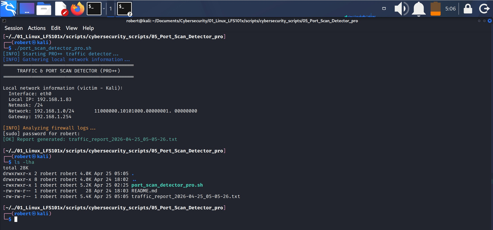

### Basic script diagram
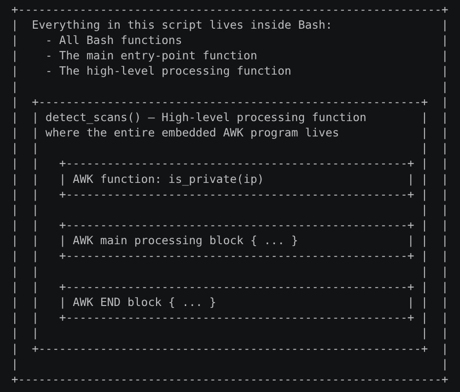


### Script structure


## 1.- Project purpose
Project 5 focuses on identifying and summarizing the behavior of every IP address that generates traffic toward the Kali machine. Instead of analyzing single firewall events, the script groups all related entries by source IP and examines what each one attempted to do. This includes detecting SSH attempts, HTTP requests, UDP packets, ICMP traffic, SYN‑only packets, and different scanning patterns. The goal is to produce a clear, organized report where each block represents one attacker and the type of activity associated with that IP.

This approach differs from Project 4, which only analyzed individual firewall log entries and classified them by protocol. While Project 4 provided a general overview of what the firewall was blocking, Project 5 goes further by identifying behavior, not just events. It detects port‑scanning patterns, determines whether the scan was sequential or random, extracts port ranges, and highlights suspicious activity per IP. In short, Project 4 explains what happened, while Project 5 explains who did it and how.

## 2.1.- Project enviroment -iptables rules
1. Configure **iptables** rules on Kali Linx to:
    1. Block incomming traffic by default.
    2. Allow only the essential.
    3. Log (register) every blocked connection attempt.
    4. Generate the logs **Port Scan Detector** requires to analyze.

2. Configure **iptables** rules in the Kali terminal executing:
    1. Clean previous rules.
        * `sudo iptables -F`: to clean existing rule strings (`-F`: Flush).
        * `sudo iptables -X`: to remove personalized strings (`-X`: Delete chain).
            * This is to prevent old rules to interfare with this project.
    2. Stablish default policies.
        * `sudo iptables -P INPUT DROP`: blocks incomming traffic.
            * `-P`: Policy. Means "policy by default". It changes the default string action. The principal string actions are: INPUT, OUTPUT and FORWARD.
            * This rule means "Kali will block all incomming traffic, except what is explicity allowed".
        * `sudo iptables -P FORWARD DROP`: blocks traffic within the system.
        * `sudo iptables -P OUTPUT ACCEPT`: allows all outcomming traffic.
            * This is to block all connection attempts to Kali, in order to:
                1. `nmap`: generates traffic.
                2. `iptables`: blocks this traffic.
                3. `journald`: registers this traffic.
                4. This project script analyze this traffic.
            
    3. Allow essential traffic.
        * `sudo iptables -A INPUT -m conntrack --ctstate ESTABLISHED,RELATED -j ACCEPT`: allows responses to connections initiated by the user, (e.g. browsing, updating, ping).
            * This is to:
                2. Maintain networking.
                3. Prevent Kali to be isolated.  

    4. Allow loopback.
        * `sudo iptables -A INPUT -i lo -j ACCEPT`: allow internal traffic.
            * This is because a lot of programs depend on loopback.
            * To block it is to break internal services.
    
    5. Register (log) everything that is blocked.
        * `sudo iptables -A INPUT -j LOG --log-prefix "IPTABLES DROP: "`: everytime a packet arrives to **INPUT** and is blocked, **iptables**:
            * Registers it in `journald`.
            * Prefix `"IPTABLES DROP: "` is added.
            * Includes data like SRC, DPT, PROTO, etc.
                * **Port Scan Detector** depends on these logs. Without this rule there will be nothing to analyze.
3. This rules are created in the Kali terminal rather that in a configuration file because:
    1. `iptables` is a dynamic firewall.
    2. `iptables` rules live in the kernel memory.
    3. These rules are managed by commands.
    4. Kali does not have a permanent configuration file (although you can make the rules permanent with `sudo apt install iptables -persitent` and `sudo netfilter-persistent save`)

#### iptables rules
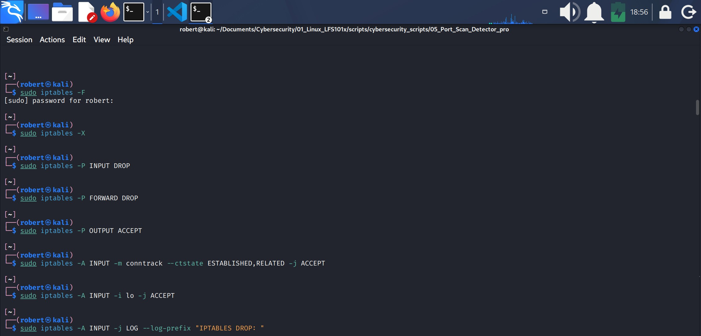

---

### 2.2.- Project enviroment - generating traffic.
To generate a robust and diverse traffic report, several actions were performed from my secondary virtual machine in order to increase the volume and variety of firewall logs.
Because I was unable to connect both VMs to different routers, it was not possible to implement an interesting geolocation feature in this version of the script.
All traffic was generated locally from the Ubuntu VM toward the Kali VM.
The following actions were executed to simulate different types of network activity:

1. **SSH Traffic Generaton**. Multiple failed SSH login attempts were sent to the Kali machine using invalid credentials.
This produced TCP SYN packets targeting port 22, simulating brute‑force activity and allowing the script to detect SSH attempts, SYN‑only packets, and repeated connection patterns.
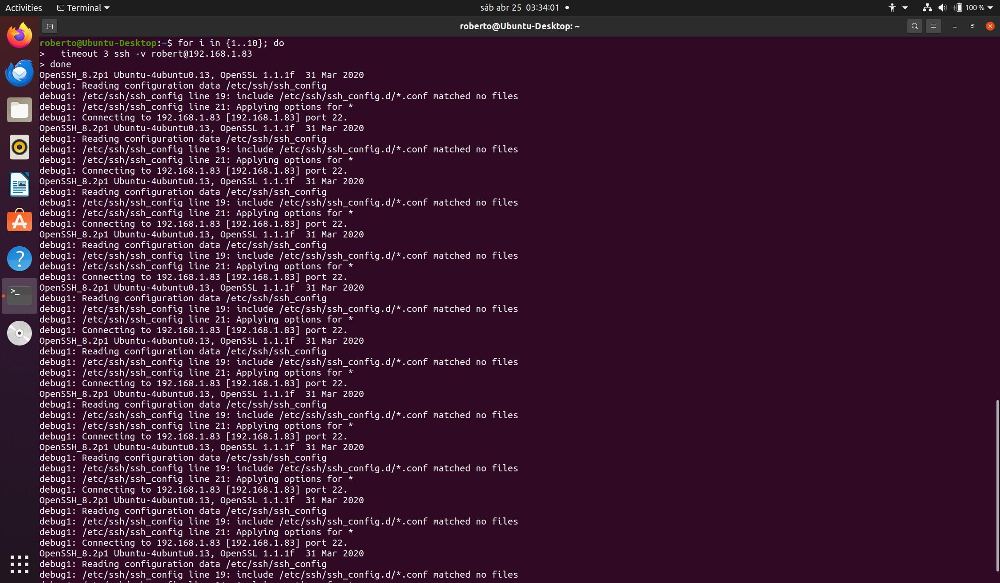


2. ** SSH Attempts to Incorrect Ports**. SSH connection attempts were also sent to ports where no SSH service was running (21, 23, 25, 2222, 3306).
These attempts generated SYN packets to closed ports, simulating service enumeration and basic port‑scanning behavior.
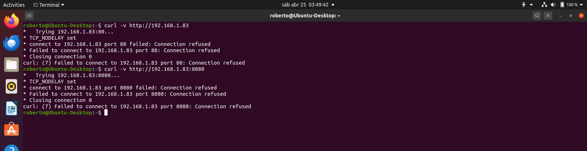

3. **HTTP Traffic (Get Requests)**. HTTP GET requests were generated using curl with different User‑Agents (Googlebot, Mozilla).
This simulated typical web crawler and automated scanner behavior, producing traffic on port 80 that the script could classify as HTTP.
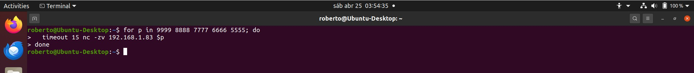

4. **HTTP Traffic to Incorrect Ports**. HTTP requests were sent to ports where no web server was running (8080, 8000, 9999).
These requests generated SYN packets to closed ports, simulating reconnaissance of alternative or non‑standard HTTP services.
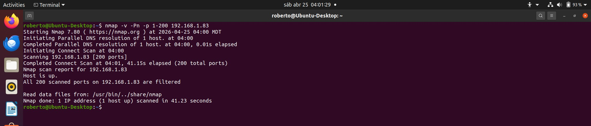

5. **HTTP POST Requests**. HTTP POST requests with dummy data were sent to the Kali machine.
This introduced more diverse HTTP traffic and validated the script’s ability to detect HTTP activity regardless of the request method. 
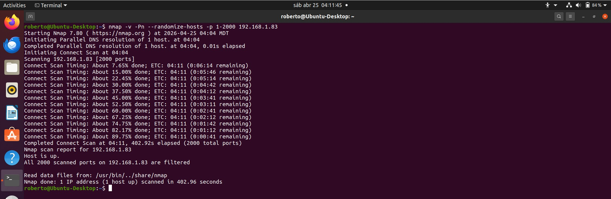

6. **UDP Traffic**. UDP packets were sent to several ports (53, 69, 161, 5000, 7000) using `nc -u`.
Since UDP is connectionless, these packets were dropped by the firewall and logged, allowing the script to detect UDP‑based probing and service discovery attempts.
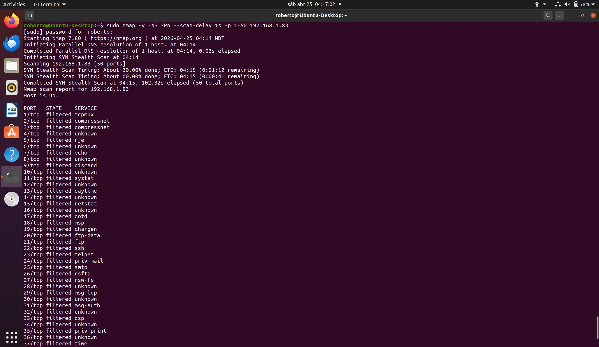

7. **ICMP Traffic (Ping)**. A controlled number of ICMP Echo Requests (ping) were sent to the Kali machine.
This simulated diagnostic network activity and allowed the script to distinguish ICMP traffic from other protocols.
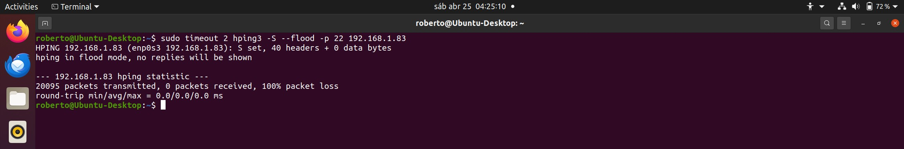

8. **Generic TCP Traffic**. TCP connection attempts were made to high, unused ports (9999, 8888, 7777, 6666) using nc.
These attempts generated SYN‑only packets, simulating manual probing and generic reconnaissance activity.
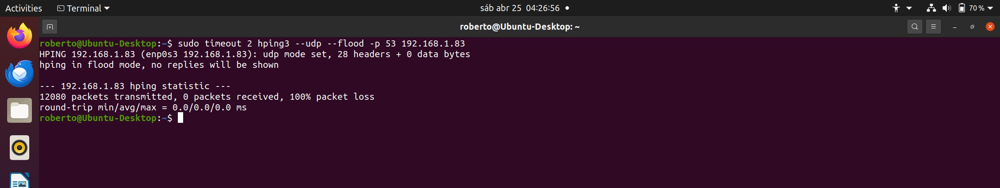

9. **Automated Traffic Generation Script (Mixed Traffic)**. In addition to manual commands, an automated traffic‑generation script was executed from the Ubuntu VM to produce a wide variety of network activity toward the Kali machine.

### 2.3.- Project enviroment - project limitations.

1. Requires iptables logging to be enabled.  
The script depends entirely on firewall logs, so it cannot analyze traffic if logging is disabled or misconfigured.

2. Depends on journalctl availability.  
The detection logic reads logs directly from journalctl. Systems without systemd or with rotated/cleared logs may produce incomplete results.

3. Cannot perform real geolocation in this version.  
Both VMs are connected to the same router, so all traffic originates from the local network. This prevents meaningful geolocation of external attackers.

4. Cannot detect encrypted or application‑layer behavior.  
The script only analyzes firewall‑level events. It cannot inspect encrypted traffic or payloads.

5. Does not monitor traffic in real time.  
It generates a report based on existing logs, but it does not continuously watch for new events.

6. Accuracy depends on the amount and variety of generated traffic.  
If the firewall logs are limited or repetitive, the report will also be limited.

7. Cannot distinguish legitimate internal traffic from malicious internal traffic.  
All traffic from the local network is treated equally, since the script has no context about user intent.


---

## 3.- Create the script
* Script name: **port_scan_detector_pro.sh**
### 3.1.- ANSI COLORS and Initial Setup: define ANSI colors for informative messages.
1. Define a timestamp with the variable: `TIMESTAMP=$(date +"%Y-%m-%d_%H-%M-%S")`
2. Define the output file with the variable `OUTPUT="traffic_report_$TIMESTAMP.txt"
        * The file includes the time stamp in its name.
3. Define the variable `MIN_PORTS=10`. This variable sets the minimum number of distintct destination ports an IP must hit before the script classifies its behavior as **port scanning**.
4. Adds a message to be displayed on screen that indicates that **PRO++ traffic detector** has started working.
    * Messages that appear during the analysis process are redirected to STDERR to avoid mixing them with the script’s output. However, initial visual messages (such as banners or startup notifications) remain in STDOUT because they do not interfere with the report or the detection logic.

### 3.2.- LOCAL NETWORK INFORMATION
1. Adds a message to be displayed on screen that indicates  that the script is "Gathering local network information..."
2. Defines the variables:
    1. **IFACE=$(ip route | awk '/default/ {print $5}')**: this variable finds the **network interface** used by the default route.
        * `ip route`: is a command that reads the system's **routing table**. It prints:
        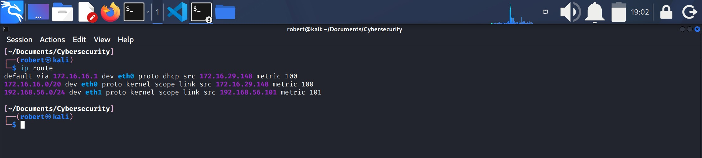 
        * `|`: pipes the result to `awk`.
        * `awk '/default/ {print $5}'`
            1. `awk`: command that processes text files in columns.
            2. `'`: starts the `awk` script.
            3. `/.../`: defines the string to be processed.
                * `/default/`: selects only the line that contains the word **default**.
            4. `{print $5}`: prints the fifth column of that line in this case `eth0`.
            * Therefore, this line reads the system's routing table with `ip route` and then `awk` prints the **fifth** field of the line that contains the word **default** and stores the result in the variable **IFACE**. 
           
               

    2. **LOCAL_IP=$(ip -4 addr show "$IFACE" | awk '/inet/ {print $2}' | cut -d'/' -f1)**: This variable retrieves the IPv4 address associated with the default network interface stored in **IFACE**. It extracts the **IP/MASK** value from the interface information and removes the subnet mask using `cut`, leaving only the IPv4 address, which is stored in **LOCAL_IP**.
        * `ip -4 addr show "$IFACE"`: this command shows only the IPv4 information of the interface stored in the variable **IFACE**.
            1. `-4`: forces `ip` to show IPv4 addresses only.
            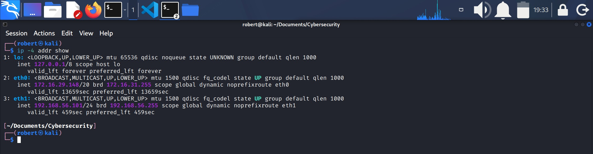
        * `awk '/inet/ {print $2}`: finds the line that contains the IPv4 address (the one starting with **inet**) and prints the second field, which looks like: 172.16.29.148/20
        * `cut -d'/' -f1`: uses `/` as a delimiter and selects the first field, removing the subnet mask. Result: 172.16.29.148. This value is storein the variable **LOCAL_IP**.

    3. **LOCAL_MASK=$(ip -4 addr show "$IFACE" | awk '/inet/ {print $2}' | cut -d'/' -f2)**: This variable extracts the subnet mask of the default network inteface stored in **IFACE**. It reads the **IP/MASK** value from the interface information and uses `cut` to select the part after the `/`, leaving only the mask (for example, **20**), which is stored in **LOCAL_MASK**.


    4. **LOCAL_NET=$(ipcalc "$LOCAL_IP/$LOCAL_MASK" | awk -F': *' '/Network/ {print $2}')**: stores the network address in CIDR format for the machine’s local network. The command uses `ipcalc` with the previously obtained **LOCAL_IP** and **LOCAL_MASK** to compute the full network information, and then filters the output to extract only the “Network” field. The result is a value such as **172.16.16.0/20**, which represents the base network address and prefix length of the local subnet.
        #### Machine local Network
        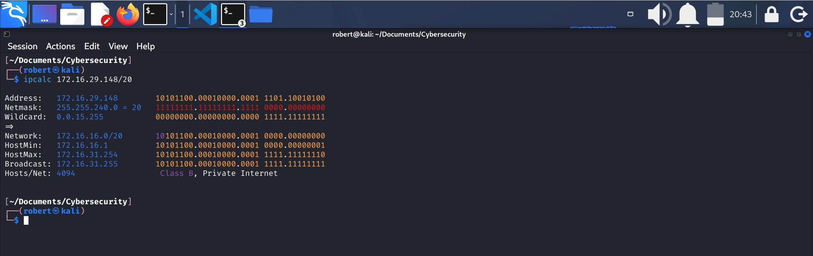
       
       * **CIDR** (Classless Inter‑Domain Routing) is a notation used to represent an IP address together with its subnet mask in a compact format. Instead of writing the full mask (like 255.255.240.0), CIDR uses a slash followed by a number that indicates how many bits of the address belong to the network portion. For example, in 172.16.29.148/20, the /20 means that the first 20 bits identify the network, and the remaining bits identify hosts within that network. This notation makes it easy to understand the size of a subnet and to calculate the network address, broadcast address, and host range.
        * `ipcalc`: takes an IPv4 address with its mask (for example, 172.16.29.148/20) and calculates all the network parameters derived from it.
        * `ipcalc "$LOCAL_IP/$LOCAL_MASK"`: `ipcalc` receives the LOCAL_IP/LOCAL_MASK combination (for example, 172.16.29.148/20) and generates all the network information, including the line "Network", which includes the real network address (for example, 172.16.16.0/20).
        * `|`: pipes the output to `awk`
        * `awk`: processes the file in columns.
        * `-F`: defines the fields delimiter.
        * `: *`: is a single delimiter which is colons followed by 0 or more spaces.
            1. `:`: literal colon.
            2. ` ` (space): literal blank space.
            3. `*`: means "zero or more repetitions of the prrevious character", which in this case is a blank space.
               
        * `'`: starts the `awk` script.
        * `/Network/`: `awk` will work on the lines that contain the word Network.
        * `{print $2}`: prints the second field.
            1. First field: Network
            2. Second field: 172.16.16.0/20
                * **172.16.16.0/20** will be stored in the variable **LOCAL_NET**.

    5. **LOCAL_GW=$(ip route | awk '/default/ {print $3}')**: This variable extracts the system’s **default gateway**—the IP address of the router used for outbound traffic. The command reads the routing table with `ip route`, finds the line that contains the word “default”, and then uses `awk` to print the third field of that line, which corresponds to the **gateway address**. The resulting value is stored in **LOCAL_GW**.
        #### Gateway addres 172.16.16.1
        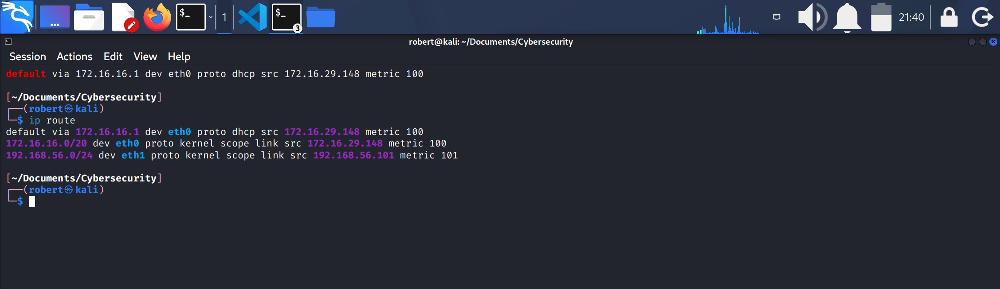

        * **REMEMBER**: The local network is the subnet your machine belongs to, while the gateway address is the router your machine uses to reach anything outside that subnet.

            1. The local network defines which devices you can communicate with directly (for example, 172.16.16.0/20).
            2. The gateway address is a single IP (for example, 172.16.16.1) that acts as the exit point for all traffic leaving your local network.


3. Define the function `print_banner () {` which prints a banner on screen that displays the program name, Local ntework information, Interface, Local IP, Netmask, Network and Gateway.

### 3.3.- ATTACK DETECTION
### 3.3.1 HIGH LEVEL PROCESSING FUNCTION
### 3.3.1.1 detect_scans () {
1. `detect_scans () {`: Is the Bash function that contains the embedded AWK program, including the AWK function `is_private()`, the main **AWK block**, and the **AWK END** block.
2. Add a message that indicates that firewall logs are being analyzed.
    1. `LOG_DATA=$(sudo journalctl -g "IPTABLES DROP" -o short)`: this function executes `journald` searching only for lines that contain "IPTABLES DROP". The result is stored in the variable **LOG_DATA**.
        * `sudo`: will request for the user to have root privileges to execute the script from this point and on.
        * `journalctl`: is the tool that reads the logs.
        * `-g`: is internal `grep` for `journald`. It filters the logs that only show the string "IPTABLES DROP".
        * `-o short`: defines the output format.
            * `short`: means a short format, includes only date, time, hostname, process and a message.
    3. `if [[ -z "$LOG_DATA" ]]; then`: "is the variable **LOG_DATA** empty?".
        1. `-z`: evaluates if the string has 0 lenght.
        2. If the conditional is **TRUE** then the script will use `echo` to display a message indicating that no firewall events were detected and redirect this message to the file related to the variable **OUTPUT**.
        3. `return`: stops the execution of the current function and sends control back to the main script. In this context, it prevents further processing when no firwall log entries are found.
            * `exit 1` is not used because the absence of firewall logs is not an error, but a normal condition. When no entries are found, the function simply stops using return, which ends only the current function without interrupting the entire script.After this function returns, the script continues with the remaining steps, such as:
                - writing the final output file
                - running summary or reporting functions
                - executing cleanup or closing routines

            * This ensures the script finishes normally and produces a valid output, even when no log data is available.
        4. `fi`: closes the conditional test.
        5. If the condition is **FALSE** (the string lenght is not 0) the script continues with:
### 3.3.1.2.- Start of the AWK script.
1. `echo "$LOG_DATA" | awk -v min="$MIN_PORTS" -v mask="$LOCAL_MASK" -v net="$LOCAL_NET" -v gw="$LOCAL_GW" '`:
    1. Marks the start of the AWK script.
    2. Sends the contents of **LOG_DATA** into an `awk` script, and pass several Bash variables (MIN_PORTS, LOCAL_MASK, LOCAL_NET, LOCAL_GW) into `awk` so it can analyze the firewall log lines using those values.
        * `echo "$LOG_DATA"`: prints the content of the variable **LOG_DATA**.
        * `|`: pipes the output to `awk`.
        * `awk`: processes text by columns. Reads every line of **LOG_DATA**, extracts fields, counts ports, detects patterns and generates final report.
        * `-v`: "variable assignment". Passes a Bash variable to a `awk` before it starts processing the input.
            * `-v` is used because `awk` cannot read Bash variables directly. `-v` sends them explicitly.
        * `-v min="$MIN_PORTS"`: creates the variable **min** within `awk`with the value contained in **MIN_PORTS**.
        * Create variable **mask**.
        * Create variable **net**.
        * Create variable **gw**.
            * **NOTICE**: The `awk` block contains several **helper functions**. These functions perform tasks such as checking whether an IP is private, converting IP addresses to integers, calculating network addresses, and determining whether an IP belongs to the local network. All of these functions exist only inside the `awk` script and are used to analyze each firewall log entry.


### 3.3.1.3.- First AWK utility function: is_private(ip) function. 
1. `is_private (ip) {`:
    1. This helper function determines whether an IPv4 address belongs to one of the RFC1918 private network ranges (10.0.0.0/8, 172.16.0.0/12, or 192.168.0.0/16). 
    2. It splits the IP into octets and evaluates the address against these ranges, returning true for private addresses and false for public ones.
        * It returns **true** if the address is:
            - 10.0.0.0/8
            - 172.16.0.0 to 172.31.255.255
            - 192.168.0.0/16
    3. The whole function looks like this:
    
   ```
   function is_private(ip) {
                split(ip, o, ".")
                return ((o[1] == 10) || (o[1] == 172 && o[2] >= 16 && o[2] <= 31) || (o[1] == 192 && o[2] == 168))
            }
    ```


    * `function is_private(ip) {`: defines the function inside the `awk` script.
    * In `awk` functions are declared using this exact syntax:
        - `function name(arguments) {`
        - This means "create an awk function named **is_private** that receives one argument called **ip**.
        - `{`: opens the body of the function, everything inside the braces is the logic that the function will execute.
    * `split(ip, o, ".")`: this line splits the IP address string into its four octets and stores them in the array `o`.
        - `split(...)`: `split` is an awk built-in function used to break a string into pieces.
        - `ip`: is the input string, the IP address passed to the function (e.g., "192.168.1.10").
        - `o`: This is the **array** where the split parts will be stored.
            - After spliting:
                1. `o[1]`= first octet.
                2. `o[2]`= second octet.
                3. `o[3]`= third octet.
                4. `o[4]`= fourth octet.
            - For example, 192.168.1.10:
                1. `o[1]`= 192
                2. `o[2]`= 168
                3. `o[3]`= 1
                4. `o[4]`= 10
        - `"."`: is the delimiter, the character used to split the string.
    * `return ((o[1] == 10) || (o[1] == 172 && o[2] >= 16 && o[2] <= 31) || (o[1] == 192 && o[2] == 168))`: This is a `return` statement. This line returns **true** or **false** depending on whether the IP address belongs to a private RFC1918 range.
        - `return (...)`: The function returns the result of the expression inside the parentheses. 
            - If the expression is true, reurns **1**.
            - If the expression is false, returns **0**
                1. `(o[1] = 10)`: checks if the first octet is 10.
                    - This matches the private range 10.0.0.0/8; so any IP starting with `10.` is private.
                2. `(o[1] == 172 && o[2] >= 16 && o[2] <= 31)`: checks if the IP is in the range: 172.16.0.0 --> 172.31.255.255; this is the private block 172.16.0.0/12.
                    * It verifies:
                        - first octet = 172
                        - second octet between 16 and 31
            3. `(o[1] == 192 && o[2] == 168)`: checks if the IP starts with 192.168.
                - This matches the private range 192.168.0.0/16 
        - `||`: is logial OR. The function returns **true** if **any** of the three conditions is true.
        -  `}`: closes the **is_private(ip)** function.
        - The function returns true if the IP address belongs to a private RFC1918 range, and false if the IP is public. A return value of 1 means “private IP”, and 0 means “public IP”.
2. End of AWK `is_private () {` utility function.

### 3.3.1.4.- AWK Main Processing Block.
1. This block processes each firewall log entry line by line, extracting key fields (source IP, destination port, protocol, flags) and updating all tracking structures used later for scan detection and traffic classification.
2. This is not part of the **is_private(ip)** function.
3. This is a separated `awk` block.
4. It is the main AWK action block, which runs once for every log line.
    1. It extracts the timestamp, 
    2. initializes variables, and 
    3. parses fields such as source IP, destination port, protocol, ICMP type, and TCP SYN flags.


#### 3.3.1.4.1.- First section of the AWK Main block
This is the first section of the AWK Main block. It extracts key fields from each line and initializes all per-line variables used later for **traffic classification**.
1. **Beginning of the block**
    1.`{`: opens the main `awk` block
2. **Initiation of variables**: 
    1. `ts = $1 " " $2 " " $3`: constitutes the timestamp using the first 3 log fields.
    2. `src = ""`
    3. `dpt = ""`
    4. `proto =""`
    5. `icmp = 0`
    6. `syn = 0`
        * It cleans all the variables before processing each line.

3. **Initiation of the for loop**:
    1. `for (i=1; i<=NF; i++)`: indicates that the loop starts at field 1, iterates through every field up to the last one (NF), and increases the field index `i` by 1 on each iteration. This process is repeated for each log line passed to `awk` through the contents of the Bash variable **LOG_DATA.**
    2. `{`: opens the for loop.
    3. `if ($i ~ /^SRC=/) { split($i,a,"="); src=a[2] }`: this line checks whether the current field starts with `SRC=`, and if so, splits the field at the `=` character and stores the extracted source IP address in the variable `src`.
        1. `if ($i ~ /^SRC=/)`: Is the condition. This condition checks whether the current field `$i` starts with the text **SRC=**.
            * `$i`: the current field in the loop.
            * `~`: AWK's matches regex operator.
            * `/^SRC=/`: a regular expression.
                1. `^`: means "the start of the string".
                2. `SRC=` is the literal text.
        2. `{`: starts the action.
        3. `split($i, a, "=")`: This block executes only if the condition is true. Splits the field `$i` using `=` as the delimiter.
            * `split`: is an internal `awk` function that splits a string using a delimiter.
            * Syntax is `split(<string>, <array>, <delimiter>)`
            * `$1`: is the current field processed by the loop, for example `SRC=8.8.8.8`, `DPT=22` and `PROTO=TCP`. In these examples, `$i` is a `KEY=VALUE` format string.
            * `a`: is the array where `awk` stores stores the parts after splitting the string. After splitting:
                1. `a[1]` will contain the part befor `=`.
                2. `a[2]` will contain the part after `=`.
                    * Example with `"SRC=8.8.8.8`
                        1. `a[1]` = "SRC"
                        2. `a[2]` = "8.8.8.8"
        4. `src = a[2]`: Assigns the extracted **source IP address** to the variable `src`.
        5. `}`: closes the action block.
    4. The same logic applies to the `DPT` regular expression.
        * `if ($i ~ /^DPT=/) { split($i,b,"="); dpt=b[2] }`: checks whether the current field starts with `DPT=`, and if so, splits the field at the `=` character and stores the extracted **destination port** in the variable `dpt`. In this case the array is named `b` instead of `a`, simply to keep variables separate and readable.
    5. The same logic applies to the `PROTO` regular epression.
        * `if ($i ~ /^PROTO=/) { split($i,c,"="); proto=c[2] }`: checks whether the current field starts with `PROTO=`, and if so, splits the field at the `=` character and stores the extracted **protocol** in the variable `proto`. In this case the array used for splitting is named `c`.
    6. `if ($i ~ /^TYPE=/) { icmp=1 }`: checks whether the current field starts with `TYPE=`, which indicates **ICMP** traffic. If the condition is true, the script sets the `icmp` flag to `1` to mark the log line as ICMP. No value extraction is needed because only the presence of the `TYPE=` field matters.
        * If the condition is true the action `{ icmp = 1 }` is executed.
    7. `if ($i ~ /SYN/) { syn=1 }`: checks whether the current field contains the string `SYN`, which indicates a **TCP SYN** flag. If the condition is true, the script sets the `syn` flag to `1` to mark the log line as a SYN packet.
        * A regular expression without `^` is used because `SYN` may appear anywhere within the field (e.g., `SYN`, `FLAGS=SYN`, `SYN,ACK`).
        * If the condition is true, the action `{ syn = 1 }` is executed.
    8. `}`: closes the **for loop**.
4. End of the first section of the AWK Main block.

#### 3.3.1.4.2.- Second section of the AWK Main block
It updates all per-source data structures, classifies traffic types, and records port, protocol, and timestamp information for each source IP.

1. `if (src != "")`: this condition ensures that the following actions execute only if the log line contains a valid `SRC=` field. In other words "process this line only if a **source IP** was detected."
2. `{`: opens the main `if` block.
3. **Port registration for each source IP**.
    * `if (dpt != "") ports[src][dpt] = 1`: checks whether a destination port was extracted from the log line. If so, it records that port inside a **per-source associative array**. This creates a set of **unique destination ports** touched by each source IP, which is later used to detect port-scanning behavior. This line stores a two-level key-value structure inside the main associative array `ports`.
        1. `if (dpt != "")`: is the condition. It verifies if the variable `dpt` contains a valid value extracted from a field like: `DPT=22`, `DPT=80`, `DPT=443`.
        2. `ports[src][dpt] = 1`: 
            * `ports`: associative array.
            * `ports[src]`: sub-array for that specific **source IP**.
            * `ports[src][dpt]`: represents a two-dimensional associative array structure, where `ports` is the main array, the first index `src` identifies the source IP address, and the second index `dpt` identifies the destination port extracted from that same log line. This line marks that this IP touched this destination port.
            * `= 1`: 
                1. The script is not counting how many times the port was touched.
                2. It only needs to know whether the port was touched at least once.
                3. Assigning `1` effectively creates a set of unique ports.
        ```
        **Visual breakdown for the associative array "ports"**
        ports       → main associative array   
          └── [src]         → first index (source IP)
              └── [dpt]     → second index (destination port)
                    = 1     → mark that this port was touched

        - TWO-LEVEL KEY-VALUE STRUCTURE
        - The first level-key is the source IP (src).
        - The second level-key is the destination port (dpt).
        - The value is 1, indicating that this port was touched at least once.
        ```
        
        ```
        **Example**
        ports["192.168.1.10"]["22"] = 1 → which is exactly what gets stored inside the main associative array "ports".

        Meaning: The IP 192.168.1.10 attempted to reach port 22
        ```


        * **IMPORTANT**: 
            1. `if (dpt != "")`: is the condition.
            2. `ports[src][dpt] = 1`: is the action taken if the condition is true.
            3. In AWK, `then` doesn't exist; the action is written immediatly after the condition in the same line.
4. **Recording the First-Seen Timestamp for Each Source IP**.
    * `if (!(src in first)) first[src] = ts`: checks whether the **source IP** has been seen before. If not, it stores the current **timestamp** as the first time this IP appeared in the logs. This allows the script to track the start time of each attacker's activity and measure how long the IP remained active. The line stores a **key-value** pair (source IP - timestamp) in the main associative array `first` if the condition is true.
        1. `if (!(src in first))`: this condition means "if this IP hasn't been registered yet".
            * `src in first`: This expression checks whether the key `src` (the source IP) already exists in the associative array `first`.
                1. `src`: is a variable that stores the **soure IP address** extracted from the log line.
                2. `in`: is an AWK operator used to check whether a **key exists** inside an associative array `first`.
                3. `first`: is an associative array where the script stores the **first timestamp** when each IP address was seen.
            
            * Why this condition is needed:
                1. We only want to save the **first** time the IP appeared.
                2. Without this condition, the value would be overwritten on every log line, losing the original timestamp.
        2. `first[src] = ts`: if the IP wasn't registered, the current **timestamp** `ts`will be saved.
            * `first`: is the associative array.
            * `first[src]`: the entry for that specific source IP.
            * `ts`: the timestamp constructed earlier (ts = $1 " " $2 " " $3), representing the moment this IP first appeared.
                * The `" "` string insert literal spaces between the fields.
            
        ```
        ** Visual breakdown for the associative array "first".
        first      → main associative array
          └── [src]        → key (source IP)
                = ts       → value (first-seen timestamp)
        
        KEY-VALUE PAIR STRUCTURE
        ```

        ```
        ** Example **
        first["192.168.1.50"] = "2025-04-30 16:22:11 kali" → this is exactly what gets stored inside the main associative array "first".
        ```
    
    * Register the first timestamp allows to:
        1. Measure the active time for an IP.
        2. Detect quick vs persistent attacks.
        3. Generate more complete reports.
        4. Arrange events chronologically.
        5. Identify behavior patterns.
    * Practical example:
        1. If an IP appears in 10 log lines:
            * On the first line `first[src]` is saved.
            * On the next lines: no modification is aplied.
                - This guarantees that `first[src]` always represent the true start of the attack.
        * **IMPORTANT**:
            1. `if (!(src in first))`: is the condition.
            2. `first[src] = ts`: is the action taken if the condition is true.

5. **Tracking the Last-Seen Timestamp for Each Source IP**
    * `last[src] = ts`: updates the **timestamp** representing the most recent time the **source IP** appeared in the logs. Unlike the `first` array, which only stores the initial appearance of each IP, this line overwrites the previous value on every new event generated by the same IP. This allows the script to track the **end time** of each attacker's activity and calculate how long the IP remained active. The line stores a **key-value** pair (source IP - timestamp) in the main associative array `last`.
    * `last[src] = ts`: this line may be executed hundreds or even thousands of times for the same source IP as AWK processes the log sequentially. Because there is no conditional test, the assignment runs on every log line where that IP appears, overwriting the previous value each time. As a result, the stored timestamp is always replaced with the most recent one. Since AWK reads the log in chronological order, the final value stored in `last[src]` is the true last‑seen timestamp for that IP, even if it appeared many times before.

    ```
    ** Visual breakdown for the associative array "last"
    Line 1  → updates last[src]
    Line 2  → updates last[src]
    Line 3  → updates last[src]
    ...
    Last line → updates last[src] (final timestamp) → this is what gets stored in the associative array "last". 
    ```

6. **Protocol Counter per Source IP**
    * `if (proto != "") protos[src][proto]++`: checks whether a protocol value was extracted from the log line. If so, it increments a counter inside a **per-source associatie array** that tracks how many times each protocol was used by that IP. This creates a frequency map of protocols (e.g., TCP, UDP, ICMP) associated with each source IP. This line stores a **two-level key-value structure** inside the main associative array `protos`, where the value increases by 1 on every occurrence.
        1. `if (proto != "")`: is the condition that checks whether a protocol value was extracted from the log line.
        2. `protos[src][proto]++`: is the action taken if the condition is true.
            * `protos`: is the main associative array where the first-level and second-level keys are stored.
            * `[src]`: is the first-level key corresponding to the **source IP**.
            * `[proto]`: is the second-level key corresponing to the **protocol** used by that **source IP**.
            * `++`: increments the counter by 1 for every IP-protocol occurrence. 
        * **IMPORTANT**:
            1. In this case the counter is the action. The counter is `protos[src][proto]`
            2. `++`: is an operator, and it can only apply to a counter.
                * Because the `++` operator is applied directly to protos`[src][proto]`, that expression becomes the counter. AWK increments this value by 1 every time the condition is met.
            3. `if (proto != "") protos[src][proto]++`: this line contains a condition, an action, and an increment operator. Because the `++` operator is applied directly to the expression `protos[src][proto]`, that expression becomes the **counter**. **AWK** automatically initializes the value to 0 if it does not exist, and then increments it by 1. This happens because AWK treats any uninitialized variable or array element as numeric zero when used in a numeric context, and the `++` operator **assigns the value implicitly** by increasing it on every occurrence. The structure is a two‑level associative array: the first‑level key is the source IP (src), and the second‑level key is the protocol (proto).
    
    ```
    ** Visual breakdown for the associative array "protos".**
    protos
      └── [src]                 → first‑level key (source IP address)
            └── [proto]        → second‑level key (protocol used by that IP)
                  value       → counter (number of times that IP used that protocol)
    ```

7. **ICMP Traffic Counter per Source IP**
* `if (icmp == 1) icmp_count[src]++`: this line contains a condition, an action, and an increment operator. The condition checks wheter the current log entry corresponds to **ICMP** traffic. If true, the expression `icmp_counter[src]` becomes the counter for ICMP occurrences associated with that source IP. AWK automatically initializes the value to 0 if it does not exist, and then increments it by 1. This happens because AWK treats any uninitialized variable or array element as numeric zero in a numeric context, and the `++` operator assigns the value implicitly by increasing it on every occurrence. The structure is a one-level associative array where the key is the source IP (`src`) and the value is the number of **ICMP** packets seen from that IP.

```
** Visual breakdown for the associative array "icmp_count".**
icmp_count
 └── [src]        → key: source IP address
        value     → counter: number of ICMP packets from that IP
```

* This array stores how many times a source IP sent ICMP traffic.
* Each IP has a unique **counter** associated with it.
* The value increments every time an ICMP packet appears in the logs, because the `++` operator increases the counter for that IP by 1.

```
** For example **
icmp_count["192.168.1.10"] = 5
icmp_count["10.0.0.5"] = 1
```

8. **SYN Flag Counter per Source IP**
* `if (syn == 1) syn_count[src]++`: This line follows the same logic as the previous counter arrays. The condition checks whether the current log entry contains a SYN flag, which indicates the start of a **TCP** connection attempt. If the condition is true, the expression `syn_count[src]` becomes the counter associated with that source IP. The structure is a one-level associative array where the key is the source IP (`src`) and the value is the number of **SYN** packets sent by that IP.

```
** Visual breakdown for the associative array "syn_count".
syn_count
 └── [src]        → key: source IP address
        value     → counter: number of SYN packets from that IP
```

* What does this array stores:
    1. It stores how many SYN packets each source IP has sent.
    2. Each IP has a unique counter.
    3. The value increments every time a SYN flag appears in the logs.
    4. AWK initializes the counter to 0 automatically and `++` increases it.

```
** For example **
syn_count
 ├── ["192.168.1.10"] = 2
 └── ["10.0.0.5"]     = 1
```

9. **SSH Connection Attempt Counter per Source IP**
* `if (dpt == 22) ssh_count[src]++`: this line checks whether the destination port of the current log entry is port 22, which corresponds to SSH. If the condition is true, the expression ssh_count[src] becomes the counter associated with that source IP. The structure is a one‑level associative array where the **key** is the **source IP** (`src`) and the value is the number of **SSH** connection attempts made by that IP.

```
** Visual breakdown for the associated array "ssh_count".**
ssh_count
 └── [src]        → key: source IP address
        value     → counter: number of SSH connection attempts from that IP
```

* What does this array do:
    1. It stores how many SSH connection attempts each source IP has made.
    2. Each IP has its own counter.
    3. The value increments every time a log entry shows **DPT=22**.
    4. AWK initializes the counter to 0 automatically, and `++` increases it by 1.

```
** For example **
ssh_count
 ├── ["192.168.1.10"] = 2
 └── ["10.0.0.5"]     = 1
```

10. **HTTP Traffic Counter per Source IP**
* `if (dpt == 80 || dpt == 8080) http_count[src]++`: this line checks whether the destination port of the current log entry is 80 or 8080, both commonly used for **HTTP** traffic. If the condition is true, the expression `http_count[src]` becomes the **counter** associated with that source IP. The structure is a one‑level associative array where the **key** is the **source IP** (`src`) and the value is the number of **HTTP** connection attempts made by that IP.

```
** Visual breakdown for the associated array "http_count". **
http_count
 └── [src]        → key: source IP address
        value     → counter: number of HTTP connection attempts from that IP
```

* What does this array do:
    1. It stores how many HTTP connection attempts each source IP has made.
    2. Each IP has its own counter.
    3. The value increments every time a log entry shows **DPT=80** or **DPT=8080**.
    4. AWK initializes the counter to 0 automatically, and `++` increases it by 1.

```
** For example **
http_count
 ├── ["192.168.1.10"] = 2
 └── ["10.0.0.5"]     = 1
```

11. **UDP Traffic Counter per Source IP**
* `if (proto == "UDP") udp_count[src]++`: this line checks whether the protocol extracted from the current log entry is UDP. If the condition is true, the expression `udp_count[src]` becomes the counter associated with that source IP. The structure is a one‑level associative array where the **key** is the **source IP** (`src`) and the value is the number of **UDP** packets sent by that IP.

```
** Visual breackdown for the associated array "udp_count"
udp_count
 └── [src]        → key: source IP address
        value     → counter: number of UDP packets from that IP
```
* What does this array do:
1. It stores how many UDP packets each source IP has sent.
2. Each IP has its own counter.
3. The value increments every time a log entry shows **PROTO=UDP**.
4. AWK initializes the counter to 0 automatically, and `++` increases it by 1

```
** For example **
udp_count
 ├── ["192.168.1.10"] = 2
 └── ["10.0.0.5"]     = 1
```

12. `}`: closes the main `if` block (see point 2 of this section: **Per-SOURCE EVENT PROCESSING AND TRAFFIC CLASSIFICATION**).
13. `}`: closes the main `awk` block (see point 1 of section 1: **FIELD EXTRACTION AND VARIABLE INITIALIZATION**)
14. End of the second section of the AWK Main block.

### 3.3.1.5.- AWK End Block.
1. This block runs once after all log lines are processed, summariing the collected data and generating the **final traffic and scan report** for each source IP.
2. The **END** block starts in the line `END {`.
3. The **END** block operates entirely inside a **for** loop, which is divided into **three sections**:

        ```
        1. IP Identification and Local Network Context.
        2. Port Activity and Summary (Distinct Port & Port Range).
        3. Event Timeline, Scan Type & Traffic Classification.
        ```
### 3.3.1.5.1.- The for loop: Per-IP Report Loop
Iterates through every source IP detected in the log and generates a complete, structured report for each one, including header information, port analysis, timestamps, and traffic classification.

1. `for (ip in first) {`: starts the **for-in** loop. It reads each attacker's IP address.
    1. `for`: indicates is a **for** loop.
    2. `(ip in first)`: is the loop condition.
        1. `first`: is an associative array that contains the **first timestamp** for each IP.
        2. Every **key** in the **first** array is an IP address.
        3. Therefore, `ip` takes the value of each detected attacker's IP.
    3. `{`: opens the the instruction block that AWK will execute once per IP.

#### 3.3.1.5.1.1.- Section 1: IP Identification and Local Network Context
1. Provides basic identification of the source IP and determines whether it is private or public.
2. If the IP is private, the script also prints contextual information about the victim's local network (netmask, CIDR network, and gateway). 
3. This section establishes the header for each attacker entry.

* **1.- Attacker Header Output**    
    1. `printf "Attacker IP: %s\n", ip`: prints the header for each block in the final report.
        * `printf`: is an AWK function that:
            1. Prints text in controlled format
            2. Allows to insert variables within a string.
            3. Avoids unnexpected space and new line problems.
            4. It is more presice than `print`.
            5. In AWK `printf` doesn't add new lines automatically, it is included manually with `\n`.
        * `"Attacker IP: %s\n"`: this is the printed string.
            1. `"Attacker IP:`: is literal text.
                * There is no space between `"` and `Attacker` for visual-organizational purposes.
            2. `%s`: is a placeholder for a string chain.
            3. `\n`: is a new line. Without this the next `printf` would be printed in the same line.
        * `, ip`: is the argument that replaces `%s`
            1. `ip`: is the varible that contains the attacker's IP.
                * It comes from the loop `for (ip in first)`.
                * Therefore, in each iteration, `ip` contains a different source IP.
    * This line produces the following output in the report:
        
        ```
        Attacker IP: 172.16.29.1
        ```

* **2.- IP Classification BLock**

    2. `if (is_private(ip))`: this line determines and prints whether the attacker belongs to a local or external network.
        * `if`: AWK conditional.
        * `(is_private(ip)`: calls the **is_private (ip)** AWK function, that determines if an IP is private or public.
            1. If it is private, the condition is **true** and returns 1.
            2. If it is public, the condition is **false** and returns 0.
                * If the condition is true, AWK executes the next instruction which is:
                    * `printf " IP type: Private (RFC1918)\n"`
                        * RFC1918 is an official internet standard that defines private IPS.
                * If the condition is **false**: `else`
                    * `print " IP type: Public\n"`
                        * In both cases the double space between `"` and `IP` are literal spaces for visual and organizational purposes.

* **3.- Local Network Context**

    3. `if (is_private(ip)) {`: calls the **is_private (ip)** AWK function, and prints: mask, network, and local gateway, if the condition is **true**.
        1. `printf "  Victim netmask: /%s\n", mask`: is the first line of the `if (is_private(ip)) {` block.
                * It prints literal `"  Victim netmask: /"`
        2. `%s`: is a place holder for a string.
        3. `, mask`: is the argument that replaces `%s`.
            * `mask` is the variable that contains the **victim's subnet mask** in CIDR format (only the number).
            * It is passed from Bash into AWK using `-v mask="$LOCAL_MASK"`.
            * Therefore, `mask` contains values like `20`, `24`, `16`, etc.
            * `/` before `%s` is literal text, because `mask` contains only the number.
            * Example: if `mask = 20`, then `/%s` becomes `/20`.
        4. This line produces the following output in the report:

        ```
            Victim netmask: /20
        ```
        * ...
            1. `printf "  Network (CIDR): %s\n", net`
            2.  `net`: is the argument that replaces `%s`.
                * `net` is the variable that contains the victim's network address in CIDR notation.
                * It is passed from Bash into AWK using `-v net="$LOCAL_NET"`.
                * It always contains the **network address + mask**.
            3. The `%s` placeholder is replaced by the full CIDR string stored in `net`.
                * Example: if `net = 172.16.16.0/20`, then `%s` becomes `172.16.16.0/20`.
            4. This line produces the following output in the report:

    ```
      Network (CIDR): 172.16.16.0/20
    ```
    
    * 
        1. `printf "  Local gateway: %s\n", gw`
        2. `gw`: is the argument that replaces `%s`.
            * `gw` is the variable that contains the victim's default gateway (router IP).
            * It is passed from Bash into AWK using `-v gw="$LOCAL_GW"`.
        3. The `%s` placeholder is replaced by the gateway address stored in `gw`.
            * Example: if `gw = 172.16.16.1`, then `%s` becomes `172.16.16.1`.
        4. This line produces the following output in the report:

    ```
      Local gateway: 172.16.16.1
    ```

    * 
        * `}`: closes the `if` block for mask, network and gateway.
* End of **first section** of the END block.              


#### 3.3.1.5.1.2.- Section 2: Port Activity and Summary (Distinct Port & Port Range)
1. Analyzes all destination ports contacted by the attacker. 
2. Counts how many unique ports were targeted and calculates the minimum and maximum port numbers observed. 
3. If at least one port was detected, the script prints the total number of distinct ports and the port range. 
4. This section summarizes the attacker's port-level behavior.

    1. **Variable definition and initialization for later port analysis**.
        * `port_count = 0`: it counts how many different ports the attacker touched.
            * It restarts at 0 for each attacker IP.
        * `minp = 99999`: it stores the lowest detected port.
            * It initializes with a very high number to ensure that:
                1. Any real port (0 - 65535) is less than 0.
                2. The first detected port replaces it.
        * `maxp = 0`: it stores the highest detected port.
            * It initializes at 0 to ensure that:
                1. Any real port is higher.
                2. The first detected port replaces it.
    
    2. **Port analysis Loop**: it iterates through every distinct port contacted by the attacker and acptures three key metric:
        * How many unique ports were targeted `port_count`.
        * The lowest port number observed `minp`.
        * The highest port number observed `maxp`.
    * 
        1. `for (p in ports[ip]) {`: it means "loop through every distinct port contacted by the attacker IP, assigning each port number to the variable `p`.
            * `for`: is the AWK loop keyword, it starts the loop that will iterate over a set of values.
            * `(p in ports[ip])`: is the loop condition and iteration target.
                1. `p`: is the loop variable. On each iteration, `p` takes the value of one port number.
                2. `in`: AWK word meaning "iterate over the keys of". It tells AWK to loop through all existing keys of the array.
                3. `ports[ip]`: is the set of all unique ports touched by the attacker.
                4. `{`: opens the loop bock. Everything inside will run once per unique port.
        2. `port_count++`: It increments the port counter by one for every unique port found in `ports[ip]`.
            * `port_count`: this is the variable that stores the number of distinct ports contacted by the attacker. It starts at 0 for each attacker IP (initialized earlier with `port_count = 0`).
            * `++`: post-increment operator, it increases the value of `port_count` by 1.
        3. `if (p < minp) minp = p`: It checks whether the current port is lower than the previously recorded minimum, and if so, updates `minp` to that new lower value. This allows the script to determine the **lowest port** touched by the attacker.
            * `if`: AWK conditional keyword.
            * `(p < minp)`: condition being tested. It means "Is the currnt port smaller than the lowest port we have recoreded?".
                1. `p`: the current port being processed in the loop.
                2. `minp`: the variable that stores the lowest port found so far.
                3. `<`: comparison operator meaning "less than".
            * `min = p`:
                1. This assignment updates the value of `minp`.
                2. If the condition is true, AWK replaces the previous value of `minp` with the current port `p`.
    
``` 
Why it works
1. `minp` starts at `99999`, a very large number.
2. Any real port (0 - 65535) will be smaller.
3. The first port encountered becomes the new minimum.
4. Subseqent ports **only replace it if they are even smaller**.
```

```
Example:
Ports touched by the attacker (same source IP): 443, 80, 22

Execution:
1. First iteration:     p = 443 → 443 < 99999 → **minp = 443**
2. Second iteration:    p = 80 → 80 < 443 → **minp = 80**
3. Third iteration:     p = 22 → 22 < 80 → **minp = 22**

Final result: minp = 22
``` 
* 
    * 
        4. `if (p > maxp) maxp = p`: It checks wheter the current port is higher than the previously recorded maximum, and if so, updates `maxp` to that new higher value. This allows the script to etermine the highest port touched by the attacker.
            * `if`: AWK conditional keyword.
            * `(p > maxp)`: This is the condition being tested. It means: "Is the current port larger than the highest port we have recorded?".
                1. `p`: current port being processed in the loop.
                2. `maxp`: the variable that stores the highest port found so far.
                3. `>` comparison operator meaning "greater than"
            * `maxp = p`:
                1. This assigment updates the value of `maxp`.
                2. If the condition is true, AWK replaces the previous value of `maxp` with the current port `p`.

```
Why this works
1. `maxp` starts at 0.
2. Any real port (0 - 65535) will be greater than 0.
3. The first port encountered becomes the new maximum.
4. Subseqent ports **only replace it if they are even higher**.
```

```
Example:
Ports touched by the attacker: 22, 80, 443

Execution:
1. First iteration:     p = 22 → 22 > 0 → **maxp = 22**.
2. Second iteration:    p = 80 → 80 > 22 → **maxp = 80**.
3. Third iteration:     p = 443 → 443 > 80 → **maxp = 443**.

Final result: maxp = 443
```
* 
    * 

        5. `}`: closes the port analysys loop.

    3. **Port Summary Output Block**: This block prints the port activity summary for the attacker. It only runs when at least one port was detected, and it outputs the number of distinct ports and the minimum-maximum port range.
        1. `if (port_count > 0) {`: It ensures that port statistics are printed **only when there is actual port activity**


        2. `printf "  Distinct ports: %d\n", port_count`: It prints the total number of distinct ports touched by the attacker, formatted with indentation and a newline. This is the first printed line of the **Port Summary Output Block**.
            * `printf`: AWK's formatted-output function.
                * Allows inserting variables into a formatted string using placeholders such as `%d` or `%s`.
            * `"  Distinct ports: %d\n"`: is the **format string**
                * `%d`: placeholder for an integer value.
            * `port_count`: is the variable passed to `printf`.
                * Replaces the `%d` placeholder.
                * Contains the number of unique ports contacted by the attacker.
                * Calculated previously in the **Port Analysis Loop**.


        3. `printf "  Port range: %d - %d\n", minp, maxp`: It prints the minimum and maximum ports touched by the attacker, showing the full range of port activity. This gives a quick overview of how wide the attacker's scan or activity was.
            * `printf`: AWK's formatted-output function.
            * `"Port range: %d - %d\n"`: this is the format string that defines how the output will look.
                1. `%d - %d`: two integer placeholders separated by a hyphen.
                    * The first `%d` will be replaced by `minp`.
                    * The second `%d` will be replaced by `maxp`
            * `, minp, maxp`: these are the variables passed to `printf`.
                * They replace the two `%d` placeholders in the format string.
    

#### 3.3.1.5.1.3.- Section 3: Event Timeline & Scan Classification
1. Reports the first and last timestamps associated with the attacker's activity. 
2. If the attacker contacted enough ports, the script determines whether the scan pattern appears sequential or random. 
3. Finally, it classifies the nature of the traffic (ICMP, SSH, HTTP, UDP, SYN-only, port scanning, or generic TCP). 
4. This section provides behavioral interpretation and high-level classification of the attack.

    1. **Event Timeline Output**: this subsection prints the first and last timestamps associated with the attacker's activity.
        * `printf "  First event: %s\n", first[ip]`: prints the first timestamp associated with the attacker's activity, formatted with indentation and a label.
            1. `printf`: this is AWK's formatted-printing function. It output structured, formatted information in the final report.
            2. `" First event: %s\n"`: this is the format string.
            3. `%s`: a placeholder for a **string**.
            4. `, first[ip]`: this is the argument that replaces `%s`.
                * `first[ip]`: contains the **first timestamp** when this IP was seen in the logs.
        * `printf "  Last event: %s\n", last[ip]`: prints the last timestamps associated with the attacker's activity, formatted with indentation and a descriptive label.
            1. `, last[ip]`: this is the **argument** that fills the `%s` placeholcer.
                * `last[ip]`: contains the **most recent timestamp** associated with this IP. 


    2. **Scan Type Classification**: Determines whether the attacker performed a **sequential** or **random** port scan.
        * Compares the range of ports (`maxp - minp`).
        * Compares it to the number of distinct ports scanned (`port_count`).
        * If the range is smal= **sequential scan**.
        * If the range is wide= **random scan**.
        1. `if (port_count >= min) {`: it checks whether the attacker scanned enough distinct ports to justify determining whether the scan was sequential or random.
            * `if`: begins a conditional block.
            * `port_count`: this variable stores the number of distinct ports contacted by the attacker.
            * `>=`: Greater-than-or-equal-to operator. It checks whether the attacker scanned at least a minimum number of ports.
            * `min`: this is the threshold that defines the **minimum number of ports** required to consider the activity a potential port scan.
            * `{`: opens the conditional block.
        2. `if (maxp - minp <= port_scan + 5)`: it checks whether the attacker scanned ports in a tight, ordered range, indicating a seqential port scan.
            * `if`: begins a conditional statement.
            * `maxp`: highest port number contacted by the attacker.
            * `minp`: lowest port number contacted by the attacker.
            * `maxp - minp`: represents the range of ports scanned
            
            ```
            Example:
            maxp = 23
            minp = 20
            maxp - minp = 3
            
            This is a thigh, compact range, typical of a sequential scan.
            ```

            * `<=`: less-than-or-equal-to operator. Used to compare the port range with the number o distinct ports scanned.
            * `port_count + 5`: creates a tolerance margin that allows the script to correctly identify sequential scans even when the attacker skips or slightly deviates from perfect port order.
                * `port_count`: this variable represents the number of distinct ports contacted by the attacker.
                * `+ 5`: creates  a tolerance margin or buffer zone.
            
            ```
            Scenario A - Sequential scan
            Attacker scan ports: 20, 21, 22, 23, 24
            Then:
            port_count = 5
            maxp - minp = 4
            port_count + 5 = 10
            Condition:
            5 <= 10 → TRUE → Sequential
            ```

            ```
            Scenario B - Random scan
            Attacker scans: 22, 443, 8080, 53, 3306
            Then:
            port_count = 5
            maxp - minp = 8080 - 22 = 8058
            port_count + 5 = 10
            Condition:
            8058 <= 10 → FALSE → Random
            ```
        
        3. `printf " Scan type: Sequential\n"`: if the condition is **true** the script will print: "  Scan type: Sequential"
        4. If the condition is **false** (`else`) the script will print: " Scan type: Random"
        5. `}`: closes the `if`block.


    3. **Traffic Nature Header + Traffic Type Detection**: Prints a list of **traffic types** generated by the attacker, based on counters accumulated earlier in the script.
        1. `printf "  Traffic nature:\n"`
        2. `if (icmp_count[ip] > 0)`: checks whether the attacker generated any ICMP traffic, and if so, the script will print a line indicating ICMP activity.

        * **NOTICE**: The same logic applies to SSH, HTTP, UDP, and SYN: each condition checks whether the corresponding counter is greater than zero, and if so, prints a descriptive line indicating that this type of traffic was observed.

        3. `if (port_count >= min)`: this line checks whether the attacker touched enough distinct ports to classify the activity as a port scan.

        4. ` if (icmp_count[ip] == 0 && ssh_count[ip] == 0 && http_count[ip] == 0 && udp_count[ip] == 0 && port_count < min)`: this line checks whether the attacker generated no ICMP, SSH, HTTP, or UDP traffic, and also touched fewer ports than the minimum threshold. If all these conditions are true, the script classifies the activity as generic TCP traffic.


    4. **Closing Separator**: Prints a horizontal separator to visually close the report for that IP. It improves readability and clearly separates each attacker's summary.
        
* The closing separator ends the third section of the **END** block
* The next `}` closes the **for loop** "Per-IP Report Loop" (3.3.1.5.1).
* The next `}` ends the **END** block.
* `'`: finishes the AWK script
* `> "$OUTPUT"`: redirects the AWK script output to the file related to the variable **$OUTPUT**.
* The next `}` closes the `detect_scans () {` function.

### 3.3.2.- ENTRY POINT / CONTROL FUNCTION 
### 3.3.2.1.- main() {
1. `main ()`: coordinattes the script execution by calling:
    1. `print_banner()` and,
    2. `detect_scans()`

2. It outputs a message indicating the script generated a report

---
End of project **five**.