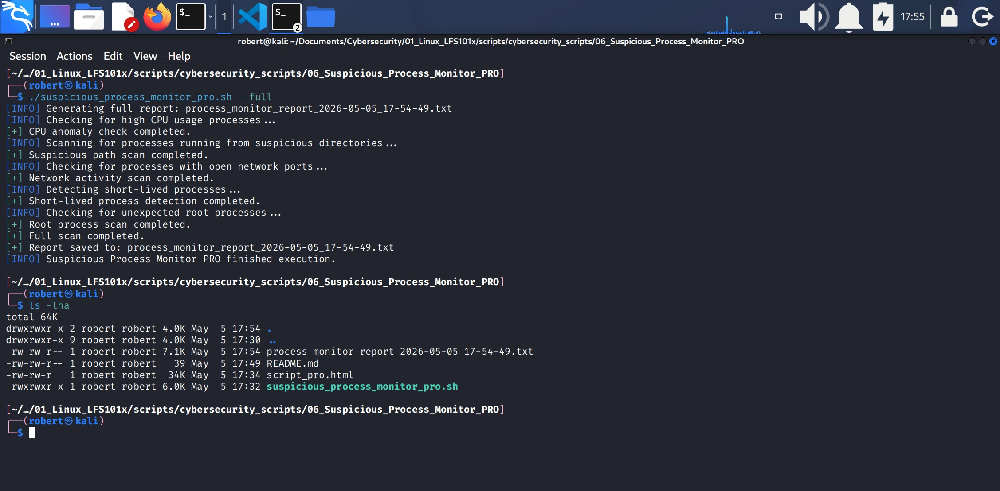
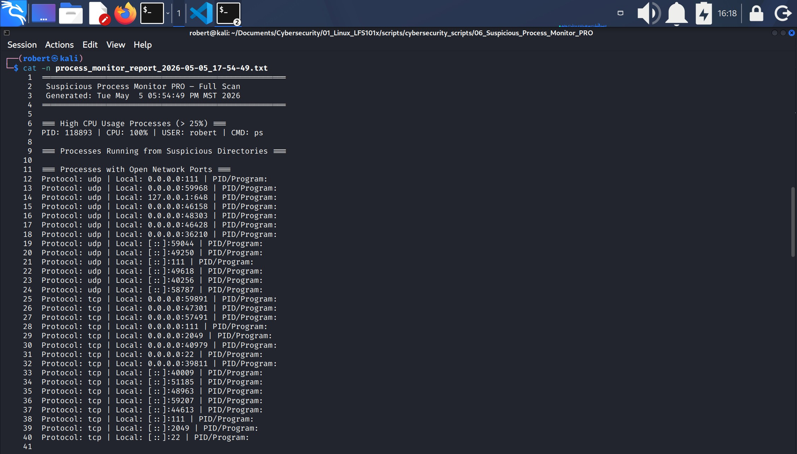
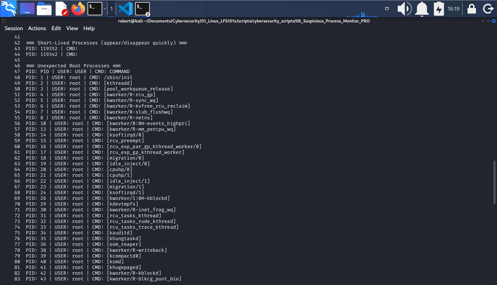

# 6.- SUSPICIOUS PROCESS MONITOR - PRO




## 1.- Script Architecture and Development


### 1.1.- Architecture Overview

This project follows a modular architecture where each detection capability is implemented as an independent Bash function. The system includes:

- a primary detection module  
- multiple analysis modules  
- a full‑scan orchestrator  
- a continuous watch subsystem  
- a CLI dispatcher for user interaction  


### 1.2.- Development Overview

Although several software‑design methodologies exist (Top‑Down, Bottom‑Up, Layered Organization), this project follows a **Development‑Driven Design** approach. The construction strategy used is a project‑specific variant which I call **Core‑First**, where the script is built starting from its functional core and then extended through the modules that depend on it. This results in a clear, modular, and logically structured architecture.

Within this approach, the script is constructed in the natural order in which its functional components should be built. Each stage of the construction process is represented as a **development block**, a self‑contained unit of functionality that builds upon the previous ones and reflects the script’s architectural flow.


#### 1.2.1 Development blocks Sequence

The script was developed following this sequence of **development blocks**:

1. **Core Detection Module (Suspicious Execution Paths)**: Central logic of the system. Scan processes and identifies those running from suspicious directories.
2. **Path Evaluation Function**: Evaluator used by the core module to classify suspicious paths.
3. **Configuration Block**: Defines thresholds, directories, and timing parameters.
4. **Utility Functions**: Logging helpers and formatted terminal output utilities.
5. **Secondary Detection Modules**: Additional detection capabilities that extend the system.
    1. CPU Anomaly Detection.
    2. Network-Active Process Detection.
    3. Short-Lived Proess Detection.
    4. Unexpected Root Process Detection.
6. **Full Scan Orchestrator**: Runs all detection modules and generates a complete report.
7. **Watch Mode Sybsystem**: Continously executes the full scan at a defined interval.
8. **CLI Dispatcher**: Routes command-line arguments to the appropiate module.
9. **Timestamp & Report Initialization**: Creates the timestamp and report filename.
10. **Color Definitions**: ANSI color codes for formatted terminal output.
11. **Header & Metadata**: Project title, author, purpose.
12. **End of Script Notification**: Final message printed after execution.


These development blocks are shown in the **illustration above**, placed on the left side of the code inside blue boxes. Their purpose is to provide a visual representation of the order in which the script was constructed.

This approach results in a clean, intuitive, and logically consistent construction sequence that reflects how an engineer naturally builds a system from the inside out.


## 2.- System enviromenment and configuration
Since this project analyzes system processes only and does not inspect network traffic, there is no need to configure networking components such as iptables, firewalls, or virtual network adapters. Likewise, there is no requirement to generate traffic on the local machine or from any external system.

## 3.- Script Breakdown
This section breaks down the script following its visual top‑to‑bottom order. **It does not represent the chronological order in which the script was developed**, but rather the order in which the user sees and reads the final completed script. Each subsection explains the purpose and behavior of the corresponding lines without embedding the full code.


### 3.1.- Header & Metadata ( 1 - 7)
1. The script uses the `/usr/bin/env bash` shebang.
2. The header is created using comments to describe the project name, author, and purpose.

### 3.2.- Color Definitions ( 9 - 14 )
1. ANSI colors are defined to improve visual clarity when the script runs.
2. For example:
    1. RED="\e[31m"
    2. GREEN="\e[32m", etc ...


### 3.3.- Message Functions ( 16 - 19 )
1. `info()  { echo -e "${BLUE}[INFO]${RESET} $1" >&2; }`: is a Bash function that prints informative messages.
    1. The `info()` function is a utility function (also called a **helper function**). In Bash (and in programming in general) a utility function is a small, reusable function designed to perform one very specific task that **other modules depend on**. It does not handle core logic; instead, its purpose is to assist other functions by providing a standardized behavior they can call whenever needed.
    2. For example: the `check_cpu_anomaly ()` function calls `info()` to display a standarized, color-formatted status message before performing its analysis. 
        * When `check_cpu_anomaly()` executes the line `info "Checking for high CPU usage processes..."`, it passes that string as an argument to `info()`.
        * Inside `info()`, this argument becomes `$1`, which is then printed to the terminal with a blue `[INFO]` prefix and reset color formatting.
        * This allows every module in the script to produce consistent, professional-looking information messages withoug duplicating formatting logic. 
    3. Every time any function in the script calls `info` followed by a **quoted string**, that entire string becomes `$1` inside the `info()` function, and it is the `info()` function that executes on that line.
        * `$1` is replaced by the **string** passed to the `info` function on any line that calls `info "String"`.
    
    * **IMPORTANT**:
        1. `info ()` is an utility function.
        2. `check_cpu_anomaly()` is a module function.

2. The functions `ok()` and `warn()` are also **utility functions**. Their purpose is to display standardized status messages, which are triggered by the **module functions** that call them during execution.


### 3.4.- Timestamp & Report Initialization ( 20 - 21 )
1. **TIMESTAMP=$(date +"%Y-%m-%d_%H-%M-%S")**: sets the variable TIMESTAMP using a date formatted as year-month-day_hour-minute-second.
2. **REPORT="process_monitor_report_$TIMESTAMP.txt"**: creates a filename that includes the base name process_monitor_report plus the timestamp indicating the exact date and time when the file was generated.

### 3.5.- Configuration Block ( 23 - 29 )
1. **CPU_THRESHOLD=25**: This line defines a variable named CPU_THRESHOLD and assigns it the value 25. 
    * In the context of this script, this value represents the percentage of CPU usage that will be considered **suspicious or abnormal**. 
    * Any **process** whose CPU consumption exceeds this threshold will be flagged by the `check_cpu_anomaly()` module. 
    * In other words, the threshold acts as the minimum CPU percentage required for a process to be treated as a potential anomaly during the analysis.

2. **SUSPICIOUS_DIRS=("/tmp" "/var/tmp" "/dev/shm" "/home/$USER/Downloads"):** defines an **array** containing directories that are commonly used by attackers or malware to store or execute temporary files.
    * These paths are monitored by the script because they often host suspicious or unauthorized activity.
    * The variable **stores** all these directories so the **detection module** can scan them later.

* **IMPORTANT**: 
    * The `check_suspicious_paths()` module is responsible for generating the paths to be analyzed. It retrieves the absolute execution path of each running process using `readlink -f /proc/$pid/exe` and passes each path as `$1` to `is_suspicious_path()`, which evaluates whether the path begins with any of the directories listed in `SUSPICIOUS_DIRS`.
    * If the path matches, it is considered suspicious; if it does not, it is treated as normal. 
    * In other words, `SUSPICIOUS_DIRS` does not provide the paths, it defines the criteria used to classify the paths generated by other modules.


3. **WATCH_INTERVAL=5**: sets the default interval (in seconds) used by the **watch mode**. This value determines how long the script waits between each **monitoring cycle** when running in `--watch` mode.


### 3.6.- Help Menu ( 30 - 36 )
 
```
show_help() {
    echo "Usage: $0 [--cpu | --network | --paths | --full | --watch N]"
    exit 0
}
```
* This is a utility function that displays the script’s usage instructions.
* `$0`: represents the name of the script.
* After printing the usage message, the function calls `exit 0`, which indicates a normal and successful termination.


### 3.7.- Utility Functions ( 16 - 18; 41 - 43 )
This section contains small helper functions that support the detection modules. They handle tasks such as appending entries to the report file and evaluating whether a given executable path belongs to a suspicious directory. These utilities keep the main logic clean and focused.
#### 3.7.1.- logs ()

```
log() {
    echo "$1" >> "$REPORT"
}
```
 * This function operates like `info()`, `ok()`, and `warn()` in that it accepts a message through the `$1` argument.
 * Unlike the other utility functions, which display formatted output to the terminal, `log()` writes the received message to the report file specified by *$REPORT**.
 * Whenever a module function calls `log` with a quoted string, that **string** becomes the `$1` argument inside `log()`. 
    * The `log()` function then uses `echo` to append that message to the file specified by the **REPORT** variable.

#### 3.7.2.- is_suspicious_path() 

```
is_suspicious_path() {
    for dir in "${SUSPICIOUS_DIRS[@]}"; do
        [[ "$1" == $dir* ]] && return 0
    done
    return 1
}
```
* `is_suspicious_path()`: is an **utility function** thath checks whether the path provided as `$1` starts with any of the directories listed in the `SUSPICIOUS_DIRS` array. 
    * Its purpose is to return a logical value (`0` for true or `1` for false) so that **other functions** in the script can decide how to handle the path based on this result. 
    * This function does not generate paths on its own; instead, it evaluates the paths supplied by the `check_suspicious_paths()` module. That module is responsible for collecting the execution paths of running processes (using `readlink -f /proc/$pid/exe`) and passing each path as `$1` to `is_suspicious_path()` for classification.


* `for dir in "${SUSPICIOUS_DIRS[@]}"; do` 
    1. `for dir in ...`: starts the **for-loop**. It means "For each element, assign it to the variable `dir` and execute the loop body."
    2. `"${SUSPICIOUS_DIRS[@]}"`: this expands the array **SUSPICIOUS_DIRS** into its individual elements. 
        * `@`: is a Bash array expansion operator used to expand an array into all its individual elements, preserving each item as a separate, properly quoted value.

```
Expanded array without @:
for dir in "$SUSPICIOUS_DIRS"; do
Result:
"/tmp /var/tmp /dev/shm /home/roberto/Downloads"
The loop receives only 1 element.
$dir wouldn't be a directory, but a giant string.
Only 1 iteration with a giant string.
```

```
Expanded array with @:
for dir in "${SUSPICIOUS_DIRS[@]}"; do
Result:
"/tmp"
"/var/tmp"
"/dev/shm"
"/home/roberto/Downloads"
The loop receives 4 elements.
$dir would now be a directory.
4 iterations, 1 for each directory.
```

* 
    3. `do`: marks the beginning of the block of commands that will be executed for each element in the loop.
    4. `[[ "$1" == $dir* ]] && return 0`: checks whether the value passed as `$1` starts with the directory stored in `$dir`. If the condition is true, the function immediately returns 0 (meaning "match found").
        * `[[ ... ]]`: bash conditional test.
        * `$1`: the path being checked.
        * `== $dir*`: Pattern matching:
            * "Does `$1` begin with the directory stored in `$dir`?"
            * The `*` means “any characters that may follow this prefix.” In this context, it allows the pattern to match a directory path that begins with the value stored in `$dir`, followed by anything else.


```
Example:
If $dir = /tmp
Then the pattern is:
/tmp*
So it matches:
- /tmp/x.sh
- /tmp/malware.bin
- /tmp/abc/xyz
```
* 
    * 
        * `&& return 0`: logical **AND**; it means: If the condition is true, then execute `return 0`.
            * `return 0` = true / success.
            * `return 1` = false / no match.
        * So, this line means: "If the path starts with this directory, stop the loop and return success".

    * `done`: finishes the for loop.
    * `return 1`: indicates false / no match. It is placed after `done` because it should only run if the loop finishes without finding a match.

**NOTICE**:
1. This for loop is executed only 4 times because the **SUSPICIOUS_DIRS** array contains exactly 4 elements.
2. `return` is used inside functions to indicate whether a condition is true (0) or false (1).
   * It is used when the result of the conditional test determines a specific action.


### 3.8.- Module 1 - CPU Anomalies ( 52 - 65 )
Detects processes exceeding a defined CPU usage threshold.

#### 3.8.1.- Function check_cpu_anomaly ()
1. `check_cpu_anomaly() {`: defines and opens the function.
2. Calls the `info` function to display a message.
3. `log "=== High CPU Usage Processes (> ${CPU_THRESHOLD}%) ==="`: this line writes a formatted header into the report file indicating that the next sectio lists processes whose CPU usage exceeds the threshold defined by `CPU_THRESHOLD`.
    1. `log`: "append whatever text you pass to it into the report file ($REPORT).
    2. `($CPU_THRESHOLD}%)`:
        * `${CPU_THRESHOLD}`: is a variable; the shell replaces it with its value.

```
Example:
If CPU_THRESHOLD=25, then the final text becomes:
(> 25%)
```


#### 3.8.2.- AWK Block #1

```
ps aux --sort=-%cpu | awk -v th="$CPU_THRESHOLD" '
    $3 > th {
        printf "PID: %s | CPU: %s%% | USER: %s | CMD: %s\n", $2, $3, $1, $11
    }
' >> "$REPORT"
```

This block scans all running processes with `ps aux`, filters thos using more CPU than the configured threshold (`$3 > th`), formats their details with `printf`, and appends them to the report file.

1. `ps aux --sort=-%cpu`: this command lists all running processes.
    1. `ps aux`: shows every process with detailed columns.
        * `ps`: Linux command that stands for: process status. It is one of the core tools used to **list running processes** on a Linux system.
        * `aux`:
            1. `a`: show processes for all users, not just the current one.
            2. `u`: show processes in a user friendly format, including: USER, %CPU, %MEM, COMMAND.
            3. `x`: show processes not attached to a terminal (daemons, background services, etc.).
        * So, `ps aux` means: "Show all processes, from all users, including background ones, in a detailed format."
    2. `--sort=-%cpu`: sorts the output by CPU usage in **decending** order (highest CPU usage at the top).
        * `-%cpu`: highest CPU first.
        * `+%cpu`: lowest CPU first.
        * So this produces a list of processes ordered by CPU consumption.
2. `|`: the output of `ps` is sent directly into `awk`.
3. `awk -v th= "$CPU_THRESHOLD"`: starts an `awk` program.
    1. `-v th="$CPU_THRESHOLD"`: creates an `awk` variable named `th` and assigns it the value of the Bash variable `CPU_THRESHOLD`.
        * `-v`: is to create an `awk` variable.
    2. For example if `CPU_THRESHOLD=25`, then inside awk `th=25`.
4. `$3 > th`: Inside `ps aux`, the **3rd column** (`$3`) is:
    1. `%CPU - the CPU usage of the process`
    2. So, this condition means: "Only process rows where CPU usage is greater than the threshold."
    3. If a process uses more CPU than `th`, the block executes.
5. **The action block**:
```
{
    printf "PID: %s | CPU: %s%% | USER: %s | CMD: %s\n", $2, $3, $1, $11
}
```
* 
    1. This prints a formatted line with:
        * `$2`: PID
        * `$3`: CPU usage
        * `$1`: USER
        * `$11`: COMMAND (the executable name).
    2. So each matching process becomes a clean, readable line.

    ```
    Example output:
    PID: 1234 | CPU: 45.0% | USER: root | CMD: /usr/bin/python3
    ```

    3. Each argument (after the `,`) takes the place of the `%s` place holders.
    4. The double `%%` in `CPU %s%%` is to print a literal **%**.
6. `>> "$REPORT"`: this redirects all `awk` output and appends it to your report file.


### 3.9.- Module 2 - Suspicious Execution Paths ( 67 - 84 )
This is the primary detection module. It scans all running processes and identifies those whose executable path resides inside suspicious directories.

#### 3.9.1.- Function check_suspicious_paths()
1. `check_suspicious_paths() {`: defines and opens the function.
2. `info "Scanning for processes running from suspicious directories..."`: calls for the `info` function, where:
    1. `info`: is the function being invoked, and
    2. The quoted text is the argument passed to the function, it replaces `$1` in the function.
        * The `info` function is: `info()  { echo -e "${BLUE}[INFO]${RESET} $1" >&2; }`.
        * Therefore, the message `"Scanning for processes running from suspicious directories..."` will replaces `$1`.
        * The function prints `[INFO]` in blue, resets the color, and then prints the message.
2. `log "=== Processes Running from Suspicious Directories ==="`: calls the `log` function, where:
    1. `log` is the function being invoked, and
    2. The quoted string is the argument that replaces `$1`.
        * The `log` function is `log () { echo "$1" >> "$REPORT"; }`.       
        *  The function appends the quoted string to the file related to the variable REPORT.
3. `for pid in $(ls /proc | grep -E '^[0-9]+$'); do`: this line iterates over all running processes. It lists the contents of `/proc`, filters out only numeric directory names (which correspond to process IDs), and assigns each PID to the variable `pid` for procssing inside the loop.
* Another way to explain it is: “For every **item** produced by `$(ls /proc | grep -E '^[0-9]+$')`, **store that item in the variable `pid`** for this iteration of the loop.”
    1. `ls /proc`: lists the `/proc` directories.
    2. `| grep -E '^[0-9]+$'`: filters the entries whose names consist only of digits.
        * `-E`: enables extended regular expressions
        * `'`: begins the regex pattern.
        * `^`: start of the string.
        * `[`: begins a character class.
        * `0-9`: defines the allowed range (digits).
        * `]`: closes the character class.
        * `+`: allows one or more digits.
        * `$`: end of the string.
        * `'`: ends the regex pattern.
4. `exe=$(readlink -f /proc/$pid/exe 2>/dev/null)`: resolves the **absolute path** of the executable associated with the process ID stored in `pid`.
* `readlin -f`: follows the `/proc/<pid>/exe` symlink and returns the real executable path.
* Any errors (e.g., inaccessible or terminated processes) are suppressed by redirecting stderr to `/dev/null`.
* The resulting path is stored in the variable `exe`.
    1. `exe`: creates (or overwrites) a variable named `exe`.
    2. `readlink -f`:
        * `readlink`: resolves symbolic links.
        * `-f`: means: "follow all symlinks and return the **canonical absolute path**.

```
This is important because /proc/<pid>/exe is a symlink pointing to the actual executable file on disk.
---
Example:
/proc/1234/exe → /usr/bin/python3.11

readlink -f resolves that and retuns:
/usr/bin/python3.11
```
* 
    3. `/proc/$pid/exe`: it is a symlink to the executable that the process is running.
        * `$pid`: is replaced with the curren PID from the loop. SO if `pid=1234`, the path becomes: `/proc/1234/exe`
    4. `2>/dev/null`: redirects stderr (file descriptor 2) to `/dev/null. It means: "If an error occurs, hide it".
    5. In `/proc/$pid/exe`, `exe` is a symbolic link creted by the kernel that points to the **actual binary** on disk that the process is executing.

5. `[[ -z "$exe" ]] && continue`: checks whether the variable `exe` is empty.
* If `readlink` failed to resolve `/proc/<pid>/exe` (e.g., kernel threads, zombie processes, or permission-restricted processes), `$exe` will be empty.
* In that case, `continue` skips the current loop iteration and moves on to the next PID.
    1. `[[ ... ]]]`: Bash test command.
    2. `-z`: means: true if the string is empty (zero lenghth), so:
        * If `$exe` is empty the condition is **true**.
        * If `$exe` contains a path the condition is **false**.
    3. `&&`: logical AND.
    4. `continue`: skip the rest of the loop body and move on to the next PID.

6. `if is_suspicious_path "$exe"; then`: calls the `is_suspicious_path` function and passes the executable path stored in `exe` as its argument.
    1. `is_suspicious_path`: is the function being invoked.
    2. `"$exe"`: is the absolute path for the executable process.
    3. The `if` statement evaluates the function's exit status:
        * If the function returns `0` (the path begins with a suspicious directory), the condition is **true** and the code inside the `if` block runs.
        * If the function returns `1`, the condition is false and the process is ignored.

7. `cmd=$(tr -d '\0' < /proc/$pid/cmdline)`: reads the command line used to start the process from `/proc/<pid>/cmdline`, removes all null-byte separators using `tr -d '\0'`, and stores the cleaned, human-readable command string in the variable `cmd`.
    1. `cmd=`: creates (or overwrits) a variable named `cmd`.
    2. `/proc/$pid/cmdline`: this is a special kernel-generated file that contains the **exact command line** used to start the process.
        * The arguments are separated by **null bytes** (\0), not spaces.
        * This makes it unreadable if you print it directly.
        * For example: **python3\0script.py\0--verbose\0**.
    2. `tr -d '\0'`: delete null bytes.
        * `tr`: is the character translation tool.
        * `-d`: means **delete**.
        * `'\0'`: means **delete null bytes**.

```
So python3\0script.py\0--verbose\0
Becomes:
python3script.py--verbose

Most processes include spaces in the original command, so after removing nulls, you get something readable like:
python3 script.py --verbose

* For many processes, the kernel inserts spaces automatically when nulls are removed.
```
* 
    3. `< /proc/$pid/cmdline`: input redirection.
        * This means: feed the contents of `/proc/$pid/cmdline` into the `tr` command.
        * So `tr` reads from the file instead of **stdin**.

8. `log "PID: $pid | EXE: $exe | CMD: $cmd"`: calls the `log` function to append a formatted line to the report file. The line includes the process ID, the absolute path of its executable, and the command line used to start the process.
    1. `log`: calls the `log` function to write a line of text to the report file ($REPORT).
    2. `"PID: $pid | EXE: $exe | CMD: $cmd"`: the message being logged.

```
Example output:
PID: 1234 | EXE: /tmp/malware | CMD: ./malware
```

9. `fi`: closes the `if` conditional test.
10. `done`: closes the for loop.
11. `ok "Suspicious path scan completed."`: calls the `ok` function and `$1` becomes in the argument "Suspicious path scan completed."
    * This message appears on screan after all iterations of the for loop were done.
12. `log ""`: calls the `log` function to include a blank line to the report file ($REPORT).
13. `}` closes the function.
    * Closes development block number 1.

---
#### Narrative Summary of What This Module Does

In simple terms, this module works as follows:

1. It uses a function to display a status message on screen.  
2. It uses another function to append a header string to the report file referenced by `$REPORT`.  
3. It enters a loop that scans the `/proc` directory, selecting only entries whose names consist of one or more digits. Each of these entries is treated as a process ID (`pid`).  
4. For each PID, it attempts to resolve the absolute path of its executable and stores it in the variable `exe`.  
5. If no executable path is found, the script simply skips that PID and continues.  
6. Once both `pid` and `exe` are available, the function evaluates a conditional `if` that calls another function to determine whether the executable path belongs to one of the suspicious directories defined in the array. The function returns `0` if the path is suspicious and `1` otherwise.  
7. If the executable is located inside a suspicious directory, the script retrieves the command line used to start that process.  
8. It then uses the logging function to append the formatted string  
   ```
   PID: $pid | EXE: $exe | CMD: $cmd
   ```  
   to the report file.  
9. The `if` block closes, and the loop continues until all PIDs have been processed.  
10. After the loop finishes, the script calls the `ok` function to display a completion message on screen.  
11. Finally, it calls the `log` function again to append a blank line to the report file for readability.


### 3.10.- Module 3 - Network-Active Processes ( 86 - 99)
Identifies processes with open network ports by parsing socket information.

#### 3.10.1.- Function check_network_activity ()
1. `check_network_activity () {`: defines the function.
2. Calls for the `info` function to display a message on screen.
3. `log` appends a message to the report file `$REPORT`.


#### 3.10.2.- AWK Block #2 
```
ss -tulnp 2>/dev/null | awk '
    NR>1 {
        printf "Protocol: %s | Local: %s | PID/Program: %s\n", $1, $5, $7
    }
' >> "$REPORT"
```
This block lists all **listening TCP/UDP sockets**, skips the header, extracts protocol, local address, and PID/program, formats them into readable lines, and appends them to the report file.

1. `ss`: is a modern replacement for `netstat`. This command lists **active network sockets**.
2. `-tulnp`: are flags, they mean:
    1. `t`: TCP sockets.
    2. `u`: UDP sockets.
    3. `l`: only listening sockets.
    4. `n`: show numeric addresses (don't resolve hostnames).
    5. `p`: show the process using the socket (PID/program).
3. `2>/dev/null`: redirects stderr (file descriptor 2) to `/dev/null`.
4. `| awk ' ... '`: the output of `ss` is piped into an `awk` script.
5. `NR > 1`: means "Skip the first line (the header). Process only real data rows."
    1. `NR`: Number of Record (line number).
6. **The AWK action blok**:
```
{
    printf "Protocol: %s | Local: %s | PID/Program: %s\n", $1, $5, $7
}
```
* 
    1. For each row after the header, AWK prints a formatted line using specific columns from `ss`:
        * `$1`: Protocol (tcp, udp).
        * `$5`: Local address + port (e.g., 0.0.0.0:22).
        * `$7`: PID/program (e.g., `1234/sshd`).
    ```
    Example output:
    Protocol: tcp | Local: 0.0.0.0:22 | PID/Program: 1234/sshd
    ```

    2. Each argument after the `,` replaces the `%s` placeholders.

### 3.11.- Module 4 - Short-Lived Processes ( 101 - 124)
Detects processes that appear only once during multiple sampling intervals, indicating short-lived or transient execution.
#### 3.11.1.- Function check_short_lived ()
This function samples running processes twice, one second apart, identifies processes that appear onlye once (short-lived), retrieves their commands, and logs them into the report.

1. `check_short_lived () {`: defines the function.
2. `info`: Calls the `info` function to print a message on the screen.
3. `log`: Calls the `log` function to append a header into the report file.
4. `declare -A seen`: creates an associative array named `seen`. This array will **track how many times each PID appears** during sampling.
    * `declare`: Bash built-in used to define variables with **specific attributes**.
    * `-A`: tells bash to create the variable as an associative array.
    * `seen`: is the name of the associative array.

5. **First loop: sample processes twice**:
    1. `for i in {1..2}; do`: this is the **outer loop**.
        * `{1..2}`: is a Bash brace expansion that generates the sequence `1 2`, so the loop runs exactly **two iterations** (i=1 and i=2).
            1. It generates two separate values: `1` and `2`.
            2. The `for` loop assigns each value to `i` on every iteration.
    2. `for pid in $(ps -e -o pid=); do`: this is the **inner loop.** It runs inside the outer `{1..2}` loop. Its job is to iterate over **every running process** in the system.
        * `ps -e -o pid=`: lists all running processes, outputs only their PIDs, and removes the header line.
            1. `ps`: lists processes status.
            2. `-e`: show all processes. 
            3. `-o`: output only. Choose exactly which columns `ps` should display.
            4. `=`: removes the header.
        * The command substitution expands into a list of PIDs, and the `for` loop assigns each PID to the variable `pid` on each iteration.
    3. `seen[$pid]=$((seen[$pid]+1))`: this line increments a counter for each PID to track how many times it appears it appears across the two sampling rounds.
        * `seen[$pid]`:
            1. `seen`: is the associative array.
            2. The key is the PID (`$pid`).
            3. The value is how many times that PID has been observed.
        * `$(( ... ))`: arithmetic expansion. It tells Bash "Evaluate this as a math expression."
        * `seen[$pid]+1`:
            1. If the PID was seen before: increment its count.
            2. If the PID was **never** seen before: its value defaults to 0, so it becomes 1.           
    3. `done`: finishes the inner loop.
    4. `sleep 1`: waits one second before the second sampling round.
    5. `done`: finishes the outer loop.

* **NOTICE:** why two samples?, because a **short-lived process** will appear in only one of the two samples. A normal process appears in both.

5. **Second loop: detect short-lived processes**:
    1. `for pid in "${!seen[@]}"; do`: this line iterates over all the keys of the associative array `seen`.
        * `"${!seen[@]}"`: itereate over all PIDs stored in `seen`. Expand to all keys (PIDs) in the associative array.
            1. `${seen[@]}`: expands to all **values**.
            2. `${!seen[@]}`: expands to all **keys**.
        * `@`: is an array expansion operator. It tells Bash "Expand ALL elements of the array.
            1. Without `@`, Bash would treat the array as a single string.
            2. With `@`, Bash expands each element separately, preserving spacing and quoting.

    2. `if [[ ${seen[$pid]} -eq 1 ]]; then`:
        * `seen[$pid] -eq 1`: condition. If a PID was seen only once, it means:
            1. The process existed in one sample but disappeared before the ext.
            2. This is the definition of a **short-lived process**
    3. `cmd=$(ps -p $pid -o cmd= 2>/dev/null)`: attempts to retrieve the command that launched the process. If the process already died, this may return empty, that's normal.
        * `ps -p $pid -o cmd= 2>/dev/null`:
            1. `ps`: lists processes status.
            2. `-p`: select process by PID; show information only for this specific PID.
            3. `-o`: choose the output format (which columns to print).
            4. `cmd`: the `ps` field that prints the full command line of the process.
            4. `=`: removes the header (no "CMD" label).
            5. `2>/dev/null`: suppresses error messages (e.g., if the PID no longer exists).
    4. `log "PID: $pid | CMD: $cmd"`: Calls the `log` function to append the short-lived process entry into the report ($REPORT).
    5. `fi`: closes the conditional test.
    6. `done`: finishes the for loop.
6. `ok`: calls the `ok` function to print a message on the screen.
7. `log`: calls the `log` function to append an empty line in the report file ($REPORT).


### 3.12.- Module 5 - Unexpected Root Processes ( 126 - 139)
Flags root-owned processes that do not match a whitelist of expected system services.
#### 3.12.1.- Function check_root_processes ()
1. `check_root_processes () {`: defines the function.
2. `info`: Calls the `info` function to print a message on the screen.
3. `log`: Calls the `log` function to append a header to the report file ($REPORT).


#### 3.12.2.- AWK Block #3

```
ps -U root -u root u | awk '
    $11 !~ /(systemd|NetworkManager|dbus-daemon|cron|rsyslogd|sshd)/ {
        printf "PID: %s | USER: %s | CMD: %s\n", $2, $1, $11
    }
' >> "$REPORT"
```
This block lists all processes running as root, filters out known legitimate system daemons, and prints only **unexpected root processes**.

It uses `ps -U root -u root u` to gather root-owned processes, and AWK checks the command column (`$11`) against a list of allowed root services. Any process not matching the whitelist is reported with its PID, user, and command.

1. **AWK Input and Processing Logic.** 
    1. `ps -U root -u root u | awk '`: this command line lists all processes running as root, using the `u` format (user-oriented output).
        * `ps`: lists processes status.
        * `-U root`: real user is root.
            1. `-U`: real user ID (RUID); the user who started the process.        
        * `-u root`: effective user is root.
            1. `-u`: effective user ID (EUID); the user the process is running as.
        * `-u`: display user-friendly columns (USER, PID, %CPU, %MEM, COMMAND, etc.)
    2. `| awk '`: starts the AWK script

2. **The AWK condition.**
    1. `$11 !~ /(systemd|NetworkManager|dbus-daemon|cron|rsyslogd|sshd)/`: means "If the 11th column (COMMAND) does NOT match any of these known safe root processe, process it.
        * `$11`: the COMMAND column in `ps u` output.
        * `!~`: "does NOT match the regex".
            1. `~`: operator that means "matches".
            2. `!`: operator that means "NOT"
        * The regex lists **legitimate root processes** you want to ignore:
            1. systemd
            2. NetworkManager
            3. dbus-daemon
            4. cron
            5. rsyslogd
            6. sshd
                * So AWK filters out **expected** root processes and keeps only **unexpected** ones.
        * So, this condition means "The 11th field DOES NOT match any of the following patterns".
        * In other words: If the **command** of this process **DOES NOT** contain any of this names, process it.
3. **The AWK action**:

```
{
    printf "PID: %s | USER: %s | CMD: %s\n", $2, $1, $11
}
```
This is the action AWK will take if the condition is **true**.
*    
    1. `printf`: prints formatted text.
    2. The arguments after `,` replace the placeholders `%s`.
    3. `\n`: means a new line.
4. **AWK closing and redirection**
    1. `' >> $REPORT`: redirects the AWK output to the report file ($REPORT).
        * `'`: ends the AWK script.
5. `ok`: Calls the `ok` function to print a message on the screen.
6. `log`: Calls the `log` function to append a blanck line to the report file ($REPORT).
7. `}`: function ends.


### 3.13.- Full Scan Orchestrator (141 - 160)
Coordinates all detection modules and generates a complete system activity report.
#### 3.13.1.- Function run_full_scan ()
1. `info`: Calls the `info` function to print a message on the screen that includes the name of the report file ($REPORT).
2. The `log` function is called a series of times to append a header for the **full scan**.


#### 3.13.2.- Execution Flow
The full scan is performed by **invoking each detection module through its corresponding function**.  
The execution flow must follow the exact order defined in the script.  
Each module occupies its position for a specific technical reason, ensuring that time‑sensitive signals are captured correctly and that no module interferes with the accuracy of another.

1. **Execution Flow:**
    1. **check_cpu_anomaly**  
        Runs first because CPU spikes are highly time‑dependent.  
        Processes consuming abnormal CPU may terminate quickly, so this module must capture them while they are still alive.

    2. **check_suspicious_paths**  
        Executed after CPU analysis to inspect the execution paths of currently running processes.  
        If delayed, short‑lived suspicious processes may disappear before being analyzed.

    3. **check_network_activity**  
        Requires active processes to inspect open sockets and network connections.  
        Running it earlier ensures that transient network activity is not missed.

    4. **check_short_lived**  
        This module detects processes that have already terminated.  
        It must run after all modules that depend on live processes, otherwise it would produce false negatives.

    5. **check_root_processes**  
        Root‑owned processes are typically long‑running and stable.  
        This module is placed last because it does not depend on timing and can safely run after all volatile checks.

        * Maintaining this order guarantees consistent, reliable, and complete detection across all modules.

2. `ok`: calls the `ok` function and prints a message on the screen.
3. `echo -e`: prints a success message on the screen.
4. `}`: the function ends her.


### 3.14.- Watch Mode Subsystem (162 -175)
Runs continuous monitoring by executing the **full scan** at fixed intervals.

#### 3.14.1.- Function run_watch_mode ()
1. `run_watch_mode () {`: defines the function.
2. `interval=$1`: assigns the first argument received by the function, representing the interval value in seconds.
3. `info`: Calls the `info` function and prints a message on the screen.
4. `echo`: prints a message on the screen to indicate how to stop the continuous full scan.

#### 3.14.2.- Loop Behavior
This loop implements the continuous monitoring mode `--watch`.
It repeatedly generates a new report, runs a full scan, waits for the specified interval, and then repeats indefinitely.

1. **Infinite Loop**
    1. `while true; do`: this starts an **infinite loop**. It keeps running until the user manually stops it (usualy with CTRL+C).
        * `true` is a command, that runs instantly, does nothing, and always returns exit statos 0 (success).
            1. `true`: is a command that always succeeds.
            2. `while` executes its block as long as the command (`true`) alwys returns 0.
            3. Since `true` always returns 0, the loop never ends, and the block is executed infinitely.
2. **Action 1**: Generate a new timestamped report filename
    1. `REPORT="watch_report_$(date +"%H-%M-%S").txt"`: the timestamp (HH-MM-SS) ensures that a **new report filename** is generated on every iteration.
        * each report is unique
        * no file is overwritten
        * reports are chronologically ordered
3. **Action 2**: run the full scan silently
    1. `run_full_scan >/dev/null`: runs the entire full scan, but sends its terminal output to `/dev/null`.
4. **Action 3**: Wait before the next iteration
    1. `sleep :$interval"`: pauses execution for the number of seconds specified by the user.


### 3.15.- CLI Dispatcher ( 177 - 187)
This block is the **command-line dispatcher**. It routes command-line arguments to the appropiate detection module or mode.
1. `case "$1" in`: starts a `case` statement that evaluates the first command-line argument. This is how the script decides what the user wants to run. In other words, it starts a **case-statement** and compares the **first** command-line **argument** against the **available options**.
    1. `case`: this keyword begins a multi-branch conditional in Bash.
        * It works lika a switch-statement in other languages.
        * It means: "Evaluate this value and compare it against several possible patterns".

    2. `"$1"`: is the first positional parameter. It contains whatever the user typed after the script name.
    ```
    Example:
    ./script.sh --cpu

    So:
    If the user runs --cpu, then $1 = --cpu.
    ```

    3. `in`: this keyword tells Bash:
        * Start checking `$1` against the patterns that follow."
        * Everything after this line (until `esac`) is a list of patterns and actions.

2. `--cpu) check_cpu_anomaly ;;`: 
    1. If the user runs ```./script.sh --cpu```, the script calls the **CPU anomaly detection module**. So that is the only detection module the script will executate.

3. The same logic works for the patterns for `--paths`, `--network`, and `--full`.
4. `-- watch) run_watch_mode "$2" ;;` means: "If the user selects `--watch`, start the continuoous monitoring mode and use the second argument as the scan interval".
```
Example:
./script.sh --watch 5

$1 = --watch
$2 = --5 (the interval in seconds)
```
* 
    1. `run_watch_mode "$2"` calls the function `run_watch_mode` and passes the second argument `$2` to it
4. `*) show_help ;;`: is the **default / fallback case** in the `case` statement.

It means: If the user passes an argument that **does NOT** match any of the valid options, then execute `show_help`.
* 

    1. So it triggers when:
        * The user passes an unknown argument.
        * The user passes a misspelled argument.
        * The user passes no argument at all (because `$1` is empty).

5. `esac`: ends the `case` statement.


### 3.16.- End of Script ( 189 - 192)
Final message printed when the script finishes execution.

1. `echo -e "${BLUE}[INFO]${RESET} Suspicious Process Monitor PRO finished execution." >&2`: this command prints a message on the screen indicating the script has finished execution.

## 4.- Final report interpretation



### 4.1.- High CPU usage processes
The only entry in this section is the `ps` command at 100%, which is normal because `ps` briefly spikes CPU usage when executed.
* Interpretation: No malicious activity; expected behavior.

### 4.2.- Processes Running from Suspicious Directories
The section is empty.
* Interpretation: No processes are running from suspicious paths; this is a good sign.

### 4.3.- Processes with Open Network Ports
Many entries lack a PID because kernel-level sockets or system services do not always map to a user-space process.

All ports shown (SSH, NFS, system services) are typical for a **Linux VM**.

* Interpretation: Normal system activity; no suspicious network listeners detected.



### 4.4.- Short-Lived Processes (appear/disappear quickly)
Short-lived processes are common in Linux (kernel tasks, system utilities, background jobs).

The **commands** are empty because the processes ended before their command line could be captured.

* Interpretation: Normal behavior; not indicative of malicious activity.

### 4.5.- Unexpected Root Processes
Displays root‑owned processes that do not match a small whitelist of expected services.
Most entries are kernel threads (`[kworker]`, `[rcu]`, `[nfsd]`, etc.) or legitimate system daemons (`Xorg`, `lightdm`, `VBoxService`, `ModemManager`).

* Interpretation: All entries are normal for a Linux system, **especially inside a virtual machine**. No malicious root processes detected.


### 4.6.- Overall Summary
* The report shows no indicators of compromise.
* All detected items correspond to normal system behavior in a **Linux VM** enviroment.

---
End of project **six**, thanks for reading.
- Roberto Orozco