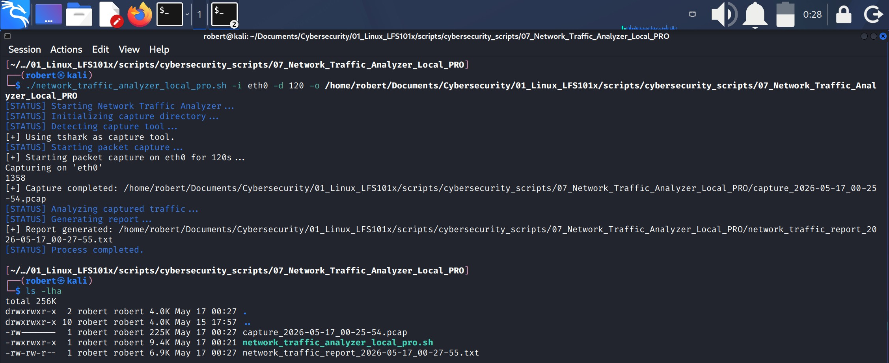
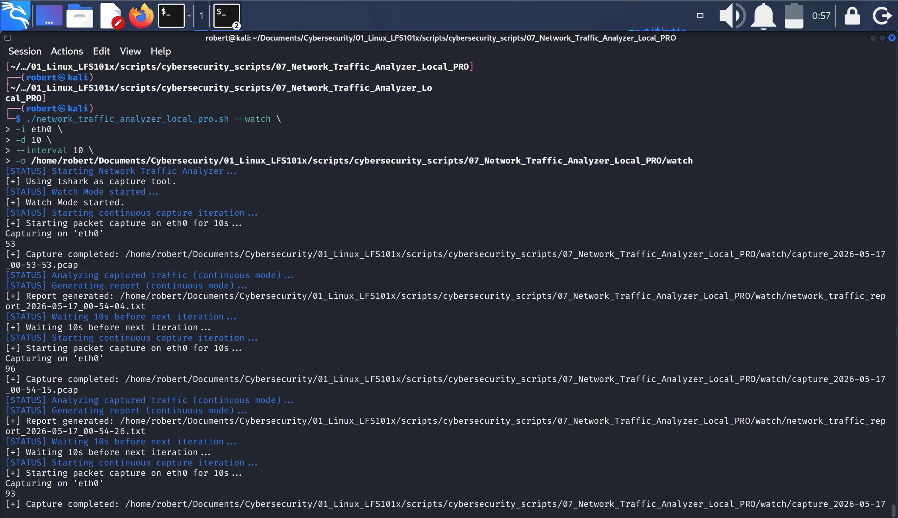
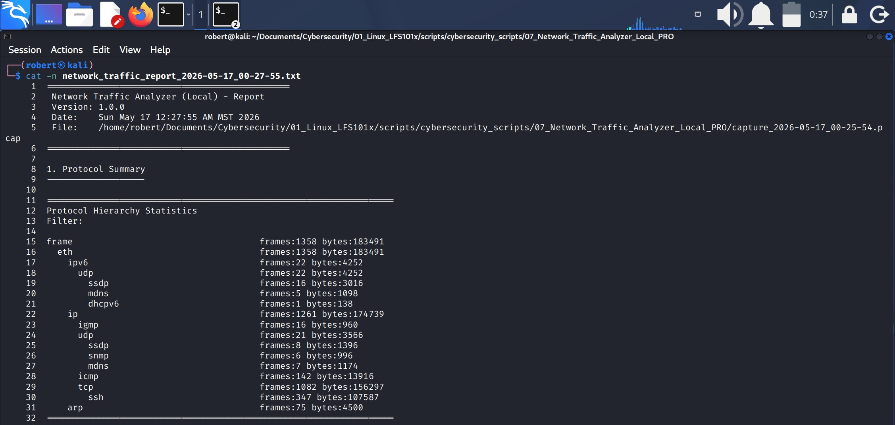
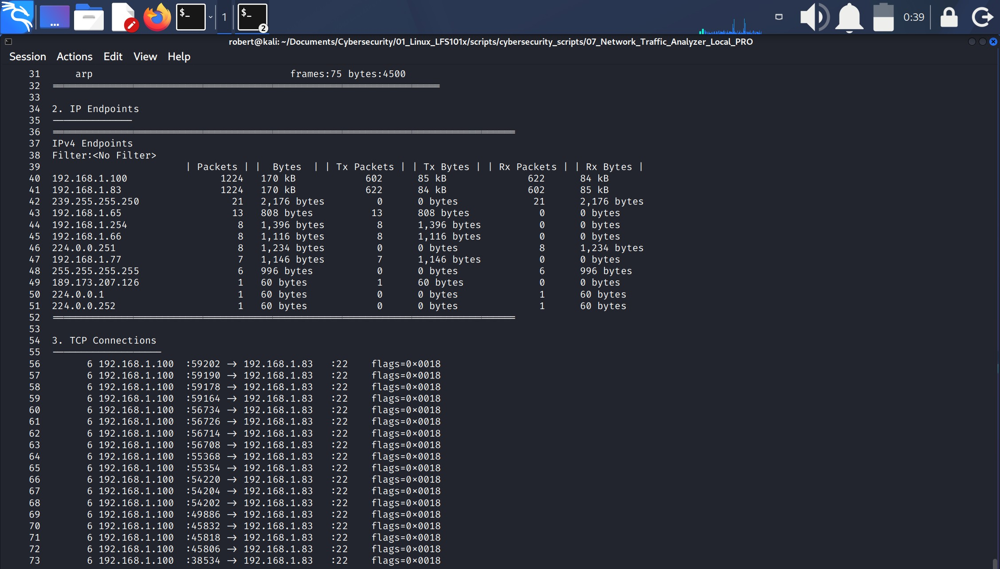
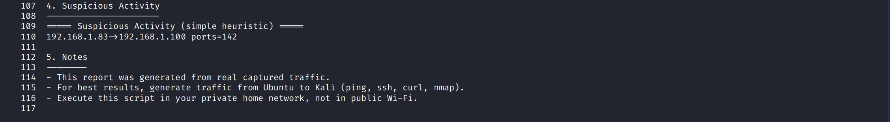
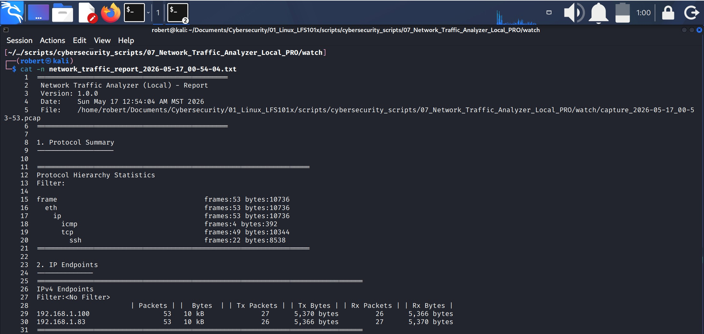
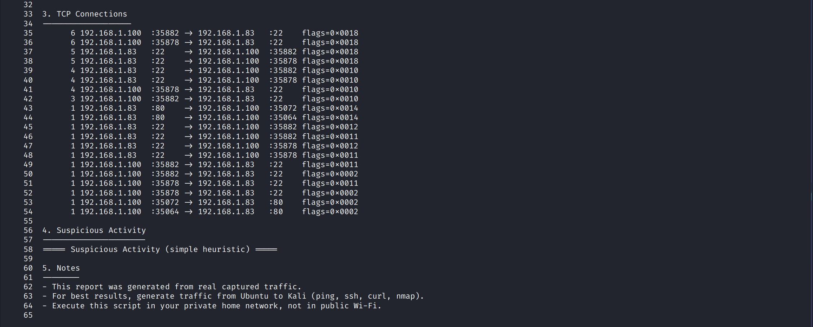

# 7.- NETWORK TRAFFIC ANALYZER (LOCAL) - PRO

### Single Mode, One-Time Capture and Report

**Single Mode run of the Network Traffic Analyzer PRO, capturing 120 seconds of traffic on eth0 and generating a standalone analysis report.**

### Watch Mode Execution

**Automated Watch Mode execution showing repeated 10‑second packet captures on eth0, followed by traffic analysis and report generation in the watch directory.**


## 1.- Script Architecture and Development

### Project Architecture Overview

**This diagram illustrates the conceptual architecture of the system, showing how each module contributes to packet capture, analysis, detection, and reporting. The numbered blocks represent functional roles, not execution order, and highlight the modular design that separates primitives, heuristics, orchestration, and user interaction.**


### 1.1.- Architecture Overview
This project follows a modular architecture where each monitoring and analysis capability is implemented as an independent Bash function. The system includes:

1. A core packet-capture engine
2. Multiple traffic-analysis modules.
3. A suspicious-pattern evaluator.
4. A continuous watch-mode subsystem, and
5. A CLI dispatcher for user interaction.

These components collectively form a structured, extensible, and automation-ready network traffic monitoring system.


### 1.2.- Development Overview
Although several software‑design methodologies exist (Top‑Down, Bottom‑Up, Layered Organization), this project follows the Development‑Driven Construction Order — Classic Variant.

Under this methodology, the script is constructed according to the conceptual responsibilities of its components rather than strict dependency order. The goal is to build the system in the same logical sequence in which an engineer naturally organizes its functional modules.

DDCO‑Classic organizes the script into development blocks, each representing a coherent unit of functionality grouped by purpose, clarity, and architectural role.

#### 1.2.1.- Development Blocks Sequence

The script was developed following this sequence of development blocks:

1. **Core Capture Engine:** Implements the packet‑capture functionality that produces the raw PCAP files used by the rest of the system.
2. **Core Analysis Primitives:** Provides the essential analytical operations such as protocol summaries, endpoint enumeration, and connection inspection.
3. **Suspicious Pattern Evaluator:** Applies heuristic logic to detect potentially abnormal or malicious traffic patterns.
4. **Report Builder:** Generates a structured, human‑readable report that consolidates all analysis and detection results.
5. **Orchestrator Module:** Coordinates the full workflow, executing capture, analysis, detection, and reporting in the correct sequence.
6. **CLI Handler:** Processes command‑line arguments, validates user input, and selects the appropriate operational mode.
7. **Configuration Layer:** Defines global parameters, defaults, thresholds, and directory paths used throughout the system.
8. **Utility Layer:** Provides cross‑cutting helper functions such as logging, timestamp generation, directory initialization, and command checks.
9. **Metadata & Header:** Contains script metadata including version, description, and contextual notes.

These development blocks are shown in the illustration above, placed on the left side of the code inside blue boxes. Their purpose is to provide a visual representation of the order in which the script was constructed.

This DDCO‑Classic approach results in a clean, intuitive, and logically structured construction sequence that reflects how an engineer naturally organizes a system from its primary responsibilities outward.


## 2.- System enviroment and configuration
This project performs **local packet capture and traffic analysis** using `tcpdump` and `tshark` inside a Kali Linux virtual machine.  
No advanced network configuration is required: the VM only needs to run in **Bridged Adapter** mode so it can observe LAN traffic and generate its own packets during execution.

Although the script does not depend on external systems, a **second virtual machine (Ubuntu)** was used during testing to generate realistic traffic toward the Kali VM.  
This included ICMP, SSH, HTTP, and Nmap scans, allowing the capture engine and detection logic to operate under real conditions.

No firewall rules, iptables modifications, or additional network services were required.  
The default Kali networking stack and packet‑capture tools are sufficient for full functionality.

## 3.- Script Breakdown
This section breaks down the script following its visual top‑to‑bottom order. It does not reflect the chronological order in which the script was developed, but rather the order in which the user reads the final completed script. Each subsection explains the purpose and behavior of the corresponding lines.

### 1. Header & Metadata  
**Lines 1–7**
Describes the script and its purpose.


### 2. Shell Options (Strict Mode)  
**Lines 9–12**
1. `set -o errexit`: this makes the script stop immediately if any command returns an error (a non-zero exit code).
    1. Without this, Bash would keep running even after a failure, which can cause corrupted output or unpredictable behavior.

2. `set -o pipefail`: this makes a pipeline fail if any command inside the pipeline fails, not just the last one.
    1. If any part of a pipeline fails, treat the whole thing as a failure.
3. `set -o nounset`: this makes the script exit if it tries to use a variable that has not been defined.
    1. Without `nounset`: prints an empty string.
    2. With `nounset`: script stops with an error.

* `-o`: means "set an option" when used with the `set` command. The word after `-o` is the name of the behavior you want to enable.

### 3. Global Config & Core State  
**Lines 14–26**
Defines global parameters, constants, and system state.

### 4. Utility Layer (Cross‑cutting Utilities)  
**Lines 28–67**
Provides helper functions used across all modules.
    

#### 4.1 Color Definitions  
**Lines 33–36**
Defines colors for status messages:
1. `BLUE="\e[34m"`
2. `RESET="\e[0m"`

#### 4.2 Logging Utilities  
**Lines 37–40**
Defines functions for status messages:

 1. `log_info() { echo "[+] $*"; }`: defines a function that can be called anywhere in the script. Its purpose is to display on the screen an information message.
        * The message starts with the prefix `[+]`.
        * It continues with all the arguments passed to the function (`$*`) in a single line.
2. `log_warn() { echo "[!] $*" >&2; }`: Defines a function that prints a warning message.
    * The message is sent to stderr (`>&2`).
    * STDERR is normally visible on the screen, so the message appears on the terminal.
    * When the script redirects STDERR into the report file, this message is also included in the report.
3. `log_error() { echo "[-] $*" >&2; }`: Defines a function that prints an error message.
    * The message is sent to stderr (`>&2`).
    * It appears on the screen and is also written on the report file when stderr is redirected.

Later in the script, the `report‑building` function redirects both STDOUT and STDERR into the report file. Because `log_warn` and `log_error` write to STDERR, their messages are captured inside the report file during that phase.


#### 4.3 Timestamp Utility  
**Line 41**
Defines the `timestamp()` function expanding `date` and adding to it: year, month, day, hour, minute and second.

#### 4.4 Command Requirement Checker  
**Lines 43–46**
`require_cmd() {`: this defines and opens a function.
* It checks whether a given command exist in the system.
* It receives the command name as its first argument, stores it in a local variable, and uses `command -v` to test for its presence.
* All output is suppressed, and the function returns success (0) if the command exists or failure (1) if it does not.
* This allows other parts of the script to **validate dependencies** cleanly.
    1. `local cmd="$1"`: declares a local variable named `cmd` and assigns it the value of the first argument passed to the function.
    ```
    Example:
    require_cmd geoiplookup

    Inside the function:
    - $1 = geoiplookup
    - cmd = "geoiplookup"
    ```
    2. `command -v "$cmd" >/dev/null 2>&1`:
        * `command -v`: checks if a command exists in the system's PATH.
    3. `>/dev/null 2>&1`: means: "Hide STDOUT", "Hide STDERR"; so the user sees no output, only the return code matters.
    4. `}`: closes the function.

#### 4.5 Capture Directory Initializer  
**Lines 48–54**
`init_capture_dir() {`: defines and opens a function.
* It ensures that the output directory used for packet captures exists.
* It receives the directory path as its first argument, checks whether it already exists, and creates it if necessary using `mkdir -p`.
* When a new directory is created, the function logs an informational message through `log_info()`.
    1. `local dir="$1"`: creates a local variable named `dir` and assigns it the value of the first argument passed to the function.
        * This is the directory path the script shoud use for storing captures and reports.
    2. `if [[ ! -d "$dir" ]]; then`: checks whether the directory **does not exist**.
    3. If the condition is true, then the program creates a directory with `mkdir -p "$dir"`.
        * `-p`: ensures:
            * parent directories are created if needed.
            * no error is thrown if the directory already exists.
    4. `log_info "Capture directory created: $dir"`: prints an informational message indicating that the directory was created.
    5. `fi`: closes the `if` block.
    6. `}`: closes the function.

#### 4.6 Capture Tool Detector  
**Lines 56–67**
`detect_capture_tool() {`:declares and opens a function.
* It determines which **packet-capture tool** is available on the system.
* It first checks for `tshark` using `require_cmd()`. If `tshark` is installed, the function sets `CAPTURE_TOOL=tshark` and logs an informational message.
* If `tshark` is not available, it checks for `tcpdump` and selects it if present.
* If neither tool is installed, the function logs an error message and terminates the script with exit code 1.
    1. `if require_cmd tshark; then`: calls the helper function `require_cmd` to check whether the command `tshark` (firts argument) exists in the system.
        * If `tshark` is installed the condition is true.
        * If not, the condition is false and the script moves to the `elif`.
    2. `CAPTURE_TOOL="tshark`: if `tshark` is available, the script sets the global variable `CAPTURE_TOOL` to `"tshark"`.
        * This tells the rest of the script: "Use `tshark` for packet capture and analysis."
    3. `log_info "Using tshark as capture tool."`: Prints an informational message indicating that `tshark` was selected.
    4. `elif require_cmd tcpdump; then` if `tshark` was not found, the script checks for `tcpdump`.
        * If `tcdpdump` exists, this branch runs.
        * If not, the script moves to the `else` block.
    5. `CAPTURE_TOOL="tcpdump"`: if `tcpdump` is available, the script sets the capture tool to `"tcpdump"`.
    6. `log_info "Using tcpdump as capture tool."`: logs that `tcpdump` will be used.
    7. `else`: this block runs only if neither `tshark` or `tcpdump` are installed.
    8. `log_error "Neither tshark nor tcpdump is installed."`: prints an error message to stderr.
    9. `exit 1`: stops the script immediately with exit code 1 (error). This script cannot continue without a capture tool.
    10. `fi`: closes the entire `if / elif / else` structure.
    11. `}`: closes the function.

```
In an if statement, you always start with one if condition. After that, you can add as many elif (“else if”) sections as you need. Each elif gives the script another condition to check, but only if all the previous conditions were false.

The else part is optional, but if you decide to use it, you can only include one else block, and it must always be the last part of the entire conditional. The else block runs only when none of the if or elif conditions were true. Because it represents the “everything else” case, it only makes sense to have it once.
```

### 5. Core Capture Engine  
**Lines 70–102**
The dominant module. Defines the script's purpose: capturing traffic.

#### 5.1 run_capture_once()  
**Lines 74–102**
1. `run_capture_once() {`: defines and opens the function.
2. `local iface="$1`: creates a local variable named `iface` inside the function and assigns it the value of the firts argument passed to the function.
    1. `local`: limits the variable to the function's scope.
    2. `iface`: the variable name.
    3. `"$1"`: the first positional parameter (argument #1).
3. `local duration="$2"`: creates a local variable named `duration` inside the function and assigns it the value of the second argument passed to the function.
4. `local out_dir="$3"`: creates a local variable named `out_dir` inside the function and assigns it the value of the third argument passed to the function.
4. `local ts`: declares a local variable named `ts` inside the function **without assigning a value yet.**
    1. `local`: limits the variable's scope to the function.
    2. `ts`: the variable name.
    3. no `=`: the variable is created but still empty.
5. `ts="$(timestamp)"`: this line assigns the output of the `timestamp` function to the variable `ts`.
    1. `timestamp`: this is a function defined earlier.
    2. `$(timestamp)`: runs that function and captures its output.
    2. `ts="..."`: stores that output in the variable `ts`.
    4. The quotes ensure the value is treated as a single string.
    5. `local ts` (from the previous line) means the variable exists only inside the function.
6. `local pcap_file="${out_dir}/capture_${ts}.pcap"`: this line creates a local variable named `pcap_file` and assigns it a full file path for the output `.pcap` file, using both the output directory and the timestamp.
    1. `local`: declares the variable with function-local scope, preventing it from leaking outside the function.
    2. `pcap_file`: the name of the variable that will store the path of the capture file.
    3. `"${out_dir}/capture_${ts}.pcap"`: builds a file path by combining:
        * the output directory (`out_dir`)
        * the prefix `capture_`
        * the filestamp (`ts`)
        * the `.pcap` extension.
            * `{...}` is for variable expansion.
            * `${ts}` means: insert the value of the variable named `ts` here.
            * `(...)` is for command substitution.
7. `log_info "Starting packet capture on ${iface} for ${duration}s..." >&2`: prints a status message and redirects it to stderr.
    1. `log_info`: Calls the `log_info` function and expands the local variables `iface` and `duration`.
8. `case "$CAPTURE_TOOL" in` begins a **case statement** in Bash. It means: Check the value stored in the variable `CAPTURE_TOOL` and execute the matching block. Earlier, the script sets `CAPTURE_TOOL` to either `"tshark"` or `"tcpdump"`, so this line starts a branching structure.
    1. If the selected capture tool is `tshark` then run the command.
        * `tshark)`: is the case label, it means "execute the following command **only when** `CAPTURE_TOOL` equals `tshark`.
        * So if earlier the script detedted: `CAPTURE_TOOL="tshark"` then this block is the one that runs.
            * The command executed: `tshark -i "$iface" -a "duration:${duration}" -w "$pcap_file"`, this runs a **packet capture** using `tshark`
                1. `tshark` internal flags:
                    * `-i`: interface selector.
                    * `-a`: autostop condition (duration).
                    * `-w`: write output to file. This tells `tshark` to save the captured packets to a `.pcap` file.
        * `;;`: end of this `case` branch.
    2. If the selected capture tool is `tcpdump` then run the command.
        * `tcpdump)`: is the case label, it means "execute the following command **only when** `CAPTURE_TOOL` equals `tcpdump`.
        * So if earlier the script detected: `CAPTURE_TOOL=tcpdump` then this block is the one that runs.
            * The command executed: `timeout --signal=INT "${duration}" tcpdump -i "$iface" -w "$pcap_file" > /dev/null 2>&1 || true`
                1. `timeout --signal=INT "${duration}`: runs the `tcpdump` command with a forced time limit.
                    * `timeout`: runs a command for a maximum amount of time.
                    * `--signal=INT`: sends an interrupt signal (Ctrl+C) when time expires.
                    * `"${duration}"`: number of seconds to run the capture.
                2. `tcpdump -i "$iface" -w "$pcap_file"`: **is the actual packet capture command.**
                    * `
                3. `> /dev/null 2>&1`: redirect all output away. This silences `tcpdump` completely.
                    * `> /dev/null`: discard stdout.
                    * `2>&1`: redirect stderr to stdout (which is already discarded).
                    * Meaning: "Do not print anything to the terminal."
                        * This is important because `tcpdump` is noisy by default.
                4. `|| true`: prevent script failure. This ensures the script does not exit if `timeout` returns a non-zero exit code.
                    * Without `|| true`, the script would abort every time `tcpdump` stops normally.
                    * So `|| true` means **"Even if `tcpdump` or `timeout` returns an error code, treat it as success.**
        * `;;`: end of this `case` branch.
9. `esac`: ends the `case` statement.
10. `if [[ -f "$pcap_file" ]]; then`: starts conditional test.
    1. `[[ ... ]]`: Bash test expression.
    2. `-f`: checks if a file exists and is a regular file.
    3. `"$pcap_file"`: the path to the expected `.pcap` file.
        * Meaning: "If the capture file exists..."
    4. `log_info "Capture completed: $pcap_file" >&2`: if the file exist:
        * `log_info`: Calls the `log_info` function and prints a success message.
        * `>&2`: redirects the message to stderr, so it doesn't contaminate stdout (stdout must remain clean because the function returns the filename there).
    5. `else`: if the file does not exist, the script enters this branch.
    6. `log_warn "Capture file was not created." >&2`
        * `log_warn`: Calls the `log_warn` function and prints a warning message to stderr.
    7. `fi`: ends the `if` block.
11. `echo "$pcap_file"`: prints the value of `$pcap_file` to stdout.

```
So if $pcap_file is: 
/home/robert/captures/capture_2026-05-19_20-10-00.pcap
Then the function will output exactly:
/home/robert/captures/capture_2026-05-19_20-10-00.pcap
```
12. `}`: closes the function.


### 6. Core Analysis Primitives  
**Lines 104–150**
Evaluators that analyze captured traffic.

#### 6.1 analyze_protocols()  
**Lines 108–120**
Analyzes a `.pcap` file and produces a protocol summary.
It uses `tshark` if available, and falls back to `tcpdump + awk` if tshark is not the selected capture tool.

1. `analyze_protocols() {`: defines and opens the function.
2. `local pcp="$1"`: it creates a local variable named `pcp` and assigns it the value of the first argument passed to the function.
3. `[[ -f "$pcap" ]] || { echo "No pcap file available."; return; }`: Means: "If the file `$pcap` does not exist, print an error message and exit the function." This is a one-line guard clause.
    1. `[[ -f "$pcap" ]]`: tests if the file exist and if it is a regular file.
        * `-f`: returns true only if the file exist.
    2. `||`: OR operator. This means: "If the conditional test is false, execute the block.
    3. `{ echo "No pcap file available."; return; }`: this block executes only when the file check fails.
        * Prints an error message, and
        * Stops the function with `return`, so the function exits early instead of continuing with invalid input.
```
 [[ -f "$pcap" ]] || { echo "No pcap file available."; return; }
 and
 if [[ ! -f "$pcap" ]]; then
    echo "No pcap file available."
    return
fi
accomplish the same processes.
```

4. `if [[ "$CAPTURE_TOOL" == "tshark" ]]; then`: if the variable `CAPTURE_TOOL` is exactly equal to the string `tshark`, then execute the following block.
5. `tshark -r "$pcap" -q -z io,phs 2>/dev/null`: this command reads a pcap file and prints a **protocol hierarchy summary**, while auppressing all error messages.
    1. `tshark -r "$pcap"`: read a pcap file.
        * `-r` means read from file instead of capturing live.
        * `"$pcap"`: is the path to the `.pcap` captured previously.
        * So this tells `tshark`: "Open this pcap file and analyze it."
    2. `-q`: quiet mode: this suppresses normal packet-by-packet output.
        * Without `-q`, tshark would print every packet, which is noisy and useless for summaries.
    3. `-z io,phs`: this tells tshark: "Generate a protocol hierarchy summary."
        * `-z`: activates one of `tshark`'s built-in statics engines.
        * `io`: refers to **input/output** statics, which includes:
            1. protocol hierarchy
            2. packet/byte counts
            3. traffic distribution
                * So `io` selects the **I/O statics family**.
        * `phs`: stands for **Protocol Hierarchy Statistics**.
            1. This module analyzes the entire pcap and produces a tree.
    ```
    This produces output like:
    Protocol Hierarchy Statistics
    frame
       eth
         ip
           tcp
             http
    ```
    * 
        * It shows:
            1. which protocols appear in the capture
            2. how many packets belong to each
            3. how they are nested

        * This is exactly what the script uses to analyze traffic.
    4. `2>/dev/null`: hide error messages.
        * This redirects stderr (file descriptor 2) to `/dev/null`.
        * Meaning: "If `tshark` prints warnings or errors, discard them."
        * This keeps your output clean and prevents noise like:
            1. "Malformed packet"
            2. "Unknown protocol"
            3. "Dissector warnings"
6. `else`: Bash keyword that means "If the condition in the `if` is false, run the `else` block.
7. `tcpdump -nn -r "$pcap" 2>/dev/null \`: this command reads packets from a pcap file using `tcpdump`, prints them in a clean, numeric format, and suppresses all error messages.
    1. `tcpdump`: runs the tcpdump program in read mode (not capturing live traffic).
    2. `-nn`: disable name resolution.
        * `-n`: do not resolve IP addresses to hostnames.
        * `-n`(second one): do not resolve port numbers to service names.
            * Together: "Show raw IPs and raw port numbers, no DNS, no service names."
        ```
        Example:
        Instead of google.com.https, you get 142.250.190.78.443.

        This is essential for clean parsing.
        ```
        * **parsing**: to parse something is to:
            * read messy or unstructured input
            * identify the parts you care about
            * extract them
            * clean them
            * convert them into a usable format
                * Parsing is everywhere in programming, scripting, and cybersecurity.

        * `-r "$pcap"`: read from file. This tells `tcpdump`: "Open this pap file and print its packets."
        * `2>/dev/null`: suppress error messages. This redirects stderr (file descriptor 2) to `/dev/null`.
        * `\`: line continuation. The backlash means: "This command continues on the next line."
8. `| awk '{print $5}' | sed 's/://g' \`: this pipeline takes the `tcpdump` output, **extracts the 5th field**, and then **removes all colons** from that field.
    1. `| awk '{print $5}'`: this takes each line of the tcpdump output and prints only the 5th column.
    
    ```
    Example tcpdump line:
    IP 192.168.1.10.443 > 192.168.1.20.51532: Flags [P], seq 1:50, ack 1, win 501, length 49
    
    5th field: Flags
    
    But depending on the packet type, the 5th field often contains the source or destination endpoint, like: 192.168.1.10.443:

    So this step extracts the part containing IP + port.
    ```
    2. `| sed 's/://g' \`: this line removes all colons from the extracted field.
        * `sed`: a stream editor used to modify text.
        * `s`: indicates a substitution operation.
        * `:`: the character to search for.
        * `/`: starts the string of what will be substituted.
        * `//`: an empty replacement, meaning the colon will be removed.
        * `g`: stands for global, it tells `sed` to replace all occurrences of `:` in the line, not just the first one.
9. `| awk -F'.' '{print $NF}' \`: this takes the cleaned field (after removing colons) and extracts the last element after splitting by dots (`.`). It extraxts the port number or protocol identifier from the endpoint string.
    1. `-F`: sets the field separator. 
    2. `-F'.'`: means "Split the line into fields using the dot (`.`) as the delimiter."
    ```
    Example:
    Input:
    192.168.1.20.51532

    With -F'.', fields become:
    $1  =   192
    $2  =   168
    $3  =   1
    $4  =   20
    $5  =   51532
    ```
    3. `'{print $NF}`: prints the las field, which is **51532**.
10. `| sort | uniq -c | sort -nr`: this sequence takes the list of extracted ports (or values) and produces a **frequency table stored from most common to least common.**
    1. `| sorts`: this sorts all incoming lines alphabetically or numerically as plain text.
        * Why?: because `uniq`  only detects duplicates when they are **next to each other**.
    2. `| uniq -c`: count how many times each unique line appears.
    3. `| sort -nr`: this sorts the results:
        * `-n`: numeric sort.
        * `-r`: reverse order (largest first).

11. `fi`: closes the if conditional test.
12. `}`: closes the function.


#### 6.2 analyze_endpoints()  
**Lines 122–133**
This function analyzes a `.pcap` file and prints a symmary of all IP endpoints (source and destination IPs) seen in the capture. 
If `tshark` is available, it uses its built-in endpoint statics. 
If not, it falls back to `tcpdump + awk` to approximate the same result.

This function uses the same general structure `analyze_protocols()`:
1. It declares a local variable named `pcap` whose value is the first argument passed to the function.
2. Has a conditional test that verifies the existence of `"$pcap"` as a regular file and if the condition is false it prints a message and `returns` so the function stops executing.
3. It decides whether the `CAPTURE_TOOL` is `tshark` or `tcpdump` and executes the corresponding commands.

The differences are:
1. The `tshark` built-in statistics engine uses the option `-z endpoints,ip`.
2. If `tcpdump` is used instead of `tshark`, `awk` extracts fields `$3` and `$5` which correspond to the **source** and **destination** endpoints in the `tcpdump` output. 
3. The sorting logic is similar to the fallback in the other function, but this one limits the output to the top 50 entries using `head -50`.


#### 6.3 analyze_connections()  
**Lines 135–150**
This function analyzes TCP connections inside a `.pcap` file and prints a summary of the most frequent source->destination pairs, including ports and TCP flags when using `tshark`.

If `tshark` is available, it extracts detailed TCP connection fields.
If not, it falls back to a simpler `tcpdump + awk` pipeline.

1. **Function header and argument**:
    1. Stores the `.pcap` filename in `pcap`.
    2. If the file does not exist, prints an error and exits the function.
2. If `[[ "$CAPTURE_TOOL" == "tshark" ]]` is true, the program executes:
3. `tshark -r "$pcap" -T fields \`: means "Read the PCAP file and output only the specific fields I request."
    1. `-r`: means **read from file**.
    2. `tshark -r "$pcap"`: means "Open this PCAP file and analyze its packets."
    3. `-T fields`: output only specific fields instead of full packet details.
        * `-T`: selects the **output format**.
        * `fields`: means: "Print only the fields I specify with `-e`."
4. `-e ip.src -e tcp.srcport -e ip.dst -e tcp.dstport -e tcp.flags\`: each `-e` option tells `tshark`: "Extract this field and print it as a column in the output."
    1. ip.src: source IP address.
    2. tcp.srcport: source TCP port.
    3. ip.dst: destination IP address.
    4. tcp.dstport: destination TCP port.
    5. tcp.flags: TCP flags field.
        * In other words this line tells `tshark`: "For every TCP packet, print: source IP, source port, detination IP, destination port, and TCP flags."
        * These fields **are not** Bash variables or values extracted directly from the PCAP file. **They are internal protocol fields defined by Wireshark/Tshark.**
5. `-Y "tcp" 2>/dev/null \`: this part of the command tells `tshark` to apply a display filter so that only TCP packets are processed.
    1. `-Y "tcp"`:
        * `-Y`: display filter (same syntax as Wireshark filters).
        * `"tcp"`: filter expression.
            * So it means: "Only include packets where the protocol is TCP."
6. `| awk 'NF==5 {printf "%-15s:%-5s -> %-15s:%-5s flags=%s\n", $1,$2,$3,$4,$5}' \`: this line takes each parsed tcpdump line, checks that it has exactly **5 fields**, and then prints those fields in a formatted, aligned, human-readable output.
    1. `| awk`: pipes the previous output into `awk` for structured processing.
    2. `'NF==5`: NF means Number of Fields in the current line. It means: "Only process lines that have exactly 5 fields". This prevents malformed or unexpected lines from breaking the formatting.
    3. `printf "%-15s:%-5s -> %-15s:%-5s flags=%s\n", $1,$2,$3,$4,$5`: this is the formating engine.
        * `printf`: prints formated output.
        * `%-15s`: is a `printf` format specifier that controls how a string is printed. In this case: left-align a string in a 15-charactr field.
            * `%`: start of a format specifier.
            * `-`: left-align the text.
            * `15`: field width of 15 characters.
            * `s`: print a string. So `%-15s` **prints a string left-aligned inside a 15-character wide column.**
        * `:%-5s`: print a colon, then left-align a 5-character field.
        * `->`: literal arrow
        * `flags=%s`: print the flags field
        * `\n`: newline
        * `,`: ends the format string.
        * `$1,$2,$3,$4,$5`: is the arguments list.

        ```
        What it prints
        $1 = source IP
        $2 = source port
        $3 = destination IP
        $4 = destination port
        $5 = flags

        So the output becomes:
        192.168.1.10   :443  -> 192.168.1.20   :51532 flags=S
        
        Everything is aligned in columns.
        ```
7. `| sort | uniq -c | sort -nr | head -50`: it takes a list of values (ports, IPs, flags, anything), counts how many times each one appears, sorts them from most frequent to least frequent, and then shows only the top 50 results.

8. `else`: Bash keyword that means "If the condition in the `if` is false, run the `else` block.
9. `tcpdump -nn -r "$pcap" tcp 2>/dev/null \`: this line tells `tcpdump` to:
    1. Read packets from a pcap file (not live capture).
    2. Show raw numeric output (no DNS or service name resolution).
    3. Filter only TCP packets.
    4. Suppress all error messages.
    5. Continue the command on the next line.
        * `tcpdump`: runs the tcpdump program. Since `-r` is being used, this is offline analysis, not live capture.
        * `-nn`: two flags:
            * `-n`: do not resolve IP addresses to hostnames.
            * `-n` (second one): do not resolve port numbers to service names.

            ```
            Example:
            Instead of https, you get 443
            ```
        * `-r "$pcap"`: reads packets from the pcap file stored in the variable `$pcap`.
        * `tcp`: this is a tcpdump **filter expression**. It means: "Only show packets where the protocol is TCP. So UDP, ICMP, ARP, etc. are ignored.

        ```
        This is important because the script later extracts:
        1. source IP
        2. source port
        3. destination IP
        4. destination port
        5. TCP flags

        Those fields only exist in TCP packets.
        ```
10. `| awk '{print $3, $5}' | sed 's/://g' \`: this part extracts fields `$3` and `$5` from the `tcpdump` output and then removes any colons from them.
11. `| sort | uniq -c | sort -nr | head -50`: it takes a list of values (ports, IPs, flags, anything), counts how many times each one appears, sorts them from most frequent to least frequent, and then shows only the top 50 results. 
12. `fi`: closes the conditional test.
13. `}`: closes the function.

### 7. Suspicious Pattern Evaluator  
**Lines 153–180**
Specialized heuristic detection.

#### 7.1 detect_suspicious_activity()  
**Lines 157–180**
This function analyzes a pcap file and tries to detect **suspicious behavior**, specially:
* IP pairs where one host connects to many different destination ports - a common sign of a port scan.

It works with either:
1. **tshark** (preferred, structured output), or
2. **tcpdump** (fallback, raw output).

The logic is the same in both cases:
1. Extract (source IP -> destination IP -> destination port).
2. Group connections by source -> destination.
3. Count how many **distinct ports** were touched.
4. If the count exceeds `MIN_SUSPICIOUS_PORTS`, flag it as suspicious.
5. Sort results by number of ports scanned.

---
1. Function header and input validation.
    1. Takes the pcap filename as argument.
    2. If the file doesn't exist, print a message and exit.

2. `echo "===== Suspicious Activity (simple heuristic) ====="`: this line is printed only if the previous condition is false. Meaning:
    1. If th pcap file does exist, the condition is true, the function continues, and this line is printed.
    2. If the pcap file does not exist, the condition is false, the function prints "No pcap file available." and returns immediately, so this line is not printed.
        * This line is redirected later to a **report file** using the function `build_report()`.
        * This is the reason why the message is not printed in stdout. 
3. 
```
if [[ "$CAPTURE_TOOL" == "tshark" ]]; then
    tshark -r "$pcap" -T fields \
        -e ip.src -e ip.dst -e tcp.dstport \
        -Y "tcp" 2>/dev/null \
```
* 
    1. This block verifies if the script is using `tshark` as the capture/analysis tool.
    2. If the script is using `tshark` then it will execute the following command:
    3. `tshark -r "$pcap" -T fields \`: this command reads the pcap file instead of capturing live traffic, outputs only specific fields (`-T fields`), not the verbose packet details.
    4. `-e ip.src -e ip.dst -e tcp.dstport`: are the specified fields.
    5. `-Y "tcp"`: Only include packets where the protocol is TCP.
4. `| awk 'NF==3 {print $1, $2, $3}' \`: this command keeps only the lines that have exactly 3 fields, and for those lines, it prints field 1, field 2, and field 3.
    1. `'NF==3`: "Only process lines that contain exactly 3 fields."
    2. `{print $1, $2, $3}'`: if the line has exactly 3 fields, then the command prints them in order.
5. `| sort | uniq \`: sorts the lines and then removes duplicates.
6. `| awk '{key=$1"->"$2; ports[key]=ports[key]","$3}`: this line builds a map **(associative array)**.
    1. `key=$1"->"$2`: this creates a string key combining: `$1` = source IP; `$2` = destination IP.
    ```
    So if the line is:
    192.168.1.10 192.168.1.20 443

    Then the key becomes:
    192.168.1.10->192.168.1.20
    ```
    2. `ports[key]=ports[key]","$3`
        1. The script repeats `port[key]` on both sides of the `=` because this is how `awk` appends new data to the existing value, in this case, adding new ports to the list.
        1.  It uses `ports[key]` as a growing list.
            * `ports` is an associative array.
                * Each `key` represents: source_IP -> destination_IP.
                * `ports[key]` stores: all destination ports seen for that pair.
            * At the beginning, `ports[key]` is empty.
        2. It appends a comma and the new port.
            * `","$3` means:
                * add a comma
                * then add the port number from field `$3`.
            So if `$3` is `443`, this part becomes:
            ```
            ,443
            ```
        3. It keeps adding ports every time the key appears.
        ```
        Imagine these packets arrive:
        192.168.1.10 192.168.1.20 443
        192.168.1.10 192.168.1.20 80
        192.168.1.10 192.168.1.20 22

        It keeps accumulating ports for that IP pair, and it would look like this:
        ports["192.168.1.10->192.168.1.20"] = ",443,80,22"
        ```

7.  `END {for (k in ports) {n=split(ports[k],a,","); if (n > '"$MIN_SUSPICIOUS_PORTS"') print k" ports="n}}' \`: at the end of processing all packets, this block:
    1. Loops through every IP-pair key
    2. Splits the list of ports that were collected for that key
    3. Counts how many ports were seen
    4. Flags the IP pair as suspicious if the count is above the threshold
    5. Prints the suspicious IP pair and the number of ports

* **This is the actual port-scan detection logic.**

    1. `END {...}`: this means: "Run this code only after all input lines have been processed.
        * So this is the final summary stage.
    2. `for (k in ports)`: The loop iterates over every `key` in the associative array `ports`, and `k` holds each key (the source‑IP → destination‑IP pair) during the iteration.
    3. `{n=split(ports[k],a,",");`: this line takes the list of ports stored in the associative array `ports[k]`, splits it using commas, and counts how many items were created.
        * `ports[k]`: this is the value associated with the key `k` in the associative array.
        ```
        Example value:
        ",443,80,22"
        ```
        * `split(ports[k], a, ",")`: the `split` function takes the string stored in `ports[k]`, splits it every time it finds a comma, stores each piece in the array `a` and returns the number of pieces created.
            * `split()`: in AWK, `split()` takes a string, cuts it into pieces using a separator, stores the pieces in an array, and returns how many pieces it created.
            * `ports[k]`: is the input string. Is  string that contains all the ports seen for one IP-pair, separated by commas. This is the input that will be split.
            * `a`: the array where the pieces will be stored. So `a` becomes a list of the individual ports. Each piece gets its own index in the array.
            * `","`: the delimiter (separator): this tells AWK: "Split the string every time you see a comma."

        * `n=split(...)`: the number of elements is stored in `n`.

            * The script uses `n` to determine how many ports a source IP tried on a destination IP.
            * If `n` is greater than the threshol (MIN_SUSPICIOUS_PORTS), the script makes that IP pair as **suspicious**.
    4. `if (n > '"$MIN_SUSPICIOUS_PORTS"') print k" ports="n`: it checks wwhether the number of ports (`n`) is greater than the suspicious-activity threshold (MIN_SUSPICIOUS_PORTS). If yes, it prints the IP pair and the number of ports.
        * `n`: how many ports were found for this IP pair.
        * `MIN_SUSPICIOUS_PORTS`: the threshold configured earlier.
        * `print k" ports="n`: if the condition is true, AWK prints:
            * the key `k` (which is "sourceIP->destinationIP")
            * the text `" ports="`
            * `n`: the number of ports `n`.
        ```
        Example output:
        192.168.1.10->192.168.1.20 ports=15

        This is what ends up in the final report.
        ```
    5. `}`: closes the AWK block.

8. `| sort -k2 -nr`: it sorts the output based on the second column, treating it as a number, and sorts it in reverse order (largest first).
    1. `sort`: runs the sorting program.
    2. `-k2`: means: "Use the second column as the sorting key."
        * `-n`: sort numerically, not alphabetically.
        * `-r`: reverse order, largest numbers first.
            * It sorts the suspicious IP pairs so that the ones with the highest number of ports scanned appear at the top, this makes it easy to see the most aggressive scanners first.

9. `else`: Bash keyword that means "If the condition in the `if` is false, run the `else` block.
10. `tcpdump -nn -r "$pcap" tcp 2>/dev/null \`: this command reads packets from a pcap file using `tcpdump`, prints them in a clean, numeric format, and suppresses all error messages.
11. `| awk '{print $3, $5}' | sed 's/://g' \`: this part extracts fields `$3` and `$5` from the `tcpdump` output and then removes any colons from them.
12. `| sort | uniq \`: sorts the lines and then removes duplicates.
13. `| awk '{key=$1"->"$2; c[key]++}`: this AWK line creates a key from the sourde and destination IPs and increments a counter to track how many times each IP pair appears.
    1. `key=$1"->""$2"`: creates a string key by combining the first field  (source IP) and th second field (destination IP). `->` is a literal arrow between them.
    2. `c[key]++`: this increments a counter for that key.
        * `c`: is the associative array.
        * `key`: is the index used to access one of its elements.
        * `c[key]`: the value stored for that key.
        * `++`: is the increment operator. In AWK means: "Increase the value of this variable by 1".
    3. `END {...}`: this means: "Run this code only after all input lines have been processed. So this is the final summary stage.
        * `{`: opens the END block.
        * `for (k in c)`: iterates over every key in the associative array `c`, and `k` holds each source->destination IP pair during the iteration.
        * `if (c[k] > '"$MIN_SUSPICIOUS_PORTS"')`: means: "If the number of times this IP pair appears is greater than the suspicious-ports threshol...".
        * `print k" connections="c[k]`: it prints the `k` (the IP-pair) followed by the text `connections=` and the number of connections stored in `c[k]`.
        * `}`: closes the `END` block.
        * `'`: closes AWK program string.
    4. `| sort | uniq \`: sorts the lines and then removes duplicates.
    5. `fi`: closes the `if` bock.
14. `}`: closes the function.


### 8. Report Builder  
**Lines 183–234**
Synthesizes all results into a human-readable report.

#### 8.1 build_report()  
**Lines 187–234**
1. `build_report () {`: declares and opens the function.
2. `local pcap="$1"`: declares a local variable `pcap` whose value will be the first argument passed to the function.
3.  `local out_dir="$2"`: declares a local variable `out_dir` whose value will be the second argument passed to the function.
4. `[[ -f "$pcap" ]] || { log_warn "Cannot build report: pcap missing."; return; }`: checks wether the file in the `$pcap` variable exists and is a regular file, if it doesn't exist calls the `log_warn` function appending a warning message and then exits the function with `return`.
5. `local ts`: declares a local variable `ts` (timestamp).
6. `ts="$(timestamp)"`: expands the function `$(timestamp)` and stores the value to the variable `ts`.
7. `local report="${out_dir}/network_traffic_report_${ts}.txt"`: declares the variable `report` and assigns it the value of the local vaiable `out_dir` followed by the string `/network_traffic_rreport_` appending the value of the local variable `ts`.
8. `set +e`: this tells Bash: "If a command fails (exit code != 0), do NOT stop the script. Keep running."
9. `set +u`: this tells Bash: "If a variable is unset or empty, do NOT throw an error. Just treat it as an empty string."
10. `{`: it opens a block that groups all the report-generation commands together so they can be redirected as a single unit.
11. Report header:
```
echo "==============================================="
echo " Network Traffic Analyzer (Local) - Report"
echo " Version: ${VERSION}"
echo " Date:    $(date)"
echo " File:    ${pcap}"
echo "==============================================="
echo
```
* This lines set the report file header using `echo`, two variables to be expanded `${VERSION}` and `${pcap}`; and a command to be expanded `$(date)`. 
12. Then the proram continues building the report file with `echo` for the different processes titles and calling their corresponding functions.
13. `}`: it closes the command group that started with `{` and ends the entire block of commands whose output is being redirected into the report file.
14. `> "$report"`: this redirects **stdout** into the file stored in the variable `$report`.
15. `2>&1`: this redirects **stderr** to where stdout is currently going. SInce stdout was just redirected to `$report`, stderr now goes to the same file. Meaning: "All error messages are also written into the report file.
    1. Combined effct: `> "$report" 2>&1` means: "Send both normal output and error output into the same report file". Nothing goes to the terminal. Everything goes into the report.
        * This is used because the report requires any errors from tshark or awk captured in the final report.
16. `set -e`: enables strict error mode. Is like disabling what `set +e` does.
17. `set -u`: turns ON strict mode for variables. Makes Bash throw an error and stop the script whenever an unset variable is used. Is like disabling what `set +u` does.
18. `log_info "Report generated: $report"`: calls the `log_info` function and passes a message to the function calling the file stored in the variable `$report`.
19. `}`: closes the `build_report` function.

### 9. Orchestrator (Single & Watch Mode)  
**Lines 236–289**
Coordinates the entire workflow.

#### 9.1 run_single_capture_and_report()  
**Lines 240–261**
1. `run_single_capture_and_report() {`: declares and opens the function.
2. `local iface="$1"`: declares the local variable `iface` and asigns it the value of the **first** argument passed to the funcion.
3. `local duration="$2"`: declares the local variable `duration` and assigns it the value of the **second** argument passed to the function.
4. `local out_dir="$3"`: declares the local variable `out_dir` and assigns it the value of the **third** argument passed to the function.
5. `echo -e "${BLUE}[STATUS] Initializing capture directory...${RESET}"`: prints a colored message on the screen indicating the process status.
    1. `-e`: enables interpretation of escape sequences inside the string passed to `echo`. It tells `echo` to interpret escape seqences (like color codes), so the \[STATUS] message prints in blue instead of showing raw escape characters.
6. `init_capture_dir "$out_dir"`: it calls the function `init_capture_dir` and passes the output directory `out_dir` as its argument.
7. `echo -e "${BLUE}[STATUS] Detecting capture tool...${RESET}"`: prints a colored message on the screen indicating the process status.
8. `detect_capture_tool`: it calls the function that decides which packet-capture tool the script will use.
9. `local pcap`: it declares a local variable named `pcap` inside the function, without assigning it a value yet. It prepares the variable for later assignment.
10. `echo -e "${BLUE}[STATUS] Detecting capture tool...${RESET}"`: it prints a colored message on the screen indicating the process status.
11. `pcap="$(run_capture_once "$iface" "$duration" "$out_dir")"`: it assigns the variable `pcap` the output produced by expanding the command with the function `run_capture_once` with 3 arguments.
12. `echo -e "${BLUE}[STATUS] Analyzing captured traffic...${RESET}"`
13. ` echo -e "${BLUE}[STATUS] Generating report...${RESET}"`
14. `[[ -f "$pcap" ]] && build_report "$pcap" "$out_dir"`: this line checks wether a regular file exists in the variable `$pcap`, and if it does it runs the function `build_report` with `$pcap` and `$out_dir` as arguments.
15. `echo -e "${BLUE}[STATUS] Process completed.${RESET}"`
16. `}`: closes the function `run_single_capture_and_report`.
 


#### 9.2 run_watch_mode()  
**Lines 264–289**
1. `run_watch_mode() {`: defines and opens the function.
2. `local iface="$1"`: declares the local variable `iface` and assigns it the falue of the **first** argument passed to the funcion.
3. `local duration="$2"`: declares the local variable `duration` and assigns it the value of the **second** argument passed to the function.
4. `local interval="$3"`: declares the local variable `interval` and assigns it the value of the **third** argument passed to the function.
5. `local out_dir="$4"`: declares the local variable `out_dir` and assigns it the value of the **fourth** argument passed to the function.
6. `init_capture_dir "$out_dir"`: it calls the function `init_capture_dir` and passes the output directory `out_dir` as its argument.
7. `detect_capture_tool`: it calls the function that decides which packet-capture tool the script will use.
8. `echo -e "${BLUE}[STATUS] Watch Mode started...${RESET}"`: this message is printed every time the user runs the script in **WATCH** mode, meaning when the script’s CLI dispatcher receives the `--watch` flag.
    1. If the user doesn't use `--watch` then `case` statement falls into the `*)` default branch, and the script runs in single mode.
9. `log_info "Watch Mode started."`: calls the `log_info` function and prints a message on the screen indicatin the watch mode has started.
10. **The infinite loop while**
    1. `while true; do`: starts an infinite loop that will stop only if the user cancels the process.
        * `while`: in Bash `while` repeats its body as long as the command after `while` returns exit code 0.
        * In this case, the condition is `true`, which is a **command** that always returns exit status 0, so the loop condition is always satisfied.
    2. `local pcap`: declares a local variable named `pcap` without assigning a value yet.
    3. `echo -e "${BLUE}[STATUS] Starting continuous capture iteration...${RESET}"`
    4. `pcap="$(run_capture_once "$iface" "$duration" "$out_dir")"`: it assigns the variable `pcap` the output produced by expanding the command with the function `run_capture_once` with 3 arguments.
    5. `echo -e "${BLUE}[STATUS] Analyzing captured traffic (continuous mode)...${RESET}"`
    6. `echo -e "${BLUE}[STATUS] Generating report (continuous mode)...${RESET}"`
    7. `[[ -f "$pcap" ]] && build_report "$pcap" "$out_dir"`: this line checks wether a regular file exists in the variable `$pcap`, and if it does it runs the function `build_report` with `$pcap` and `$out_dir` as arguments.
    8. `echo -e "${BLUE}[STATUS] Waiting ${interval}s before next iteration...${RESET}"`
    9. `log_info "Waiting ${interval}s before next iteration..."`: calls the function `log_info` and prints a message indicating the program is waiting before the next iteration.
    10. `sleep "$interval"`: pauses the script for the number of seconds stored in the variable `interval`. 
        * `sleep`: is a POSIX command that pauses the script for a specified amount of time.
        * In this case, `sleeep` controls how often the loop repeats.
    11. `done`: finishes the `while` loop body.
11. `}`: closes the function `run_watch_mode`.


### 10. CLI Handler  
**Lines 291–309**
User interface and entrypoint.

#### 10.1 print_usage()  
**Lines 295–309**
1. `print_usage() {`: declares and opens the function. This function prints the script's help message using a here-document. It displays the script name, usage syntax, available options, and their default values. This function is triggered when the user runs the script with `-h` or `--help`, or when invalid arguments are provided.
2. `cat <<EOF`: starts the **here-documnt.**
    1. A here-document sends everything between `<<EOF` and the closing `EOF` directly to `cat`, which prints it exactly as written.
    2. This allows you to output multi-line help message **withoug using dozens of `echo` commands.**
    3. Everything inside this block is printed literally.
    4. Variables like `${VERSION}`, `${DEFAULT_IFACE}`, etc., are expanded before printing.
3. `EOF`: closes the **here-document**.
4. `}`: closes the function.

* **NOTICE**: `$(basename "$0")` extracts only the filename of the script being executed, removing any directory path.
    1. `"$0"`: In a Bash script, `$0` contains **how the script was invoked.**
    2. `basename`: is a command that **removes the directory path** and returns only the filename.
        * `$(basename "$0")` means: "Run `basename "$0"` and insert the resulting filename here."
        * This ensures the usage line always shows **only the script name**, regardless of how the user ran it.

### 11. Main Entrypoint  
**Lines 311–340**
1. `main () {`: declares and opens the function. 
This function initializes default settings, parses all command-line arguments, and determines whether the script should run in Single Mode or Watch Mode. 

It handles interface selection, capture duration, output directory, Watch Mode activation, interval timing, and helps display.

After parsing, it calls either `run_watch_mode` or `run_single_capture_and_report` depending on whether the user provided the `--watch` flag.

2. `echo -e "${BLUE}[STATUS] Starting Network Traffic Analyzer...${RESET}"`: this `echo` line is the very first command executed after the script is invoked and `main()` begins runniing. It is printed on the screen.
3. `local iface="${DEFAULT_IFACE}"`: this declares a local variable named `iface` and assigns it the value stored in `DEFAULT_IFACE`.
4. `local duration="${DEFAULT_CAPTURE_DURATION}"`: this declares a local variable named `duration` and assigns it the value stored in `DEFAULT_CAPTURE_DURATION`.
5. `local out_dir="${DEFAULT_CAPTURE_DIR}"`: this declares a local variable named `out_dir` and assigns it the value stored in `DEFAULT_CAPTURE_DIR`.
6. `local watch="false"`: It declares a function-scoped variable named `watch` and initializes it with the string `false`.
    1. So inside `main()`, you need a variable that tracks whether Watch Mode was requested.
    2. This line sets the **default state**:
        * `watch="false"`: user did NOT request Watch Mode.
        * If the user passes `--watch`, the parser changes it to `"true"`.
7. `local interval="${DEFAULT_WATCH_INTERVAL}"`: this declares a local variable named `interval` and assigns it the value stored in `DEFAULT_WATCH_INTERVAL`.


#### 11.1 Argument Parsing  
**Lines 321–331**
This section processes all command-line arguments provided by the user. The script iterates through each argument, matches it against supported options, and updates the corresponding configuration variables. If the user supplies an unknown option or requests help, the parser handles those cases acordingly. Once all arguments are processed, the script has a complete and validated configuration that determines how ti will run.

* **The parser**: "the parser" refers to the `while` loop inside `main()` that processes all command-line arguments.

1. **The while loop / the parser**: `while [[ $# -gt 0 ]]; do`: it starts a loop that continues as long as there is at least one command-line argument left to process.
    1. `while`: starts a loop that will repeat as long as the condition is true.
    2. `[[ $# -gt 0 ]]`: this is the condition being tested. `while [[ $# -gt 0 ]]` means: "Keep looping while there are still arguments to process."
        * `$#`: This is a special Bash variable, it contains the **number of positional parameters** (arguments) **currently remaining**.
        ```
        Example:
        ./script.sh -i eth0 -d 60

        Before parsing starts:
        $# = 4

        As arguments are consumed with shift, $# decreases.
        ```
        * `-gt`: means greater than.
        
        ```
        Why this loop eventually stops
        Inside the loop, you use shift and shift 2:
            shift: removes one argument
            shift 2: removes two arguments

        So $# keeps decreasing until it reaches 0.
        When $# becomes 0:
        [[ $# -gt 0 ]] is false, the loop ends.
        ```
    3. **The case block**: the following case block evaluates the current argument (`$1`) and determines how to handle it. Each supported flag updates a specific configuration variable and sonsumes the appropiate number of arguments using `shift`. Flags that require a value use `shift 2`, while standalone flags use `shift`. Help requsts trigger the usage mesage and exit immediately. Any unknown option results in an error and terminates the script.
        * `case "$1" in`: it starts a pattern-matching block.
            * `$1`: is the current argument.
            * Bash compares `$1` against each pattern (`-i`, `-d`, `--watch`, etc.).
            * When it finds a match, it executes the code for that case.
        * `-i) iface="$2"; shift 2 ;;`: matches the `-i` flag (the interface flag).
            * It assigns the **next argument** (`$2`) to the variable `iface`.
            ```
            Example:
            -i eth0 -> iface="eth0"

            Why shift 2
            shift 2 removes two arguments:
                - the flag (-i)
                - its value (eth0)
            
            After shifting, the next argument becomes the new $1.
            ```
        * `-d) duration="$2"; shift 2 ;;` matches the `-d` flag (the duration flag).
            * It uses the same logic as `-i) iface="$2"; shift 2 ;;`.
        * `-o) out_dir="$2"; shift 2 ;;` matches the `-o` flag (the output directory flag).
        * `--watch) watch="true"; shift ;;`: matches the `--watch` flag (flag to enable Watch mode).
            * It sets the variable `watch` to `"true"`.
            * Uses `shift` instead of `shift 2` because it does not take a value. It is a standalone flag. So only the flag itself is consumed.
        * `--interval) interval="$2"; shift 2 ;;`: matches the Watch Mode interval.
        * `-h|--help) print_usage; exit 0 ;;`: it matches either `-h-` or `--help`. The `|` means "OR".
            * It calls the function `print_usage`.
            * Exits the script succesfully (`exit 0`).
            * This prevents the script from continuing after showing help.
        * `*) log_error "Unknown option: $1; exit 1 ;;`: thi is the **catch-all** case. It matches anything that didn't match earlier patterns.
            * It logs an error message.
            * It exits with status `1` (failure).
    * `esac`: closes the `case` block
2. `done`: ends the `while` loop.


#### 11.2 Execution Branch (Single vs Watch)  
**Lines 333–337**
This section determines which execution path the script will follow based on the user's input. After argument parsing is complete, the script checks whether Watch Mode was enabled and branches accordingly, running either continuous monitoring or a single capture-and-report cycle.
1. **Watch Mode**:
```
`if [[ "$watch" == "true" ]]; then
run_watch_mode "$iface" "$duration" "$interval" "$out_dir"
```
* Meaning: If the variable watch was set to `"true"` by the `--watch` flag during argument parsing, the script enters Watch Mode and calls the function `run_watch_mode` with the parameters `"$iface" "$duration" "$interval" "$out_dir"`.

* This means:
    1. The user explicitly enabled Watch Mode
    2. The script will run continuous captures.
    3. Each iteration uses:
        * the selected interface
        * the capture duration
        * the interval between iterations
        * the output directory

2. `else`: Bash keyword that means "If the condition in the `if` is false, run the `else` block.

3. **Single Capture**:
```
run_single_capture_and_report "$iface" "$duration" "$out_dir"
```
* Meaning: if the variable watch as NOT set to `"true"` by the `--watch` flag during argument parsing, the script enters in Single Mode and calls the function `run_single_capture_and_report` with the parameters `"$iface" "$duration" "$out_dir"`

4. `fi`: closes the `if` block.
5. `}`: closes the `main` function.


#### 11.3 main() Invocation  
**Line 340**
1. `main "$@"`: this is the **entry point**, the trigger, the moment where the script stops defining things and actually starts running.
    1. It calls the `main` function and passes all command-line arguments to it.
    2. When Bash reads the script:
        * It loads all function definitions (`main`, `run_watch_mode`, etc.)
        * It does NOT execute any of them yet
        * It continuos reading until it finds a real command
        * **The first real command is: `main "$@"`**
        * This is the moment where execution begins.
        * Without this line, the script would:
            * define functions
            * exit
            * **do absolutely nothing**
    3. `"$@"`: expands to **all arguments** the user passed to the script, preserving:
        * spacing
        * quoting
        * argument boundaries

        ```
        Example:
        If the user runs:
        ./script.sh -i eth0 -d 60 --watch

        Then:
        $1 = -i
        $2 = eth0
        $3 = -d
        $4 = 60
        $5 = --watch

        And "$@" becomes:
        "-i" "eth0" "-d" "60" "--watch"

        So the call:
        main "$@"

        becomes:
        main "-i" "eth0" "-d" "60" "--watch"
        This is how the parser inside main() receives the argumeents.
        ```

2. **IMPORTANT**:

    1. **Why main "$@" is the first real command**
    
    Because every other command in the script **is inside a function, and Bash does not execute function bodies when it reads them**.

    2. **Here’s what Bash does when it loads your script:**

        1. Reads function definitions
        ```
        run_single_capture_and_report() { ... }
        run_watch_mode() { ... }
        print_usage() { ... }
        main() { ... }
        ```
        During this phase, Bash does not run any of the commands inside those functions.
        
        It only stores them in memory.

        2. Continues reading until it finds a command outside any function

        3. And the first such command is:
        ```
        main "$@"
        ```
        4. Executes that command
        This is the moment the script actually starts doing something.


`main "$@"` is the first real command because everything before it is just function definitions, not executable code.

Functions are like “modules” or “blueprints.”
They don’t run until you call them.


## 4.- Final report interpretation

### 4.1.- Single Mode



This part of the report shows a **Protocol Hierarchy Summary** generated from the captured network traffic. It breaks down all the packets found in the `.pcap` file and organizes them by protocol layers, showing how many frames (packets) belong to each protocol and how many bytes they represent.
In this context, frames = packets.

#### 4.1.1.- Protocol Summary
This is the beginning of the first analysis section. The actual protocol breakdown starts right after.

#### 4.1.1.1.- Protocol Hierarchy Statistics
This is the detailed breakdown of all protocols found in the capture.
1. `frame frames:1358 bytes:183491`: this means the capture contains 1,358 total packets, adding up to 183,491 bytes.
2. `eth frames:1358 bytes:183491`: all packets are Ethernet frames (normal for LAN traffic).
3. `ipv6 frames:22 bytes:4252`: only 22 packets were IPv6. Inside IPv6, all traffic was UDP, and inside UDP there are:
    1. SSDP (Simple Service Discovery Protocol).
    2. mDNS (Multicast DNS)
    3. DHCPv6 (IPv6 address assignment)
4. `ip frames:1261 bytes:174739`: most of the traffic was IPv4:
    1. IGMP: multicast group management.
    2. UDP: MORE ssdp, snmp, AND mDNS.
    3. ICMP: ping and network diagnostics.
    4. TCP: the largest portion of traffic.
        * Inside TCP, **SSH** is the dominant protocol: 347 SSH packets.
5. `arp frames:75 bytes:4500`: ARP is used to resolve IP addresses to MAC addresses. 75 ARP packets is normal for a home LAN.
```
No suspicious protocols appear in this section.
```



#### 4.1.2.- IP Endpoints
This section lists all the IPv4 endpoints (IP addresses) that appeared in the captured traffic.
For each IP, the report shows:
1. how many packets it sent and received
2. how many bytes it sent and received
3. the total amount of traffic associated with that IP.

This helps to understand **which devices were active**, how much data they exchanged, and whether any unusual or unexpected IPs appeared.

```
Example
192.168.1.100 - 1,224 packets (170kb)
This is the Ubuntu machine.
It sent 602 packets and received 622 packets, almost perfectly balanced.
This matches normal two-way communication, especially on SSH sessions.
```

1. The main traffic is between 192.168.1.100 (Ubuntu) and 192.168.1.83 (Kali), my SSH session.
2. The rest of the traffic is **normal LAN background noise**.

```
No signs of scanning, flooding, or malicious communication in this section.
```

#### 4.1.3.- TCP Connections
This section lists all the **TCP conversations** detected in the capture. Almost all of them are connections between 192.168.1.100 (Ubuntu) and 192.168.1.83 (Kali) on **port 22**, which is the **SSH service**. Each line shows a source IP and port communicating with destination port 22, using different **ephemeral (temporary)** source ports such as 59202, 59190, 56734, etc. These are normal for SSH sessions, because the **client opens multiple TCP streams over time**.

The **flags=0x0018** values indicate packets carrying PSH + ACK, which are typical for active SSH data transfer. The later lines with **flags=0x0010** represent ACK‑only packets, also normal in TCP communication.

Overall, this section confirms that **the dominant TCP activity in the capture is my SSH session between Ubuntu and Kali**, with **no signs of abnormal or suspicious TCP behavior**.



#### 4.1.4.- Suspicious Activity
This section shows that the script detected potentially suspicious behavior based on a simple heuristic. The entry:
```
192.168.1.83->192.168.1.100 ports=142
```
means that the device **192.168.1.83 (my Kali machine) contacted 192.168.1.100 (my Ubuntu machine) on 142 different destination ports during the capture**. Touching a large number of ports in a short period of time is a common sign of **port‑scanning behavior**, so the script flags it as suspicious. In this case, the activity is expected because I was running scans as part of my lab.


### 4.2.- Watch Mode





In the Watch Mode report, the same concepts and logic apply as in Single Mode. The difference is that Watch Mode runs for shorter periods across multiple intervals, so the program captures fewer packets overall. As a result, the Watch Mode report is smaller.

---

End of project **seven**, thanks for reading.
- Roberto Orozco