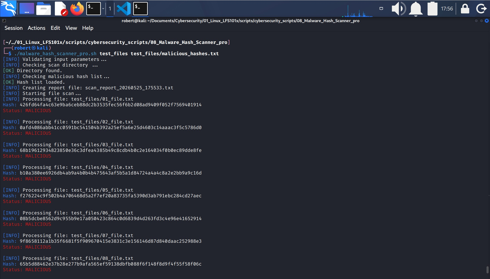
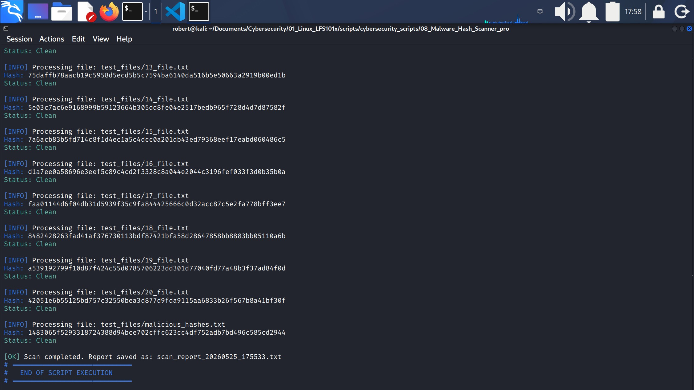
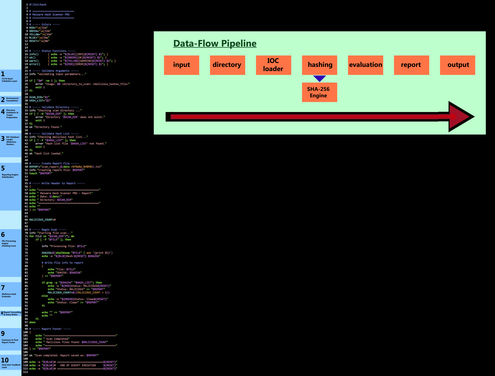
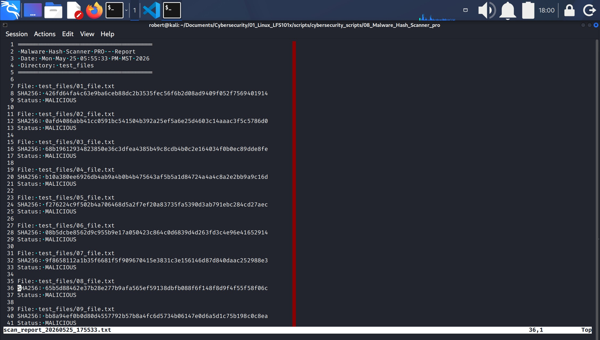
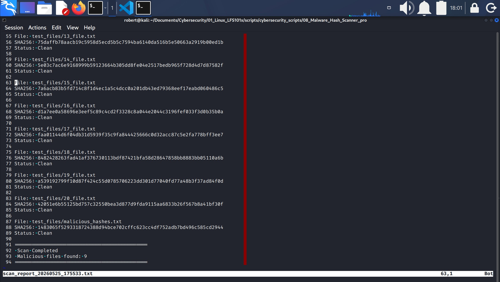

# 8.- MALWARE HASH SCANNER - PRO




## 1.- Script Architecture and Development


This diagram visualizes how the script is structured and how data moves through each stage, from input validation to hashing, evaluation, and final reporting.


### 1.1.- Architecture Overview
This project follows a modular architecture where each core capability is implemented as an independent logical component. The system is structured around a linear data‑flow pipeline that processes files from input to final reporting. The architecture includes:

1. **Directory‑scanning module**, responsible for iterating through all files in the target location.
2. **SHA‑256 hashing module**, which computes the cryptographic hash of each file and prepares it for evaluation.
3. **Malicious‑hash evaluator**, which compares each computed hash against a simulated IOC database containing known malicious values.
4. **Reporting subsystem**, which generates a timestamped scan report with structured entries and a final summary.

These components work together to form a clean, predictable, and logically organized processing pipeline, ensuring that each stage of the scan is isolated, traceable, and easy to maintain.

These components collectively form a clear, maintainable, and extensible malware‑hash detection system designed for learning, experimentation, and safe simulation of IOC‑based detection workflows.

### 1.2.- Development Overview
Although several software‑design methodologies exist (Top‑Down, Bottom‑Up, Layered Organization), this project follows the Development‑Driven Construction Order — Classic Variant.

Under this methodology, the script is constructed according to the conceptual responsibilities of its components rather than strict dependency order. The goal is to build the system in the same logical sequence in which an engineer naturally organizes its functional modules.

DDCO‑Classic organizes the script into development blocks, each representing a coherent unit of functionality grouped by purpose, clarity, and architectural role.

#### 1.2.1.- Development Blocks Sequence
The script was developed following this sequence of development blocks:
1. **CLI & Input Validation Layer**: Validates the user‑provided arguments to ensure the program starts in a safe and controlled state. If parameters are missing or incorrect, execution stops immediately.
2. **Environment Foundations & Variable Setup**: Initializes the core environment variables (**SCAN_DIR** and **HASH_LIST**) that define the scanning target and the **IOC** database.
3. **IOC Database Loader (Malicious Hashes)**: Validates and loads the malicious hash list file. This block provides the system with its “intelligence” by preparing the simulated IOC database used for detection.
4. **Directory Validation & Target Preparation**: Ensures the directory to be scanned exists and is accessible. Prevents the system from running against invalid or non‑existent paths.
5. **Reporting Engin Initialization**: Creates the report file and writes the structured header, including timestamp and scan metadata. Establishes the reporting framework used throughout the scan.
6. **File Processing Engine (Hashing Core)**: Creates the report file and writes the structured header, including timestamp and scan metadata. Establishes the reporting framework used throughout the scan.
7. **Malicious Hash Evaluator**: Compares each computed hash against the IOC list to determine whether the file is malicious or clean. Updates the malicious file counter accordingly.
8. **Report Formating & Entry Writer**: Adds spacing and separators between report entries to maintain readability and structure.
9. **Summary & Final Report Footer**: Writes the closing section of the report, including the total number of malicious files detected and a final summary banner.
10. **Final User Feedback Layer**: Displays the final status messages to the user, confirming completion and showing the location of the generated report. 

These development blocks are shown in the illustration above, placed on the left side of the code inside blue boxes. Their purpose is to provide a visual representation of the order in which the script was constructed.

This DDCO‑Classic approach results in a clean, intuitive, and logically structured construction sequence that reflects how an engineer naturally organizes a system from its primary responsibilities outward.


## 2.- Project environment

### 2.1.- What is a Hash?
* A **hash** is a fixed‑length, unique digital fingerprint generated from the contents of a file. 
* If even a single bit of the file changes, the resulting hash becomes completely different.  
* Common algorithms include **SHA‑256**, **SHA‑1**, and **MD5**.

### 2.2.- Hashing Algorithms
Common hashing algorithms such as **SHA‑256**, **SHA‑1**, and **MD5** are used to generate a unique, fixed‑length fingerprint for a file. Their role is to ensure that any change to the file — even a single bit — produces a completely different hash. This makes them essential for integrity verification, malware identification, and IOC (Indicator of Compromise) matching in cybersecurity workflows.


### 2.3.- What Is a Malicious Hash?
* A **malicious hash** is the hash value of a file that has been identified as malware during **forensic investigations, sandbox analysis, honeypot captures, or threat intelligence research**.  
* These hashes are shared as **IOCs (Indicators of Compromise)** to help analysts detect and block known malicious files across different systems.


### 2.4.- How do Malicious Hashes originate?
In **real environments**, malicious hashes originate from forensic investigations, malware sandboxes, honeypots, threat intelligence teams, antivirus telemetry, and public malware repositories. Whenever a malicious file is captured or analyzed, its hash is calculated and shared as an IOC (Indicator of Compromise) so other analysts can detect and block the same threat.

The process typically follows this sequence:

1. A malicious or suspicious file is discovered on a system.
2. Security teams analyze the file and compute its hash using algorithms like **SHA‑256**.
3. If the file is confirmed to be malware, its hash is shared as an IOC so others can detect the same threat.


### 2.5.- Malicious Hashes for this project
Since the purpose of this project is only to learn how to handle malicious hashes, no real malicious files were created or used. Instead, the following procedure was followed so the program could detect “malicious” hashes:

1. A series of harmless files were created.
2. Some of these files were flaged as "malware", the hashes for these files was calculated.
3. The resulting hashes were added to a special file (`malicious_hashes.txt`) that lists malicious hashes, this file is a simulated IOCs (Indicators of Compromise) database.
4. That file is used by the **Malware Hash Scanner** program during detection.
5. The program compares the file hashe's in the given directory with the file hashe's in the `malicious_hashes.txt`.
6. Files that match are reported as malicious, and those that not are reported as clean.


## 3. Script Breakdown

### 3.1. Header & Metadata (1–6)
This section contains the script’s header, including the shebang and the project metadata. It identifies the script as Malware Hash Scanner PRO and establishes the context for the rest of the file. Although it does not perform any logic, it provides essential descriptive information and helps maintain clarity and organization within the codebase.

### 3.2. Color Definitions (7–12)
This block defines ANSI color codes used throughout the script to enhance readability in terminal output. By assigning colors to variables such as RED, GREEN, YELLOW, and BLUE, the script can display status messages with consistent visual formatting. These definitions improve user experience without affecting the scanning logic.

### 3.3. Status Functions (15–19)
This section implements four **helper functions** used to print standardized status messages. Each function wraps a message with a color-coded prefix, making console output easier to interpret during execution.

1. `info()      { echo -e "${BLUE}[INFO]${RESET} $1"; }`: defines a utility function in Bash used to print standarized informational messages to the terminal.
    1. `info`: is the function's name.
    2. `$1`: is replaced by whatever message you pass to the function.

2. `ok()        { echo -e "${GREEN}[OK]${RESET} $1"; }`: defines a utility function in Bash used to print standarized informational messages to the terminal.
    1. `ok`: is the function's name.
    2. `$1`: is replaced by whatever message you pass to the function.

3. `warn()      { echo -e "${YELLOW}[WARNING]${RESET} $1"; }`: defines a utility function in Bash used to print standarized informational messages to the terminal.
    1. `warn`: is the function's name.
    2. `$1`: is replaced by whatever message you pass to the function.

4. `error()     { echo -e "${RED}[ERROR]${RESET} $1"; }`: defines a utility function in Bash used to print standarized informational messages to the terminal.
    1. `error`: is the function's name.
    2. `$1`: is replaced by whatever message you pass to the function.

### 3.4. Argument Validation (21–27)
Validates user-provided arguments to ensure the program starts in a safe and controlled state. If parameters are missing or incorrect, execution stops immediately.
1. `info "Validating input parameters..."`: calls the `info` function and prints a message on the screen.
2. `if [[ $# -ne 2 ]]; then`: conditional test that checks whether the user ran the program exactly with 2 arguments.
    1. `if`: establishes conditional test
    2. `#`: the number of positional parameters (how many arguments the user passed).
    3. `$#`: expands to that number.
    4. `-ne`: not equal (numeric comparison).
    5. `2`: the expected number of arguments.
3. `then`: keyword that marks the beginning of the commands that run when an `if` condition is true. Is a separator, it tells Bash: "The condition is finished. Now start the block of commands that should run if the condition succeeded."
4. `error "Usage: $0 <directory_to_scan> <malicious_hashes.txt>"`: if the condition is true (`$# -ne 2`) the program:
    1. Cals the `error` function and prints the correct usage for the program.
5. `exit 1`: stops the script and returns an error code of 1.
6. `fi`: closes the conditional test.


### 3.5. Variable Initialization (29–30)
Initializes the core environment variables (**TARGET_DIR, HASH_LIST**) that define the scanning target and the **IOC** database.

**TARGET_DIR="$1"**
**HASH_LIST="$2"**

These are the arguments passed in the CLI, stored into variables for use throughout the script.

### 3.6. Directory Validation (32–38)
Ensures the directory to be scanned exists and is accessible. Prevents the system from running against invalid or non-existing paths.

1. `info "Checking scan directory ..."`: calls the `info` function and prints a message on the screen.
2. `if [[ ! -d "$TARGET_DIR" ]]; then`: conditional test to check whether the directory stored in the variable $TARGET_DIR exists and is accessible.
    1. `!`: NOT
    2. `-d`: file test operator. It checks whether the given path exists and is a directory.
    3. `"$TARGET_DIR"`: the variable where the directory containing the files to be scanned is stored.
3. `then`: keyword that marks the beginning of the commands that run when an `if` condition is true.
4. `error "Directory not found: $TARGET_DIR"`: calls the `error` function and prints a message indicating the directory to be scanned was not found.
5. `exit 1`: stops the script and returns an error code of 1.
6. `fi`: closes the conditional test.


### 3.7. Hash List Validation (40–46)
Validates and loads the malicious hash list file. This block provides the system with its "intelligence" by preparing the IOC database used for detection.
1. `info "Checking malicious hash list..."`: calls the `info` function and prints a message on the screen.
2. `if [[ ! -f "$HASH_LIST" ]]; then`: conditional test to check whether the file stored in the variable $HASH_LIST exists and is a regular file.
    1. `!`: NOT
    2. `-f`: regular file.
    3. `"$HASH_LIST"`: the variable where the file containing the malicious hashes is stored.
3. `then`: keyword that marks the beginning of the commands that run when an `if` condition is true.
4. `error "Hash list file not found: $HASH_LIST"`: calls the `error` function and prints a message indicating the hash list was not found.
5. `exit 1`: stops the script and returns an error code of 1.
6. `fi`: closes the conditional test.


### 3.8. Report File Creation (49–53)
Creates the report file and writes the structured header, including timestamp and scan metadata. Establishes the reporting framework used throughout the scan.

1. `REPORT="scan_report_$(date +%Y%m%d_%H%M%S).txt")`: creates a unique, timestamped filename for the scan report.
2. `info "Creating report file: $REPORT"`: calls the `info` function and prints a status message showing the filename being created.
3. `touch "$REPORT"`: creates the empty report file so the script can write into it.

### 3.9. Report Header Block (55–63)
Uses `echo` and then redirects the output to $REPORT to add a header to the report file.

### 3.10. Malicious Counter Initialization (66)

1. `MALICIOUS_COUNT=0`: Initializes the counter used to track how many files match a known malicious hash during the scan. This value starts at zero and is incremented each time the evaluator identifies a malicious file.

### 3.11. File Processing Engine (Hashing Core) (69–97)
Iterates through all files in the garget directory using a `for` loop. Computes the SHA-256 hash of each file, prints it to the console, and writes file metadata and hash value to the report.

#### 3.11.1. File Check and SHA256 Calculation
1. `info "Starting file scan..."`: calls the `info` function and prints a message on the screen.
2. `for FILE in "$SCAN_DIR"/*; do`: starts a `for` loop that iterates over every item inside the directory specified by `$SCAN_DIR`.

The wildcard `*` expands to all files and subdirectories in that path, and each resulting entry is assigned to the variable `FILE` during each iteration.
3. `if [ -f "$FILE" ]; then`: checks whether an entry stored in `"$FILE"` is a regular file.
4. `then`: keyword that marks the beginning of the commands that run when an `if` condition is true.
    1. `info "Processing file: $FILE"`: calls the `info` function and prints a status message on the screen, showing which file is currently being processed.
    2. `SHA256=$(sha256sum "$FILE" | awk '{print $1}')`:
        1. `sha256sum "$FILE"`: runs the `sha256sum` utility to compute the **SHA-256** hash of the file stored in the variable `"$FILE"`.
        2. `| awk '{print $1}`: pipes the output to `awk`, which prints only the first field (`$1`), this extracts **only the hash value**, removing the filename that `sha256sum` normally includes.
        3. `SHA256=$(...)`: stores the computed hash for the current file in the variable `SHA256`.
    3. `echo -e "${BLUE}Hash:${RESET} $SHA256"`: prints the computed hash to the screen.
        1. `-e`: this option enables interpretation of escape sequences, allowwing the color variables to be applied.
    4. `{`: opens a command group. All groups inside the braces will be executed together, and their combined output can be redirected as a single unit.
        1. `echo "File: $FILE"`: writes the current file path to the output stream.
        2. `echo "SHA256: $SHA256"`: writes the computed hash for that file.
    5. `}`: closes the command group.
    6. `>> "$REPORT"`: appends the entire output of the command group to the report file specified by `$REPORT`.

#### 3.11.2 Malicious Hash Evaluator (85 - 97)
Compares each computed hash against the **IOC** list to determine whether the file is malicious or clean. Updates the malicious file counter accordingly.
1. `if grep -q "$SHA256" "$HASH_LIST";then`: it runs `grep` in quiet mode to check whether the computed hash (`SHA256`) exists in the malicious hash list file (`$HASH_LIST`). If the hash is found, `grep` returns exit status `0`, making the condition **true** and triggering the `then` block.
    1. `grep`: searches for text inside a file. Here it searches for the hash value inside the malicious hash list.
    2. `-q`: quiet mode. It does not print anything to the screen. It only returns an exit status:
        * `0`: march found.
        * `1`: no match found.
    3. The `if` statement evaluates the exit code of the `grep` command.
2. `then`: keyword that marks the beginning of the commands that run when an `if` condition is true. Is a separator, it tells Bash: "The condition is finished. Now start the block of commands that should run if the condition succeeded."
3. `echo -e "${RED}Status: MALICIOUS${RESET}"`: it prints a message indicating the file's hash **matches a malicious entry**. 
4. `echo "Status: MALICIOUS" >> "$REPORT"`: appends the text `"Status: MALICIOUS"` to the report file specified by `$REPORT`.
5. `MALICIOUS_COUNT=$((MALICIOUS_COUNT + 1))`: increments the variable `MALICIOUS_COUNT` by 1. This keeps track of how many malicious files were detected.
6. `else`: defines the fallback block in a Bash `if` statement. It runs only when all previous conditions (`if` and any `elif`) are **false**. 
7. `echo -e "${GREEN}Status: Clean${RESET}"`: prints  a message on the screen indicating the hash **is NOT malicious**.
8. `echo "Status: Clean" >> "$REPORT"`: appends the `"Status: Clean"` message to the report file.
9. `fi`: closes the `if` statement.
10. `echo "" >> "$REPORT"`: adds an empty line to the report.
11. `echo ""`: prints an empty line on the screen.
12. `fi`: closes the `if` statement.
13. `donde`: closes the `for` loop.

```
The for FILE in "$SCAN_DIR"/*; do loop iterates over every item inside the directory specified by $SCAN_DIR.
For each entry matched by the wildcard *, the loop assigns the full path to the variable FILE and executes all commands between do and done.
```

### 3.12. Report Footer Block (99–105)
Writes the closing section of the report, including the total number of malicious files detected and a final  summary banner.

Encloses a series of `echo` commands to construct the closing section, and appends all of them as a unit to the file specified by **$REPORT**.

### 3.13. Final Status Messages (107–111)
Displays the final status messages to the user, confirming completion and showing the location of the generated report.

It calls the `ok` function to indicate the scan was completed and the location of the report.


## 4. Report Interpretation
The script generates a structured report that can be reviewed directly in the terminal or inside the timestamped output file. Each section of the report provides specific information about the scan, allowing the user to understand what was analyzed, how each file was evaluated, and whether any malicious hashes were detected.




1. The report begins with a header banner indicating the program's name, the date and time of execution and the directory that was scanned.
2. Each scanned file is represented by a three-line block:
    1. File: the full path of the scanned file.
    2. SHA256: the computed SHA-256 hash of that file.
    3. Status: either MALICIOUS (if the hash matches the IOC list) or Clean (if no match is found).
3. The report ends with a summary footer, which includes: a completion banner, the total number of malicious files detected, and a closing separator. 
    * In the example shown, the script detected **9 malicious files.**

---
End of project **eight**, thanks for reading.
- Roberto Orozco.
