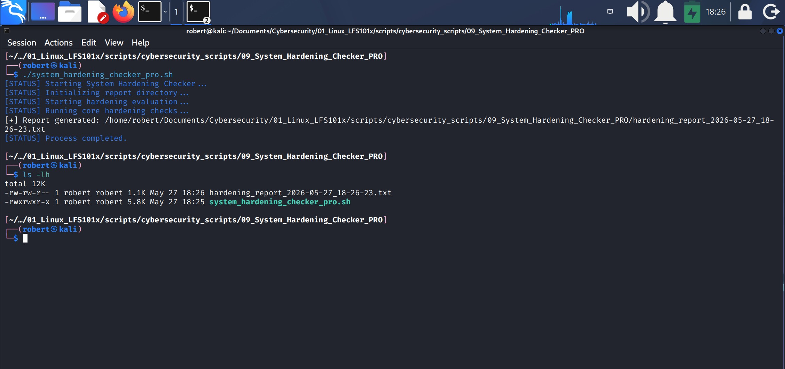
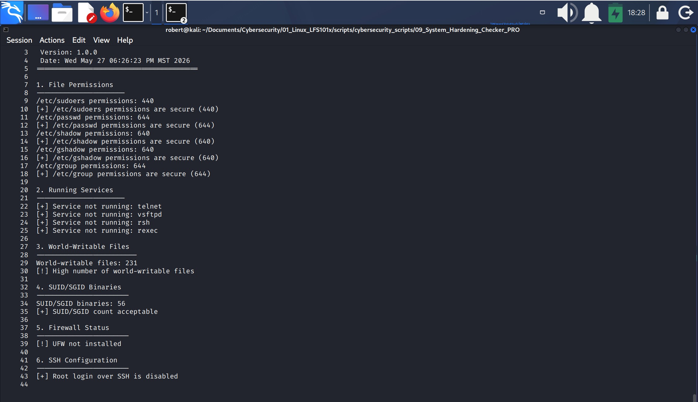

# 9.- SYSTEM HARDENING CHECKER
The System Hardening Checker – PRO Version is a Bash‑based security auditing tool that evaluates the **hardening posture of a Linux system**. It performs a series of structured checks—including file permissions, running services, world‑writable files, SUID/SGID binaries, firewall status, and SSH configuration—and generates a detailed report summarizing potential security risks.

Its primary utility is to help administrators, analysts, and students quickly assess system security, identify misconfigurations, and validate hardening policies in a consistent and automated way.




## 1.- Script Architecture and Development


A combined view of the script’s execution flow and the Development Blocks that guided its conceptual construction, with each runtime stage mapped to its corresponding module.

### 1.1.- Architecture Overview
The **System Hardening Checker – PRO Version** is built using a **Core‑First DDCO Architecture**, a design approach in which the script is structured around a dominant conceptual module: **the System Hardening Engine**.
This core module defines the purpose of the script: **evaluating the system’s hardening posture** through a series of structured security checks.

All other components in the script are architecturally positioned around this core.
The Global Configuration & Core State, the Utility Layer, the Supporting Evaluators, the Orchestrator Module, and the CLI Handler exist to provide structure, context, and operational support to the central hardening engine without fragmenting its role.

Even though the architecture is Core‑First, the script was constructed following the DDCO‑Classic (Development‑Driven Construction Order) methodology.
This means the development process followed the natural conceptual order of the system’s components, prioritizing:

1. Architectural roles
2. Functional responsibilities
3. Logical grouping of capabilities
4. The conceptual flow of the system

This combination — Core‑First architecture + DDCO‑Classic construction — ensures that the script remains clean, maintainable, and aligned with professional engineering practices, while preserving a clear separation of concerns and a predictable execution flow.

### 1.2.- Development Overview
The development of the **System Hardening Checker – PRO Version** follows a **Core‑First Development Order**, meaning the script was constructed beginning with its dominant conceptual module: the System Hardening Engine.
This core component defines the purpose of the system and establishes the main evaluation pipeline, report structure, and execution logic.

Once the Core Engine was in place, the Supporting Evaluators were implemented to extend its capabilities across specific hardening domains, such as file permissions, running services, world‑writable files, SUID/SGID binaries, firewall status, and SSH configuration.

After the core functionality and evaluators were completed, the Utility Layer and Global Configuration were added to provide logging, color output, directory preparation, and runtime constants.
Finally, the Orchestrator Module and CLI Handler were developed to coordinate execution and provide a clean, user‑friendly entry point.

This Core‑First construction workflow ensures that the script remains centered around its primary purpose while maintaining a modular, extensible, and engineering‑oriented structure.


#### 1.2.1.- Development Blocks Sequence
The script was developed following this sequence of development blocks:
1. **Core Module Initialization**: Defines the main hardening evaluation pipeline, report structure, error‑tolerant execution block, and final success message.
This is the dominant conceptual module.
2. **Critical Permissions Checker**: Validates permissions of critical system files using expected permission maps and special rules.
3. **Running Services Checker**: Checks whether insecure legacy services are running.
4. **World-Writable Files Checker**: Counts world-writable files and evaluates risk.
5. **SUID/SGID Checker**: Counts SUID/SGID binaries and evaluates thresholds.
6. **Firewall Checker**: Detects UFW and reports firewall status.
7. **SSH Configuration Checker**: Validates SSH hardening by checking PermitRootLogin.
8. **Utility Layer**: Provides logging, colors, status messages, and directory creation.
9. **Global Config & Core State**: Defines version, report directory, timestamp, and report file path.
10. **Orchestrator Module**: Coordinates the execution flow and triggers the Core Engine.
11. **CLI Handler**: Implements usage instructions, argument validation, and program entrypoint.


## 2.- Project environment
Because the script performs **local system‑level hardening checks only**, no special network configuration was required. The VM operated using its default NAT adapter, and no changes were made to firewall rules, iptables policies, or network interfaces.

The script relies exclusively on **local system resources**, built‑in Linux utilities, and standard filesystem access. As a result, it can run in any isolated or offline environment without requiring external connectivity, additional services, or privileged network setups.


## 3. Script Breakdown  
This section follows the script’s **visual top‑to‑bottom order**, not the chronological order in which it was developed.

### 3.1 Global Config & Core State (lines 14–17)
Defines version, report directory, timestamp, and report file path.
1. `VERSION="1.0.0"`
2. `REPORT_DIR="$HOME/Documents/Cybersecurity/01_Linux_LFS101x/scripts/cybersecurity_scripts/09_System_Hardening_Checker_PRO"`
3. `TIMESTAMP="$(date +"%Y-%m-%d_%H-%M-%S")"`
4. `REPORT_FILE="${REPORT_DIR}/hardening_report_${TIMESTAMP}.txt"`: expands the $REPORT_DIR variable and appends the name "hardening_report" and then appens the variable $TIMESTAMP.


### 3.2 Utility Layer (lines 23–40)
Provides logging, colors, status messages, and directory creation.
#### 3.2.1 ANSI color definitions
`BLUE="\e[34m"`
`GREEN="\e[32m"`
`YELLOW="\e[33m"`
`RED="\e[31m"`
`RESET="\e[0m"`

#### 3.2.2 Logging utilities (log_info, log_warn, log_error)

1. ` log_info()      { echo "[+] $*"; }`: is a custom logging function for "informational" messages.
    1. `log_info()` is the name of the function.
    2. `{...}`: contain the **body** of the function.
    3. `echo "[+] $*"`: is the actual command executed when the function is called.
        1. `echo`: prints text to stdout.
        2. `"[+]...`: is the prefix for success/info messages.
        3. `$*`: expands to all arguments passed to the function.
            * `$*`: expands to ONE single string.
            * `$@`: expands to MANY separate strings.
                * This applies only when the arguments are quoted (`""`).
2. `log_warn()      { echo "[!] $*"; }`.
3. `log_error()     { echo "[-] $*" >&2; }`: sends the output to stderr (`>&2`).


#### 3.2.3 Status message function (status)
1. `status () { echo -e "${BLUE}[STATUS] $*${RESET}"; }`: creates a custom function that prints an informational message using ANSI colors.

#### 3.2.4 Report directory initializer (ensure_report_dir)
1. `ensure_report_dir() {`: creates and opens the function.
2. `[[ -d "$REPORT_DIR" ]] || mkdir -p "$REPORT_DIR"`: checks whether the report directory exists, and if not, creates it using `mkdir -p`.
    1. `||`: logical OR. If the left side of the conitional test succeeds, the right side is **NOT executed**. If the left side fails, the right side **IS executed**.
    2. `-p`: stands for **parents**, and it makes `mkdir`: 
        1. Create the directory only if it doen't already exist.
        2. Create all missing parent directories in the path.
        3. Stay completely silent (no warnings, no errors for existing directories).
        4. In case `mkdir -p` creates a new directory it will receive the name given to `$REPORT_DIR`.


### 3.3 Core Module – System Hardening Engine (lines 48–87)

1. `run_hardening_checks() {`: defines and opens the function.
2. `status "Running core hardening checks..."`: calls the `status` function and prints a status message on the screen.
3. `set +e`: disables Bash's "exit on error" mode, meaning the script will continue running even if a command returns a non-zero exit code.
4. The block inside the braces (`{...}`) prints the header, section titles, separators, and blank lines that form the layout of the final report.
    1. It executes all **hardening checks**, each evaluator is called in order:
        1. `check_critical_permissions`
        2. `check_running_services`
        3. `check_world_writable`
        4. `check_suid_sgid`
        5. `check firewall`
        6. `check_ssh_config`
    2. Each function prints its results, wargnings, or secure-status messages.
5. `> "$REPORT_FILE"`: the whole block output is redirected into the report file in a single operation.
6. `set -e`: enables Bash's "exit immediately on error" mode. When this mode is active, any command that erturns a non-zero exit code causes the script to stop immediately.
7. `log_info "Report generated: $REPORT_FILE"`: calls the utility function `log_info` and prints a message to stdout. 


### 3.4 Supporting Evaluators (lines 93–191)
The Supporting Evaluators are the individual security-check functions that perform the actual hardening analysis. Each evaluator focuses on a specific security control (SSH configuration, firewall status, password policies, etc.) and returns a standarized result that is later included in the final report. They are called seqentially by `run_hardening_checks()`.

#### 3.4.1 check_critical_permissions()
Validates permissions of critical system files using expected permission maps and special rules.
1. `check_critical_permissions() {`: defines and opens the function.
2. `declare -A expected_perms=(`: the line declares an **associative array** named `expected_perms` and begins defining **key-value** pairs mapping system files to their expected permissions.
    1. `declare -A`: tells Bsh: "Create a dictionary-style array where each element has a string key and a value."
        * `declare`: is a built-in command for declaring typed or attribute-controlled variables, even though Bash is not a typed language in the traditional sense. "Tell Bash what ***kind*** of variable this is and how it should behave."
        * `-A`: used with declare, `-A` means: "Declare the variable as an associative array (a key-value dictionary where keys are **strings**). Its keys are strings, not numbers. It behaves like a **hash map**.
    2. `expected_perms`: becomes a key-value map, not a numeric array.
    3. `(`: means: "I'm about to list the key/value pairs that belong to this associative array."
    ```
    The array is completed later with entries like:
    ["/etc/passwd"]=644
    ["/etc/group"]=644
    ["/etc/shadow"]=640
    ...
    
    - Key (filename): /etc/passwd, /etc/shadow, /etc/sudoers
    - Value (expected permission): 644, 640, 440.
    ```
    4. The **key-value** pairs: 
        * `["/etc/passwd"]=644`
        * `["/etc/group"]=644`
        * `["/etc/shadow"]=640`
        * `["/etc/gshadow"]=640`
        * `["/etc/sudoers"]=440`
        Are the key-value pairs stored inside the associative array `expected_perms`. Each entry (`["/etc/passwd"]=644`) is a key-value mapping inside the associative array `expected_perms`.
    5. `)`: closes the key-value pairs.
3. `for f in "${!expected_perms[@]}"; do`: the line iterates over every **key** in the associative array `expected_perms`, assigning each filename (key) to the variable `f` so the script can process each file and compare its permissions.
    1. Normally, `${expected_perms[@]}` expands to all **values** in the array. For example 644 644 640 640 440.
    2. `${!expected_perms[@]}`, the exclamation mark `!` changes the expansion, means: "Give me all the **keys** of the associative array." For example: /etc/passwd /etc/group /etc/shadoe /etc/gshadow /etc/sudoers.
    3. `[@]`: expands all elements of the array. It tells Bash to expand all elements of an array.
    4. The quotes ensure:
        * keys with spaces
        * keys with special characters
        * keys with slashe

        are treated as single items. 
        
        This is important because the keys are file paths.
4. `if [[ -e "$f" ]]; then`: checks whether the file exists.
    1. `-e`: test operator meaning "exists".
    2. `-f`: the variable containing the filename (key from your associative array).
5. `perms=$(stat -c "%a" "$f")`: this line runs `stat` to extract file's numeric permission bits and stores that value in the variable `perms` so the script can compare it against the expected permissions.
    1. `stat`: is a LInux utility that retrieves metadata about a file.
    2. `-c :%a"`: this tells `stat` "Output the file's permissions in numeric (octal) format.
    ```
    Examples:
    | File mode   | Numeric (%a) |
    |-------------|--------------|
    | rw-r--r--   | 644          |
    | rw-------   | 600          |
    | r--r-----   | 440          |
    | r--------   | 400          |
    ```
    * 
        * `-c`: means: "Use a custom output format"
        * `%a`: tells `stat`: "Print the file's permission bits in numeric (octal) format."
    3. `$f`: this is the filename currently being processed in the loop.
    4. The output of `$(...)` is stored in `perms`. So the lines becomes something like: 644 or 640.
6. `expected="${expected_perms[$f]}"`: this line retrieves the expected permission value from the associative array `expected_perms` using the current fileame `$f` as the key, and stores that value in the variable `expected`.
    1. `expected_perms`: is the associative array defined earlier where keys are filenames and values are expected permission numbers.
    2. Inside the loop `$f` takes each key.
    3. `expected_perms[$f]`: this accesses the value associated with that key.
    4. `expected="..."`: the value is assigned to the variable `expected`.
        * This is important because later the script compares `if [[ "$perms" -ne "$expected" ]]; then`, where:
            1. `perms`= actual permission from `stat -c "%a"`.
            2. `expected`= expected permission from the associative array.
                * This is the core of the permission-validation logic.
7. `echo "$f permissions: $perms"`: prints the filename currently being evaluated (`$f`) along with its actual numeric permission value (`$perms`). In this script, the line executes inside the `run_hardening_checks()` redirection block, so its output is written to the generated report file rather than displayed in the terminal.

##### 3.4.1.1 Special rule: passwd and group are allowed to be 644
1. `if [[ "$f" == "/etc/passwd" || "$f" == "/etc/group" ]]; then`: this condition checks whether the file being evaluated is `/etc/passwd` or `/etc/group`. These two files are allowed to have permissions `644`, so the script applies a special validation rule for them before skipping to the next file.
2. `if [[ "$perms" -ne 644 ]]; then`: this line checks whether the file's actual permissions differ from the required `644` value for `/etc/passwd` and `/etc/group`.
3. `log_warn "$f has weak permissions ($perms), expected $expected"`: logs a warning indicating that the file's actual permissions do not match the required secure value.
4. `else`: is the fallback branch of an `if` statement. It means: "If none of the previous `if` or `elif` conditions were true, execute this block."
5. `log_info "$f permissions are secure ($perms)"`: logs an informational message confirming that the file's permissions match the required secure value.
6. `fi`: closes the `if [[ "$perms" -ne "$expected" ]]; then` block.
7. `else`: this is the fallback for the outer if **file-exists check** `if [[ -e "$f" ]]; then`.
8. `fi`: this closes the outer `if [[ -e "$f" ]]; then`.
9. `done`: is the keyword that closes the `for` loop that iterates through each file in the `expected_perms` associative array.


#### 3.4.2 check_running_services()
1. `check_running_services() {`: defines and opens a function.
2. `local suspicious=("telnet" "vsftpd" "rsh" "rexec")`: this line declares a local variable named `supicious`. The variable is an array that contains a list of insecure or legacy services that the script will check.
    1. These services are considered insecure because:
        * **Telnet**:
            * No encryption:
                1. Sends usernames, passwords, commands, session data in plaintext over the network.
                2. Anyone with `Wireshark`, `tdcump` or a compromised router can read everything.
            * Vulnerable to:
                1. Credential theft
                2. Session hijacking
                3. MITM attacks.
            * Its modern replacement is **SSH**.
        * **vsftpd (FTP)**: 
            * Just like Telnet, it is unencryped. Its vulnerable to sniffing, credential theft and data tampering.
            * Modern replacement: 
                1. SFTP (SSH File Transfer Protocol).
                2. FTPS (FTP over TLS).
        * **rsh (Remote Shell)**:
            * No encryption.
            * Uses `.rhosts` trust relationships. This allows login without a password.
            * Vulnerable to spoofing, MITM, unauthorized remote access.
            * Modern replacement: **SSH**.
        * **rexec (Remote Execution)**: just like Telnet ans rsh.
2. `for svc in "${suspicious[@]}"; do`: starts a `for` loop that iterates over all the elements of the **array** `suspicious` and assigns each element to the variable `svc` during each iteration.
    1. `[@]`: expand to all the elements of the array.
3. `if systemctl is-active --quiet "$svc"; then`: checks whether the service stored in `$svc` is currently active; if it is, the condition evaluates to true.
    1. `systemctl is-active`: cheks if a system is currently active (running).
        * `systemctl`: is the command-line tool used to interact with `systemd`, the init system and service manager used by most modern Linux distributions. It allows to **start services**, stop services, **check services status**, enable/disable services at boot, reload configurations, manage system  states (shutdown, reboot, suspend).
        * `is-active`: is a systemctl subcommand that checks whether a **systemd** service is currently running.
    2. `--quiet`: suppresses all output; only the exit code is used to determine the `if` condition.
    3. `$svc`: the service name being checked in the current loop iteration.
4. `log_warn "Suspicious service running: $svc"`: calls the `log_warn` function and prints the name of a running suspicious service.
5. `else`: fallback branch for the `if` statement. It means: "If the the last condition is NOT true, execute this block."
6. `log_info "Service not running: $svc"`: calls the `log_info` function and prints the name of a service that is not running.
7. `fi`: closes the `if` statement.
8. `done`: ends the `for` loop.
9. `}`: closes the function.

#### 3.4.3 check_world_writable()
1. `check_world_writable () {`: defines and opens a function.
2. `local count`: declares a local variable named `count`.
3. `count=$(find / -xdev -type f -perm -0002 2>/dev/null | wc -l)`: counts all world-writable files on the root filesystem (excluding other mounted filesystems) and stores the total number in the variable `count`.
    1. `find /`: search the entire filesystem starting at root `/`.
    2. `-xdev`: do not cross filesystem boundaries. It means:
        * Only search the root filesystem.
        * Skip `/proc`, `/sys`, `/dev`, mounted drives, etc.
        * This avoids errors, infinite loops, irrelevant files.
    3. `-type f`: only match regular files (not directories, sockets, devices, etc.).
    4. `-perm -0002`: match files that have the **others-write** bit set.
    5. `2>/dev/null`: redirect all error messages (permission denied, inaccessible directories) to `/dev/null`. This keeps the output clean.
    6. `| wc -l`: count the number of lines output by `find`. Each line = one world-writable file. So this gives the total **count**.
4. `echo "World-writable files: $count"`: prints the world-writable files.
5. `if [[ "$count" -gt 50 ]]; then`: conditional test that checks whether `$count` is greater than 50.
6. `log_warn "High number of world-writable files"` calls the `log_warn` function and prints that there is a high umber of world-writable files.
7. `else`: fallback branch of the `if` statement. It means: "if the last condition is not true, execute this block."
8. `log_info "World-writable files count acceptable"`: calls the `log_info` function and prints a message indicating that the file count is acceptable.
9. `fi`: closes the `if` statement.
10. `}`: closes the function.

#### 3.4.4 check_suid_sgid()
1. `check_suid_sgid() {`: defines and opens the function.
2. `local count`: defines a local variable named `count`.
3. `count=$(find / -xdev \( -perm -4000 -o -perm -2000 \) 2>/dev/null | wc -l)`: counts all SUID and SGID files on the root filesystem (excluding other mounted filesystems) and stores the total number in the variable `count`.
    1. **SUID**: (Set User ID) is a special permission bit on a file that makes the program run with the file owner's privileges instead of the privileges of the user who runs it. 
    2. **SGID**: (Set Group ID) is a special permission bit that makes a program run with the file's group privileges instead of the group of the user who runs it.
    3. `\( -perm -4000 -o -perm -2000 \)`: this is a grouped permission test used by `find` to match files that have either the SUID bit or the SGID bit set.
        * `\(` and `\)`: these are escaped parentheses. They tell `find`: "Treat the conditions inside as a single logical group." The backslashes are required so the shell doesn't interpret the parentheses.
        * `-perm -4000`: is the SUID permission bit.
        * `-o`: logical OR.
        * `-perm -2000`: is the SGID permission bit.
    4. `| wc -l`: count the number of lines returned by `find`. Each line = one SUID/SGID file. The result of the entire pipeline is stored in the variable `count`.
5. `echo "SUID/SGID binaries: $count"`: prints the number of SUID/SGID binaries.
6. `if [[ "$count" -gt 100 ]]; then`: conditional test that checks whether the number of SUID/SGID binaries is greater than 100.
7. `log_warn "High number of SUID/SGID binaries"`.
8. `else`: fallback branch of the `if` statement, it means: "If the last condition is NOT true, execute this block."
9. `log_info "SUID/SGID count acceptable"`
10. `fi`: closes the `if` statement.
11. `}`: closes the function.

#### 3.4.5 check_firewall()
1. `check_firewall() {`: defines and opens the function.
2. `if command -v ufw >/dev/null 2>&1; then`: this line checks whether the `ufw` command is available on the system; if it exists, the `then` block is executed. All output is suppressed.
    1. `command`: is a built-in shell utility that lets you check, run, or inspect commands in a controlled way. It is also used to query whether a command exists in the system's PATH.
    2. `-v`: stands for "verify." It tells the `command` builtin to check whether a command exists in the system's PATH.
    3. `ufw`: (Uncomplicated Firewall) is a command-line interface for managing the Linux firewall. It allows you to:
        * enable or disable the firewall
        * allow or deny ports
        * allow or deny services
        * manage rules persistently
        * check firewall status
        * log firewall events.
    4. `>/dev/null`: sends stdout to /dev/null.
    5. `2>&1`: sends stderr to the same place as stdout.
        * Since stdout is already goint to `/dev/null`, stderr also ends up there. So the command produces no visible output at all.
3. `ufw status | sed 's/^/    /'`: it runs `ufw status` and then adds four spaces at the beginning of every line of its output.
4. `else`.
5. `log_warn "UFW not installed"`.
6. `fi`.
7. `}`.
    
#### 3.4.6 check_ssh_config()
1. `check_ssh_config() {`: defines and opens the function.
2. `if [[ -f /etc/ssh/sshd_config ]]; then`: checks whether the file /etc/ssh/sshd_config exists and is a regular file.
3. `if grep -q "^PermitRootLogin yes" /etc/ssh/sshd_config; then`: this line checks whether the SSH configuration explicitly allows root login (`PermitRootLogin yes`); if so, the script flags it as insecure.
    1. `-q`: quiet mode.
    2. `"^PermitRootLogin yes"`: this is the exact pattern being searched for.
    3. `^`: match start of line.
4. `log_warn "Root login over SSH is enabled"`: calls the `log_warn` function and prints a warning message indicating that root login over SSH is enabled.
5. `else`: fallback branch for the `if` statement. It means: "If the conditional test is NOT true, execute this block."
6. `log_info "Root login over SSH is disabled"`.
7. `fi`.
8. `}`.


### 3.5 Orchestrator Module (lines 197–205)
Coordinates the execution flow and triggers the Core Engine.
#### 3.5.1 run_system_hardening()
1. `run_system_hardening() {`: is the orchestrator function that implements the full execution sequence of the **System Hardening Checker**. It coordinates all evaluator modules, manages report generation, and controls the overall program flow.
2. `status "Initializing report directory..."`: calls the `status` function and prints an informational message on the screen.
3. `ensure_report_dir`: executes the `ensure_report_dir` function which contains `[[ -d "$REPORT_DIR" ]] || mkdir -p "$REPORT_DIR"`.
4. `status "Starting hardening evaluation..."`: calls the function and prints an informational message on the screen.
5. `run_hardening_checks`: executes the `run_hardening_checks` function (Core Engine function), which is the function that contains all the supporting evaluators.
6. `status "Process completed."`: calls the function and prints an informational message on the screen.
7. `}`: closes the function.


### 3.6 CLI Handler (lines 211–231)
Implements usage instructions, argument validation, and program encryption.

#### 3.6.1 print_usage()
1. `print_usage() {`: displays a simple help message showing the program name, version, and correct way to run the script.
    1. It is triggered when `if [[ $# -gt 0 ]]; then`.
2. `echo " $(basename "$0")"`: prints only the filename, not the full path.
    1. `$0`: the script name as it was invoked.
    2. `basename`: strips the path and leaves only the filename.
        * `basename`: is a standard Unix utility that takes a full file path and returns only the filename, removing all directory components.


#### 3.6.2 main()
This function prints the startup message, validates that no arguments were provided, and then calls `run_system_hardening()` to execute the full hardening workflow.

1. `main() {`: defines and opens the function.
2. `status "Starting System Hardening Checker..."`: calls the `status` function and prints a message on the screen indicating the program started running.
3. `if [[ $# -gt 0 ]]; then`: checks whether the the script was run with arguments.
4. `print_usage`: if the condition is true, then the program calls the `print_usage` function to show the correct way to run the script.
5. `exit 1`: the program stops with error code 1.
6. `fi`: closes the `if` statement.
7. `run_system_hardening`: is the orchestrator function. It ensures the **report directory** exists and calls `run_hardening_checks`, which executes all supporting evaluator functions and generates the full hardening report.
8. `}`: closes the function.


##### 3.6.2.1 Script entrypoint
1. `main "@"`: is the script's entrypoint; it calls the `main()` function at the end of the file and begins program execution, passing along any command-line arguments.
2. It must be the last line of the script because Bash reads scripts top-to-bottom"
    1. It loads all function definitions.
    2. It does nothing yet.
    3. When it reaches `main "$@"`, it finally executes the program.
3. If this line is placed anywhere earlier:
    1. The script might try to run `main()` before the function is defined.
    2. Bash would throw an error.
    3. Or the script would behave unpredictably.
4. **In Bash function must be defined before it is called**.

## 4. Report interpretation



When running on Kali Linux, the System Hardening Report must be interpreted with Kali's role as penetration-testing distribution in mind. Secure file permissions, SSH settings, and service status are valid findings, but warnings such as "High number of world-writable files" and "UFW not installed" are normal for Kali. 

Kali uses permissive directories for tool compatibility and relies on **iptables/nftables** instead of UFW. On server-oriented distributions like **Ubuntu, Debian, or CentOS**, these same findings would indicate **misconfiguration** or missing hardening controls, but on Kali they are expected and not security issues.

---
End of project **nine**, thanks for reading.
- Roberto Orozco

