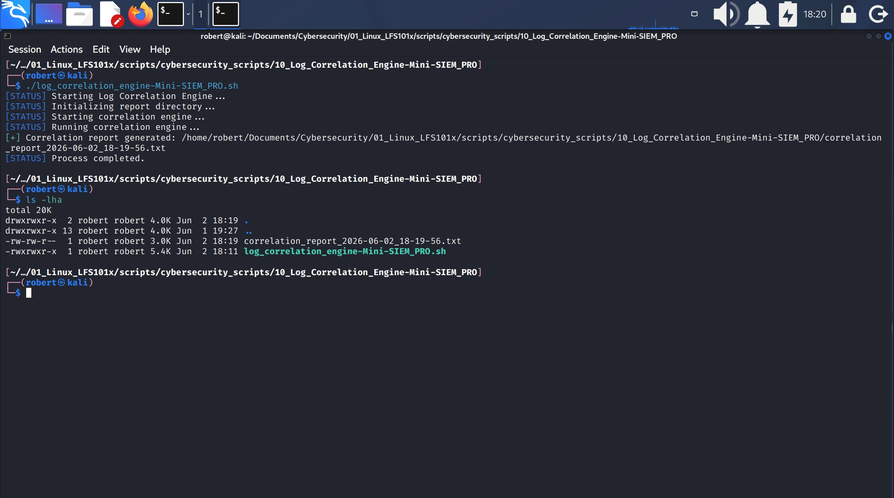
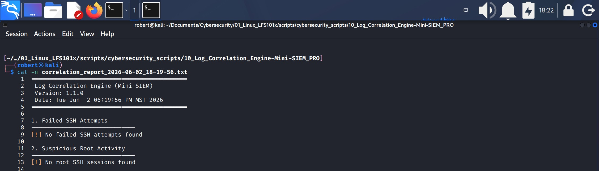
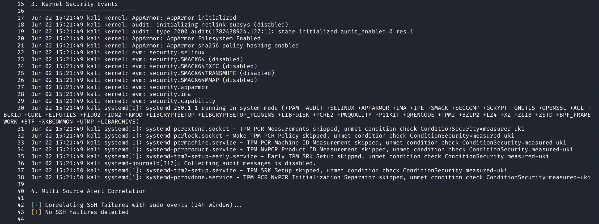

# 10.- LOG CORRELATION ENGINE (Mini-SIEM) PRO
The **Log Correlation Engine – Mini‑SIEM (PRO Version)** is a lightweight security analysis tool designed to help users identify suspicious activity by examining multiple system logs and correlating them into a single, structured report. Instead of manually searching through journalctl output or reviewing logs one by one, this script automates the entire process and highlights events that may indicate unauthorized access or system compromise.

The engine analyzes four key areas:

1. Failed SSH login attempts.
2. Root account activity.
3. Kernel‑level security messages.
4. Cross‑source correlations, such as SSH failures followed by sudo actions within a short time window.

By collecting and comparing these events, the script can reveal patterns that are easy to miss when looking at logs individually. For example, it can detect when repeated SSH failures from the same IP address are followed by a successful sudo command — a common sign of brute‑force attacks or credential misuse.

The goal of this project is to provide a simple, accessible introduction to SIEM‑style log correlation using only Bash and journalctl. It offers clear output, a structured report, and a modular architecture that makes it easy to understand, extend, and integrate into a security learning environment.

This Mini‑SIEM is ideal for students, analysts, and system administrators who want practical visibility into system activity without deploying a full enterprise SIEM platform.




## 1.- Script Architecture and Development


### 1.1.- Architecture Overview
The **Log Correlation Engine – Mini‑SIEM (PRO Version)** is built using a **Core‑First DDCO Architecture**, a design approach in which the script is structured around a dominant conceptual module: **the Correlation Engine Core.**
This core module defines the purpose of the script: **collecting, normalizing, and correlating multi‑source security events** to identify meaningful relationships between SSH failures, privilege‑escalation attempts, and other system‑level anomalies.

All other components in the script are architecturally positioned around this core.
The **Global Configuration & Core State**, the **Utility Layer**, the **Event Extractors**, the **Correlation Logic**, the **Report Generator**, and the **Orchestrator Module** exist to provide structure, context, and operational support to the central correlation engine without fragmenting its role.

Although the architecture is Core‑First, the script was constructed following the **DDCO‑Classic (Development‑Driven Construction Order)** methodology.
This means the development process followed the natural conceptual order of the system’s components, prioritizing:

1. Architectural roles
2. Functional responsibilities
3. Logical grouping of capabilities
4. The conceptual flow of the system

This combination — **Core‑First architecture + DDCO‑Classic construction** — ensures that the script remains clean, maintainable, and aligned with professional engineering practices, while preserving a clear separation of concerns and a predictable execution flow.

### 1.2.- Development Overview
The development of the **Log Correlation Engine – Mini‑SIEM (PRO Version)** follows a **Core‑First Development Order**, meaning the script was constructed beginning with its dominant conceptual module: **the Correlation Engine Core.**
This core component defines the purpose of the system and establishes the main event‑collection pipeline, normalization logic, correlation rules, and reporting structure.

Once the Core Engine was in place, the **Event Extractors** were implemented to gather and preprocess data from multiple log sources, such as:

1. SSH authentication failures
2. sudo privilege‑escalation attempts
3. systemd service logs
4. journalctl‑based event streams

After the extractors were completed, the **Correlation Logic Layer** was developed to compare timestamps, match IP addresses, and identify temporal relationships between events (e.g., SSH failures followed by sudo activity within a 60‑second window).

Next, the **Utility Layer** and **Global Configuration** were added to provide logging, color output, directory preparation, timestamping, and runtime constants.
Finally, the **Orchestrator Module** and **CLI Handler** were implemented to coordinate execution, manage user interaction, and produce a clean, structured correlation report.

This Core‑First construction workflow ensures that the script remains centered around its primary purpose — **multi‑source event correlation** — while maintaining a modular, extensible, and engineering‑oriented structure.


#### 1.2.1.- Development Blocks Sequence
The script was developed following this sequence of development blocks:

1. **Core Engine Definition**: Defines the dominant module of the system. This is the heart of the Mini‑SIEM, orchestrating all evaluators and generating the final correlation report.
2. **SSH Failure Evaluator**: Extracts failed SSH login attempts from systemd‑journal logs.
3. **Root Activity Evaluator**: Detects SSH sessions opened for the root user.
4. **Kernel Security Events Evaluator**: Extracts kernel‑level security events such as AppArmor, audit, and denials.
5. **Multi-Source Correlation Engine**: Correlates SSH failures with sudo events within a 60‑second window.
This is the most advanced evaluator and performs cross‑log correlation.
6. **Utility Layer**: Provides ANSI colors, logging helpers, and directory preparation utilities. 
7. **Global Configuration & Core State**: Defines version, timestamp, and report output paths.
8. **Orchestrator Module**: Prepares the environment and triggers the core engine.
9. **CLI Handler**: Validates arguments, prints usage, and starts the orchestrator.


## 2.- Project Environment
This project was developed and executed inside a Kali Linux virtual machine, using the default system configuration provided by the distribution. Because the Log Correlation Engine was designed to operate directly on systemd‑based journal logs, no special network configuration or external services were required. The VM ran with its default NAT adapter, and no modifications were made to firewall rules, iptables policies, or network interfaces.

Kali Linux uses systemd-journald as its primary logging system, which means that many traditional log files (such as `/var/log/auth.log` or `/var/log/secure`) are not present or are not actively populated. For this reason, the project relies entirely on `journalctl` to extract authentication events, sudo activity, and kernel‑level security messages. This ensures compatibility with modern Linux environments and avoids dependency on legacy log file paths.

The script operates exclusively on local system resources, built‑in Linux utilities, and the systemd journal. As a result, it can run in any isolated or offline environment without requiring external connectivity, remote logging infrastructure, or privileged network setups. This makes the project suitable for virtualized labs, offline analysis, and controlled training environments where simplicity and portability are essential.


## 3.- Script Breakdown
This section follows the script’s **visual top‑to‑bottom order**, not the chronological order in which it was developed.


### 3.1.- Global Configuration & Core State (Lines 11–19)
Defines global variables, versioning, timestamp generation, and report file paths.

1. `VERSION="1.1.0"`: it define a shell variable named `VERSION` and assigns it the string `1.1.0`.
2. `TIMESTAMP="$(date +"%Y-%m-%d_%H-%M-%S")"`: it runs the `date` command with a specific format and stores the result in the variable `TIMESTAMP`.
    1. `+`: it tells `date`: "Use the following string as a format for the output."
        * Without the `+`, `date` would ignore your format and print the **default system date**.
    2. `%`: in the `date` command, the `%` symbol means: "The next character(s) represent a date/time field."
    3. `%Y`, `%m`, `%d`, `%H`, `%M`, `%S`: are not literal characters, they are **tokens** that `date` interprets and replaces.


3. `REPORT_DIR="/home/robert/Documents/Cybersecurity/01_Linux_LFS101x/scripts/cybersecurity_scripts/10_Log_Correlation_Engine-Mini-SIEM_PRO"`: defines a variable named `REPORT_DIR` and asigns it the value of a path.
4. `REPORT_FILE="${REPORT_DIR}/correlation_report_${TIMESTAMP}.txt"`: defines a variable named `REPORT_FILE` and asigns it the value of `${REPORT_DIR}/correlation_report_${TIMESTAMP}.txt`.


### 3.2.- Utility Layer (Lines 20–41)
Provides ANSI color definitions, logging helpers, and directory preparation utilities.

#### 3.2.1.- ANSI Color Definitions (Lines 24–29)
Color codes used for CLI output formatting.
1. BLUE="\e[34m"
2. GREEN="\e[32m"
3. YELLOW="\e[33m"
4. RED="\e[31m"
5. RESET="\e[0m"


#### 3.2.2.- Logging Functions (Lines 33–36)
Prefixed logging helpers: info, warning, error, and status.

1. `log_info()  { echo -e "${GREEN}[+]${RESET} $*"; }`
2. `log_warn()  { echo -e "${YELLOW}[!]${RESET} $*"; }`
3. `log_error() { echo -e "${RED}[-]${RESET} $*" >&2; }`
4. `log_status(){ echo -e "${BLUE}[STATUS]${RESET} $*"; }`


#### 3.2.3.- Directory Preparation (Lines 39–41)
Ensures the report directory exists before writing output.
1. `[[ -d "$REPORT_DIR" ]] || mkdir -p "$REPORT_DIR"`: checks whether the path stored in `$REPORT_DIR` exists and is a directory. If it does not exist, the `mkdir -p` command creates it.
    1. `||`: boolean **OR** it means: "If the left condition is false, execute the next command.
    2. `mkdir -p`: creates the directory and any missing parent directories, and it does NOT throw an error if the directory already exists.


---

### 3.3.- Core Module: Correlation Engine (Lines 43–78)
Defines the dominant module of the system. This is the heart of the Mini-SIEM, orchestrating all evaluators and generating the final correlation report.

1. `run_correlation_engine() {`: defines and opens the function.
2. `log_status`: calls the `log_status` function to print on the screen a message indicating that the correlation engine is running.
3. `set +e`: disables Bash's "exit on error" mode, meaning the script will continue running even if a command returns a non-zero exit code.
4. `{...}`: the braces create a grouped command block whose entire output is redirected into the report file.
    1. This block executes all correlation modules sequentially:
        1. `correlate_failed_ssh`
        2. `correlate_root_activity`
        3. `correlate_kernel_security`
        4. `correlate_multi_source`
    2. This orderer execution ensures that the final report reads like a structured investigation, where each section provides the necessary background for the next.
5. `> "$REPORT_FILE"`: the whole block output is redirected into the report file in a single operation.
6. `set -e`: enables Bash's "exit immediately on error" mode. When this mode is active, any command that erturns a non-zero exit code causes the script to stop immediately.
7. `log_info "Correlation report generated: $REPORT_FILE"`: calls the utility function `log_info` and prints a message to stdout. 
---

### 3.4.- Supporting Evaluators (Lines 80–161)
Independent analysis modules used by the core engine.

#### 3.4.1.- SSH Failure Evaluator (Lines 84–89)
Extracts failed SSH login attempts from journalctl.
1. `correlate_failed_ssh() {` defines and opens a function.
2. `journalctl -u ssh --no-pager --since "24 hours ago" \`: this command retrieves SSH daemon (`sshd`) logs from the last 24 hours and prints them diretly standard output without using a pager. It is used by the correlation engine to extract recent authentication activity for analysis.
    1. `journalctl`: is a command-line tool used to view and **query** system logs stored by **system-journald**, the logging service in modern Linux distributions.
    2. `-u ssh`: thi tells `journalctl` "Show me only logs generated bye the SSH daemon (`sshd`). So you get failed login attempts, successful logins, session opens/closes, authentication errors and SSH warnings.
        * `-u`: this option means: **unit**. It filters the logs by a specifuc system service (unit).
    3. `--no-pager`: by default, `journalctl` pipes output into `less`. `--no-pager` disables that. 
        * Why it matters?: the script needs raw output, no scrolling, no waiting for user input and no interruptions. This is essential for automation.
    4. `--since "24 hours ago"`: only logs from the las day.
        * `--since`: is a time filter used by `journalctl` to show only log entries that occurred after a specific point in time.
        * `"24 hours ago"` is a value that is understand by `journalctl`. Other values can be: "today", "yesterday", "2024-05-01 10:00:00" "1 hour ago" and "2023-12-31".
        * **24 hours**: is a common standard, it matches daily SOC cycles, keeps the data small and fast, captures most brute-force and probing activity, matches log retention defaults and is ideal for Mini-SIEM.
    5. `\`: is a line-continuation character. It means: "this command continues on the next line, don't execute this yet."
3. `| grep "Failed password" \`: this line takes the prrevious command's output, filter it to show only **failed SSH password attempts**, and continue the command on the next line.
4. `| awk '{print $1, $2, $3, $11}' \`: this line takes the previous output, extract the timestamp and the IP from each failed SSH login line, and continue the command on the next line.
    1. `|`: the pipe means: "Send the previous command's output into `awk`."
    2. `awk`: in this case `awk` acts as a text-processing utility. AWK automatically splits each line into fields ($1, $2, $3, $4 ... etc.).
    3. `'`: marks the beginning and end of the AWK program.
    4. `{...}`: define the action block, the code that AWK executes for every line of input (unless a pattern restricts it).
    5. `print $1, $2, $3, $11`: AWK automatically splits a string into fields. This line prints fields 1=Month, 2=Day, 3=Time and 11=Source IP address.
    6. The resulting output is something like this:
    ```
    Jan 30 12:33:01 192.167.1.10
    ```
    * In this case AWK does not need a separator (`-F`) because it automatically splits each log line by whitespace, and SSH logs are already whitespace-separated.
    * A separator is only needed when the data uses a different delimiter, e.g.: commas, colons, equal signs, custom formats, etc.
5. `|| log_warn "No failed SSH attempts found"`: this line uses a logical OR operator, it means: "If the previous command fails, then run `|| log_warn "No failed SSH attempts found"`
```
Bash evaluates commands by exit status:
- 0: success
- non-zero: failure

The operator:
command1 || command2
means:
"Run command2 only if command 1 fails.
```
* 
    1. This line means: "If the previous command didn't find any **failed SSH attempts**, show a warning message."

6. `}`: closes the function.


#### 3.4.2.- Root Activity Evaluator (Lines 91–96)
Detects SSH sessions opened for the root user.
1. `correlate_root_activity() {`: defines and opens a function.
2. `journalctl -u ssh --no-pager --since "24 hours ago" \`: this command retrieves SSH daemon (`sshd`) logs from the last 24 hours and prints them diretly standard output without using a pager. It is used by the correlation engine to extract recent authentication activity for analysis.
3. `| grep "session opened for user root" \`: takes the previous comand's output, filter ir to show only **successful root SSH sessions**, and continue the command on the next line.
4. `| awk '{print $1, $2, $3, $11}' \`: prints month, day, time and source IP address.
5. `|| log_warn "No root SSH sessions found"`: if the previous command didn't find any **root SSH sessions**, print a warning message.
6. `}`: closes the function.


#### 3.4.3.- Kernel Security Events Evaluator (Lines 98–102)
Extracts kernel‑level security events such as AppArmor, audit, and denials.
1. `correlate_kernel_security() {`: defines and opens the function.
2. `journalctl -k --no-pager --since "24 hours ago" \`: this line means: "Show **kernel logs** from the last 24 hours, print them without paging, and continue the command on the next line."
    1. `-k`: this option means: "Show only kernel messages."
3. `| grep -Ei "audit|apparmor|denied|security" \`: filters the previous output and keeps only kernel security events related to audit logs, AppArmor, access denials, or general security messages, and continues the command on the next line.
    1. `-E`: extended regular expressions. This allows the use of the `|` operator inside the quotes.
    2. `-i`: case sensitive search. This means it will match audit, Audit, AUDIT, AuDiT and so on.
4. `|| log_warn "No kernel security events found"`: If no kernel security events were found, prints a warning message.
5. `}`: closes the function.


#### 3.4.4.- Multi‑Source Correlation Engine (Lines 104–161)
Correlates SSH failures with sudo events within a 60‑second window.

1. `correlate_multi_source() {`: defines and opens the function.
2. `log_info "Correlating SSH failures with sudo events (24h window)..."`: this function is inside `run_correlation_engine()` whose output is redirected to $REPORT_FILE, this is why it won't print in stdout.

##### 3.4.4.1.- Load SSH Failures (Lines 107–114)
Loads SSH failure events into an array using mapfile.
1. `mapfile -t ssh_failures < <(`: it means: "Load the output of the command inside `<(...)` into the array `ssh_failures`."
    1. `mapfile`: is a built-in Bash command that reads multiple lines from stdin and stores them into a Bash array.
    2. `-t`: tells `mapfile`: "Remove the trailing newline (`\n`) from each line before storing it in the array." It tells `mapfile` to strip the newline at the end of each line before storing it in the array.
    3. `ssh_failures`: is the array that `mapfile` creates and fills`. It becomes in a Bash array where each element is one failed SSH login attempt.
    ```
    Example:
    ssh_failures[0] = "Jun 03 18:55:01 192.168.1.10"
    ssh_failures[1] = "Jun 03 19:02:44 203.0.113.5"
    ssh_failures[2] = "Jun 03 19:11:09 45.67.89.10"
    Each line from the journalctl pipeline becomes one array element (see the next lines).
    ```
    4. `<`: the first `<` is input redirection. It means "Take the data from the file/stream on the right and feed it into the command on the left as stdin."
    5. `<(...)`: is a **process substitution** (not command substitution (`$(...)`)).
        1. We use `<(...)` because it is a **process substitution** that produces a temporary file descriptor (e.g., `/dev/fd/63`). The leading `<` redirects that file descriptor into `mapfile`, which reads from **stdin**.
        2. Braces `{ ... }` only group commands and produce normal stdout; they do not create a file descriptor and cannot be used as input redirection for `mapfile`.
        3. Using pipes would run `mapfile` in a subshell, causing the array to be lost.
        4. **The commands inside `<(...)` are executed, and their output becomes the stdin stream that `mapfile` reads to populate the array***.
        5. The file descriptor (e.g., `/dev/fd/63`) is a temporary file‑like stream created by process substitution. It contains the output of the `<(...)` commands and behaves like a readable file, which `mapfile` consumes via **stdin** to populate the **array**.
2. `journalctl -u ssh --no-pager --since "24 hours ago" \`: This line retrieves SSH logs from the last 24 hours, prints them without a pager, and prepares the output for the next pipeline step.
3. `| grep "Failed password" \`.
4. `| awk '{print $1" "$2" "$3, $11}'`.
5. `)`: closes the process substitution.   


##### 3.4.4.2.- Load Sudo Events (Lines 116–121)
Loads sudo events into an array for correlation.
1. `mapfile -t sudo_events < <(`: this is the start of the pipeline that loads **all sudo-related events** into a Bash array called `sudo_events`.
2. `journalctl -t sudo --no-pager --since "24 hours ago"`: this command retrieves all log entries tagged with `sudo` from the last 24 hours and prints them directly to stdout without using a pager.
3. `)`: closes the **process substitution**.


##### 3.4.4.3.- Validation Checks (Lines 123–132)
Ensures both datasets contain events before correlating.

1. `ssh` failures.
2. `[[ ${#ssh_failures[@]} -eq 0 ]] &&`: this line is a compact Bash conditional that checks whether the `ssh_failures` array is empty, and if it is, it executes the command block `{...}`.
    1. `#`: means: "Give me the number of elements in this array". It is used because the conditional test checks if the number of elements is equal to 0.
    2. `&&`: AND operator. It means: "Run the command on the right ONLY if the command on the left succeeded (exit status 0).
    ```
    &&: run the next command only if condition is true. Triggers on success.
    ||: run next command only if condition is false. Triggers on false.
    ```
3. `log_warn "No SSH failures detected"`: executes if condition is true.
4. `return`: if the condition is true, `return` exits the function, the script continues normally. It is used inside modules, helpers, detection blocks. `return` is one of Bash's **reserved shell keywords**, just like if, then, else, fi, for, while, do, done, function, case, esac.
    1. When `return` is executed, it makes the program "return" to the caller function, in this case `run_correlation_engine()`.
        * Because the `return` statement is executed inside `correlate_multi_source()`, **control** returns to the function that called it. In this script, that **caller** is `run_correlation_engine()`.

5. `sudo` events.
```
[[ ${#sudo_events[@]} -eq 0 ]] && {
    log_warn "No sudo events detected"
    return
    }

This block works exactly the same way as the previous one, just applied to the sudo_events array instead of ssh_failures.    
```

##### 3.4.4.4.- Correlation Logic (Lines 134–155)
Matches SSH failures with sudo events based on timestamp proximity.

1. `local correlated=0`: it declares a local variable named `correlated` and initializes it to `0`. This variable is the flag that tells the Mini-SIEM whether any correlation was found.

##### Outter loop
2. `for entry in "${ssh_failures[@]}"; do`: this line starts a loop that will run once for each element in the array `ssh_failures`. It:
    1. Extracts the timestamp from the SSH failure log.
    2. Converts that timestamp into epoch seconds, and
    3. Extract the IP address from the SSH failure.

3. `"${ssh_failures[@]}"`: expand the array element by element. It expands to each element as a separate word. The quotes preserves spaces inside each element.
4. `entry`: becomes the loop variable. On each iteration, `entry` receives one full SSH failure record. `entry` is something like: `"Jan 10 12:00 192.168.1.10"`.
5. `ts=$(awk '{print $1" "$2" "$3}' <<< "$entry")`: this line uses `awk` to extract the first three fields (the timestamp) from the SSH failure entry and stores them in the variable `ts`.
    1. `<<<`: is a Bash here-string operator, a special redirection syntax that feeds a **string** directly into a command as standard input (stdin).
        * `<<<`: is used when the input is a string, not a file.
        * `<`: expects a **file**, not a string.
    2. The quotes (`"..."`) in this line are to indicate a blanck space as separator.
6. `ip=$(awk '{print $4}' <<< "$entry")`: this line extracts the 4th field (the attacker's IP address) from the SSH failure entry and stores it in the variable `ip`.
7. `epoch=$(date -d "$ts" +"%s" 2>/dev/null || echo 0)`: this line converts the timestamp to epoch seconds, hides parsing errors, and falls back to `0` if the timestamp is invalid.
    1. **Epoch time** (also called Unix time) is:
        * The number of seconds since **January 1, 1970 at 00:00:00 UTC***. That moment is called the **Unix epoch**.
        * So `0`= Jan 1, 1970, 00:00:00 UTC.
        * `60`= one minute later.
        * `3600`= one hour later.
        * `1736539200`= some date in 2025.
        * It is just a giant counter of seconds.
    2. Why the script converts timestamps to epoch seconds:
        * Because comparing human-readable timestamps like:
            * Jan 10 12:00
            * Jan 10 12:01 is hard.
        * But comparing **integers** like:
            * `1736539200`
            * `1736539260` is easy.
    3. `date`: is a LInux date-handling command. It is used to parse dates, format dates, convert dates, output timestamps. Is a built-in program available on all LInux systems.
        * **Parse**: is to take raw text and break it into meaningful pieces to work with it.
    4. `-d`: is an option that means: "parse this date string instead of using the current date."
    5. `"$ts"`: is the variable passed to `date -d`, and it is the date string that `date` will **parse** and convert.
    6. `date -d "$ts"`: tells `date`: "Interpret this text as a date/time."
    7. `+"%s"`: is a format specification, not an option. It converts that **parsed date** into epoch seconds. Example output: `1736539200`.
        * `%s`: in `date` is a format specifier meaning "epoch seconds".
        * `+`: in `date` introduces a format string. It tells `date`: "Format the output according to what follows this `+`."
            * Options start with `-`.
            * Format strings start with `+`.
    8. `2>/dev/null`: Any error message produced by the command will be silently discarded.
        * `2`: file descriptor **2**, which is stderr.
        * `>`: redirect.
        * `/dev/null`: the "black hole" of Linux (anything sent here disappears).
    9. `|| echo 0`: if the command on the left returns a non-zero exit status, execute the command on the right (`echo 0`).
        * `0`: is the fallback value.

##### Inner Loop
8. `for line in "${sudo_events[@]}"; do`: this loop iterates through every **sudo log entry**, one by one, so the script can extract its timestamp and compare it against the current **SSH failure** being processed in the outer loop.vIt:
    1. Extracts the timestamp from each sudo event, and
    2. Converts that timestamp into epoch seconds.
9. `"${sudo_events[@]}"`: this is the array expansion of the array `sudo_events`. It expands the array one element at a time, preserving spaces. 
10. `line` is a temporary variable that holds **one full string from the array `sudo_events`** during each iteration of the loop.
```
Visual eexplanation
Supose the array looks like this:
sudo_events[0]="Jun 06 18:55:05 sudo: session opened for the user root"
sudo_events[1]="Jun 06 18:56:00 sudo: user admin executed /usr/bin/apt update"
sudo_events[2]="Jun 06 18:57:12 sudo: session closed for user root"

Iteration 1 is:
line="Jun 06 18:55:05 sudo: session opened for the user root"
```

11. `log_ts=$(awk '{print $1" "$2" "$3}' <<< "$line")`: this line takes the full **sudo log entry** stored in `line`, extracts the timestamp (first three fields), and saves it into `logs_ts` so it can be converted to epoch time.
12. `log_epoch=$(date -d "$log_ts" +"%s" 2>/dev/null || echo 0)`: this line converts the sudo event timestamp into **epoch seconds**, hides any parsing errors, and uses `0` as a safe fallback if the timestamp is invalid.
13. `if (( log_epoch >= epoch && log_epoch <= epoch+60 )); then`: this line checks whether the **sudo event occurred within 60 seconds after the SSH failure** (the core correlation rule of the detection script).
    1. `((...))`: arithmetic evaluation. This means: "Evaluate this as a numeric (integer) expression." Inside `((...))`, Bash treats variables as numbers, not strings.
    2. `log_epoch`: is the timestamp of the **sudo event**, converted to epoch seconds. Example: `log_epoch = 1736282105`.
    4. `epoch`: this is the timestamp of the **SSH failure**, also in epoch seconds. Example: `epoch = 1736282050`.
    5. `log_epoch >= epoch`: this checks if the sudo event happened **after** the SSH failure. If `log_epoch` is smaller, it means the sudo event happened **before** the SSH failure, this is not interesting.
    6. `log_epoch <= epoch+60`: this checks if the sudo event happened **within 60 seconds** after the SSH failure.
        * `epoch + 60`: means: "60 seconds after the SSH failure."
        * So the sudo event must be **no later than 1 minute** after the SSH failure.
    7. `&&`: this is logical **AND**. Both conditions must be true:
        * sudo event is **after** the SSH failure.
        * sudo event is **within 60 seconds**.
        * Only then the correlation is triggered.
    ```
    Why 60 seconds?
    Because this is a classic attack pattern:
    1. Attacker brute-forces SSH
    2. Gets a valid password
    3. Immediately runs sudo to escalate privileges.

    This usually happens within seconds.
    The script is detecting exactly that.
    ```

14. `echo "[CORRELATED] SSH failure from $ip followed by sudo event: $line"`: this line is executed only when the correlation condition is met (i.e., a sudo event happened within 60 seconds after an SSH failurre).
    1. `$ip`: this variable contains the IP address extracted from the SSH failure log.
    2. `$line`: this variable contains the entire **sudo log entry** currently being processed in the inner loop.

    ```
    If the script detects a correlation, the printed message looks like:

    [CORRELATED] SSH failure from 192.168.1.10 followed by sudo event: Jun 06 18:55:05 hostname sudo: session opened for user root

    This is an alert, it tells:
    1. Which IP caused the SSH failure
    2. Which sudo event happened shortly after
    3. That the two events are correlated
    ```
    3. This message will be redirected later to the report file. It won't be displayed on the screen.
15. `correlated=1`: marks that a correlation was found so the function doesn't print the "no correlations detected" warning at the end.
    1. `correlated=1` is a **boolean flag**, not a counter, meaning:
        * `0`: false, no correlations found.
        * `1`: true, at least one correlation found.
    2. It never increments.
    3. It never counts how many correlations happened.
    4. It only flips from `0` to `1` the first time a match is found.
16. `fi`: closes the if statement.
17. `done`: closes the inner for loop.
18. `done`: closes the outer for loop.

##### Why this loop is inside the other loop
The outer loop iterates over SSH failures, the inner loop iterates over sudo events. This creates a **double loop**, which means: **For each SSH failure, check every sudo event to see if they happened close together**. This is exactly how correlation works in SIEM logic.

##### Why it MUST be nested
Because you need to compare every SSH event against every sudo event. If you did'nt nest the loops:
1. you would only compare matching indexes.
2. you would miss correlations.
3. you would miss attacks.
4. the SIEM logic would be broken.

**Nested loops are the simplest and most reliable way to do temporal correlation.**

19. `(( correlated == 0 )) && log_warn "No multi-source correlations detected"`: if after all iterations no correlations were found (`(( correlated == 0 ))`) a warning message will be printed.
    1. `&&`: this is logical **AND**, it means: "if the condition on the left is true, then run the command on the right." If the condition is false, the command on the right is skipped.
20. `}`: closes the `correlate_multi_source()` function.


---

### 3.5.- Orchestrator Module (Lines 164–176)
Handles initialization, directory preparation, and triggers the core engine.

1. `run_engine() {`: defines and opens a function.
2. `log_status "Initializing report directory..."`: calls the `log_status` function and appends a message.
3. `ensure_report_dir`: calls the function to check if the path for the directory exists and if it does not the function creates it.
4. `log_status "Starting correlation engine...`: calls the `log_status` function and appends a message.
5. `run_correlation_engine`: calls this function, which is the **main madoule of the program**, it orchestrates all evaluators and generates the final correlation report.
6. `log_status "Process completed."`: calls the `log_status` function and appends a message. 


---

### 3.6.- CLI Handler (Lines 179–202)
Validates arguments, prints usage instructions, and starts the engine.

#### 3.6.1.- Usage Function (Lines 183–189)
Displays help information.
1. `print_usage() {`: defines and opens a function. This function prints a simple help banner showing the script name and version, and is called whenever **the user passes any argument**.
2. `echo "Log Correlation Engine (Mini-SIEM) -v$VERSION"`
3. `echo`
4. `echo "Usage:"`
5. ` echo "  $(basename "$0")"`: it prints the script's filename (without the path) inside the usage/help message.
    1. `basename`: is a standard Linux command that takes a full file path and returns only the filename, removing all directory components.
    2. `$0`: contains the name of the script that is currently running.
        * If you run the script using a **path**, `$0` contains that path.
        * If you run it using a **relative path**, `$0` contains that.
        * If you run it using **just the filename**, `$0` contains only the filename.
            * It always reflects how the user invoked the script.
6. `echo`
7. `}`: closes the function.


#### 3.6.2.- Main Function (Lines 192–200)
Entry point of the script; validates input and runs the orchestrator.

1. `main () {`: defines and opens a function. This is the central entry point of the script where argument checking and execution flow start.
2. `log_status "Starting Log Correlation Engine..."`: calls the `log_status` function and appends a message.
3. `if [[ $# -gt 0 ]]; then`: checks whether the user passed any arguments.
4. `print_usage`: if the condition is true, the program will call the `print_usage` function.
5. `exit 1`: if the condition is true, after printing the script usage, the program will exit with error code 1.
6. `fi`: closes the `if` statement.
7. `run_engine`: calls the `run_engine` function which initializes the **report directory** and then calls `run_correlation_engine` to execute the **full correlation workflow**.
8. `}`: closes the function.
9. `main "@"`: is the script's entrypoint; it calls the `main()` function and passes all command-line arguments to it. 
    1. Because Bash reads scripts top-to-bottom, the `main()` function must be defined before it is called.
    2. If `main "$@"` appears before the function definition, Bash will throw a "command not found" error.
    3. For this reason, the call to `main "$@"` is placed at the end of the script, after all functions have been defined.
    


## 4.- Report Interpretation



1. **Failed SSH Attempts**: "No failed SSH attempts found. This means:
    1. No one has tried to guess passwords via SSH.
    2. No brute-force attempts.
    3. No credential-stuffing attempts.
    4. No scanning bots hitting the SSH port.

        * My endpoint is not being targeted via SSH.
        * This is normal for a VM in a private network.

2. **Suspicious Root Activity**: "No root SSH sessions found." This means:
    1. No one logged in as root via SSH.
    2. No privilege escalation via remote login.
    3. No signs of compromised credentials.

        * Root access is one of the strongest indicators of compromise, and I have none.

3. **Kernel Security Events**: All events are Benign System Initialization. The following are **normal boot-time messages**:
    1. AppArmor enabling.
    2. audit subsystem initializing.
    3. TPM modules skipped (normal in VMs).
    4. **systemd** loading security modules.
    5. **journald** reporting audit disabled.

        * There are **no kernel denials, no AppArmor violations, no SELinux blocks, no suspicious kernel warnings.**
        * This section shows normal **system startup**, not an attack.

4. **Multi-Source Alert Correlation**: "No SSH failures detected." This means:
    1. No correlation possible.
    2. No suspicious sudo activity tied to SSH.
    3. No multi-stage attack behavior.

        * The system shows **no signs of coordinated malicious activity.**

---

End of project **ten**. Thanks for reading.
- Roberto Orozco.