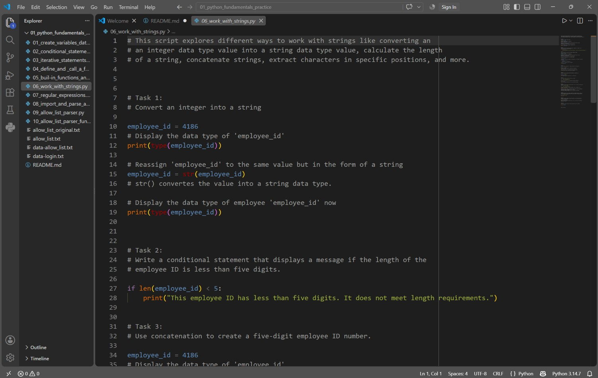

# Python fundamentals projects.

This directory contains 10 scripts inspired by one of the units from the Google Cybersecurity Professional Certificate. That unit was composed of several modules and focused on teaching how to automate cybersecurity tasks using Python.

Throughout the lessons, I learned Python fundamentals such as defining variables, building conditional statements, writing iterative statements, using functions, working with strings, using regular expressions, importing text files, and performing parsing operations.

The .py files in this directory demonstrate the Python skills I learned and how I can apply them in practice.

All of these projects were created using vs code in a Windows System.

