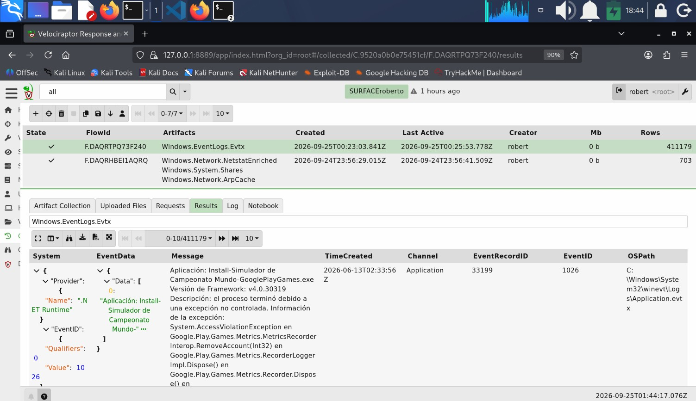
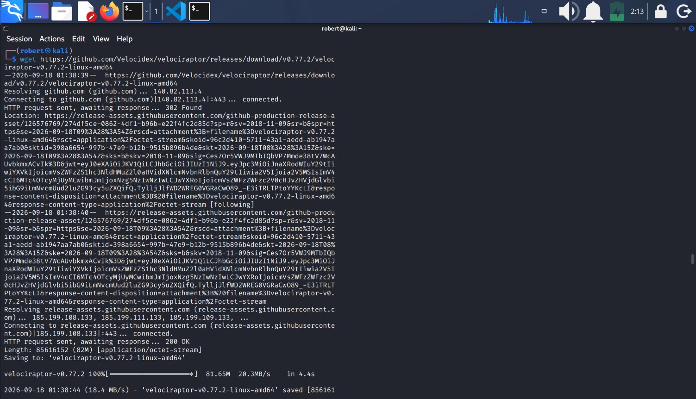
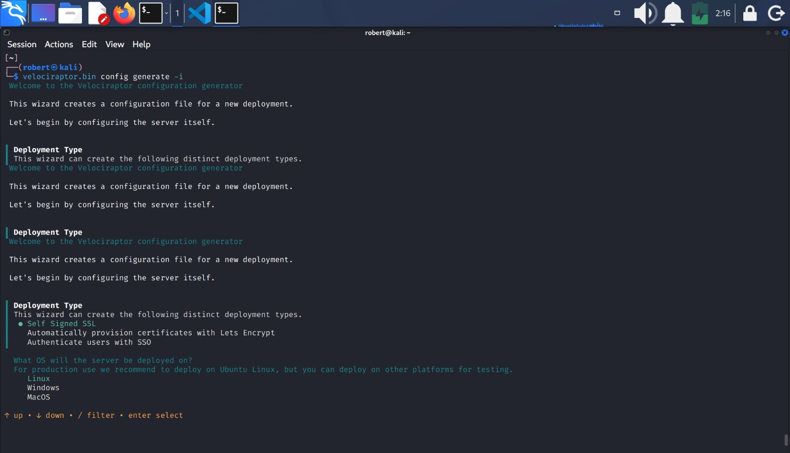
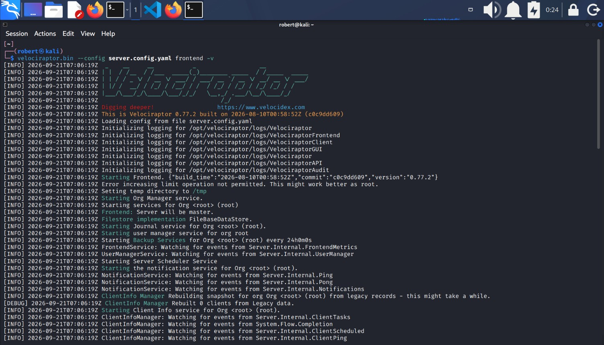
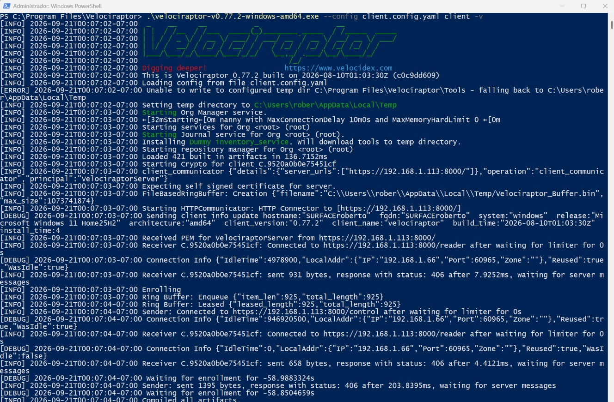
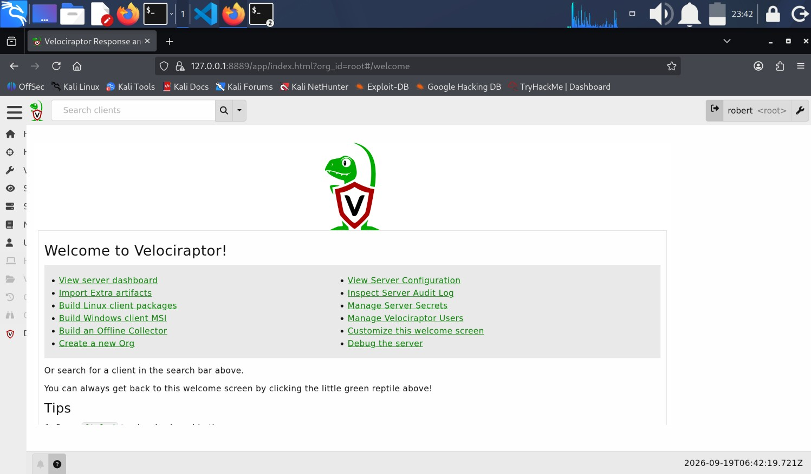
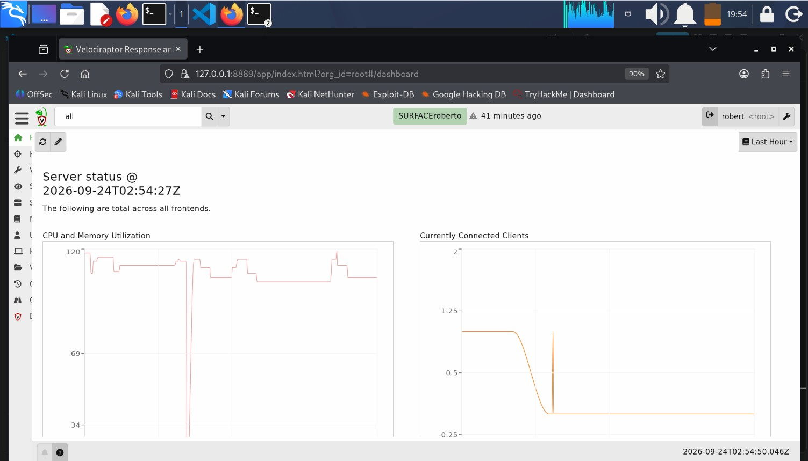
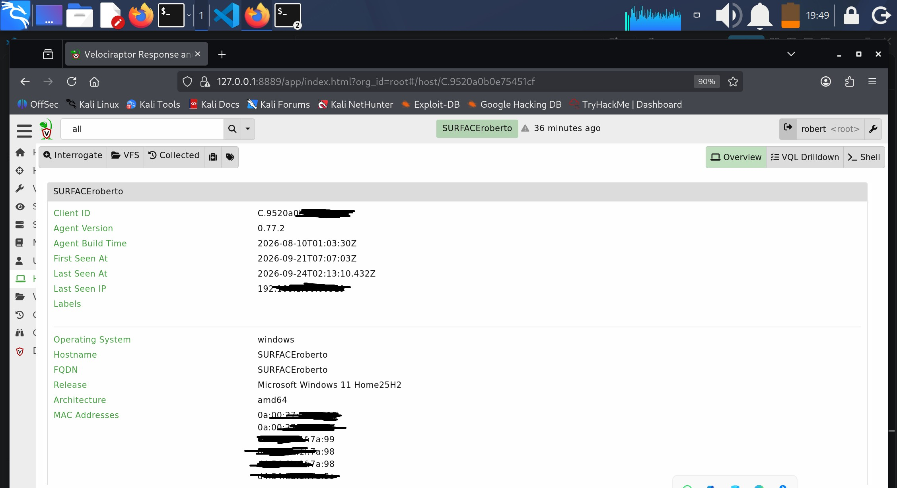
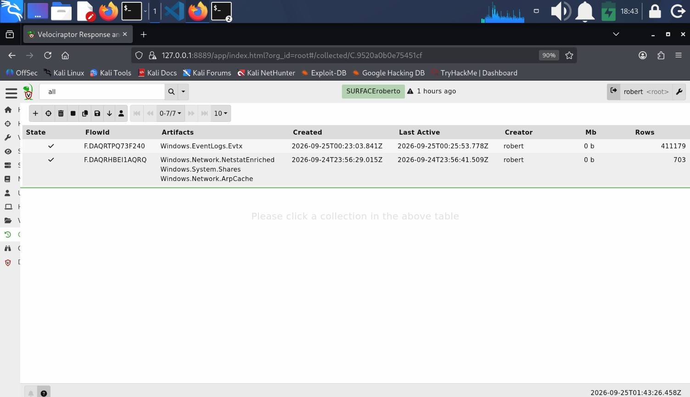
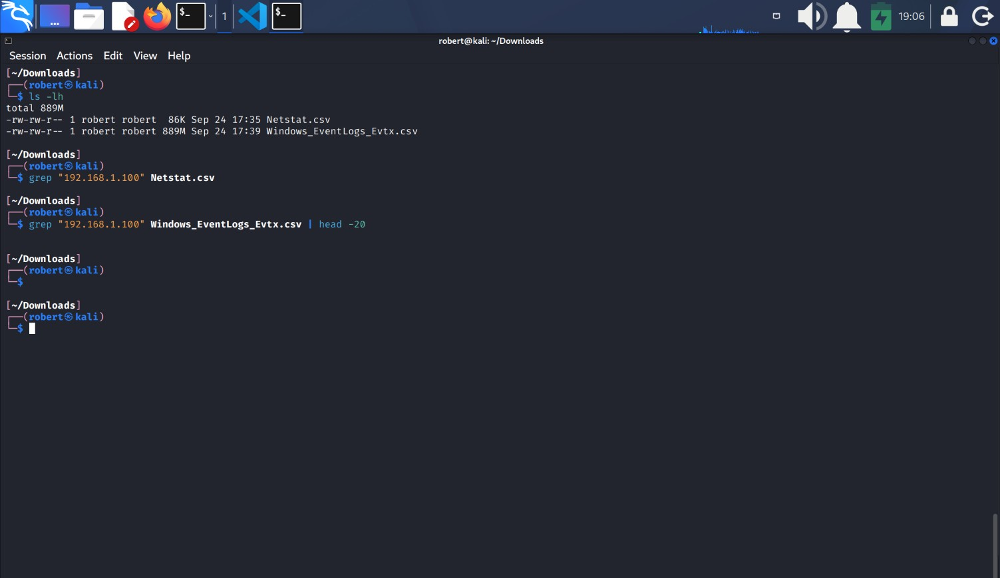

# Velociraptor DFIR

## 1.- Purpose
The purpose of this project is to use **Velociraptor** as a **digital forensics and incident response (DFIR)** platform to investigate a potential persistence mechanism escalated by the security team. The objective is to collect and analyze forensic artifacts from the affected endpoint—including processes, registry keys, scheduled tasks, file system modifications, and network connections—to determine whether the activity represents a legitimate configuration change or a malicious attempt to maintain unauthorized access. By leveraging Velociraptor’s artifact-based collection and powerful query capabilities, the project aims to produce a clear, evidence‑driven assessment that supports incident response operations and contributes to a comprehensive forensic report.

## 2.- DFIR Environment
In an organization, the security team installs **Velociraptor in its agent version on the endpoints considered critical for operations**. These agents allow internal monitoring of system activity, such as processes, registry keys, file system changes, and network connections. When a monitoring system such as a **SIEM**, **EDR**, or **IDS** detects suspicious activity on one of these endpoints, **an alert is generated** and sent to the security team. This alert may originate from unusual events, correlation rules, behavioral detections, or indicators of compromise identified by other security tools.

Once the security team receives the alert, they can **connect to the affected endpoint using Velociraptor in its server version**. From the server, analysts can **collect forensic evidence** from the endpoint and review recent activity. Possible attacks or malicious behaviors that may be discovered include:
1. Persistence mechanisms in the registry, 
2. scheduled tasks created by malware, 
3. unknown background processes, 
4. suspicious files placed in sensitive directories,
5. unauthorized network connections, and
6. unexpected modifications to the file system. 

With this information, the analyst determines whether the observed activity is normal or represents a potential security incident.

## 3.- Environment Setup
For this project, Velociraptor was deployed in a two‑machine environment to simulate a real DFIR investigation. 
1. The Velociraptor **agent** was installed on the Windows endpoint, representing the workstation where suspicious activity was detected. 
2. The Velociraptor **server** was installed on the Kali Linux machine, representing the DFIR analyst’s workstation. 

This setup allows the server to remotely collect forensic artifacts from the Windows endpoint and analyze its activity to determine whether any malicious behavior is present.

**The agent communicates securely with the server over HTTPS, allowing remote evidence collection without requiring direct interaction with the endpoint**. This communication flow ensures that forensic data can be retrieved safely, efficiently, and without disrupting the system under investigation.

**Kali Linux was selected as the DFIR workstation** due to its stability, isolation, and compatibility with forensic and incident response tools. Using Kali provides a controlled environment where the analyst can perform evidence collection and analysis without affecting the endpoint or introducing additional variables into the investigation.

### 3.1- Download Velociraptor
Download the Velociraptor's install files:
1. **Server file (Kali)**: use `wget` to fetch the official release directly from **GitHub**.
    * `wget https://github.com/Velocidex/velociraptor/releases/download/v0.77.2/velociraptor-v0.77.2-linux-amd64`.

* In Kali, Velociraptor does not have a `--version` flag, so to verify it is installed run `velociraptor --help` instead. If the help menu appears, then velociraptor is installed correctly.
2. **Agent file (WIndows)**: go to https://docs.velociraptor.app/downloads/ and download the Windows binary `velociraptor-v0.77.2-windows-amd64.exe`. This binary will be used together with the generated `client.config.yaml` to install and start the Velociraptor client on Windows.

### 3.2- Velociraptor Initial Configuration
Before evidence collection begins, Velociraptor requires initial configuration on both machines. The server configuration is generated and initialized on the Kali Linux workstation, enabling the Velociraptor frontend and backend services. After that, the Windows agent is prepared by downloading the Velociraptor executable (**.exe**) and deploying it together with the generated `client.config.yaml` file. Once the agent starts using this configuration and successfully connects to the server, the endpoint appears online in the Velociraptor interface, confirming that the environment is ready for **remote forensic collection**.

### 3.2.1.- Kali Workstation Configuration - Server.
1. Make the binary executable: 
    * `chmod +x velociraptor-v0.77.2-linux-amd64`.
2. If you downloaded the file to a directory diferent to `/usr/local/bin`, move it to that directory, this lets you run `velociraptor` from any folder. (In this project the file was renamed from `velociraptor-v0.77.2-linux-amd64` to `velociraptor.bin`). 
3. Generate the server configuration file:
    * This steps creates the core Velociraptor configuration for both the server and the clients. On Linux (especially Kali), the **interactive wizard** works, but it does not successfully create the **admin user**, so an additional manual step is required. This are the steps to follow:
        1. Run the interactive Configuration Wizard. 
            * From the directory whre the Velociraptor binary is located run:
            `velociraptor.bin config generate -i`. 
            * From any other directory run (if you moved the binary file to `/usr/local/bin`):
            `velociraptor.bin config generate -i`.

        2. The wizard will ask for several values:
            1. Deployment Type: `Self Signed SSL`.
            2. What OS will the server be deploed on?: `Linux`.
            3. Path to the datastore directory: `/opt/velociraptor`.
            4. Path to the logs directory: `logs`.
            5. Public DNS name of the Master Frontend: `localhost`.
            6. DNS Type: `None - Configure DNS manually`.
            7. Frontend port: `8000`.
            8. GUI port: `8889`.
            9. Admin username: e.g., `robert`.
            10. Admin password: On Kali, this step appears to work but the user is not actually created.
            11. Press `Ctrl + C` to skip this step.
            12. The next step will suggest a **Name of file to write** and a path, e.g., `/home/robert/server.config.yaml.
            13. Press `enter`.
        3. After completing the wizard, Velociraptor generates:
            1. `server.config.yaml`.

            
4.  Manually Create the Admin User.
    1. After the wizard finishes and the configuration files exist, create the admin user manually:
    `velociraptor.bin --config server.config.yaml user add robert --role administrator`.
    * If you get `error: user add: mkdir /opt/velociraptor: permission denied` is because you haven't created the directory `/opt/velociraptor`.
    * Create the `/opt/velociraptor` directory.
        1. `sudo mkdir -p /opt/velociraptor`.
        2. Give write permissions to the directory with `sudo chown robert:robert /opt/velociraptor`.
        3. Velociraptor will prompt:
        `Enter password:`
        4. Type the password (it will not display). In this version, **no confirmation prompt appears**, and this is normal.
        5. The user is stored in the Velociraptor datastore:
        * `/opt/velociraptor/` under the directory `users` (.db) file. That is the administrator user file.
5. Edit the `server.config.yaml` file:
    1. Check the server **IP address**, then edit the `server.config.yaml` file with `nano` and manually replace the line:
        * `server_urls: https://localhost:8000`
            for:
        * `server_urls: https://THE_SERVER_IP:8000`.
6. Create the file `client.config.yaml`:
    * `velociraptor.bin --config /home/robert/server.config.yaml config client > /home/robert/client.config.yaml`
7. Copy the `client.config.yaml` file to the agent workstation (client-Windows).
        

### 3.2.2.- Windows Workstation Configuration - Client
1. Store the `velociraptor-v0.77.2-windows-amd64.exe` and the `client.config.yaml` in the same directory, for example:
    `C:\Program Files\Velociraptor\`.

## 4.- Establish connection between the Server and the Client.
1. In Kali Linux, start the Velociraptor server:
    1. Run `velociraptor.bin --config /home/robert/server.config.yaml frontend -v`to start the server.

2. In Windows, start the Velociraptor client:
    1. Open **PowerShell** as administrator (`Ctrl + Shift + Enter`).
    2. Go to the directory where `velociraptor-v0.77.2-windows-amd64.exe` and `client.config.yaml` are stored.
    3. Run `.\velociraptor-v0.77.2-windows-amd64.exe --config client.config.yaml client -v` to start the client. This will temporary start the client, which is very handful. The conection will shutdown if the terminal is closed, the system is rebooted, or the process canceled with `Ctrl + C`. This method won't start the client automatically.

## 5.- Start the Velociraptor GUI in the Server
The Velociraptor **web dashboard** serves as the analyst’s operational center, providing a unified interface for endpoint visibility, artifact collection, live response, and forensic analysis. Accessing the GUI is the starting point for interacting with the Velociraptor server and managing connected clients.

1. Open a web browser such as **FireFox** and navigate to **https://127.0.0.1:8889/**.
    * `127.0.0.1`: this is the local loopback address, meaning ***this same machine***.
    * `8889`: This is the port where the Velociraptor server exposes its **web dashboard**, allowing you to view connected clients and perform **DFIR** operations.
3. Click `Advanced`.
4. Select `Accept the Risk and Continue`.
5. The Velociraptor GUI login page will load. Enter your administrator credentials.
6. After loggin in, you will be redirected to the Velociraptor `/welcome` dashboard.
7. Go to the search box in the `Clients` section, click the arrow and select `all`, the client workstation will be there.

## 6.- Velociraptor GUI overview.
1. Velociraptor landing page: This is the landing page of Velociraptor. Here you will find a left-lateral menu with the following options:
    1. **Home**: This is the server **dashboard**. It displays general server information, connected clients, recent activity, and system health. Useful for confirming that the Windows endpoint is online and communicating with the server. The sections you will find here are:
        * Server status, which displays:
            1. CPU and Memory Utilization: A live line graph showing how much processing power and RAM the Velociraptor server is using over time. Spikes typically occur when collecting artifacts, running hunts, or processing large forensic data. This visualization helps analysts ensuere the server remains responsive during DFIR operations.
            2. Currently Connected Clients: A line graph showing the nomber of endpoints connected to the server at any given moment. This metric helps correlate server load with client activity. For example, a rise in connected clients may coincide with increased CPU usage during artifact collection. 
        * Current Orgs: Shows the organizations configured within Velociraptor. In most lab environments there is only one org, but in the enterprise deployments multiple orgs allow segmentation of clients, policies, and hunts.
        * Disk Space: Display available and used disk space on the Velociraptor server. Important for DFIR investigations because artifact collections, logs, and timelines can grow quickly.
        * Users: Lists the users who have access to the Velociraptor server, along with their roles and permisions. Useful for managing analyst accounts or API keys.
        * Server version: Shows the current Velociraptor version running on the server.
    2. **Hunt Manager**: Allows launching large-scale "hunts" across multiple endpoints simultaneously. Used for SOC-wide investigations, mass artifact collection, or rapid triage during incidents.
    3. **View Artifacts**: The core DFIR section. Here you select a client and run forensic artifacts such as:
        * process listings
        * network connections
        * registry keys
        * file system changes
        * timelines, and
        * event logs.

    **Artifact**: in Velociraptor is a predefined forensic module that collects specific types of evidence from an endpoint. Each artifact contains a set of VQL queries designed to retrieve trageted information.

    Artifacts allow analyst to perform structured, repeatable, and focused evidence collection without writing custom queries manually.

    **VQL**: is Velociraptor’s forensic query language. It is similar to SQL but designed specifically for DFIR investigations. Instead of querying databases, VQL queries system artifacts such as processes, files, registry keys, network connections, event logs, and timelines.

    This is where most of the analysis work happens.
    4. **Server Events**: Shows logs and internal events generated by the velociraptor server. Useful for debugging communication issues or verifying artifact execution.
    5. **Server Artifacts**: Artifacts executed on the server itself, not on clients. Used for server-side monitoring, maintenance, or collecting logs from the Velociraptor backend.
    6. **Notebooks**: Interactive documentation and analysis space. You can combine text, VQL queries, and results in a single notebook. Ideal for building DFIR reports or documenting an investigation.
    7. **User**: Account settings, preferences, and session information. Allows changing passwords, managin API keys, or adjusting user-level configurations.
    8. **Documentation**: Built-in Velociraptor documentation. Includes artifact descriptions, VQL references, examples, and official usage guides.

2. Clients Section (Endpoint Management & DFIR Operations)

The **Clients** section displays all endpoints currently connected to the Velociraptor server. Each client represents a monitored machine (Windows, Linux, macOS) that can be interrogated, analyzed, or collected for forensic evidence. Selecting a **Client ID** opens a detailed view of that endpoint and provides several DFIR‑focused actions.

* 
    1. Client Information Panel: When clicking on a **Client ID**, Velociraptor shows general information about the endpoint, including:
        - Hostname  
        - Operating System and architecture  
        - Velociraptor client version  
        - First Seen / Last Seen timestamps  
        - Network addresses  
        - Labels assigned to the client  

This information helps analysts quickly understand the context of the machine being investigated.

* 
    2. Client Actions: Below the client information panel, Velociraptor provides several operational buttons used during DFIR investigations:
        - **Interrogate**: Runs a predefined set of artifacts designed to gather baseline forensic information from the endpoint. This typically includes system info, running processes, network connections, user accounts, persistence mechanisms, and installed software. It is commonly used as the first step in an investigation.

        - **VFS (Virtual File System)**: Provides remote access to the client’s file system through Velociraptor’s virtualized interface. Analysts can browse directories, inspect files, and download files for analysis. This feature enables live forensics without needing remote desktop access.

        - **Collected**: Displays all artifacts previously collected from this client, including process listings, registry keys, timelines, event logs, and network data. It acts as a history log of all forensic actions performed on the endpoint.

        - **Quarantine Host**: Isolates the endpoint from the network by instructing the Velociraptor client to block all inbound and outbound communication except with the Velociraptor server. This is used when malware is actively spreading, lateral movement is suspected, or the endpoint must be contained immediately.

        - **Add Label**: Allows assigning custom labels to the endpoint. Labels help categorize clients (e.g., “Windows10”, “Lab”, “Suspicious”, “High‑Priority”) and are useful for filtering clients, organizing hunts, and grouping endpoints during investigations.

## 7.- Generate Suspicious Activity on the Endpint.
To generate investigation data, several controlled activities were executed from an **Ubuntu workstation** against the **Windows endpoint** monitored by Velociraptor.

### 7.1.- Simulated reconnaissance behavior using Nmap

`sudo nmap -sV -O CLIEN_IP` 
This scan attempted to identify open ports, running services, and the operating system of the target host. Port scanning is commonly observed during the reconnaissance phase of an attack and can be used by adversaries to discover potential attack surfaces.

### 7.2.- SMB Connectivity Test.
The second activity established a direct TCP connection to the SMB service:

`nc 192.168.1.66 445`

This generated network activity against the SMB port (445/TCP), a service frequently targeted during lateral movement and credential-based attacks within Windows environments.

### 7.3.- Administrative Share Access Attempt
An attempt was made to access the administrative `C$` share on the Windows endpoint:

`smbclient //CLIENT_IP/C$`

Administrative shares are commonly used for remote administration but may also be abused by attackers during lateral movement. This activity can generate SMB-related artifacts and authentication events.

### 7.4.- HTTP Connection
A single HTTP request was sent to the endpoint:

`curl http://192.168.1.66`

This command generated basic web traffic and allowed the collection of network-related artifacts on the target machine.

### 7.5.- Repetitive HTTP Requests
To simulate repeated communication behavior, a continuous HTTP request loop was executed:

`while true; do curl http://192.168.1.66; sleep 5; done`

This activity generated recurring network connections at fixed intervals. Similar patterns are often observed in beaconing malware, monitoring tools, or automated scripts communicating with remote systems.

## 8.- Collect Evidence with Velociraptor
1. Establish connection between the client and the server.
2. Navigate to the Velociraptor GUI.
3. Select the target client by clicking its Client ID.
4. Open the `Collected` section.
5. Click on the `+` button to add the following artifacts:
    - Windows.Network.Netstat.Enriched
    - Windows.System.Shares
    - WIndows.Network.ArpCache
6. Click `Launch` to execute the selected artifacts on the endpoint.
7. Wait for the collections to complete and review the results in the `Results` tab.
8. Since some artifacts may generate hundreds or even thousands of records, export the results in `csv` format to easier analysis.
9. Once the evidence has been collected and exported, the Velociraptor GUI can be closed and the clien-server connection may be terminated if no further collections are required.

## 9.- Analyze the results.
1. Since you know the attacker IP address, which is `192.168.1.100` you can search for it in the `.csv` files.
2. Those files are too large, the best way to work with them is in the terminal as follows:
    - `grep "192.168.1.100" Netstat.csv`: to search on the file generated by the **Windows.Network.Netstat.Enriched** artifact, and
    - `grep "192.168.1.100" Windows_EventLogs_Evtx.csv | head -20` to search on the file generated by the **Windows.Event.Logs.Evtx** artifact.
3. No direct references to the source IP address were identified in the exported artifacts.

## 10.- Findings

The selected artifacts were successfully collected and exported using Velociraptor.

The Windows.Network.NetstatEnriched artifact confirmed the presence of active network services, including SMB listening on TCP port 445.

The Windows.EventLogs.Evtx artifact successfully collected a large volume of historical Windows events, demonstrating Velociraptor's capability to acquire forensic evidence from a remote endpoint.

Although the simulated activity originated from the Ubuntu workstation (192.168.1.100), no direct references to that IP address were identified during the initial review of the exported artifacts. Additional artifact collection or deeper log analysis may be required to identify traces of the simulated activity.

