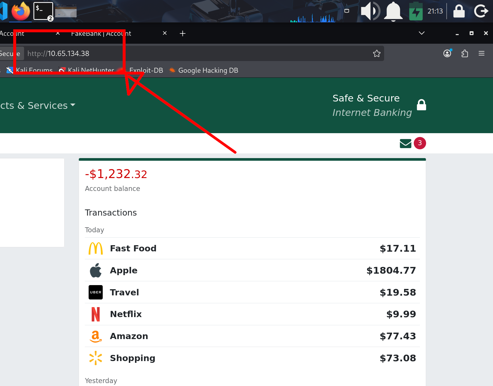
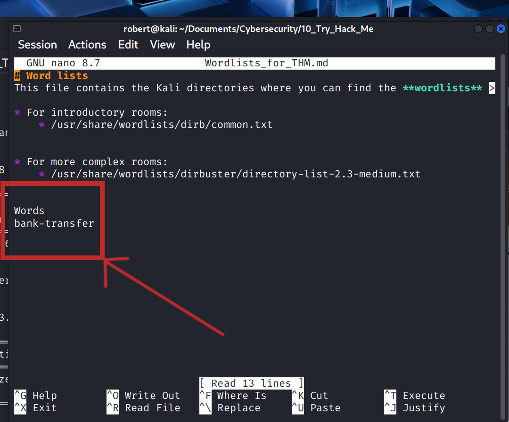
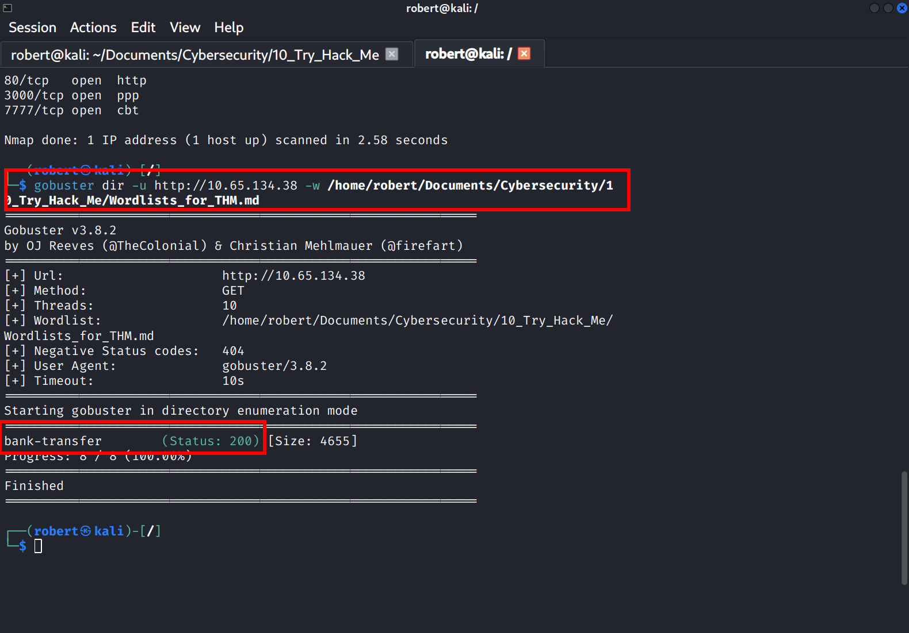
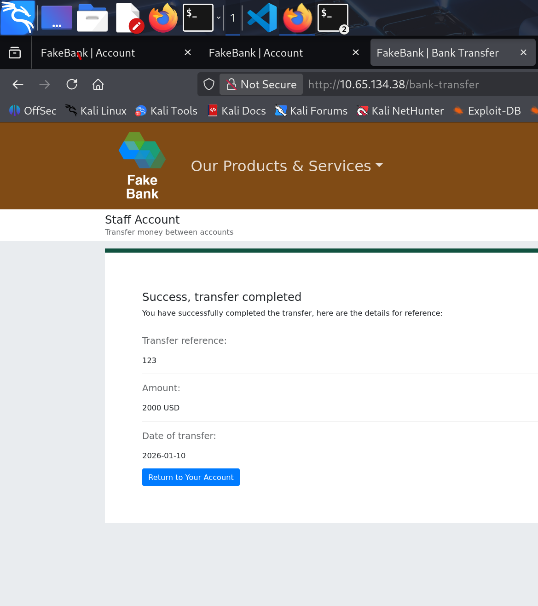
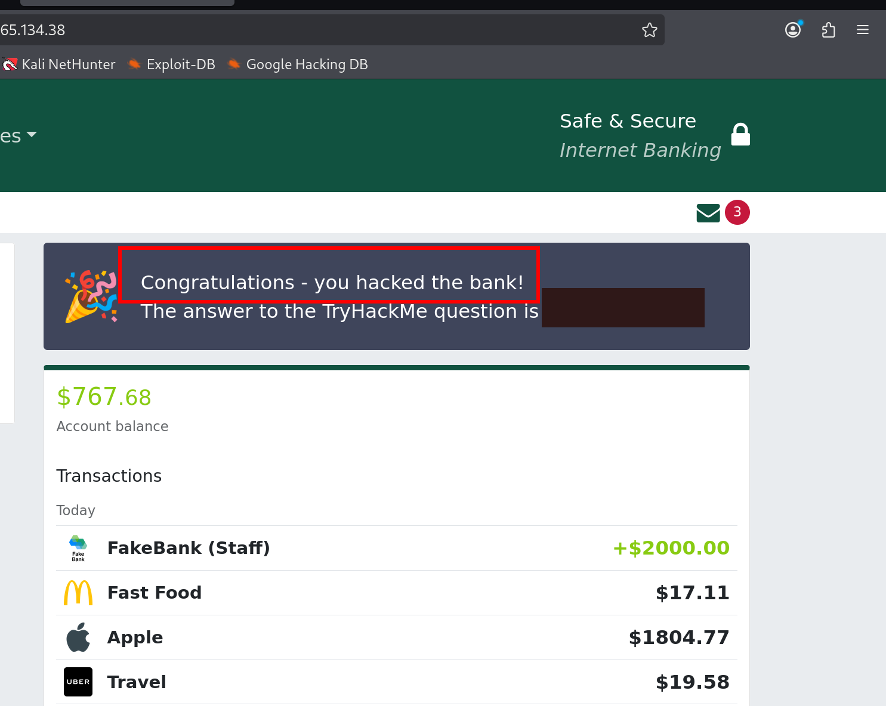

# Hack the bank
* Path:     Pre Security
* Module:   1 Introduction to Cybersecurity
* Room:     Offensive Security Intro (no URL available anymore)
* Task:     2

Objective: use tool `gobuster` to find a hidden URL on `http://fakebank.thm` to transfer money from one account to another.

1. Stablish OpenVPN connection between my system and THM servers.
2. ```nmap -Pn 10.65.134.38```.
3. `nmap` returned 4 ports: 22, 80, 3000 and 7777. Try all of them on your system browser.

2. Create a *personalized wordlist* on my system.
 and add the line `bank-transfer` (line given as a hint in task).
3. Instructions indicate to use **gobuster** with `gobuster -u http://fakebank.thm -w wordlist.txt dir`.
4. Instead use `gobuster dir -u http://10.65.134.38/ -w Wordlists_for_THM.md` becouse:
    * wordlist.txt doesn't exist on your system and you already created *Wordlists_for_THM.md*, and,
    * You got the machine IP from the actual task.
5. **gobuster** will show you the code **(Status: 200)** indicating a valid, active and probably hidden URL.

6. On your browser navigate to `http://10.65.134.38/bank-transfer`.
7. Transfer money from an account to "your account" as indicated.

8. Click `Return to Your Account` as indicated to see the **answer to the task question.**


---
Thank you for reading.
- Roberto Orozco


