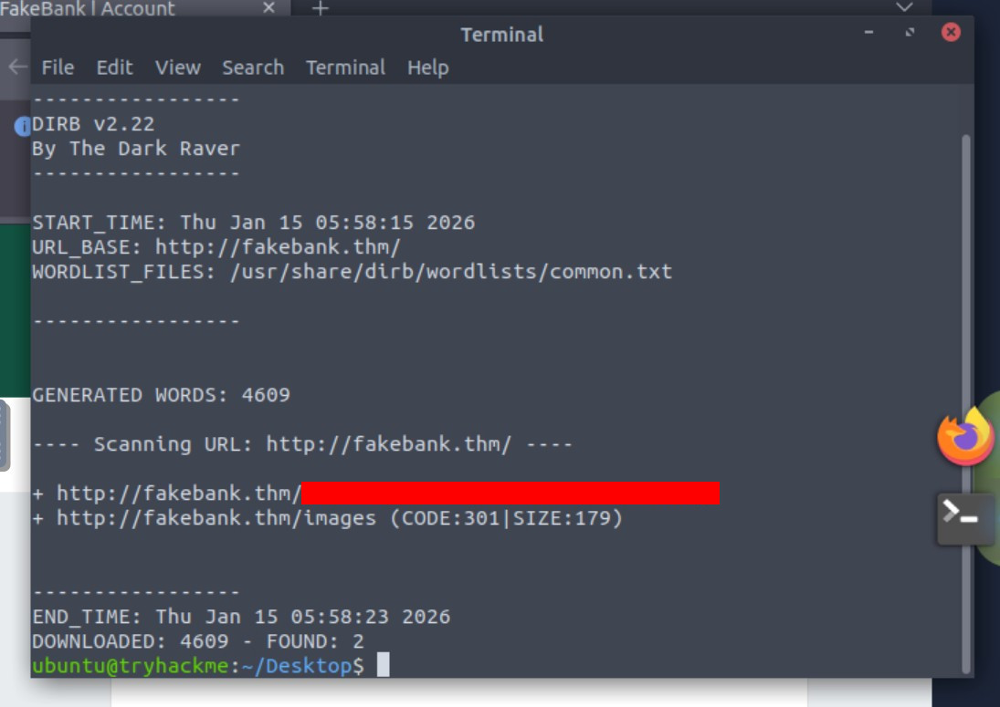

# Hack the bank v2.5
* Path:     Pre Security
* Module:   1 Introduction to Cybersecurity
* Room:     [Offensive Security Intro](https://tryhackme.com/room/offensivesecurityintro)
* Task:     3

This was a tricky one. The most important thing I learned on this task, which is task 3, is that to be able to accomplish it you have to start the machine that is on task 2, then go to task 3 and follow the instructions. In other words, you solve task 3 (and 4) with task 2 machine.

#### Objective: use `dirb` to brute-force `http://fakebank.thm` and get hidden URLs.

1. Your own system won't work using OpenVPN conection for this tool and this parameters, so you will have to use the THM VM.
2. Open the VM Terminal.
3. `dirb http://fakebank.thm` to get the hidden URLs:

4. The URL that is not /images is the **answer** to the task question.

---
Thanks for reading.
- Roberto Orozco

