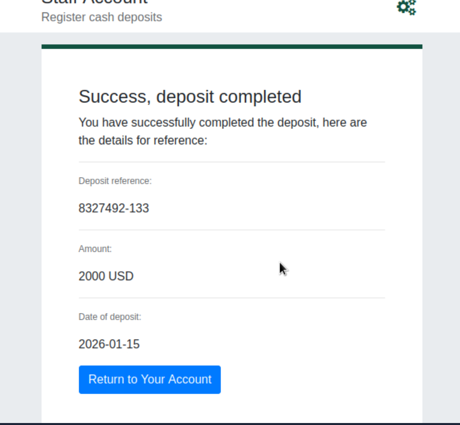

# Hack the bank v2.5
* Path:     Pre Security
* Module:   1 Introduction to Cybersecurity
* Room:     [Offensive Security Intro](https://tryhackme.com/room/offensivesecurityintro)
* Task:     4

This was a tricky one. The most important thing I learned on this task, which is task 4, is that to be able to accomplish it you have to start the machine that is on task 2, then go to task 4 and follow the instructions. In other words, you solve task 4 with task 2 machine.

#### Objective: transfer $2000 to your account.

1. On the VM browser navigate to `http://fakebank.thm/bank-deposit`.
2. Deposit $2000 to your account.

3. Return to your account.
4. Answer to task 4 question will be displayed.

---
Thanks for reading.
- Roberto Orozco

